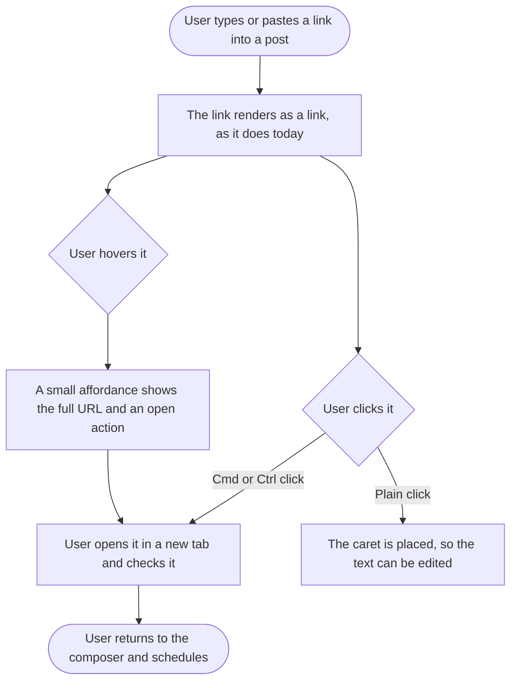

# Stories: Clickable links in the composer editor

From a user request by Camilo, tagged **#Improvement** and **#Integrations**, status **Planned**: *"Make links in the copy clickable directly from the text editor so they open in a new tab. It's useful because you can verify the links you're going to post much faster and more efficiently before scheduling them."*

Request: https://contentstudio.frill.co/dashboard/inbox/ideas?idea=make-links-in-the-copy-clickable-directly-from-the-text-editor-so-they-open-in-a-new-tab

Links already render blue in the editor, because a decoration marks them. They are not interactive, because a decoration is styling rather than an anchor. The work is adding a way to open one without breaking the fact that this is a field people type in.

Two stories. The design one is small and exists because the affordance is new UI; if you would rather ship modifier-click only, it can be dropped.

| # | Title |
|---|---|
| 1 | `[FE]` Open a link from the composer editor in a new tab |
| 2 | `[Design]` Link affordance in the composer editor |

---
---

# 1. [FE] Open a link from the composer editor in a new tab

### Description

Users paste links into their posts and have no way to check them without leaving the composer, retyping or copying the URL into another tab. They want to confirm a link resolves before scheduling, which is exactly the moment a broken link is cheapest to fix.

Links in the editor already look like links. This story makes them openable, without breaking the ability to click into a URL to edit it, and without turning the editor's plain text into rich text.

### Workflow

1. User types or pastes a link into a post. It renders as a link, exactly as today.
2. User hovers the link. A small affordance appears showing the full URL and a way to open it.
3. User opens it. The link loads in a new tab, and the composer is untouched behind it.
4. User can also hold Cmd or Ctrl and click the link to open it directly.
5. A plain click still puts the caret in the text, so the link can be edited as before.
6. If the post has link shortening or UTM tracking on, the affordance says so, because the posted link will not be the typed one.
7. User returns to the composer with the draft exactly as they left it.

### Acceptance criteria

**The thing being asked for**

- [ ] A link in the composer editor can be opened in a new tab without leaving the composer or copying the URL out.
- [ ] Holding Cmd (macOS) or Ctrl (Windows and Linux) and clicking a link opens it in a new tab.
- [ ] Hovering a link reveals an affordance showing the full URL and an action to open it, so a truncated or long link can be read in full.
- [ ] The opened tab does not have access back to the app window.
- [ ] The composer draft is unchanged after opening a link: no lost text, no lost caret position, no re-render of the editor.

**Not breaking editing, which matters more than the feature**

- [ ] A plain click on a link places the caret, exactly as it does today. No navigation.
- [ ] The caret can be placed at the start, inside and at the end of a link, so a URL can be edited character by character.
- [ ] Dragging to select text across a link still selects, and does not open anything.
- [ ] Double-click and triple-click selection behave as they do today.
- [ ] Typing, deleting and pasting around a link behave as they do today.

**Not turning plain text into rich text**

- [ ] The TipTap Link extension stays disabled. No anchor mark is added to the document.
- [ ] What the editor serialises is byte-for-byte identical to today for the same input. A post's content does not change because links became clickable.
- [ ] Copying text out of the editor yields the same plain text as today, with no markup.

**Safety, since the URL is whatever the user typed**

- [ ] Only `http` and `https` links open. Anything else, including `javascript:`, `data:` and `file:`, is not openable and shows no open affordance.
- [ ] A malformed or incomplete URL does not open and does not error visibly.

**Coverage and consistency**

- [ ] The behaviour works in every surface that uses the social editor, including the main composer editor and the lite editor.
- [ ] The behaviour works for every link the editor already detects, using the same matcher that feeds link previews, so a blue link and an openable link are always the same thing.
- [ ] Multiple links in one post are each independently openable.

**Being honest about what gets posted**

- [ ] Where link shortening or UTM tracking is enabled for the post, the affordance states that the posted link will differ from the typed one, so opening it is not mistaken for verifying the final link.
- [ ] Where neither is enabled, no such note appears.

**Quality**

- [ ] The affordance is reachable and dismissible by keyboard, and the open action can be triggered without a mouse.
- [ ] The affordance does not obscure the text the user is editing, and does not appear while they are actively typing.
- [ ] The link and hashtag decoration colours come from theme tokens rather than the current hardcoded hex values, so they follow a white-label customer's brand colour.
- [ ] Every new string is translated and present in every locale directory.

### UI copy

**Hover affordance**
- The full URL, shown in a single line and truncated at the middle if it does not fit.
- Open action label: `Open in new tab`
- Keyboard hint, shown subtly: `Cmd + click` on macOS, `Ctrl + click` elsewhere

**When shortening or UTM is on for this post**
- `The posted link will differ from this one, because this post uses {feature}. Opening it here checks the original.`
- Where `{feature}` resolves to `link shortening`, `UTM tracking`, or `link shortening and UTM tracking`.

**When a link cannot be opened**
- No affordance appears. Nothing is shown, because a user typing a malformed URL mid-edit does not need an error.

All strings go through translation and land in every locale directory in the same change. Note the deliberate absence of em dashes.

### Mock-ups

Provided by **[Design] Link affordance in the composer editor**. If that story is dropped, ship modifier-click only and omit the hover affordance rather than inventing one.

### Impact on existing data

None. Nothing about the stored post changes, and the serialised content is explicitly required to stay identical.

### Impact on other products

- Web app only. The composer exists in the mobile apps, but hover and modifier keys do not, so the interaction does not carry over. If it is wanted there it needs its own gesture and a separate story.
- The Chrome extension has its own composer surface; confirm whether it uses this editor, and if it does, the behaviour follows for free.
- White-label domains: this is the story that moves the link and hashtag colours onto tokens.

### Dependencies

- Depends on **[Design] Link affordance in the composer editor** for the hover treatment, unless that story is dropped.

### Global quality and compliance checklist

- [ ] Mobile responsiveness tested (frontend only, N/A for backend-only stories)
- [ ] Multilingual support verified (frontend + backend, translations available or fallback handled)
- [ ] UI theming supported (default + white-label, design library components are being used)
- [ ] White-label domains impact reviewed
- [ ] Cross-product impact assessed (web, mobile apps, Chrome extension)

### Implementation references

*Pointers from research — not a contract. Engineering may choose a different approach.*

- The editor is `contentstudio-frontend/src/components/UI/TextEditor/CstSocialEditor.vue`, TipTap 3. `editorProps` already implements `handleKeyDown`, `handlePaste`, `handleDrop` and `handleDOMEvents`; there is no `handleClick`, which is the natural hook for modifier-click.
- **Do not enable the Link extension.** `StarterKit.configure({ ..., link: false, ... })` is deliberate, with the comment *"Formatting stripped to plain text — social posts have no rich formatting."* Adding an anchor mark would change what the editor serialises, which is what the "identical output" criteria above are guarding.
- The link ranges already exist. `components/UI/TextEditor/editorHighlights.ts` decorates them via `Decoration.inline(..., { class: 'tt-link' })` from `URL_RE`. Click handling should resolve the URL from the same range rather than re-matching, so a clickable link can never disagree with a blue one.
- `components/UI/TextEditor/linkDetect.ts` exports `extractLinks` and owns `URL_RE`, described as *"the SAME regex-based `getLinksFromText` the composer"* uses for link previews. Worth checking what schemes that regex currently admits before relying on it for a safety decision.
- Consuming surfaces are `modules/composer/components/EditorBox/EditorBox.vue` and `EditorBox/LiteEditorBox.vue`, so a change in the wrapper covers both.
- The shortening and UTM state to read comes from the composer's own options; `EditorBox/EditorOptions/UtmDropdown.vue` is the UTM control, and the shorten copy lives in `locales/en/composer.json`.
- The hardcoded colours to replace are in `CstSocialEditor.vue`: `.tt-link { color: #216fdb; }` and `.tt-hashtag { background-color: rgba(22, 120, 247, 0.2); }`.
- Worth a regression test on serialisation, since "output must be identical" is the criterion most likely to break quietly. `components/UI/TextEditor/__tests__/editorHighlights.spec.ts` already tests the `tt-link` ranges and is the natural neighbour.

---
---

# 2. [Design] Link affordance in the composer editor

### Description

Making a link openable inside a field people type in needs a deliberate affordance: a plain click has to keep placing the caret, so the open action needs somewhere else to live. It also has to carry an awkward truth, which is that the link the user is checking may not be the link that gets posted when shortening or UTM tracking is on.

Small story. It exists because this is new UI in a dense, frequently used surface.

### Workflow

N/A. Design deliverable.

### Acceptance criteria

- [ ] The hover affordance is specified: what it shows, where it sits relative to the link, and how it behaves when the link is near the top, bottom or edge of the editor.
- [ ] How a long URL is presented is specified, including where it truncates, given the editor can be narrow.
- [ ] The open action is specified, along with how the modifier-click shortcut is communicated without clutter.
- [ ] Timing is specified: how quickly the affordance appears on hover, how it dismisses, and the rule that keeps it from appearing while the user is actively typing.
- [ ] The note shown when shortening or UTM tracking is on is specified, in a treatment that informs without alarming, since it applies to a large share of posts.
- [ ] The affordance is specified for a link that cannot be opened, which per the build story means showing nothing.
- [ ] Keyboard behaviour is specified: how the affordance is reached, dismissed and triggered without a mouse.
- [ ] The link and hashtag text treatments are specified using theme tokens, replacing the current fixed blue, and checked against a white-label palette.
- [ ] The design confirms the affordance does not collide with the editor's existing overlays, including the mention and hashtag autocomplete dropdowns, which occupy similar space.
- [ ] Behaviour is specified in both the main composer editor and the narrower lite editor.
- [ ] The design names the design-library components to reuse and flags anything unavailable as a component gap.

### Mock-ups

This story produces them.

### Impact on existing data

None.

### Impact on other products

- Web app only.
- White-label domains, since the link colour moves onto tokens as part of this.

### Dependencies

None. Should start first, since the build story consumes it.

### Global quality and compliance checklist

- [ ] Mobile responsiveness tested (frontend only, N/A for backend-only stories)
- [ ] Multilingual support verified (frontend + backend, translations available or fallback handled) — the shortening note is a full sentence and needs room in longer languages
- [ ] UI theming supported (default + white-label, design library components are being used)
- [ ] White-label domains impact reviewed
- [ ] Cross-product impact assessed (web, mobile apps, Chrome extension)

### Implementation references

*Pointers from research — not a contract. Engineering may choose a different approach.*

- The editor already has two hovering overlays to avoid colliding with: the mention dropdown (`components/UI/TextEditor/SocialMentionDropdown.vue`) and the hashtag dropdown (`HashtagDropdown.vue`). Both anchor to the caret, so a link affordance anchored to the pointer will sometimes be near them.
- Current link styling is `.tt-link { color: #216fdb; }` in `CstSocialEditor.vue`, applied to a decoration span rather than an anchor, so there is no default browser link styling to override or inherit.
- The two editor sizes to design for are `EditorBox.vue` (main) and `LiteEditorBox.vue` (lite), which is the narrower constraint.
