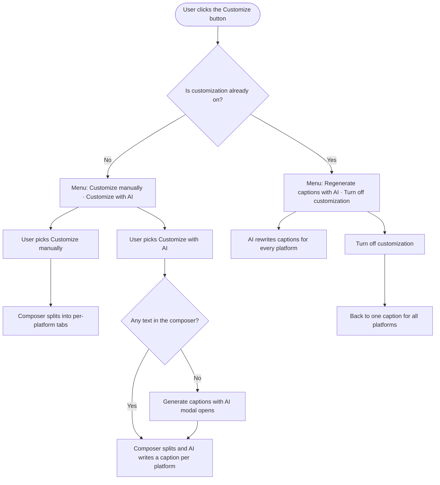

# Composer Customize dropdown — Stories

Local deliverable. Nothing is pushed to Shortcut. The Product Owner creates the story in Shortcut
manually, selecting the **New Feature Template** so the standard sections and quality-checklist
tasks are pre-populated.

---

## [FE] Replace the Composer Customize toggle with a single Customize dropdown (manual or AI)

### Description

In Composer, customizing content per platform is currently split across two controls that sit side
by side — a small AI wand icon and a "Customize" on/off toggle. Users have to already know that the
wand is where AI lives, and nothing on screen tells them that customizing can be done either by
hand or by AI.

Replace both with **one "Customize" button that opens a dropdown** and names the choices outright:
**Customize manually** or **Customize with AI**. Once content is split per platform, the same button
becomes the place to regenerate AI captions or switch customization back off.

Nothing about how captions are generated changes — the AI modal, the per-platform loading states,
the generated captions, and the credit usage all stay exactly as they are today. This is about
making both paths discoverable from one obvious control.

---

### Workflow

1. User opens Composer and selects social accounts from two or more platforms.
2. User sees a single **Customize** button in the editor toolbar, in the same place the Customize
   toggle sits today.
3. User clicks it and sees two clearly labelled choices: **Customize manually** and
   **Customize with AI**.
4. If the user picks **Customize manually**, Composer splits into per-platform tabs and the caption
   already written (if any) is copied into each platform's empty caption box — exactly what the old
   toggle did. Nothing is generated.
5. If the user picks **Customize with AI** while the composer has text, Composer splits into
   per-platform tabs and AI writes a caption for each selected platform.
6. If the user picks **Customize with AI** while the composer is empty, the existing
   "Generate captions with AI" modal opens and asks what the post is about; on submit, Composer
   splits and AI writes a caption per platform.
7. Once customization is on, clicking **Customize** shows a different pair of choices:
   **Regenerate captions with AI** and **Turn off customization**.
8. User picks **Regenerate captions with AI** to have AI rewrite every platform's caption.
9. User picks **Turn off customization** to collapse back to one caption for all platforms.
10. If the user turned customization on manually and hasn't used AI yet, the menu offers
    **Customize with AI** alongside **Turn off customization**, so they can hand over to AI at any
    point.

---

### Acceptance criteria

**The control**

- [ ] The AI wand icon, the vertical divider, and the Customize on/off switch are all removed from
      the editor toolbar and replaced by a single button labelled **"Customize"** with a chevron
      indicating it opens a menu.
- [ ] The button sits in the same toolbar position the Customize toggle occupies today, in the
      common caption box and in every per-platform tab.
- [ ] The button shows an active/selected treatment while customization is on, so the user can tell
      at a glance that content is currently split per platform.
- [ ] Clicking the button opens the dropdown; clicking outside it, pressing Escape, or picking an
      item closes it.
- [ ] The dropdown is keyboard navigable — up/down arrows move between items, Enter picks the
      focused item, Escape closes.
- [ ] The button is disabled when no social accounts are selected or while a link is being
      processed, matching today's disabled behaviour, and shows the existing hover tooltip:
      "Customize your content for each platform. (Choose accounts from at least two different
      platforms to customize)".
- [ ] When the button is enabled, its hover tooltip reads: "Write a different caption for each
      platform — by hand or with AI."

**Menu while customization is OFF**

- [ ] The dropdown shows exactly two items, in this order: **"Customize manually"** then
      **"Customize with AI"**.
- [ ] "Customize manually" shows the subtext: "Write a different caption for each platform
      yourself."
- [ ] "Customize with AI" shows the subtext: "Let AI write a caption for each platform."
- [ ] Picking **"Customize manually"** splits the composer into per-platform tabs and copies the
      current caption into each platform's empty caption box — the same result the Customize toggle
      produces today — and never starts an AI generation.
- [ ] "Customize manually" behaves identically whether the composer is empty or already has text.
- [ ] Picking **"Customize with AI"** when the composer has text splits the composer into
      per-platform tabs and generates a caption for each selected platform, exactly as the current
      "Generate per-platform captions" action does.
- [ ] Picking **"Customize with AI"** when the composer is empty opens the existing
      "Generate captions with AI" modal unchanged — same title, description, topic field, brand
      voice option, credit hint, and buttons — and does not split the composer until the user
      submits it.
- [ ] "Customize with AI" is disabled when accounts from fewer than two platforms are selected, and
      the menu shows the existing footer line: "Select accounts from at least two platforms to use
      AI."
- [ ] "Customize with AI" is disabled while a generation is already running.

**Menu while customization is ON**

- [ ] Once AI captions exist, the dropdown shows exactly two items, in this order:
      **"Regenerate captions with AI"** then **"Turn off customization"**.
- [ ] "Regenerate captions with AI" shows the subtext: "Write fresh captions for every selected
      platform."
- [ ] Picking "Regenerate captions with AI" regenerates captions for all currently selected
      platforms, exactly as today's "Regenerate captions for all platforms" action does.
- [ ] When customization was turned on manually and no AI captions exist yet, the dropdown shows
      **"Customize with AI"** (same subtext and disabled rules as the off-state item) in place of
      "Regenerate captions with AI", alongside "Turn off customization".
- [ ] "Turn off customization" shows the subtext: "Go back to one caption for all platforms."
- [ ] Picking "Turn off customization" collapses the per-platform tabs and returns the composer to a
      single caption box — the same result as switching the old Customize toggle off, with no new
      confirmation step.
- [ ] "Regenerate captions with AI" is disabled while a generation is already running.

**Everything that must not change**

- [ ] The "Generate captions with AI" modal, its copy, and its brand-voice behaviour are unchanged.
- [ ] Per-platform loading ("Writing for {platform}…"), the "Edited" tab marker, the trimmed-caption
      notice, and all generation error messages are unchanged.
- [ ] AI text credit consumption per generation and regeneration is unchanged.
- [ ] Platform caption limits and validation behave exactly as before.

**Copy and theming**

- [ ] All new button, menu item, subtext, and tooltip copy goes through translations and exists in
      every supported locale — no hardcoded strings in templates.
- [ ] The button and dropdown use `@contentstudio/ui` components (`Button` or `ActionIcon` for the
      trigger, `Dropdown`, `DropdownItem`, `Icon`) and are styled through component props, not
      Tailwind colour overrides.
- [ ] Any brand-coloured element uses theme-aware classes (`text-primary-cs-500`, `bg-primary-cs-50`,
      `border-primary-cs-200`) so white-label domains render in their own primary colour.
- [ ] The button label and menu remain readable and tappable at mobile-width web viewports.

**Analytics**

- [ ] When the Customize dropdown opens, a `customize_ai_menu_opened` Usermaven event fires with
      `{ selected_platforms, platform_count, customize_on }` — the same event the wand menu fires
      today.
- [ ] When the user picks "Customize manually", a `customize_manual_selected` Usermaven event fires
      with `{ selected_platforms, platform_count }`.
- [ ] The existing `customize_ai_generate_clicked`, `customize_ai_generate_success`,
      `customize_ai_generate_failed`, `intent_dialog_shown`, and `intent_dialog_submitted` events
      keep firing with their current payloads.
- [ ] Analytics payloads contain no caption text, topic text, or other personal data.

---

### Mock-ups

Attach the Customize dropdown prototype/screenshots to this story in Shortcut after creation —
the off-state menu, the on-state menu, and the active button treatment.

---

### Impact on existing data

None. The dropdown state is transient UI state only. No change to drafts, templates, saved posts,
or per-platform caption data — the platform split writes the same caption fields it writes today.

---

### Impact on other products

Web Composer only.

- **Mobile apps (iOS/Android):** not impacted. AI caption generation is web-only and the mobile
  composers have their own editor UI.
- **Chrome extension:** not impacted.
- **White-label domains:** impacted — the button's active state and any brand-coloured menu accents
  must come from theme variables, not fixed colours.
- The reusable post-editor surface used by the Evergreen/recycle automation modal hides this control
  entirely, so that flow is unaffected.

---

### Dependencies

None. This replaces the grouped control shipped by **[FE] Add AI Customize control and
empty-caption dialog to Composer**; the generation behaviour from **[FE] Handle AI generation,
regeneration, loading, errors, and edited states** stays as-is.

---

### Global quality & compliance (wherever applicable)

- [ ] Mobile responsiveness tested (frontend only, N/A for backend-only stories)
- [ ] Multilingual support verified (frontend + backend, translations available or fallback handled)
- [ ] UI theming supported (default + white-label, design library components are being used)
- [ ] White-label domains impact reviewed
- [ ] Cross-product impact assessed (web, mobile apps, Chrome extension)

---

### Implementation references

*Pointers from research — not a contract. Engineering may choose a different approach.*

**Primary entry points:**
- `contentstudio-frontend/src/modules/composer/components/EditorBox/editor-box/CustomizeAiControl.vue`
  — the grouped wand + divider + `Switch` control this story replaces.
- `.../editor-box/EditorBoxToolbar.vue` (~line 248) renders it behind `toolbarConfig.customize !== false`
  and passes `separate-boxes`, `disabled`, `disabled-tooltip`, `on-toggle`.
- `.../editor-box/useEditorBoxDropdowns.ts` — `handleCustomBoxToggle(val)` emits `isSeparateBoxes`
  (the platform split, both directions); `getCustomizeTooltip()` builds the disabled tooltip.
- `src/modules/composer/composables/useComposerAiCustomize.ts` — already exposes everything the new
  menu needs: `onGenerateClick()` (opens the intent dialog when the base caption is empty, otherwise
  generates), `regenerateAll()`, `regeneratePlatform()`, `canGenerate` (≥ 2 platforms),
  `hasAiContent`, `isGenerating`, `trackMenuOpened()`.
- `src/stores/composer/useComposerAiCustomizeStore.ts` — `customizeOn`, `hasAiContent`,
  `statusByPlatform`; the three menu states map to `customizeOn` × `hasAiContent`.
- `src/modules/composer/components/AiCustomizeDialog.vue` — the empty-caption modal; no change.

**Existing behavior to preserve:**
- `runGeneration()` already forces the split on (`sharing.isSeparateBoxes(true)`) before generating,
  so "Customize with AI" from the off state needs no extra split call.
- The control renders in the common box *and* in every per-platform tab, so the on-state menu has to
  be correct in each tab. `features/post-editor/types.ts` sets `customize: false`, which is why the
  Evergreen post-editor surface never shows it.

**i18n:**
- Keys live in `src/locales/*/composer.json` under `composer.ai_customize.*` and
  `composer.editor_box.customize*` — new labels must land in all 8 locale directories in the same
  change. `ai_customize.dropdown.section`, `.generate_sub`, `.tip`, `control.toggle_tooltip`, and
  `control.ai_tooltip` likely become unused; run a repo-wide reference check before deleting any key.

**Gotchas:**
- Two different rules gate the control today: the whole control is disabled on an empty account
  selection, while the AI actions additionally require accounts from **two or more platforms**
  (`canGenerate`). The disabled tooltip already claims "at least two different platforms", so the
  copy and the rule don't quite match — worth aligning while the control is being rebuilt.
- Turning customization off discards per-platform captions with no confirmation today; this story
  keeps that behaviour deliberately.
- The shipped **"Regenerate caption for {platform} only"** menu item is intentionally not part of the
  new menu — its absence is by design, not a regression. `regeneratePlatform()` stays in the code
  unused; leave it in place rather than deleting it.
- `trackMenuOpened()` fires on the trigger click, so a click that *closes* the menu also fires the
  event (documented limitation of the current dropdown component) — the new trigger inherits this.

---

### Shortcut fields

- **Template:** New Feature Template · **Story type:** feature · **Project:** Web App · **Group:** Frontend
- **Epic:** Q2 - 2026: Miscellaneous (id `115078`) — confirm whether a current-quarter Miscellaneous
  epic should be used instead
- **Priority:** Medium · **Product Area:** Composer · **Skill Set:** Frontend
- **Estimate:** _(empty)_ · **Labels:** _(none)_ · **Iteration:** _(PO assigns)_
