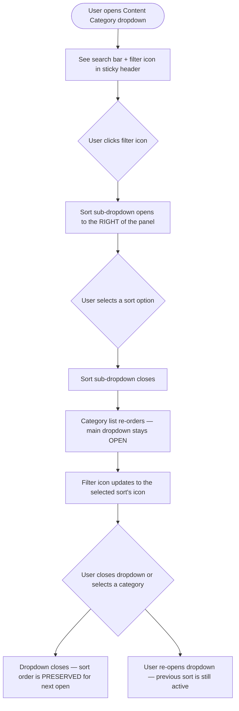
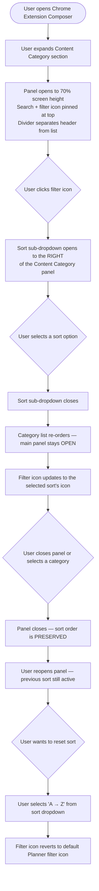

# Stories: Content Category Dropdown UX Improvements in Composer

---

## Story 1: [FE] Improve Content Category Dropdown Filter UX in Composer

### Description

As a ContentStudio user composing a post, I want the Content Category dropdown in the Composer to have a taller panel, a sticky header, a properly positioned sort dropdown, and an icon that reflects the active sort so that I can browse and sort my categories without the panel closing unexpectedly or losing my sort preference.

---

### Workflow

1. User opens the Composer and the Content Category section expands in the left sidebar.
2. The search bar and sort filter button are visible at the top of the expanded panel, pinned in place — they do not scroll away when the user scrolls through the category list.
3. A clear horizontal divider separates the header (search + filter) from the scrollable category list below.
4. The panel expands to 70% of the screen height, giving the user more categories visible at once.
5. User clicks the filter button (Planner-style filter icon). A small sort dropdown opens **to the right** of the panel — it does not cover or collapse the category list.
6. User selects a sort option (e.g., "Newest First"). The sort dropdown closes, but the **category panel remains open**.
7. The category list re-orders according to the selected sort. The filter button icon updates to show the selected sort's icon (e.g., `ArrowDownWideNarrow` for Newest).
8. User selects a category or closes the panel. When the user reopens the dropdown later, the previously selected sort is **still active** — it does not reset to A-Z.
9. To reset the sort, the user opens the sort dropdown and selects "A → Z" (the default). The filter button icon reverts to the default Planner filter icon.

---

### Acceptance criteria

- [ ] The Content Category panel expands to occupy 70% of the screen height when opened.
- [ ] The search bar and sort filter button row is sticky — it remains visible at the top when the user scrolls through a long category list.
- [ ] A horizontal divider is displayed between the sticky header row (search + filter button) and the scrollable category list.
- [ ] Clicking the sort filter button opens a small sort options dropdown positioned to the right of the Content Category panel, not below it or overlaid on top of the category list.
- [ ] Selecting a sort option from the sort dropdown does **not** close the main Content Category panel.
- [ ] The selected sort order persists — reopening the Content Category panel after closing it shows the same sort that was last selected.
- [ ] The sort filter button uses the same filter icon as the Planner's filter button (two horizontal sliders / custom SVG icon).
- [ ] When a sort option other than the default is active, the filter button icon changes to the corresponding icon: `ArrowDownAZ` for A→Z, `ArrowDownWideNarrow` for Newest First, `ArrowUpNarrowWide` for Oldest First.
- [ ] When the user selects "A → Z" (the default sort), the filter button reverts to the default Planner filter icon.
- [ ] Sort options available: **A → Z** (label: "A → Z", subtext: "Sort categories alphabetically"), **Newest First** (label: "Newest First", subtext: "Show most recently created categories first"), **Oldest First** (label: "Oldest First", subtext: "Show oldest categories first").
- [ ] The active sort option is visually indicated inside the sort dropdown with a checkmark.

---

### Mock-ups

N/A

---

### Impact on existing data

None. Sort is client-side only; no data model changes.

---

### Impact on other products

The Content Category section in the **Chrome Extension Composer** has the same filter and should receive the same improvements in a parallel story: **[FE] Improve Content Category Dropdown Filter UX in Chrome Extension Composer**.

---

### Dependencies

None.

---

### Global quality & compliance (wherever applicable)

- [ ] Mobile responsiveness (frontend only, N/A for backend-only stories)
- [ ] Multilingual support (frontend + backend, translations available or fallback handled)
- [ ] UI theming support (default + white-label, design library components are being used)
- [ ] White-label domains impact review
- [ ] Cross-product impact assessment (web, mobile apps, Chrome extension)

---

### Implementation references
*Pointers from research — not a contract. Engineering may choose a different approach.*

**Primary entry point:**
- `contentstudio-frontend/src/modules/composer_v2/components/AccountSelectionAside.vue`
  - Template: `CstDropdown` (lines ~57–244) wraps the entire category panel; inner `Dropdown` (lines ~138–200) is the sort filter sub-dropdown
  - Data: `sortOrder: 'az'` and `sortOrders` array (lines ~865–884)
  - `resetCategorySearch()` (lines ~1403–1408) — called on every `@on-close` of the outer `CstDropdown`

**Filter icon reference:**
- `contentstudio-frontend/src/modules/planner_v2/components/PlannerHeader.vue` lines 16–28 — contains the custom inline SVG filter icon. Extract it to a shared component or inline the same SVG in `AccountSelectionAside.vue`.

**Fixes needed:**
- **Height**: Add a max-height of `70vh` to the `CstDropdown` dropdown panel.
- **Persistent dropdown**: The inner `Dropdown` (sort) click events bubble up to `CstDropdown` and trigger a close. Add `@click.stop` / stopPropagation on the inner dropdown trigger and item clicks.
- **Filter state persistence**: Remove `this.sortOrder = 'az'` from `resetCategorySearch()` — this line resets the sort on every panel close. The search query reset (`clearCategorySearch()`) can remain; only the sort reset should be removed.
- **Sticky header**: Wrap the search + filter button row in a `sticky top-0 z-10 bg-white` container; place the divider `
` immediately after it.
- **Sort positioning**: Change inner `Dropdown` `placement` from `"bottom-end"` to `"right-start"` so it opens beside the panel rather than below it within the list.
- **Filter icon**: Replace the static `ArrowUpDown` icon (line ~153) with the Planner custom filter SVG from `PlannerHeader.vue` lines 16–28. This is the default (unfiltered) state icon.
- **Dynamic icon**: When `sortOrder !== 'az'`, replace the default filter SVG with the active sort option's `icon` property from the `sortOrders` array (`ArrowDownAZ`, `ArrowDownWideNarrow`, or `ArrowUpNarrowWide`). When `sortOrder === 'az'`, show the Planner filter SVG.

---

## Story 2: [FE] Improve Content Category Dropdown Filter UX in Chrome Extension Composer

### Description

As a ContentStudio Chrome Extension user composing a post, I want the Content Category dropdown to have the same improved filter UX as the web app — a taller panel, sticky header, properly positioned sort dropdown, and an icon that reflects the active sort — so that my experience is consistent across both the web app and the Chrome extension.

---

### Workflow

1. User opens the Chrome Extension and navigates to the Composer.
2. User expands the Content Category section. The panel opens to **70% of the screen height**, giving more categories visible at once.
3. The search bar and sort filter button are pinned at the top of the panel — they remain visible when scrolling through a long list. A horizontal divider separates this header row from the scrollable category list.
4. User clicks the filter button (Planner-style two-slider icon). A sort options dropdown opens **to the right** of the panel — it does not overlay or collapse the category list.
5. User selects a sort option (e.g., "Newest First"). The sort dropdown closes, but the **Content Category panel stays open**.
6. The category list re-orders. The filter button icon updates to the selected sort's icon (`ArrowDownWideNarrow` for Newest First).
7. User selects a category or closes the panel. When the panel is reopened, the previously selected sort is **still active** — it does not reset to A-Z.
8. To reset the sort, the user opens the sort dropdown and selects "A → Z". The filter button reverts to the default Planner filter icon.

---

### Acceptance criteria

- [ ] The Content Category panel in the Chrome Extension Composer expands to 70% of the screen height when opened.
- [ ] The search bar and sort filter button row is sticky — it remains visible at the top when the user scrolls through the category list.
- [ ] A horizontal divider separates the sticky header (search + filter button) from the scrollable category list.
- [ ] Clicking the sort filter button opens the sort options dropdown positioned to the **right** of the Content Category panel — it does not overlap or collapse the category list.
- [ ] Selecting a sort option does **not** close the main Content Category panel.
- [ ] The selected sort order persists — reopening the Content Category panel shows the same sort that was last selected.
- [ ] The sort filter button uses the same Planner-style filter icon (two horizontal sliders SVG) as the web app.
- [ ] When a sort other than the default is active, the filter button icon changes to match the selected sort: `ArrowDownAZ` for A→Z, `ArrowDownWideNarrow` for Newest First, `ArrowUpNarrowWide` for Oldest First.
- [ ] When the user selects "A → Z" (default), the filter button reverts to the default Planner filter icon.
- [ ] Sort options and labels match the web app exactly:
  - **A → Z** — label: "A → Z", subtext: "Sort categories alphabetically"
  - **Newest First** — label: "Newest First", subtext: "Show most recently created categories first"
  - **Oldest First** — label: "Oldest First", subtext: "Show oldest categories first"
- [ ] The active sort option is visually indicated inside the sort dropdown with a checkmark.

---

### Mock-ups

N/A

---

### Impact on existing data

None. Sort is client-side only; no data model changes.

---

### Impact on other products

Web app version of this fix is tracked separately: **[FE] Improve Content Category Dropdown Filter UX in Composer**.

---

### Dependencies

None.

---

### Global quality & compliance (wherever applicable)

- [ ] Mobile responsiveness — N/A (Chrome Extension is desktop-only)
- [ ] Multilingual support (frontend + backend, translations available or fallback handled)
- [ ] UI theming support (default + white-label, design library components are being used)
- [ ] White-label domains impact review
- [ ] Cross-product impact assessment (web, mobile apps, Chrome extension)

---

### Implementation references
*Pointers from research — not a contract. Engineering may choose a different approach.*

**Primary entry point:**
- The Chrome Extension's Content Category section component — likely the equivalent of `AccountSelectionAside.vue` from the web app. The Chrome Extension codebase is not mounted in this pipeline repo; the exact file path should be confirmed by the Chrome Extension dev team. The web app implementation in `contentstudio-frontend/src/modules/composer_v2/components/AccountSelectionAside.vue` is the reference implementation for all 7 changes.

**Fixes needed (mirror the web app):**
- **Height**: Add a max-height of `70vh` (or equivalent) to the Content Category panel/dropdown container.
- **Persistent dropdown**: The inner sort sub-dropdown click events should not bubble up to close the outer Content Category panel. Add `stopPropagation` / `@click.stop` on the sort trigger and item clicks.
- **Filter state persistence**: Remove any `sortOrder` reset that fires on panel close — sort should be retained until the user explicitly changes it.
- **Sticky header**: Wrap the search + filter button row in a sticky container (`position: sticky; top: 0`) with a `z-index` above the list; place the divider `
` immediately after.
- **Sort positioning**: Change the sort sub-dropdown placement to open to the right of the panel (e.g., `placement="right-start"` if using the same `Dropdown` component from `@contentstudio/ui`).
- **Filter icon**: Replace the current sort icon with the Planner custom filter SVG (two horizontal sliders). Reference: `contentstudio-frontend/src/modules/planner_v2/components/PlannerHeader.vue` lines 16–28.
- **Dynamic icon**: Compute the active icon from the selected sort option — show the sort option's icon when a sort is active, revert to the Planner filter SVG when sort is default (A-Z / unset).
