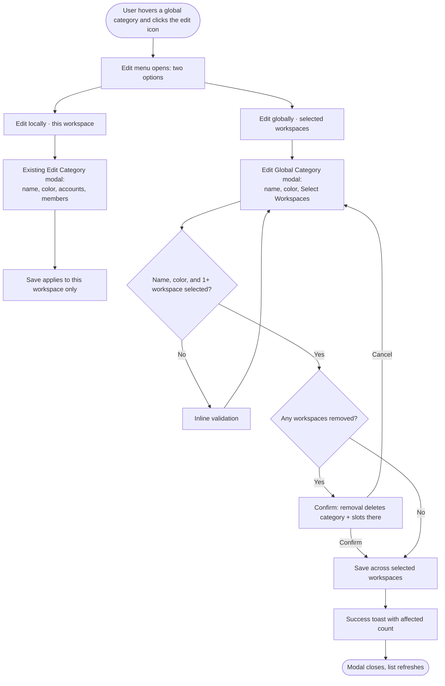

# Story — Global Content Category: Local vs Global Edit

> Deliverable for the Product Owner to create in Shortcut manually. Nothing is pushed to Shortcut.
> One full-stack story. Create it from the "New Feature Template" so the standard sections + quality checklist are pre-populated.

**Context in one line:** A *global* content category lives as one parent record plus a linked copy in each workspace it belongs to. Today, editing it silently does two different things — the name/color change in **every** workspace, while account changes save only for the **current** workspace — and the user is never told which is which. This story replaces that with an explicit choice: **Edit locally** (this workspace only) or **Edit globally** (across selected workspaces, via a new workspace picker).

---

## [Full Stack] Add local vs global edit scope for global content categories

### Description
As a super admin or internal team member managing global content categories, I want the edit action on a global category to let me choose whether I'm editing it **just for this workspace** or **across the workspaces I select** — so a change in one place doesn't unexpectedly rewrite every workspace, and so I can control which workspaces a global category applies to.

Today a global category has a single edit (pencil) action opening one modal, and the effect of edits is inconsistent and invisible: the name/color propagate to all linked workspaces while account changes apply only to the current one. This story turns the edit action into a menu with two clearly-scoped choices and adds a dedicated "Edit globally" modal with a workspace picker.

### Workflow

1. On the Content Categories page, the user hovers a **global** category card (marked with the crown icon) and clicks the edit (pencil) icon.
2. Instead of opening a modal directly, a small menu appears with two options: **Edit locally (this workspace)** and **Edit globally (selected workspaces)**.
3. **Edit locally** opens the existing Edit Category modal (Category Name, Choose Color, Select Account(s), Allowed Team Members). Saving there applies changes to the current workspace only — no other workspace's copy changes.
4. **Edit globally** opens the new Edit Global Category modal, pre-filled with the category's current name and color, and a **Select Workspaces** picker with the workspaces that currently have this category pre-checked.
5. In the global modal, the user can rename, recolor, and check/uncheck workspaces (with search and "Select All"), then clicks **Update**.
6. If the name is empty, no color is chosen, or no workspace is selected, an inline validation message appears and the save is blocked.
7. If the user removed workspaces that previously had the category, a confirmation dialog warns that this deletes the category and its scheduled slots in those workspaces.
8. On confirm, the name/color are applied across all selected workspaces, the category is added to newly-checked workspaces and removed from unchecked ones, a success toast reports how many workspaces were affected, the modal closes, and the list refreshes.
9. **Local** (non-global) categories are unchanged: their edit icon still opens the existing modal directly with a single click (no menu).

### UI copy

**Edit menu (global categories only)**
- **Header (optional):** "Edit this category"
- **Option 1 label:** "Edit locally (this workspace)" — **subtext:** "Change the name, color, accounts and members for the current workspace only."
- **Option 2 label:** "Edit globally (selected workspaces)" — **subtext:** "Change the name and color, and choose which workspaces this category applies to."
- **Edit icon tooltip (unchanged):** "Edit category"

**Edit Global Category modal**
- **Title:** "Edit Global Category" · **Primary CTA:** "Update"
- **Category Name** — label "Category Name", placeholder "Articles, Tips, Podcasts, Webinars", validation "Name cannot be empty."
- **Choose Color** — label "Choose Color", validation "Please choose a category color."
- **Select Workspaces**
  - **Label:** "Select Workspaces"
  - **Info icon (ℹ) tooltip:** "Choose which workspaces this category should appear in. Adding a workspace creates this category there with all of that workspace's accounts selected. Removing a workspace deletes this category — and its scheduled posting slots — from that workspace."
  - **Placeholder (nothing selected):** "Select workspaces..."
  - **Selected summary:** "{count} workspace(s) selected"
  - **Select-all row:** "Select All" · **Search placeholder:** "Search workspaces..."
  - **Loading state:** "Loading workspaces..." · **Empty state:** "No workspaces available." · **No search match:** "No workspaces match your search."
  - **Validation (none selected):** "Please select at least one workspace."
- **Info box (below the picker):**
  - "Renaming or recoloring here updates this category in every selected workspace."
  - "Adding a workspace creates this category there with that workspace's accounts selected. Fine-tune accounts per workspace using 'Edit locally'."
  - "Removing a workspace deletes this category and its scheduled slots from that workspace."

**Removal confirmation dialog** (on Update, only when workspaces were removed)
- **Title:** "Remove category from workspaces?"
- **Message:** "You've removed this category from {count} workspace(s). This deletes the category and any scheduled posting slots there. This can't be undone."
- **Confirm:** "Yes, update" · **Cancel:** "Cancel"

**Success toast:** "Global category updated across {count} workspace(s)."

### Acceptance criteria

**Edit menu**
- [ ] On a global category card, clicking the edit (pencil) icon opens a menu with exactly two options: "Edit locally (this workspace)" and "Edit globally (selected workspaces)", each with its subtext as specified.
- [ ] The menu closes when the user selects an option, clicks outside it, or presses Escape; focus returns to the edit icon on close.
- [ ] The menu is keyboard accessible (open, navigate, dismiss via keyboard).
- [ ] Local (non-global) categories are unaffected: their edit icon opens the existing modal directly with no menu.
- [ ] Only users who can manage global categories see the "Edit globally" option (matches the existing gating that hides global edit controls).

**Edit locally (existing modal, current workspace only)**
- [ ] "Edit locally (this workspace)" opens the existing Edit Category modal, pre-filled with the category's current name, color, selected accounts, and allowed members for the current workspace.
- [ ] Saving from the "Edit locally" modal applies changes — including name and color — to the current workspace only; no other workspace's copy changes, and the parent global record is not changed. (Behavior change: today name/color propagate to all workspaces from this modal.)
- [ ] Account selections saved persist for **all** supported platforms — Facebook, X (Twitter), LinkedIn, Pinterest, Instagram, Google Business, Threads, Bluesky, Telegram, YouTube, TikTok. (Today the global-edit path silently drops Threads, Bluesky, Telegram, YouTube, and TikTok — this must be fixed.)
- [ ] Allowed team member access saved for the category persists for the current workspace (today `allowed_member_ids` is not applied on the global-edit path — confirm it is saved).

**Edit globally modal**
- [ ] "Edit globally (selected workspaces)" opens the "Edit Global Category" modal, showing Category Name, Choose Color, and Select Workspaces — and **not** the Local/Global "Category Type" selector.
- [ ] Name and color are pre-filled with current values; the Select Workspaces picker pre-checks the workspaces that currently have this category, lists all workspaces the user can access, and supports search + "Select All".
- [ ] Clicking Update with an empty name shows "Name cannot be empty."; with no color shows "Please choose a category color."; with zero workspaces shows "Please select at least one workspace." — each blocks the save.
- [ ] If the user unchecks one or more previously-selected workspaces, clicking Update shows the removal confirmation dialog with the correct count before saving; cancelling returns to the modal with selections intact and nothing saved.
- [ ] Confirming a save applies the new name and color to all selected workspaces, adds the category to newly-checked workspaces (with that workspace's accounts selected by default), and removes it from unchecked ones (deleting that workspace's copy, its scheduled slots, and its entry in members' access lists).
- [ ] Workspaces that remain selected keep their existing per-workspace account selections — a global edit does not reset accounts in workspaces that already had the category.
- [ ] On success, a toast reads "Global category updated across {count} workspace(s)." and the categories list reflects the changes without a manual refresh.

**Backend scoping (shared)**
- [ ] The save scope is driven by the frontend (local vs global); if no scope is supplied, the endpoint defaults to the safest behavior (local / current workspace only) rather than propagating across workspaces.
- [ ] A global-scope save updates the parent global record's name and color and applies them to every selected workspace.
- [ ] At least one workspace must remain selected; a request that would leave the global category with zero workspaces is rejected with a clear error message.
- [ ] The save response reports how many workspaces were affected so the UI can show an accurate confirmation message.
- [ ] Only users allowed to manage global categories can perform a global-scope edit; others are limited to local-scope edits.

**Analytics**
- [ ] When the user saves from the "Edit globally" modal, the existing `publishing_queues_created` Usermaven event fires with `{ scope: 'global' }`; when saving from the "Edit locally" modal, it fires with `{ scope: 'local' }`.

### Mock-ups
Attach in Shortcut: the edit-dropdown design (the "Global platforms" card with the two-option menu open — an interactive prototype was produced during research) and screenshot 2 (Add Category global view) as the visual reference for the Edit Global Category modal, noting the "Category Type" selector is removed there.

### Impact on existing data
- No schema migration. Workspace membership of a global category is already derived from the linked `content_categories` records (one per workspace, joined by `global_content_category_id`); the parent `global_content_categories` record continues to hold only name/color/owner.
- Behavior change: name/color propagation is now scoped to **selected** workspaces on a global edit (previously always all linked workspaces); local edits no longer propagate name/color at all, so a workspace's copy can diverge in name/color.
- Adding/removing workspaces on a global edit creates/deletes linked category records and their slots — de-selecting a workspace is destructive for that workspace's slots (gated behind confirmation in the UI).

### Impact on other products
- **Mobile (iOS/Android):** none — content category management is web-only; there is no global-category editing screen in the apps.
- **Chrome extension:** none.
- **White-label:** global categories are gated to super admins / internal team regardless of domain; the new menu, modal, and picker must use theme-aware design system components so they adapt to white-label branding.

### Dependencies
- None external. Internal ordering: the backend scope/workspace handling should land with or before the frontend so the "Edit locally" (current-workspace-only) and "Edit globally" (selected-workspaces) saves behave correctly.

### Global quality & compliance (wherever applicable)
- [ ] Mobile responsiveness (frontend only, N/A for backend-only stories)
- [ ] Multilingual support (frontend + backend, translations available or fallback handled)
- [ ] UI theming support (default + white-label, design library components are being used)
- [ ] White-label domains impact review
- [ ] Cross-product impact assessment (web, mobile apps, Chrome extension)

### Implementation references
*Pointers from research — not a contract. Engineering may choose a different approach.*

**Frontend entry points:**
- `contentstudio-frontend/src/modules/setting/components/content-categories/ContentCategories.vue` — the global category row currently renders the edit pencil (`icon-edit-cs`) calling `editCategoryModal(category)`. For global categories, replace it with a `Dropdown` + two `DropdownItem`s (optionally triggered via `ActionIcon`).
- `contentstudio-frontend/src/modules/setting/composables/useContentCategories.ts` — `editCategoryModal()` currently emits `edit-category`, loads the category, and shows the `add_category` modal. Split into a local handler (existing behavior) and a global handler (open the new modal).
- New modal: `contentstudio-frontend/src/modules/setting/components/content-categories/dialogs/EditGlobalCategory.vue` + a `useEditGlobalCategory.ts` composable; register from `ContentCategories.vue` alongside `AddCategory`, `AddSlot`, `RemoveGlobalCategoryConfirmation`. Model it on the global branch of `AddCategory.vue` minus the Category Type radios.
- Save path: extend `useContentCategoryStore.storeGlobalCategory()` / `src/api/content-categories.ts` `storeGlobalCategory()` to send `scope` (`local` | `global`) and the selected `workspace_ids` to POST `global/categories/store`.
- Gating: `usePermissions().isEnableGlobalCategoryOption` already governs whether global edit controls show — reuse it.

**Existing patterns to reuse (FE):**
- **Select Account(s)** / **Allowed Team Members** dropdowns in `AddCategory.vue` are the exact `Dropdown` + `DropdownItem` + `Checkbox` + `SearchInput` multi-select pattern to copy for **Select Workspaces** (selected-avatars summary, select-all, search, "N selected").
- Confirmation: `RemoveGlobalCategoryConfirmation.vue` and `$cstuModal.msgBoxConfirm(...)` with `cstuModalAttributes()`.
- Updated toast: `useContentCategoryStore` already surfaces `settings.content_categories.categories_updated` — extend for the affected-count message.
- Workspace list source: check `useWorkspaceStore` for an existing accessible-workspaces getter before adding a new fetch (same set the backend derives via `WorkspaceTeamRepo::getWorkspaceIdsByUserId`).
- Components (per `docs/ui-components.md`): `Dropdown`, `DropdownItem`, `Checkbox`, `SearchInput`, `Icon`, `CstuModal` — no new library components needed.

**Backend entry points:**
- `contentstudio-backend/app/Http/Controllers/Settings/ContentCategories/GlobalContentCategoriesController.php` → `store()`. The edit branch (where `global_content_category_id` is present) currently calls `ContentCategoriesRepository::updateAllCategoriesNameAndColorById(...)` (name/color → all) and then updates only the current workspace's category with a **partial** account payload (missing threads/bluesky/telegram/youtube/tiktok).
- Building blocks to reuse: `ContentCategoriesRepository::createOrUpdate` (add/update a workspace's linked category), `getByGlobalCategoryId` (diff selected vs current workspaces), `updateAllCategoriesNameAndColorById` (may need a "by selected workspace ids" variant). The `delete()` method already shows the correct per-workspace removal sequence — `ContentCategoryAccessService::removeCategoryFromAllMembers(...)` then slot + record delete — reuse it for de-selected workspaces. The create path shows how a new workspace's accounts are auto-populated via `Platforms(...)->getItems(...)`.

**Suggested shape / gotchas (non-binding):**
- Accept `scope` (`local` | `global`) and, for global, `workspace_ids`.
- The account payload in the edit branch hard-codes six platforms — enumerate all supported channels from a single source so no platform is dropped again.
- No workspace multi-select exists in the codebase today (the current global *create* flow applies to all of the user's workspaces automatically, with no picker; its copy still says "all workspaces"). This story introduces the picker — keep it self-contained, or share it if a create-flow picker lands in parallel.

**Suggested i18n keys** — add to `settings.json` in **every** locale dir (de, el, en, es, fr, it, pl, zh):
- `settings.content_categories.edit_menu.{header,local_label,local_desc,global_label,global_desc}`
- `settings.edit_global_category.*` — modal title/CTA, Select Workspaces label/tooltip/placeholders/states/validation, info box, removal confirmation, success toast.

---

## Shortcut fields

Values map from `.claude/shortcut-config.json`.

- **Template:** New Feature Template (PO selects on create so the standard sections + 5 quality-checklist tasks are pre-populated)
- **Story type:** feature
- **Project:** Web App
- **Group:** Full Stack
- **Epic:** Q2 - 2026: Miscellaneous (id 115078) — PO: use the current quarter's Miscellaneous epic if a newer one exists
- **Priority:** Medium
- **Product Area:** Settings
- **Skill Set:** Frontend & Backend (spans both — set the primary per your team convention)
- **Estimate:** _(empty — set during sprint planning)_
- **Labels:** _(none — team manages labels)_
- **Iteration:** _(PO assigns current/target sprint)_
