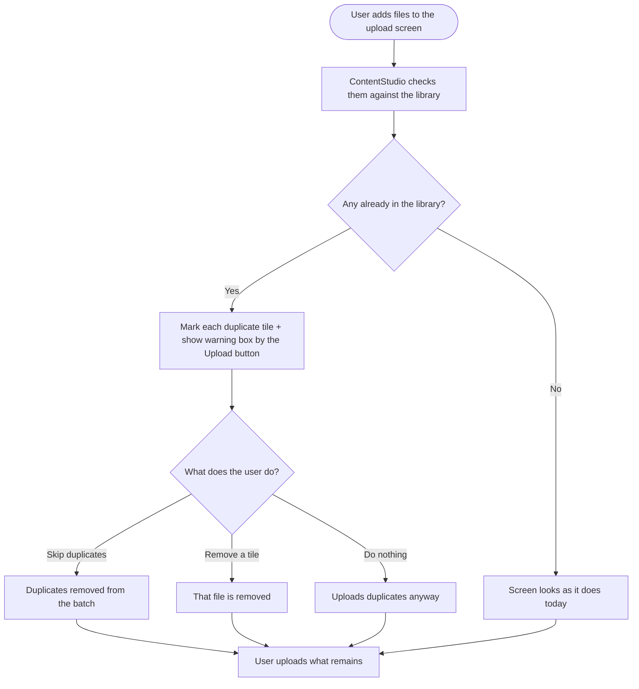

# Stories — Duplicate detection when uploading to the Content Library

Two stories: a small backend check, and the frontend UI that uses it. Both are web-app only.

---

## Story 1 — [BE] Check which selected files already exist in the Content Library

### Description

As a user uploading media to my Content Library, I want ContentStudio to know which of the files I've picked are already in my library, so that I can avoid uploading the same file twice by accident (for example, when I retry a bulk upload that only partly went through).

This story covers the backend check only. The frontend that shows the result lives in **[FE] Flag duplicate files in the Content Library upload screen**.

### Workflow

The user never sees this step directly — it's the check the upload screen calls behind the scenes to know which files to flag.

1. The user selects a set of files to upload to their Content Library.
2. The upload screen sends the list of selected files (name + size for each) to ContentStudio.
3. ContentStudio compares each one against the files already in that workspace's Content Library and returns which of the selected files already exist.
4. The upload screen uses that answer to flag the duplicates (see the frontend story).

### Acceptance criteria

- [ ] An authenticated endpoint accepts a `workspace_id` and a list of selected files (each with a file name and file size) and returns, for each, whether a matching file already exists in that workspace's Content Library.
- [ ] A file is reported as a duplicate when the workspace's Content Library already contains a file with the **same name and the same size**.
- [ ] The check looks across the **whole workspace Content Library**, not just one folder — a file already stored in any folder counts as a duplicate.
- [ ] The response clearly identifies which items in the submitted list are duplicates (e.g. by index or by the name+size key that was sent), so the frontend can map each result back to the exact file the user picked.
- [ ] Submitting a list with no matches returns an empty/"no duplicates" result (not an error).
- [ ] The endpoint only ever checks the Content Library of the requesting user's own workspace; it cannot be used to probe another workspace's library.
- [ ] The check is read-only — it never creates, moves, or deletes any media.
- [ ] The endpoint responds quickly for a realistic bulk selection (e.g. 50 files in one request) so the upload screen stays responsive.

### Mock-ups

N/A — backend only.

### Impact on existing data

None. No schema changes and no data is written. This is a read-only lookup against existing Content Library media.

### Impact on other products

- **Mobile apps / Chrome extension:** not in scope. This endpoint is additive; existing upload behaviour is unchanged. Mobile apps may adopt the same check later but are out of scope here.
- **White-label:** works the same on white-label domains (workspace-scoped).

### Dependencies

None. The frontend story **[FE] Flag duplicate files in the Content Library upload screen** depends on this one.

### Global quality & compliance (wherever applicable)

- [ ] Mobile responsiveness — N/A, backend-only story
- [ ] Multilingual support (frontend + backend, translations available or fallback handled)
- [ ] UI theming support — N/A, backend-only story
- [ ] White-label domains impact review
- [ ] Cross-product impact assessment (web, mobile apps, Chrome extension)

### Implementation references
*Pointers from research — not a contract. Engineering may choose a different approach.*

**Primary entry points:**
- `contentstudio-backend/` — media library assets controller/service that already handles uploads (the existing upload route is `media_library/assets/uploadByBytes`). A sibling "check duplicates" action fits here.

**Suggested shape (non-binding):**
- Accept `{ workspace_id, files: [{ name, size }] }` and return the subset that already exists (by index or `name|size` key). Matching on name + size is the agreed heuristic; a content hash (e.g. MD5) is an optional precision upgrade if the team prefers — the frontend just needs a per-file yes/no back.

**Gotcha:**
- Name + size can, in theory, collide for two genuinely different files. That's acceptable for a *warning* (the user still decides whether to upload), but don't turn this into an automatic block/replace on the backend.

### Shortcut fields
- **Template:** New Feature Template
- **Story type:** feature
- **Project:** Web App
- **Group:** Backend
- **Epic:** Q2 - 2026: Miscellaneous
- **Priority:** Medium
- **Product Area:** Media Library
- **Skill Set:** Backend
- **Estimate:** _(leave empty — team estimates during sprint planning)_
- **Labels:** _(none)_
- **Iteration:** _(PO assigns current/target sprint at creation)_

---

## Story 2 — [FE] Flag duplicate files in the Content Library upload screen

### Description

As a user uploading media to my Content Library, I want the upload screen to clearly mark files that are already in my library, so that I can skip them in one click (or upload them anyway) instead of hunting through a big batch to figure out which ones already made it — especially when retrying an upload that only partly succeeded.

### Workflow

1. The user opens **Upload to content library** and picks files on the **Upload files from your computer** tab (by choosing files or dragging them in).
2. As files are added, ContentStudio quietly checks them against the user's Content Library.
3. If none are already in the library, the screen looks exactly as it does today.
4. If one or more are already in the library, the user sees:
   - A **warning-triangle icon at the top-right of each affected tile**, and an amber ring around that tile.
   - A **warning box next to the Upload button** (styled like the composer's footer warning box) telling them how many files are already in their library, with a **Skip duplicates** link.
5. The user chooses what to do:
   - **Skip duplicates** — every flagged file is removed from the batch in one click. The "items ready to upload" count and total size update, and the warning box clears.
   - **Do nothing** — the flags and warning stay visible, and the user can still upload the duplicates if they want.
   - They can also remove any single tile with its delete button, duplicate or not.
6. The user clicks **Upload**, and whatever is still in the batch is uploaded. Any duplicates they chose to keep are uploaded as new copies — that's their call.

### Acceptance criteria

**Detecting & flagging (per tile)**
- [ ] When files are added to the "Upload files from your computer" tab (via the file picker or drag-and-drop), ContentStudio checks them against the user's Content Library.
- [ ] A file that already exists in the library (same name and size) shows a **warning-triangle icon at the top-right of its tile** (always visible, not only on hover), and the tile gets an **amber ring**.
- [ ] The warning-triangle icon uses the theme's warning/amber colour, and does not obstruct the existing top-right delete button (delete still appears on hover alongside it).
- [ ] Hovering the warning triangle shows the tooltip: **"This file is already in your content library."**
- [ ] Files that are not duplicates look exactly as they do today (no icon, no ring).
- [ ] If the same file is picked twice within one selection, both are treated as duplicates of each other and flagged (no silent double-upload).

**Warning box (next to the Upload button)**
- [ ] When at least one selected file is a duplicate, a warning box appears in the footer, immediately to the **left of the "Upload N files" button**, styled like the composer's footer warning box (light background, amber `TriangleAlert` icon).
- [ ] Warning text (plural): **"{count} files are already in your content library and will be uploaded as duplicates."**; singular: **"1 file is already in your content library and will be uploaded as a duplicate."**
- [ ] The warning box includes a **"Skip duplicates"** link.
- [ ] The warning box disappears when there are no duplicates left in the batch (all skipped or removed).

**Actions**
- [ ] Clicking **"Skip duplicates"** removes every flagged file from the batch; the "items ready to upload" count and total size update accordingly, and the warning box clears.
- [ ] The user can still remove any individual tile with its delete button (duplicate or not).
- [ ] If the user does nothing, the flags and warning box stay visible and the duplicates remain in the batch.
- [ ] Clicking **Upload** uploads exactly the files currently in the batch — including any duplicates the user chose to keep (which upload as new copies).

**States**
- [ ] While the duplicate check is running, the user is not blocked — they can keep adding files and can start the upload; flags simply appear once the check returns.
- [ ] If the duplicate check fails (e.g. network error), the upload screen behaves as it does today (no warning box, no flags) and the user can still upload — the failure is silent and never blocks uploading.

**Analytics**
- [ ] When the user clicks **"Skip duplicates"**, a `upload_duplicates_skipped` Usermaven event fires with `{ count }` (the number of files skipped). _Search `contentstudio-frontend/src/` for `userMaven.track(` first and reuse an existing event if one already covers this action._

### Mock-ups

Approved interactive mock (design reference for the team; recreate in Shortcut by attaching the screenshots): each flagged tile gets an amber ring and a warning-triangle icon at its top-right; a composer-style warning box sits in the footer to the left of the "Upload N files" button, reading "{count} files are already in your content library and will be uploaded as duplicates." with a **Skip duplicates** link. Warning colour is the theme's amber; the footer box matches the composer's existing warning box styling.

### Impact on existing data

None. This is a UI addition to the existing upload flow; no change to how media is stored.

### Impact on other products

- **Mobile apps / Chrome extension:** not in scope. This is a web Content Library upload feature.
- **White-label:** all colours use theme-aware classes (`text-primary-cs-*`, danger/warning tokens), so the banner and label adapt to white-label themes automatically. No hardcoded hex.

### Dependencies

- Depends on: **[BE] Check which selected files already exist in the Content Library**

### Global quality & compliance (wherever applicable)

- [ ] Mobile responsiveness (frontend only, N/A for backend-only stories)
- [ ] Multilingual support (frontend + backend, translations available or fallback handled)
- [ ] UI theming support (default + white-label, design library components are being used)
- [ ] White-label domains impact review
- [ ] Cross-product impact assessment (web, mobile apps, Chrome extension)

### Implementation references
*Pointers from research — not a contract. Engineering may choose a different approach.*

**Primary entry points:**
- `contentstudio-frontend/src/modules/publish/components/media-library/components/MediaTabs/UploadFilesTab.vue` — owns the selected-files array (`images`), the file picker / drag-drop, the "items ready to upload" count, the footer, and the Upload button. The check call, the footer warning box, and the skip action belong here.
- `contentstudio-frontend/src/modules/publish/components/media-library/components/Asset.vue` — the per-tile component (selected files use `type="secondary"`). Add the top-right warning triangle + amber ring here, driven by a prop (e.g. `isDuplicate`). The tile already has a top-right actions cluster (delete on hover) to slot the triangle beside.
- `contentstudio-frontend/src/config/api-utils.js` — add the new duplicate-check endpoint URL here (no inline URLs).

**Existing patterns to follow:**
- The footer warning box should mirror the composer's warning box in `contentstudio-frontend/src/modules/composer_v2/components/MainComposerFooter.vue` — it renders `Icon name="TriangleAlert"` with `color="rgb(var(--cstu-warning-500))"` and warning text in a light box. Reuse that treatment for consistency.
- Use `Icon` (`TriangleAlert`) from `@contentstudio/ui` for both the per-tile triangle and the footer box, per `docs/ui-components.md`.
- All copy via `t()` / `$t()` with keys added to every locale directory under `src/locales/` (namespace `publisher`, alongside the existing `publisher.media_tabs.*` keys).
- Colours through theme tokens only (warning/amber `--cstu-warning-500` for the triangle, ring, and footer box; primary token for the "Skip duplicates" link) — never hardcoded hex, for white-label support.

**Suggested behaviour details (non-binding):**
- Run the check on file-add (picker `@change` and drop), batching the newly added files into one request. Match results back to `images` entries by name+size.
- Scope the match to the whole workspace library (a duplicate anywhere counts), matching the BE story.
- First delivery targets the "Upload files from your computer" tab only; the same check can be reused later for the From URL / Dropbox / Google Drive tabs.

### Shortcut fields
- **Template:** New Feature Template
- **Story type:** feature
- **Project:** Web App
- **Group:** Frontend
- **Epic:** Q2 - 2026: Miscellaneous
- **Priority:** Medium
- **Product Area:** Media Library
- **Skill Set:** Frontend
- **Estimate:** _(leave empty — team estimates during sprint planning)_
- **Labels:** _(none)_
- **Iteration:** _(PO assigns current/target sprint at creation)_
