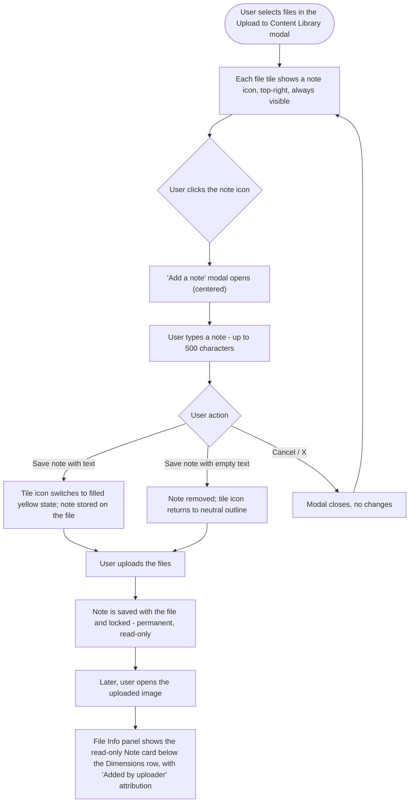

# Stories — Media Notes for the Content Library upload flow

> Deliverable for the Product Owner to create in Shortcut manually. Nothing is pushed to Shortcut. Each story ends with a **Shortcut fields** block. Create both stories with the **New Feature Template** so the standard sections + 5 quality-checklist tasks are pre-populated.

---

## Suggested Epic

**Epic name:** `Media Notes for Content Library Uploads`

**Epic description:**

> **Why:** When teams upload media to the Content Library, the important context about a file — where it came from, its usage rights or licensing, or how it's meant to be used — lives only in someone's head, a chat thread, or a separate document. Once the file is in the library, that context is lost, and any teammate who reuses the asset later has no way to know its constraints.
>
> **What:** Let users attach a short, permanent note to each file at the moment they upload it. The note is written per file in the "Upload to Content Library" modal, saved with the file, and shown read-only (with uploader attribution) whenever that file is opened later. Because the upload modal is reused across ContentStudio, notes work identically everywhere media can be added from the Content Library — the main library, the composer, campaigns, automation, discovery, and any other entry point.
>
> **In scope:**
> - Add, edit, or delete a note per file — during the upload step only.
> - Notes lock automatically once the file is uploaded — permanent and read-only, never editable or deletable afterward.
> - Read-only note display in the File Info panel, with an "Added by [uploader] · at upload" attribution and an explanatory info tooltip.
> - Works at every Content Library upload entry point, not just the main library page.
>
> **Out of scope:**
> - Editing or deleting a note after upload.
> - Notes on the mobile apps and Chrome extension (the note field is returned by the API so these surfaces can display it read-only in a future enhancement).
> - Rich text, mentions, or attachments inside a note (plain text only, 500-character maximum).

**Epic state:** To Do

> **Note on epic vs. Miscellaneous:** The `/story` pipeline normally files standalone stories under the current **Q2 - 2026: Miscellaneous** epic (id `115078`). Since these two stories form one cohesive feature, a dedicated epic is recommended and both stories below reference it. If you'd rather not create a dedicated epic, drop both under the Miscellaneous epic instead.

---

## Story 1

# [BE] Store an optional per-file note on Content Library media uploads

### Description

As a user uploading media to the Content Library, I want a short note I write against a file at upload time to be saved permanently with that file, so that the context I captured (its source, usage rights, or how it should be used) stays attached to the asset for me and my team to reference later.

This story covers the backend: accepting a note for each file across every Content Library upload path, saving it on the asset, returning it (with the uploader's identity, which is already recorded) when assets are fetched, and guaranteeing the note can never be changed once the file exists.

---

### Workflow

1. A user adds one or more files in the "Upload to Content Library" modal and writes a note against a file before uploading (frontend behavior — see **[FE] Add media notes to the Content Library upload flow and File Info panel**).
2. When the user uploads, each file's optional note travels with that file in the upload request.
3. The system saves the note on the media asset, alongside the uploader identity it already records for every upload.
4. When anyone later opens that asset, the saved note and the uploader's name are returned so they can be displayed read-only.
5. There is no way — from any screen or endpoint — to change or remove the note after the asset has been created. Removing the file removes the note with it, exactly as today.

---

### Acceptance criteria

- [ ] Every Content Library upload path accepts an optional `note` for each file — direct file upload, upload-by-bytes, upload-by-link, document upload, and the GCS "process uploaded media" flow.
- [ ] A note is limited to **500 characters**; a longer value is rejected with a validation error (the note is never silently truncated).
- [ ] The note is optional — uploads that send no note succeed and behave exactly as they do today (no `note` stored, no regression to existing upload behavior).
- [ ] The saved note is persisted on the media asset and returned in the asset fetch response (absent or `null` when no note was provided).
- [ ] The asset fetch response includes the uploader's identity (name/avatar) already recorded at upload, so the note can be attributed to the person who added it. (No new uploader capture is required — the uploader id is already stamped on every upload.)
- [ ] The note is **write-once**: no endpoint allows editing or deleting a note after the asset exists. Move, archive, rename, and folder operations never alter an existing note.
- [ ] Assets uploaded before this change (which have no note) continue to load normally with no note shown.

---

### Mock-ups

N/A — backend story.

---

### Impact on existing data

- Adds a new **optional** `note` field to media asset documents. Existing assets have no `note` (treated as absent/null) — **no data migration required**.
- Extends the Content Library upload request payload with an optional per-file `note` (additive, backward-compatible). **This changes the upload API request shape** — an additive contract change that the frontend upload flow (`ImageItem` → upload queue → `process-uploaded-gcs-media` payload) relies on; coordinate the exact field name with the FE story.

---

### Impact on other products

- **Mobile apps (iOS/Android) & Chrome extension:** The `note` field will be present in asset fetch responses. These surfaces are not required to change now, but can display the note read-only in a future enhancement.
- **White-label:** No impact.

---

### Dependencies

- Unblocks **[FE] Add media notes to the Content Library upload flow and File Info panel** (frontend cannot send or display a note until this persists and returns it). Align on the `note` field name and the 500-character limit across both stories.

---

### Global quality & compliance (wherever applicable)

- [ ] Mobile responsiveness — N/A, backend-only story
- [ ] Multilingual support (frontend + backend, translations available or fallback handled) — the 500-character validation message must be translatable/handled
- [ ] UI theming support — N/A, backend-only story
- [ ] White-label domains impact review
- [ ] Cross-product impact assessment (web, mobile apps, Chrome extension)

---

### Implementation references
*Pointers from research — not a contract. Engineering may choose a different approach.*

**Primary entry points:**
- `contentstudio-backend/app/Http/Controllers/Storage/MediaLibrary/MediaLibraryAssetsController.php` — the upload methods (`uploadMedia`, `uploadDocument`, `uploadMediaByLink`, `uploadMediaByBytes`, plus the GCS process-uploaded path). Routes in `contentstudio-backend/routes/web/storage.php` under `/media_library/assets/*`.
- `contentstudio-backend/app/Libraries/Storage/MediaLibrary.php` — where `$mediaDetails[...]` (name, mime_type, size, etc.) is assembled and persisted; the `note` field would be added here.

**Existing behavior to preserve (no change needed):**
- The uploader is already captured on every upload path: `$mediaDetails['user_id'] = Auth::id()` (controller lines ~160, 295, 463, 1168, 1315). The frontend already resolves this into `currentMedia.user.full_name`. Attribution needs **no new capture** — only the new `note` field.

**Gotcha:**
- The frontend upload payload has no note field today (`ImageItem` in `UploadFilesTab.vue`, `QueueItem` in `useMediaUploadQueue.ts`, and the `{ workspace_id, files: [fileDetails], folder_id?, is_root? }` payload in `useGCSUpload.ts` → `process-uploaded-gcs-media`). Adding the note is an additive contract change on the upload request — settle the exact field name once and use it on both sides.

---
---

## Story 2

# [FE] Add media notes to the Content Library upload flow and File Info panel

### Description

As a user uploading media to the Content Library, I want to attach a short note to each file while I'm uploading it and then see that note whenever I open the file later, so that I never lose the context behind an asset — where it came from, its usage rights, or how it should be used — and my teammates can see it too.

Notes can be added, edited, or deleted **only during the upload step**. Once a file is uploaded, its note is permanent and read-only. Because the upload modal, the file tile, and the File Info panel are shared across ContentStudio, this works identically everywhere media can be added from the Content Library (main library, composer, campaigns, automation, discovery, and any other entry point).

---

### Workflow

**During upload (add/edit/delete a note):**
1. In the "Upload to Content Library" modal, every selected file tile shows a **note icon in the top-right corner** — always visible. Files with no note show it in a neutral outline style; files with a note show it filled (yellow background, dark icon). This is separate from the three-dots menu, which still appears on hover at the bottom-right.
2. The user clicks the note icon, and a centered **"Add a note" modal** opens.
3. The user types a note (up to 500 characters) and clicks **Save note**. The tile's note icon switches to the filled state.
4. To edit, the user clicks the icon again (the modal opens pre-filled) and saves changes. To delete, the user clears the text and clicks **Save note** — the note is removed and the icon returns to the neutral outline.
5. **Cancel** or the **X** closes the modal without saving.
6. The user uploads the files. Each note is saved permanently with its file.

**After upload (read-only everywhere):**
7. Once a file is uploaded, its note is locked — it can no longer be edited or deleted from anywhere in the app.
8. When the user later opens an uploaded image, the File Info panel shows the note as a **read-only card directly below the Dimensions row**, with the "Note" label, an info tooltip, the note text, and an "Added by [uploader] · at upload" caption beneath it.

---

### Acceptance criteria

**Note icon on the file tile (upload modal):**
- [ ] Each file tile in the "Upload to Content Library" modal shows a note icon in the **top-right corner, always visible** (not hover-gated).
- [ ] A file with **no note** shows the icon in a **neutral outline** style.
- [ ] A file **with a note** shows the icon **filled**: yellow background (map to `bg-yellow-500`) with a dark foreground icon (map to `text-gray-700` / `#353535`).
- [ ] The note icon is visually and functionally **separate** from the three-dots menu, which continues to appear on hover at the bottom-right of the tile.
- [ ] Hovering the note icon shows a tooltip (via the `v-tooltip` directive): **"Add a note"** when the file has no note, **"Edit note"** when it already has one.

**"Add a note" modal:**
- [ ] Clicking the note icon opens a **centered modal**.
- [ ] The modal shows a note icon badge at the top with a **yellow-50 background (`bg-yellow-50`) and a yellow-500 icon (`text-yellow-500`)**.
- [ ] Title: **"Add a note"**.
- [ ] One-line description below the title: **"Saved with the file on upload — can't be edited afterward."**
- [ ] A `Textarea` with placeholder: **"Add a note about this file — for example, its source, usage rights, or how it should be used."**
- [ ] The textarea is limited to **500 characters** (input is prevented beyond 500), with a live character counter shown below it, e.g. **"0/500"**, updating as the user types.
- [ ] Buttons: **"Cancel"** (secondary) and **"Save note"** (primary), plus an **X** in the top-right to close.
- [ ] The **file name is NOT shown** anywhere in this modal.
- [ ] Opening the modal on a file that already has a note **pre-fills** the textarea with that note.
- [ ] Clicking **Save note** with text stores the note on that file and switches the tile icon to the filled state.
- [ ] Clicking **Save note** with the textarea emptied **removes** the note and returns the tile icon to the neutral outline.
- [ ] **Cancel** or **X** closes the modal and discards any unsaved changes.
- [ ] Adding, editing, and deleting a note is possible **only before the file is uploaded**.

**Locked after upload:**
- [ ] Once a file is uploaded, its note becomes **permanent and read-only** — it cannot be edited or deleted from the upload modal, the File Info panel, or anywhere else.

**Read-only Note card in the File Info panel:**
- [ ] When a user opens an uploaded image that has a note, the File Info panel shows a **Note card directly below the Dimensions row** (and the card is **not shown** when the file has no note).
- [ ] The card is a rounded rectangle with a **yellow-50 background** (`bg-yellow-50` / `#FFF9EE`), a **yellow-100 border** (`border-yellow-100` / `#FFEDCA`), and **grey-500 text** (`text-gray-500` / `#4a4a4a`).
- [ ] The card shows a **"Note"** label with an **info icon** in a blue accent (map to the existing blue token; see Implementation references).
- [ ] Hovering the info icon shows a tooltip: **"This note was added by the person who uploaded this file. It's saved with the file and can't be edited."**
- [ ] The note text is displayed read-only, wrapping across lines and preserving line breaks.
- [ ] Directly below the card, an attribution caption reads **"Added by [uploader] · at upload"** (e.g., "Added by Sarah Chen · at upload"), using the uploader name already returned with the asset.
- [ ] The note is **fully read-only** in this view — no edit or delete affordance is present.

**Works everywhere:**
- [ ] The note icon, "Add a note" modal, locked-after-upload behavior, and File Info note card work **identically at every entry point** where the Content Library upload modal appears — the main Content Library page, the composer, campaigns, automation, and discovery.

**Analytics (Usermaven):**
- [ ] When a user saves a non-empty note during upload, a `media_note_added` Usermaven event fires with `{ character_count }`. It fires once per file on save (not per keystroke), and does **not** fire when a note is cleared/removed or when an empty note is saved.

---

### Mock-ups

N/A — no mockup files provided. Visual spec (colors, placement, copy) is captured in the acceptance criteria above.

---

### Impact on existing data

- No change to existing stored data. The note is written client-side against each pending file and sent with the upload; persistence and retrieval are handled by **[BE] Store an optional per-file note on Content Library media uploads**.

---

### Impact on other products

- **Mobile apps (iOS/Android) & Chrome extension:** Not changed by this story. The note is web-only for now; the backend returns the field so these surfaces could show it read-only later.
- **White-label:** The note affordance uses fixed semantic accent colors (yellow/blue), intentionally not the brandable primary — so it looks the same across white-label domains. No brand-color coupling.

---

### Dependencies

- Depends on **[BE] Store an optional per-file note on Content Library media uploads** for persisting the note at upload and returning it (with uploader) when the asset is opened. Align on the `note` field name and the 500-character limit.

---

### Global quality & compliance (wherever applicable)

- [ ] Mobile responsiveness (frontend only, N/A for backend-only stories)
- [ ] Multilingual support (frontend + backend, translations available or fallback handled) — all new strings (modal title, description, placeholder, buttons, tooltips, "Note" label, attribution caption) via `t()` in all 8 locale dirs
- [ ] UI theming support (default + white-label, design library components are being used)
- [ ] White-label domains impact review
- [ ] Cross-product impact assessment (web, mobile apps, Chrome extension)

---

### Implementation references
*Pointers from research — not a contract. Engineering may choose a different approach.*

**Primary entry points (all shared components — implement once, works everywhere):**
- `contentstudio-frontend/src/modules/publish/components/media-library/components/Asset.vue` — the single tile component (used in the upload modal via `type="secondary"` and in the library grid). Add the always-visible note-icon overlay in the top-right zone (near the existing `.asset-check-button` at `top-2 right-2`); the three-dots menu (`.asset-menu`, `EllipsisVertical` in a `Dropdown`) stays at `bottom-2.5 right-2.5` on hover — keep them separate.
- `contentstudio-frontend/src/modules/publish/components/media-library/components/MediaTabs/UploadFilesTab.vue` — add a `note` field to the per-file `ImageItem` shape and include it in the upload payload (via the upload queue / `useGCSUpload` → `processUploadedMedia`).
- `contentstudio-frontend/src/modules/publish/components/media-library/components/UploadMediaModal.vue` — host the "Add a note" modal here (a new `AddNoteModal.vue` sibling is cleanest). Modal access via `inject('root') as ModalPlugin` → `$cstuModal`.
- `contentstudio-frontend/src/modules/publish/components/media-library/components/PreviewMediaAssetModal.vue` — add the read-only Note card in the file-info rows, directly after the conditional Dimensions row (`v-if="mediaDimension"`). Uploader name is already available as `currentMedia.user.full_name`; the "created on"/relative-time helpers are already imported.

**Suggested names / patterns:**
- Component: `AddNoteModal.vue`. i18n keys under the existing `publisher.media_tabs.*` namespace (e.g. `publisher.media_tabs.note.*` for the modal + tile tooltips, `publisher.media_tabs.preview_modal.file_info.note*` for the card) — add to all 8 locale dirs.
- Structural template for the note editor: `contentstudio-frontend/src/modules/composer_v2/components/EditorBox/SaveCaptions/AddEditCaption.vue` (textarea + save/edit form). Per-image text-metadata precedent: `alt_texts` (`[{ image, alt_text }]`) in `composer_v2/.../EditorBox.vue` (note: that lives on the post payload, not the library asset).

**Components to use (from `docs/ui-components.md`):**
- `Modal` (`@contentstudio/ui`, via `$cstuModal`), `Textarea`, `Button`, `Icon`. Tooltips via the `v-tooltip` directive (no standalone Tooltip component exists). For the note glyph, pick a suitable icon from the `Icon` set (e.g. a sticky-note / notebook glyph) — confirm the exact name exists before use.

**Theming / color mapping:**
- Prefer palette tokens over hardcoded hex: `bg-yellow-50` (`#FFF9EE`), `border-yellow-100` (`#FFEDCA`), `bg-yellow-500`, `text-gray-700` (`#353535`), `text-gray-500` (`#4a4a4a`). For the info icon's `blue-450`, use the existing blue accent token in the palette; if that exact shade isn't defined, **flag it for a token addition** rather than hardcoding a hex (per repo styling rules). These are fixed semantic accents — intentionally **not** `primary-cs-*`, so they don't shift per white-label brand.

---

## Shortcut fields

### For **[BE] Store an optional per-file note on Content Library media uploads**
- **Template:** New Feature Template
- **Story type:** feature
- **Project:** Web App
- **Group:** Backend
- **Epic:** Media Notes for Content Library Uploads *(new — see Suggested Epic above; fallback: Q2 - 2026: Miscellaneous, id `115078`)*
- **Priority:** Medium
- **Product Area:** Media Library
- **Skill Set:** Backend
- **Estimate:** _(empty — devs estimate during sprint planning)_
- **Labels:** _(none)_
- **Iteration:** _(PO assigns current/target sprint at creation)_

### For **[FE] Add media notes to the Content Library upload flow and File Info panel**
- **Template:** New Feature Template
- **Story type:** feature
- **Project:** Web App
- **Group:** Frontend
- **Epic:** Media Notes for Content Library Uploads *(new — see Suggested Epic above; fallback: Q2 - 2026: Miscellaneous, id `115078`)*
- **Priority:** Medium
- **Product Area:** Media Library
- **Skill Set:** Frontend
- **Estimate:** _(empty — devs estimate during sprint planning)_
- **Labels:** _(none)_
- **Iteration:** _(PO assigns current/target sprint at creation)_
