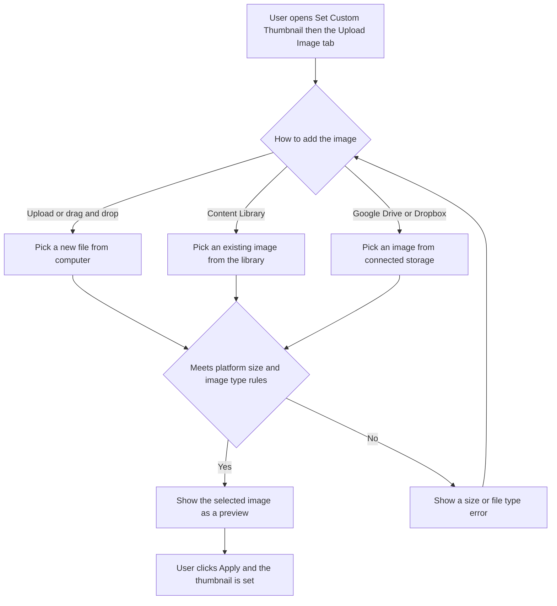

# 02 — Stories: Custom Video Thumbnail from Media Library

Single frontend story. Reuses the shared media-import widget already used across the app (AI Studio tools, bulk upload automation) so no new design or backend work is needed.

---

## [FE] Add Media Library, Google Drive and Dropbox sources to the custom video thumbnail Upload tab

### Description

When a user adds a video to a post and opens the **Set Custom Thumbnail** modal, the **Upload Image** tab today only lets them upload a fresh file from their computer. If they customize a post per platform (for example Facebook, Instagram and LinkedIn separately), they have to upload or regenerate the thumbnail for each platform, and again every time they re-upload the video.

This story makes the Upload Image tab use the same media widget the rest of the app already uses, so the user can also pick an image that is already in their **Content Library**, or from **Google Drive** or **Dropbox**, in addition to uploading a new file. Picking an image that already exists in the library sets it as the thumbnail in one click, with no re-upload, which removes the repetitive per-platform work.

### Workflow

1. User adds a video to a post and opens the **Set Custom Thumbnail** modal.
2. User selects the **Upload Image** tab.
3. Instead of only a plain upload box, the user now sees the standard media widget: a drag and drop area with an "upload" link, plus three source buttons, **Content Library**, **Google Drive** and **Dropbox**.
4. The user adds an image in any of these ways: drag and drop or click "upload" to add a new file, click **Content Library** to pick an image already in their library, or click **Google Drive** or **Dropbox** to pick from connected storage.
5. The selected image appears as a preview inside the tab.
6. User clicks **Apply** and the image is set as the custom thumbnail for the selected account or platform. Clicking **Cancel** discards the selection.

### Acceptance criteria

- [ ] In the **Set Custom Thumbnail** modal, the **Upload Image** tab shows the shared media widget (the same one used in the AI Studio tools and bulk upload), with a drag and drop area, an "upload" link, and three source buttons: **Content Library**, **Google Drive**, **Dropbox**.
- [ ] User can still add a new image by clicking "upload" or by dragging an image onto the area (existing upload behavior is preserved).
- [ ] Clicking **Content Library** opens the media library picker; selecting an image sets it as the thumbnail without re-uploading it.
- [ ] Clicking **Google Drive** opens the media library picker on the Google Drive source; selecting an image sets it as the thumbnail.
- [ ] Clicking **Dropbox** opens the media library picker on the Dropbox source; selecting an image sets it as the thumbnail.
- [ ] Only images can be added in this tab. Selecting or dropping a non-image shows the error: "Please choose an image file."
- [ ] The chosen image appears as a preview inside the Upload Image tab before the user clicks Apply.
- [ ] Selecting an image from the library, Google Drive or Dropbox sets the thumbnail for the current account or platform only, and does not attach the image to the post itself.
- [ ] Existing per-platform limits still apply: a thumbnail over the Instagram image size limit is blocked with the current Instagram error, and a thumbnail over the YouTube thumbnail size limit is blocked with the current YouTube error, for both uploaded files and images picked from the library.
- [ ] The existing YouTube Shorts, TikTok and Instagram reel only warnings continue to show as they do today.
- [ ] Clicking **Apply** sets the chosen image as the custom thumbnail (same result as today's upload). Clicking **Cancel** discards the selection.
- [ ] The Upload Image tab stays hidden where it is hidden today (for example for TikTok) and respects the existing per account disabled states.
- [ ] Design tools (Canva, Vista Create, PostNitro) and video or PDF sources are not shown in this tab. It offers image sources only.

### UI copy

The tab reuses the shared media widget, configured for thumbnails and images only:

- **Instruction line:** "Drag & drop thumbnail here, or" followed by the "upload" link
- **Drag overlay title:** "Drop your image here"
- **Supported formats line:** "Supported: JPG, PNG, GIF, WebP."
- **Source buttons:** "Content Library", "Google Drive", "Dropbox"
- **Wrong file type error:** "Please choose an image file."
- **Size limit errors:** reuse the existing Instagram and YouTube size limit messages already shown in this modal (no new copy).

Use the same label wording across the widget. The target is the widget shown in the second provided screenshot (Content Library, Google Drive, Dropbox), restricted to image sources.

### Mock-ups

Two screenshots were provided:
1. The current Upload Image tab, a plain "Click to upload or drag and drop" box (PNG or JPG).
2. The target shared media widget: "Drag & drop thumbnail here, or upload", a "Supported: JPG, PNG, GIF, WebP." line, and the three source buttons Content Library, Google Drive, Dropbox.

The Upload Image tab should match screenshot 2, restricted to image sources.

### Impact on existing data

None. Thumbnails are already stored as an image URL. This only adds more ways to choose that image. No schema or data migration.

### Impact on other products

- **Mobile apps:** N/A. The per-platform custom video thumbnail editor is a web composer feature and is not present in the mobile apps.
- **Chrome extension:** N/A.
- **White-label:** the shared media widget already handles white-label behavior elsewhere (for example design tools are hidden on white-label domains). The image sources (Content Library, Google Drive, Dropbox) should behave in this tab the same way they do in the rest of the composer.

### Dependencies

None. Reuses existing components and existing media library, Google Drive and Dropbox flows.

### Global quality and compliance checklist

- [ ] Mobile responsiveness tested (frontend only, N/A for backend-only stories)
- [ ] Multilingual support verified (frontend and backend, translations available or fallback handled) — add or reuse i18n keys for any new copy in the `composer` namespace across all locales
- [ ] UI theming supported (default and white-label, design library components are being used) — ContentStudio has no dark mode
- [ ] White-label domains impact reviewed
- [ ] Cross-product impact assessed (web, mobile apps, Chrome extension)

### Implementation references

*Pointers from research, not a contract. Engineering may choose a different approach.*

**Reuse the existing shared widget (same one used in AI Studio tools and bulk upload):**
- `contentstudio-frontend/src/components/common/MediaImportDropzone.vue` — the shell component. Props include `instructionPrefix`, `actionLabel`, `supportedText`, `dragTitle`, `isDragging`, `showSelectedContent`, `disabled`. Slots: `sources` (place the Content Library / Google Drive / Dropbox buttons here) and `selected` (the chosen-image preview). Events: `click`, `dragenter`, `dragover`, `dragleave`, `drop`.

**Pattern to copy (closest existing usage):**
- `contentstudio-frontend/src/modules/AI-tools/video-clips/components/StepVideoImport.vue` — uses `MediaImportDropzone` with the `#sources` buttons and `#selected` preview, and wires the library through `useEditorBridge()`:
  - `bridge.openMediaLibrary({ source, sideTabIndex, modalId: 'global-upload-media-modal' })` where `sideTabIndex` selects the source tab: Library = 1, Google Drive = 9, Dropbox = 8.
  - `bridge.onMediaFromMediaLibrary(callback)` receives the pick as `{ type, media, mediaType }` (the `add-media-from-media-library` protocol). Filter by your own `source` string and by `mime_type` to accept images only.

**Target to change:**
- `contentstudio-frontend/src/modules/composer_v2/components/CustomThumbnail/CustomThumbnailModal.vue` — replace the `<label>` plus `<input type="file">` block inside the `type === 'upload'` section (currently around lines 116-155) with `MediaImportDropzone` plus the three source buttons.
  - Keep the existing `uploadFrame(file)` path for freshly uploaded or dragged files (upload to storage then `setThumbnailURL`).
  - For an image picked from the library, Google Drive or Dropbox, the asset already has a hosted URL, so call `setThumbnailURL(mediaURL)` directly with no re-upload.
  - Preserve the current Instagram and YouTube `max_size` checks (from `socialIntegrationsConfigurations`). For URL-based library picks, validate using the asset's size and mime metadata returned by the picker instead of a `File` object.
  - Use a dedicated `source` value (for example `'custom-thumbnail'`) when opening the library so the selection is scoped to this modal and is not attached to the post. This is the "handle the modal opening and media addition" wiring.
  - Subscribe to `bridge.onMediaFromMediaLibrary` on modal show and tear it down on modal hide or `onUnmounted`, so it does not clash with the composer's own media library selections.
- The modal is currently Options API with a `setup()` block; `useEditorBridge()` and the media helper can be called there. Keep the change focused. If a new child component is extracted, author it as `<script setup lang="ts">` per the composer_v2 module guide.
