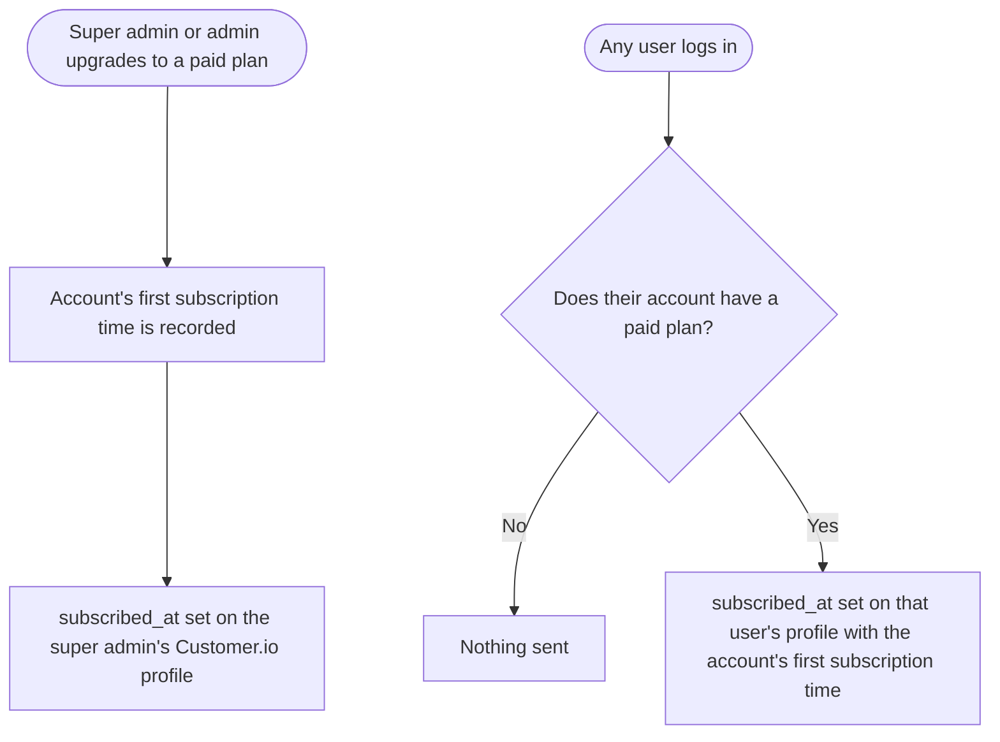

# [BE] Send first subscription time to Customer.io as a `subscribed_at` attribute

### Description:

As the marketing and lifecycle team, we want every ContentStudio user on a paid account to carry the date their account first subscribed as a Customer.io profile attribute, so we can segment and time campaigns by customer tenure. Examples: onboarding for new payers, a "3 months with ContentStudio" message, or renewal nudges.

It has to be an **attribute on the person**, not an event, so it can be used directly in segments and campaign filters. It also has to be the same value for everyone on the account. It doesn't matter whether the super admin or an admin did the upgrade, and team members see the account's subscription date, not a date of their own.

---

### Workflow:

1. A super admin, or an admin with billing access, upgrades the account from the trial or free plan to a paid plan.
2. As soon as the subscription is created, the super admin's Customer.io profile gets `subscribed_at` set to the time the account first subscribed.
3. Later, any user on that account logs in: the super admin, another admin, or a team member. For example, an admin upgraded on Monday and the super admin logs in on Wednesday.
4. If the account has a paid plan, that user's Customer.io profile gets `subscribed_at` set to the **same** first subscription time. It is not the time they logged in, and it is not the time of the latest renewal.
5. Plan changes after that (upgrade, downgrade, billing cycle switch, renewal) never change the value.

---

### Acceptance criteria:

- [ ] When an account subscribes to a paid plan for the first time, the super admin's Customer.io profile shows a `subscribed_at` attribute equal to the time of that first subscription
- [ ] `subscribed_at` is sent as a person attribute (it appears in the person's Attributes tab in Customer.io), not as an event in their activity log
- [ ] `subscribed_at` is a Unix timestamp in seconds, the same format as the existing `created_at` attribute, so Customer.io reads it as a date
- [ ] When an admin with billing access completes the upgrade, the super admin still gets `subscribed_at` straight away, not only when they next log in
- [ ] When any user whose account has a paid plan logs in (super admin, admin, or team member of any role), their own Customer.io profile gets `subscribed_at` set to the account's first subscription time
- [ ] Two users on the same account always get the identical `subscribed_at` value
- [ ] Login via email/password, Google and other social sign-in, and SSO all send it, from both the web app and the mobile app
- [ ] Users on the free plan or a trial with no paid subscription get no `subscribed_at` attribute, and no empty or zero value is sent
- [ ] Upgrading, downgrading, switching monthly/annual, or a renewal does not change an account's `subscribed_at`
- [ ] Existing paid customers who subscribed before this ships get their correct historical first subscription date the next time they log in, not the date of their first login after release
- [ ] When ContentStudio staff log in as a customer ("login as user"), nothing is sent to Customer.io
- [ ] When Customer.io credentials are not configured for an environment, nothing is sent and no Customer.io profile is created
- [ ] A Customer.io failure or timeout never blocks or slows down login or the subscription webhook, and the failure is reported to Sentry
- [ ] The existing `subscription_created` and `subscription_updated` Customer.io events keep firing unchanged

---

### Mock-ups:

N/A, no UI.

---

### Impact on existing data:

- No change to existing subscription records.
- The account's first subscription time is read from existing subscription records (earliest across current and legacy billing providers). It may be stored once on the account so it doesn't have to be recomputed on every login. If stored, it is backfilled from existing records, so existing paid customers get their real historical date.
- Customer.io: a new `subscribed_at` attribute appears on the profiles of paid-account users. Existing attributes are untouched.

---

### Impact on other products:

- **Mobile app (Flutter):** no app change. Logging in on the app sets the attribute through the same backend login.
- **Chrome extension:** no change.
- **White-label:** white-label users on a paid account get the attribute the same way. The lifecycle team should decide whether white-label users are excluded from Customer.io campaigns, as they are today.
- **Customer.io:** the lifecycle team can build segments on `subscribed_at` once this is live.

---

### Dependencies:

None.

---

### Global quality & compliance (wherever applicable)

- [ ] Mobile responsiveness (N/A, backend-only story)
- [ ] Multilingual support (N/A, no user-facing copy)
- [ ] UI theming support (N/A, no UI)
- [ ] White-label domains impact review
- [ ] Cross-product impact assessment (web, mobile apps, Chrome extension)
- [ ] Developer surfaces coverage (N/A, no new or changed public API; internal Customer.io sync only)
