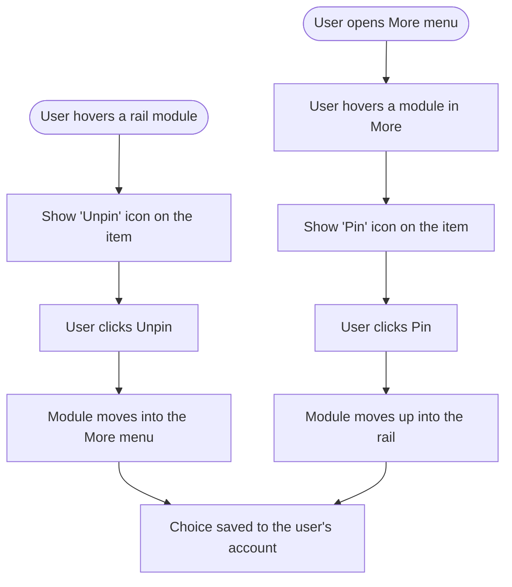

# Desktop Navigation Rail — Pin / Unpin · Stories

**Platform:** Web only (desktop left rail). **Scope:** Frontend + Design. No backend (reuses the existing user-preferences endpoint), no mobile.

| # | Story | Priority |
|---|---|---|
| S-1 | [FE] Let users pin/unpin modules in the desktop navigation rail | Medium |
| S-2 | [Design] Design the rail pin/unpin affordances and More-menu footer | Medium |

---

## S-1 · [FE] Let users pin/unpin modules in the desktop navigation rail
**Project:** Web App · **Group:** Frontend · **Skill:** Frontend · **Product area:** Throughout product · **Priority:** Medium · **Type:** Feature

### Description
As a user, I want to choose which product sections sit directly in my left navigation rail versus tucked inside the "More" menu, so that the sections I use most are always one click away and the rail isn't cluttered with ones I don't.

Today the rail decides what overflows into "More" automatically based on screen height — the user has no say. This adds explicit pin/unpin control, remembered per user.

### Workflow

1. The user hovers a module in the rail (e.g., Analytics). A small **Unpin** icon appears on that item.
2. The user clicks Unpin. The module disappears from the rail and now lives inside the **More** menu.
3. The user opens the **More** menu and hovers a module inside it. A small **Pin** icon appears on that row.
4. The user clicks Pin. The module moves out of More and back into the rail.
5. The user's pinned/unpinned choices are remembered and restored the next time they log in, on any device.
6. A **Reset** action in the More menu restores the default rail layout.

### Acceptance criteria
- [ ] Hovering a pinnable rail module reveals an **Unpin** affordance (icon button) on that item; clicking it moves the module into the More menu.
- [ ] Hovering a module row inside the More menu reveals a **Pin** affordance; clicking it moves the module into the rail.
- [ ] The Unpin icon tooltip reads: **"Unpin from sidebar"**, with hover detail: **"Remove this from the sidebar. You'll still find it under More."**
- [ ] The Pin icon tooltip reads: **"Pin to sidebar"**, with hover detail: **"Add this to the sidebar for one-click access."**
- [ ] **The top/Home item cannot be unpinned** (no Unpin icon); it stays anchored at the top regardless of plan (including when it shows as "API" on API-centric plans).
- [ ] The **More** button is a separate, fixed control — never pinnable or unpinnable. Secondary/utility items (Social Accounts, Brand Knowledge, notifications, profile) are out of scope — no pin/unpin on those.
- [ ] The More menu shows a footer with helper text: **"Pin or unpin to customize your sidebar"** and a **Reset** action.
- [ ] The Reset action restores the default set of pinned modules; tooltip: **"Restore the default sidebar layout."**
- [ ] Pinned/unpinned choices persist per user across sessions and devices (saved to the user's preferences), and are applied on next load.
- [ ] If the user's pinned modules don't all fit on a short screen, the lowest-priority pinned modules still overflow into More automatically (existing height behavior preserved) — pinning never breaks the layout or hides the More button when overflow exists.
- [ ] Unpinning the currently-active module still keeps it reachable from More and does not navigate the user away.
- [ ] When a user unpins a module, a `nav_rail_item_unpinned` Usermaven event fires with `{ item: '<module_id>' }`.
- [ ] When a user pins a module, a `nav_rail_item_pinned` Usermaven event fires with `{ item: '<module_id>' }`.
- [ ] When a user resets the layout, a `nav_rail_layout_reset` Usermaven event fires.
- [ ] All new copy (tooltips, footer, reset) is added to the `header` namespace across every locale directory under `src/locales/`, English first.

### Mock-ups
See **[Design] Design the rail pin/unpin affordances and More-menu footer**. Reference image provided by the PO (More menu with a "Pin or remove from toolbar" footer + Reset).

### Impact on existing data
Adds one new key to the user's stored preferences (the pinned-modules layout). No schema migration — uses the existing generic preferences store.

### Impact on other products
- Desktop web rail only. No change to the mobile apps, the Chrome extension, or white-label behavior (icons/labels already theme-aware).
- The automatic height-based overflow continues to work; this layers user intent on top of it.

### Dependencies
- **[Design] Design the rail pin/unpin affordances and More-menu footer** (final placement and visuals for the pin/unpin icons, hover states, and More-menu footer).

### Global quality & compliance (wherever applicable)
- [ ] Mobile responsiveness (frontend only, N/A for backend-only stories)
- [ ] Multilingual support (frontend + backend, translations available or fallback handled)
- [ ] UI theming support (default + white-label, design library components are being used)
- [ ] White-label domains impact review
- [ ] Cross-product impact assessment (web, mobile apps, Chrome extension)

### Implementation references
*Pointers from research — not a contract. Engineering may choose a different approach.*

**Primary entry points:**
- `contentstudio-frontend/src/components/layout/DesktopNavigationRail.vue` — owns the rail render and the current auto-overflow logic (`OVERFLOW_PRIORITY`, `overflowIds`, `visibleItems`, `overflowItems`, the More `Dropdown`). The pin/unpin affordances and the user-pinned set layer in here.
- `contentstudio-frontend/src/components/layout/useHeaderNavigation.ts` — builds `primaryNavItems` (ids: `home`, `publisher`, `analytics`, `inbox`, `discover`, `media-library`, `social-accounts`, `brand-knowledge`, `more`). Good home for the pinned-set state + pin/unpin/reset actions so the rail stays a thin renderer.
- `contentstudio-frontend/src/components/layout/TopHeaderBar.vue` — wires `useHeaderNavigation` into `DesktopNavigationRail`.

**Persistence:**
- Reuse `setPreferenceStatus(key, value)` from `contentstudio-frontend/src/modules/common/composables/useHelper.js` → `setUserPreferencesApi` → `preferences/setPreferences`. Suggested key e.g. `nav_rail_pinned_modules` holding the ordered list of pinned module ids (or the unpinned set). The generic endpoint already accepts arbitrary key/value, so **no backend change is expected** — confirm it round-trips an array/object value; if the store only persists scalars, a tiny BE follow-up to allow the value type would be the only addition.

**Components / patterns:**
- Use `@contentstudio/ui` `Icon` for the pin/unpin glyphs (e.g., `Pin` / `PinOff`) and `ActionIcon` for the clickable affordance; tooltips via the existing `v-tooltip` directive already used throughout this file.
- More menu rows are `ListItem`s in the existing `Dropdown` (`overflowItems` loop) — add the hover Pin affordance there; add the footer below the list.

**Usermaven:**
- `const { trackUserMaven } = useUserMaven()` from `contentstudio-frontend/src/composables/useUserMaven.ts`. No existing nav-rail events — these are new.

**Gotchas:**
- Home/`more` and the secondary group are excluded from `moduleItems`/pinning logic today — keep them excluded.
- The auto-overflow reserves one slot for the More button; the user-pinned set must compose with that height math, not replace it, so short screens still degrade gracefully.

---

## S-2 · [Design] Design the rail pin/unpin affordances and More-menu footer
**Project:** Web App · **Group:** Design · **Skill:** Design · **Product area:** Throughout product · **Priority:** Medium · **Type:** Feature

### Description
As the team building rail customization, we need clear visual designs for the pin/unpin interactions so that the affordances are discoverable on hover, unobtrusive at rest, and consistent with the existing rail styling.

### Workflow
1. Designer reviews the current desktop rail and the PO's reference image (More menu with a "Pin or remove from toolbar" footer + Reset).
2. Designer delivers Figma designs covering the rail item hover state, the More-menu row hover state, and the footer.
3. Designer hands off specs (icon, placement, hover/active states, spacing) to frontend.

### Acceptance criteria
- [ ] Design for the **rail item hover → Unpin** affordance (icon placement on the compact rail item without crowding the label/icon).
- [ ] Design for the **More-menu row hover → Pin** affordance.
- [ ] Design for the **More-menu footer**: helper text ("Pin or unpin to customize your sidebar") + a **Reset** action.
- [ ] Design the **resting vs hover** states so the affordances are hidden until hover and don't shift layout when they appear.
- [ ] Show the **Home (anchored, non-unpinnable)** treatment so it's visually clear it can't be removed.
- [ ] All designs use existing rail tokens / `@contentstudio/ui` components and are white-label safe (no hardcoded brand colors).
- [ ] No dark mode and no RTL variants (not supported).

### Mock-ups
This story produces the mock-ups; link the Figma file here on completion.

### Impact on existing data
N/A — design only.

### Impact on other products
N/A — design only. Desktop web rail only.

### Dependencies
None (informs the FE story).

### Global quality & compliance (wherever applicable)
- [ ] Mobile responsiveness — N/A, design story (desktop rail only)
- [ ] Multilingual support — N/A, design story (copy provided by the FE story)
- [ ] UI theming support (default + white-label, design library components are being used)
- [ ] White-label domains impact review
- [ ] Cross-product impact assessment — N/A, desktop web only
