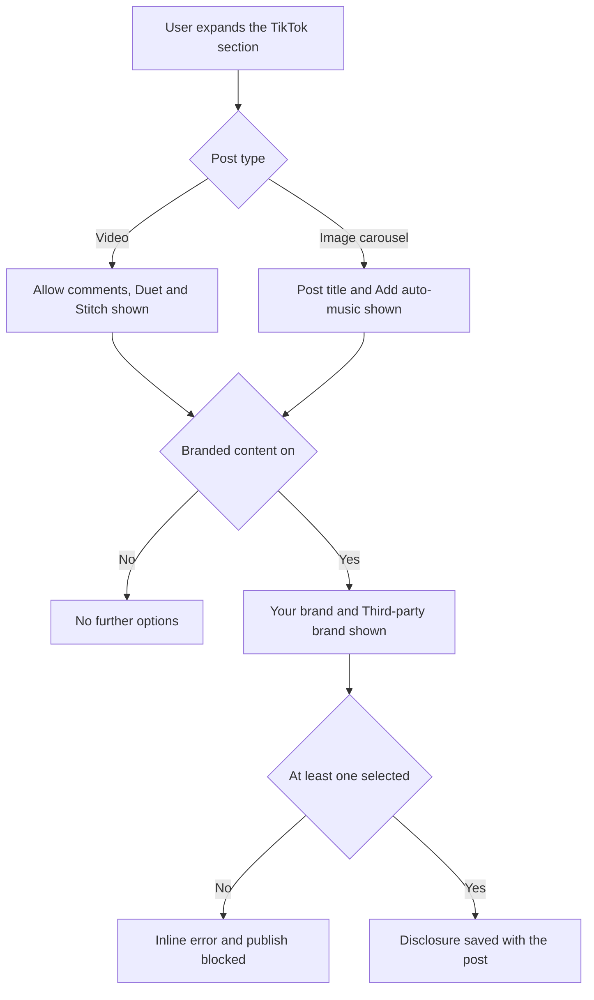

# Story: Flutter Composer Parity with the Web Composer

One story, as requested. Structure the body with the **New Feature Template** sections when creating it.

---

## `[Flutter] Bring the mobile composer to parity with the web composer`

### Description

As a ContentStudio user who schedules from my phone, I want the mobile composer to offer the same networks and posting options as the web composer, so that I can finish a post on mobile instead of starting it there and reopening it on desktop to set the options that only exist on web.

Today the mobile composer covers the common path well, but it is missing two networks entirely and a set of per-network posting options. The practical effect is that some posts simply cannot be created on mobile, and some can be created but go out without the settings the user expects, including the branded content and AI disclosures TikTok requires. This story closes that gap so a post created on mobile is indistinguishable from one created on web.

### Workflow

1. The user opens the composer on mobile and taps to select accounts.
2. **Bluesky and Telegram now appear** in the network list alongside the networks already there, and can be selected like any other.
3. The user writes a caption and adds media as they do today.
4. The user taps **Post settings**.
5. Each selected network has its own section. Every section now offers the same options the same network offers on web, and options appear or hide based on the post type and the media attached, so the user is never shown a control that cannot apply.
6. For **TikTok**, the user picks the post type, sets who can see the post, sets the interaction permissions, and can now disclose branded content and mark the post as AI-generated. Choosing **Image carousel** reveals the post title and auto-music options.
7. For **LinkedIn**, the user can now create a poll with a question, up to 4 options, and a duration.
8. For **Instagram**, the user can now invite collaborators and choose whether the post publishes directly through the API or through a mobile notification to a chosen device.
9. For **Facebook**, the user can now set a video title on video posts.
10. If a required option is missing or two options conflict, the user sees a clear inline message on the field and the post is not published until it is fixed.
11. The user publishes, schedules, saves as draft, adds to queue, or sends for approval exactly as before. Every option the user set is carried in the published post.
12. Reopening the post to edit shows every option exactly as it was saved.

The TikTok disclosure rules are the only genuinely conditional part of the flow:

### Acceptance criteria

**Networks**

- [ ] Bluesky accounts can be selected in the mobile composer and a post publishes to Bluesky successfully
- [ ] Telegram accounts can be selected in the mobile composer and a post publishes to Telegram successfully
- [ ] Bluesky and Telegram appear in the same position in the network order as they do on web
- [ ] The caption character counter uses the correct limit for Bluesky and for Telegram
- [ ] A Telegram album is limited to 10 items, matching web

**TikTok**

- [ ] Post type can be set to **Video** or **Image carousel**
- [ ] Selecting **Image carousel** shows the post title field, limited to 90 characters, and hides the Duet and Stitch options
- [ ] Selecting **Image carousel** shows **Add Auto-Music**
- [ ] Selecting **Video** shows Allow comments, Duet, and Stitch, and hides the post title and auto-music
- [ ] **Branded content** can be turned on, revealing **Your brand** and **Third-party brand**
- [ ] With branded content on and neither brand option selected, publishing is blocked with the message: `Please select at least one commercial content type for TikTok.`
- [ ] **AI-generated** can be turned on and is sent with the post
- [ ] A video post with no video is blocked with the message: `Please add a video for Tiktok video post.`
- [ ] A carousel post with fewer than 2 images is blocked with the message: `Please add at least 2 images for Tiktok carousel post.`
- [ ] A carousel post with more than 35 images is blocked with the message: `You can add maximum 35 images for Tiktok carousel post.`
- [ ] Direct publishing with no privacy level set is blocked with the message: `Please select who can view this post in Tiktok Settings.`
- [ ] A video smaller than 360 pixels in width or height is blocked with the message: `TikTok Video dimensions should be at least 360 pixels for both width and height.`

**LinkedIn**

- [ ] A poll can be created with a question and at least 2 options
- [ ] Up to 4 options can be added, and options beyond that cannot be added
- [ ] Poll duration can be set to 1 day, 3 days, 1 week, or 2 weeks
- [ ] A question longer than 140 characters shows: `Question must be between 1 to 140 characters`
- [ ] An option outside 1 to 30 characters shows: `Option must be between 1 to 30 characters`
- [ ] Two identical options show: `Option must be unique`
- [ ] Adding a poll to a carousel or document post is blocked with: `You can not add a poll to a LinkedIn carousel post or document post.`
- [ ] Adding media to a poll post is blocked with: `You cannot add media to a LinkedIn poll post.`
- [ ] An existing poll can be removed, with a confirmation first

**Instagram**

- [ ] Up to 3 collaborators can be invited by username
- [ ] Adding a 4th collaborator shows: `You can only add up to 3 Instagram Collaborators.`
- [ ] Adding a username already in the list shows: `This Instagram collaborator has already been added.`
- [ ] A collaborator can be removed from the list
- [ ] Collaborators are not offered on story posts
- [ ] Publishing method can be set to **Direct Publishing via API** or **Mobile Notifications**
- [ ] Choosing Mobile Notifications allows selecting one or more linked devices, and selecting none notifies all active devices
- [ ] Collaborators and publishing method are both carried in the published post

**Facebook**

- [ ] A video title can be entered on video posts, limited to 100 characters
- [ ] The video title is carried in the published post

**Threads**

- [ ] Threads has its own section in Post settings
- [ ] A multi-part thread can be composed, with each part published in order

**Validation depth**

- [ ] An Instagram feed post is limited to 1 media item
- [ ] An Instagram reel requires exactly 1 video
- [ ] A YouTube Shorts post rejects a video longer than 60 seconds
- [ ] A GMB event or offer post requires its date fields before publishing
- [ ] Every validation message appears inline on the field it belongs to, not only as a toast

**Cross-cutting**

- [ ] Every new option is available in single-caption mode and in per-channel custom content mode, scoped to the channel being edited
- [ ] Every option above survives a save and reopen for editing, with no value silently dropped
- [ ] Every new string is translated in all supported app languages, with the translation parity check passing
- [ ] A post created on mobile with these options set produces the same published result as the same post created on web
- [ ] Options that do not apply to the current post type or media are hidden rather than shown disabled, matching the existing behavior of the settings sheet

### UI copy

Reuse the web copy verbatim so the two surfaces read the same. Every string below is already translated on web.

**TikTok**

| Element | Copy |
|---|---|
| Publishing method label | Publish As |
| Direct option | Direct Publishing via API |
| Direct description | Direct publishing via TikTok API, offers limited posting options. |
| Notification option | TikTok App Notifications |
| Notification description | Publishing via TikTok App Notification, offers all TikTok features. |
| Post type label | Post Type |
| Post type options | Video · Image Carousel |
| Post title label | Post Title |
| Privacy label | Who can see |
| Privacy placeholder | Select Who can see this post |
| Privacy options | Public To Everyone · Mutual Follow Friends · Self Only |
| Permissions label | Allow User to |
| Permission options | Comment · Duet · Stitch |
| Auto-music label | Add Auto-Music |
| Auto-music tooltip | To enhance your TikTok carousel post, enable auto-music to let TikTok's algorithm add music automatically based on your content. |
| Branded content label | Branded content |
| Branded content tooltip title | Disclose Commercial Content |
| Branded content tooltip body | Let others know this option promotes a brand or business. |
| Your brand | Your brand |
| Your brand tooltip | Check this if you are promoting yourself or your own business. |
| Third-party brand | Third-party brand |
| Third-party brand tooltip | Check this if you are promoting another brand or third-party. |
| AI label | AI-generated |
| AI tooltip title | AI-generated content |
| AI tooltip body | Mark if any part of this post (video only) was created with AI. |

Carousel requirements note, shown when Image Carousel is selected, titled **Requirements for carousel post:**

- Only images are allowed in carousel post.
- Minimum 2 images required.
- Maximum 35 images allowed.
- Maximum width 1920 and height 1080 for single image.
- Maximum 20MB size for single image.

**LinkedIn poll**

| Element | Copy |
|---|---|
| Sheet title | LinkedIn Poll |
| Question label | Poll Question * |
| Question placeholder | What would you like to ask your audience? |
| Options label | Poll Options * |
| Options counter | {count}/{max} Options |
| Option placeholder | Option {number} |
| Add option | Add Option |
| Remove option | Remove option |
| Duration label | Poll Duration |
| Duration options | 1 day · 3 days · 1 week · 2 weeks |
| Save | Save Poll |
| Cancel | Cancel |
| Remove poll | Remove Poll |
| Remove confirmation title | Remove Poll |
| Remove confirmation body | Are you sure you want to remove current poll? |

**Instagram**

| Element | Copy |
|---|---|
| Publishing method label | Publish As |
| Method options | Direct Publishing via API · Mobile Notifications |
| Device label | Device |
| Device tooltip | These are your mobile devices linked with the ContentStudio app. Select one or more to receive a push notification for publishing. If none are selected, all active devices will be notified by default. |
| Collaborators label | Collaborators |
| Collaborators placeholder | Invite up to 3 collaborators by typing their usernames. Only public profiles can be added. |
| Add hint | Press Enter to add |
| Collaborators tooltip | Boost engagement with Instagram Collaborator Posts! Invite collaborators to add their username to the post and share it with their followers. |
| Story limitation note | Collaborators cannot be invited to story posts. |
| Remove tooltip | Remove Collaborator |

**Facebook**

| Element | Copy |
|---|---|
| Video title label | Video Title |

On mobile, render each web tooltip as a tappable info icon opening the app's standard info popup, since hover does not exist. Keep the wording unchanged.

Note for the PO: the existing web strings spell the network as "Tiktok" in validation messages and "TikTok" everywhere else. This story copies them as-is so the two surfaces match. Correcting the casing on both surfaces is a worthwhile separate copy fix, not part of this work.

### Mock-ups

None provided. The mobile settings sheet already has an established pattern of collapsible per-network sections, so each new option should follow it and reuse the existing field, toggle, chip, and sheet widgets rather than introducing new ones. Bluesky and Telegram need their network icons added to the account picker and channel strip.

### Impact on existing data

None. No schema changes and no migration. Every field in this story is already accepted by the publishing API and is already used by the web composer, so posts created on mobile will simply start carrying values that were previously always absent or defaulted. Existing scheduled and draft posts are unaffected and continue to open correctly.

### Impact on other products

- **Web app:** no changes. Web is the reference for this work.
- **Backend:** no changes. Mobile publishes through the same endpoint as web and the API already accepts every field.
- **Chrome extension:** not affected.
- **White-label:** the new controls must use the app's design tokens so they follow the active theme like the rest of the composer.

### Dependencies

- **Blocked on nothing.** No backend or design dependency, so this can start immediately.
- Two items are known to need data the composer does not have today, and should be treated as follow-ups rather than blockers for this story: the **YouTube playlist picker** needs a per-account playlist fetch, and the **Facebook Group warning banner** and page-versus-profile distinction for first comment need an account sub-type on the channel list.
- The **carousel builder** is deliberately excluded and stays its own epic. The publishing payload already supports carousels, only the builder UI is outstanding.
- **AI caption assist is out of scope** and stays hidden in the mobile composer, consistent with AI generation being a web-only capability.
- **Natural split seams if engineering wants to break this up at planning:** (a) Bluesky and Telegram, (b) TikTok compliance fields, (c) the options whose data already round-trips but has no control, (d) validation depth. Each is independently shippable and independently testable.

### Global quality & compliance (wherever applicable)

- [ ] Mobile responsiveness (frontend only, N/A for backend-only stories)
- [ ] Multilingual support (frontend + backend, translations available or fallback handled)
- [ ] UI theming support (default + white-label, design library components are being used)
- [ ] White-label domains impact review
- [ ] Cross-product impact assessment (web, mobile apps, Chrome extension)
