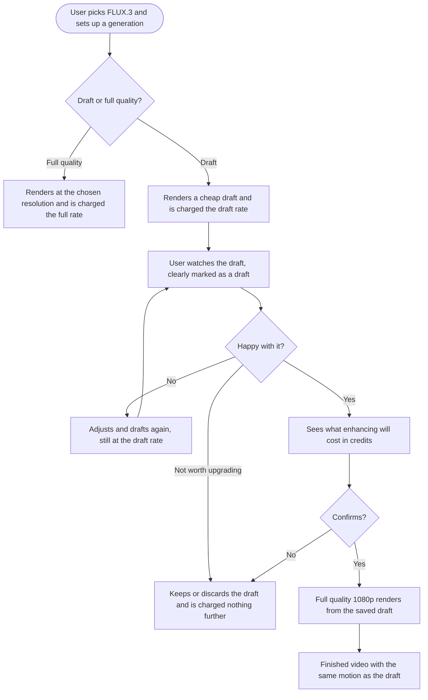

# EPIC: FLUX.3 video models

Bring Black Forest Labs' FLUX.3 video family into ContentStudio, and with it a way to try video ideas cheaply before paying for the finished render.

FLUX.3 is a frontier video model with five generation modes: from a text prompt, from a still image, between a start and an end frame, across a sequence of keyframes, and continuing an existing clip. It generates synchronized audio by default and produces clips of up to 20 seconds, longer than anything else we offer today.

Every mode also has a draft tier. A draft renders in a fraction of the time at roughly a third of the cost, and returns a reusable cache bundle. If the user likes what they see, one action promotes that exact draft to a full-quality 1080p render with the same motion and no re-planning. That turns video generation from an expensive one-shot gamble into something a user can iterate on, which is the real product change here.

Black Forest Labs is already a provider for our image models. This is their first video model in our stack.

| Order | Story |
|---|---|
| 1 | [Full Stack] Add FLUX.3 with text-to-video, image-to-video and first-last-frame-to-video |
| 2 | [Design] Design the keyframe sequencer and the draft-to-enhance flow |
| 3 | [Full Stack] Add FLUX.3 draft previews and full-quality enhance |
| 4 | [Full Stack] Add FLUX.3 keyframes-to-video |
| 5 | [Full Stack] Add FLUX.3 extend-video |

Story 1 gets the model live using patterns we already have. Story 3 is placed before keyframes and extend-video deliberately: it is the highest-value part of the family, and until it ships the only FLUX.3 path available is the expensive one.

**Sequencing note:** these stories touch `model_registry.py`, `parameter_optimizer_util.py`, `useVideoGeneration.ts` and `useVideoCreditCalculation.ts`, which are the same files as **[Full Stack] Add reference video and audio inputs to MiniMax H3** in `video-model-reference-audio-video-inputs` and the Seedance 4K story. Running them concurrently will conflict.

---

## 1. [Full Stack] Add FLUX.3 with text-to-video, image-to-video and first-last-frame-to-video

### Description

Add FLUX.3 as a selectable video model with its three modes that fit patterns we already support: generating from a text prompt, animating a still image, and generating the motion between a start frame and an end frame.

FLUX.3 brings things no model in our stack currently offers. It produces clips of up to 20 seconds where everything else caps at 15. It generates synchronized audio by default, at no extra cost, so there is no audio-on versus audio-off price split to reason about. And it is the first Black Forest Labs video model we carry, though we already use them for image generation.

The two remaining modes, keyframes and extend-video, and the draft tier all come later in this epic.

### Workflow

1. The user opens video generation and picks FLUX.3 from the model list.
2. The user writes a prompt, and optionally attaches a starting image, or a start frame and an end frame together.
3. The user sets duration, resolution, and aspect ratio. Durations run from 5 to 20 seconds, resolution is 720p or 1080p, and the aspect ratio list includes a 2:1 option not offered by other models.
4. The credit estimate updates as the user changes duration and resolution, before they generate.
5. The user generates and receives a video with synchronized audio, through the existing generation flow.

### UI copy

- Model name in the picker: `FLUX.3`
- Model description: `Black Forest Labs' frontier video model. Generates up to 20 seconds with synchronized audio, from a prompt, a single image, or a start and end frame.`
- Duration options: `5s` through `20s`
- Resolution options: `720p`, `1080p`
- Aspect ratio options: `21:9`, `2:1`, `16:9`, `4:3`, `1:1`, `3:4`, `9:16`
- Start and end frame labels reuse the existing first and last frame copy from the Veo models, with no new wording
- Audio indicator tooltip: `FLUX.3 always generates audio with your video, at no extra credit cost.`

### Acceptance criteria

- [ ] FLUX.3 appears in the video model picker with the description above
- [ ] Text-to-video works from a prompt alone
- [ ] Image-to-video works from a prompt plus one image, accepting PNG, JPEG and WebP
- [ ] First-last-frame-to-video works from a prompt plus a start image and an end image, and requires both rather than accepting one
- [ ] Durations from 5 to 20 seconds are selectable, and the value sent matches what the model expects
- [ ] 720p and 1080p are both selectable, with 720p as the default
- [ ] All seven aspect ratios are selectable, including 2:1
- [ ] Generated videos include synchronized audio
- [ ] The audio indicator shows audio is always on for this model and cannot be switched off, consistent with how other always-on-audio models behave today
- [ ] The credit estimate shown before generating reflects the correct rate for the chosen resolution, and updates when duration or resolution changes
- [ ] Credit charges are verified against real generations at both resolutions, not assumed from configuration
- [ ] A 20 second 1080p generation is estimated and charged correctly, given it is the most expensive single generation in the product
- [ ] Insufficient credits are caught before the generation starts
- [ ] No other model's options, pricing, or behavior changes

### Mock-ups

N/A. Uses the existing model picker, duration, resolution and frame controls.

### Impact on existing data

- No schema changes. A new model definition and its cost entries.
- The duration selector needs to accommodate values above 15 seconds for the first time. Confirm nothing assumes a 15 second ceiling.
- Existing generations and credit history are untouched.

### Impact on other products

- Mobile apps: no impact. AI video generation is web only.
- Chrome extension: no impact.
- White-label domains: no impact.

### Dependencies

None. This is the epic's entry point.

### Global quality & compliance (wherever applicable)

- [ ] Mobile responsiveness tested
- [ ] Multilingual support verified (translations available or fallback handled)
- [ ] UI theming supported (default + white-label, design library components are being used)
- [ ] White-label domains impact reviewed
- [ ] Cross-product impact assessed (web, mobile apps, Chrome extension)

### Implementation references

*Pointers from research, not a contract. Engineering may choose a different approach.*

**Verified schemas.** All three modes share `prompt` (required), `aspect_ratio` (`auto`, `21:9`, `2:1`, `16:9`, `4:3`, `1:1`, `3:4`, `9:16`, default `auto`), `resolution` (`720p`, `1080p`, default `720p`), `duration` (`auto` or 5 to 20), `generate_audio` (bool, default true), and `safety_tolerance` (0 to 4, default 2). Output is `video` plus `seed`.

- image-to-video adds `image_url`, accepting PNG, JPEG, WebP.
- first-last-frame-to-video adds `start_image_url` and `end_image_url`, both required. Note its `duration` is an integer 5 to 20 defaulting to 5, not `auto`.

**First-last-frame is already a first-class mode.** Veo 3.1, Veo 3.1 Fast and Veo 3.1 Lite use it, with `requires_first_frame`, `requires_last_frame`, `first_frame_param_name` and `last_frame_param_name` in `contentstudio-ai-agents/src/utils/model_registry.py` and `startEndFrameSupport: { bothRequired: true }` in `contentstudio-frontend/src/composables/useVideoGeneration.ts`. FLUX.3 uses `start_image_url` and `end_image_url` where Veo uses `first_frame_url` and `last_frame_url`, but since those param names are already per-model configuration this is a declaration rather than a code change.

**Pricing:** $0.17 per second at 720p and $0.29 at 1080p, for all three modes. Audio does not affect price, so this is a flat resolution map rather than the nested audio-tiered shape Veo uses.

**Two decisions worth making explicitly:**

- `safety_tolerance` is a concept we do not model. Sending fal's default of 2 and not exposing it is the smallest sensible step. Flag if product wants it surfaced.
- `auto` for duration and aspect ratio is supported by the model and by nothing in our stack. Sending explicit values keeps this story consistent with every other model. Treat `auto` as a separate improvement.

**Watch the cost lookup.** `useVideoCreditCalculation.ts` around line 388 falls back to the first key in `api_cost` when the requested resolution is missing, silently and with no error. Later stories in this epic add modes with very different rates on the same model, so getting the cost structure right here matters more than usual. See the per-mode pricing note in the draft story.

---

## 2. [Design] Design the keyframe sequencer and the draft-to-enhance flow

### Description

Two parts of this epic introduce interactions the product has never had, and both need design before their build stories start.

**The draft-to-enhance flow.** A draft is a real, watchable, lower-quality video that the user may keep or may promote to full quality. That creates states we have never shown: a video that is explicitly provisional, an action to upgrade it that costs additional credits, and an upgraded result that replaces or sits alongside the original. The economics make the messaging delicate. Drafting then enhancing costs about 21 percent more than rendering at full quality directly, so drafts are only a saving when the user iterates. The design must not imply drafts are simply the cheaper option, and it must stop a user posting a draft to social thinking it is the finished article.

**The keyframe sequencer.** Keyframes-to-video takes up to 10 images, each pinned to an absolute moment in the clip. That is not the flat unordered attachment list we use for reference images, and not the two fixed slots we use for start and end frames. It is closer to placing markers on a timeline: users add an image, choose when it appears, and see the whole sequence laid out against the clip's length. No two images may share a moment, and shortening the clip can push an image past the end.

### What the designer needs to deliver

**Draft to enhance**

- A generated draft in the result view, unmistakably marked as a draft rather than a finished video
- The enhance action, with its credit cost visible before the user commits
- How the cost is framed so a user understands drafting then enhancing is not cheaper than going direct, without a paragraph of explanation
- The enhance in-progress state, and the result state once the full-quality video arrives
- Whether the enhanced video replaces the draft or sits beside it, and what happens to the draft afterwards
- The state where a draft can no longer be enhanced because its cache has expired
- Guardrails at the point a user tries to use a draft in a post, so a draft does not go out to social by accident
- How a user finds an old draft they want to enhance later, if that is supported

**Keyframe sequencer**

- **Placement in time, not ordering.** A keyframe is pinned to a moment in the clip, so the control is closer to a timeline than to a sortable list. Users work in seconds and never see frame numbers
- Adding an image at a chosen moment, moving it to a different moment, and removing it
- What placement precision the user gets. The model resolves to 1/24 of a second, which is finer than anyone needs, so the design should decide the snap interval
- The full clip, at 1 keyframe, at a handful, and at the maximum of 10
- What happens when the user shortens the clip and a keyframe now sits past the end, since the valid range is tied to duration
- Preventing two keyframes landing on the same moment, which the model rejects
- Whether a single keyframe is offered at all, given one keyframe pinned at the start is just image-to-video
- How it differs visually from the existing reference image attachments and the start and end frame slots, so users are not confused between three image-attachment concepts on neighbouring models

**Both**

- Mobile, tablet, and desktop widths
- Any missing design library component named and flagged

### Acceptance criteria

- [ ] Draft result state designed, clearly distinguishable from a finished video
- [ ] Enhance action designed with its credit cost shown before commitment
- [ ] Cost framing designed so drafting then enhancing does not read as the cheaper route
- [ ] Enhance in-progress and completed states designed
- [ ] The relationship between a draft and its enhanced version resolved visually
- [ ] Expired draft cache state designed
- [ ] Guardrail designed for using a draft in a post
- [ ] Keyframe control designed around placing images at a moment in the clip, working in seconds with no frame numbers shown
- [ ] Add, move and remove designed, plus the chosen snap interval for placement
- [ ] Empty, 1 keyframe, several, and the 10 keyframe maximum designed
- [ ] The shortened-clip case designed, where a keyframe falls outside the new duration
- [ ] Collision prevented visually when two keyframes would land on the same moment
- [ ] Keyframe control visually distinct from reference attachments and start and end frame slots
- [ ] All states designed at mobile, tablet and desktop widths
- [ ] Any missing design library component named and flagged
- [ ] Handed off before the draft and keyframes build stories begin

### Mock-ups

This story produces them.

### Impact on existing data

N/A, design only.

### Impact on other products

N/A. AI video generation is web only.

### Dependencies

None. Unblocks **[Full Stack] Add FLUX.3 draft previews and full-quality enhance** and **[Full Stack] Add FLUX.3 keyframes-to-video**.

### Global quality & compliance (wherever applicable)

- [ ] Mobile responsiveness tested, N/A for a design story beyond specifying the breakpoints
- [ ] Multilingual support verified, designs must tolerate longer translated labels and cost strings
- [ ] UI theming supported (default + white-label, design library components are being used)
- [ ] White-label domains impact reviewed
- [ ] Cross-product impact assessed (web, mobile apps, Chrome extension), N/A, web only

---

## 3. [Full Stack] Add FLUX.3 draft previews and full-quality enhance

### Description

Video generation is currently a gamble. The user writes a prompt, pays full price, waits, and often gets something not quite right. Then they adjust and pay full price again. At FLUX.3's rates a few discarded attempts at 1080p add up fast.

FLUX.3's draft tier changes that. Every generation mode can render a cheap, fast draft at roughly a third of the cost. The draft is a real watchable video, and it comes with a reusable cache bundle. When the user finds a draft they like, one action re-renders that exact draft at full-quality 1080p with the same motion and no re-planning.

The economics need care, and they shape the whole story. A draft costs $0.06 per second and enhancing costs $0.29 per second, so drafting and then enhancing totals $0.35 per second, against $0.29 for going straight to full 1080p. **Enhancing is about 21 percent more expensive than rendering at full quality in the first place.** Drafts only save money when the user iterates: three drafts plus one enhance costs $0.47 per second against $0.87 for three full renders.

So this is not "the cheap option". It is "try ideas cheaply, then commit", and the product has to say that honestly rather than let users assume drafting is always the thrifty choice.

Two more consequences. The enhance step always produces 1080p, so a user who wants 720p cannot get there via a draft. And the draft cache is a URL we receive and must store ourselves, so if we lose it the draft can never be promoted.

### Workflow

1. Setting up a FLUX.3 generation, the user chooses between a draft and a full-quality render. The credit estimate for each is visible before they choose.
2. Choosing draft, the user gets a video back quickly and cheaply. It is clearly marked as a draft everywhere it appears.
3. The user watches it. If it is wrong, they adjust and draft again, still at the draft rate.
4. When a draft is right, the user chooses to enhance it. Before committing they see what it will cost in credits.
5. The user confirms, and the full-quality 1080p version renders from the saved draft with the same motion.
6. The user ends up with the finished video. If they never enhance, they are charged only for the drafts.
7. If the user tries to use a draft in a post, they are warned that it is a draft and offered the chance to enhance it first.

### UI copy

**Choosing the tier**

- Toggle labels: `Draft` and `Full quality`
- Draft option subtext: `Fast and cheap. Best for trying an idea before you commit.`
- Full quality option subtext: `Final render at your chosen resolution.`
- Info tooltip on the toggle: `A draft is a quick, low-cost version you can watch and judge. If you like it, you can upgrade it to full quality for the difference in credits. If you already know exactly what you want, going straight to full quality costs less overall.`
- Draft resolution note, shown when Draft is selected: `Drafts render at a fixed quality. Upgrading produces 1080p.`

**The draft result**

- Badge on the video: `Draft`
- Caption under the video: `This is a draft. Upgrade it to full quality when you are happy with it.`
- Primary action: `Upgrade to full quality`
- Action subtext: `{credits} credits, renders at 1080p`

**Confirming an enhance**

- Confirmation title: `Upgrade this draft?`
- Body: `This renders the same video at full quality in 1080p, with the same motion and audio. It costs {credits} credits.`
- Primary button: `Upgrade`
- Secondary button: `Cancel`

**States**

- Enhancing in progress: `Rendering at full quality. This takes longer than the draft did.`
- Enhance finished: `Your full-quality video is ready.`
- Enhance failed: `We could not upgrade this draft. No credits were used. Please try again.`
- Draft no longer upgradeable: `This draft has expired and can no longer be upgraded. Generate a new one to continue.`
- Insufficient credits: `You need {credits} credits to upgrade this draft. You have {balance}.`

**Using a draft in a post**

- Warning title: `This is a draft video`
- Body: `Draft videos are lower quality than the finished render. Upgrade it to full quality before publishing, or continue with the draft.`
- Primary button: `Upgrade to full quality`
- Secondary button: `Use the draft anyway`

### Acceptance criteria

**Generating a draft**

- [ ] Every FLUX.3 generation mode that is live at the time this ships offers a draft tier alongside full quality
- [ ] The credit estimate for both tiers is visible before the user chooses
- [ ] A draft generation is charged the draft rate, not the full rate
- [ ] The resolution selector is hidden or disabled when Draft is selected, since drafts have no resolution choice
- [ ] A returned draft is marked as a draft everywhere it appears, including the result view, the generation history, and anywhere it can be selected for a post

**Enhancing**

- [ ] A draft offers an upgrade action showing its credit cost before the user commits
- [ ] Confirming produces a full-quality 1080p video with the same motion and audio as the draft
- [ ] The enhanced video is not marked as a draft
- [ ] Enhancing is charged the enhance rate, separately from the draft that preceded it
- [ ] A user with insufficient credits is told before the enhance starts, and is not charged
- [ ] A failed enhance charges nothing and leaves the draft intact and still upgradeable
- [ ] The same draft cannot be enhanced twice by double-clicking or resubmitting

**The cache**

- [ ] The draft cache reference is stored against the generation so the draft remains upgradeable after the user navigates away, reloads, or returns in a later session
- [ ] How long a draft stays upgradeable is established from fal and documented, and the product behaves consistently with it
- [ ] A draft whose cache has expired shows the expired state rather than failing when the user tries to upgrade it
- [ ] The stored cache reference is not exposed to the browser in a way that lets a user enhance a draft belonging to another workspace

**Honest pricing**

- [ ] The draft tier is never described in the interface as cheaper overall than rendering at full quality
- [ ] Total credits charged across a draft plus an enhance are verified against a direct full-quality render of the same length, and match the expected roughly 21 percent premium
- [ ] Per-mode rates are applied correctly, so a draft of an extend-video generation is not charged the same as a draft of a text-to-video generation if their rates differ

**Publishing guardrail**

- [ ] Selecting a draft for a post warns the user and offers to upgrade first
- [ ] The user can still proceed with the draft after being warned

**Tracking**

- [ ] When a draft is generated, a `video_draft_generated` Usermaven event fires with `{ model, mode }`
- [ ] When a draft is upgraded, a `video_draft_enhanced` Usermaven event fires with `{ model, mode, drafts_before_enhance }`

### Mock-ups

To be provided by the product designer, see **[Design] Design the keyframe sequencer and the draft-to-enhance flow**.

### Impact on existing data

- Generations gain a stored draft cache reference and a flag marking whether the output is a draft. This is the first time a generated video carries a follow-up action, so the generation record grows a small amount of state.
- Existing generations have neither and are unaffected. No migration.
- No change to how finished videos are stored or delivered.

### Impact on other products

- Mobile apps: no impact. AI video generation is web only.
- Chrome extension: no impact.
- Composer and Planner: a draft video can reach a post, which is why the publishing guardrail is in scope. Confirm the warning appears wherever generated media can be attached to a post, not only in the AI Studio result view.
- White-label domains: no impact.

### Dependencies

- **[Design] Design the keyframe sequencer and the draft-to-enhance flow**.
- **[Full Stack] Add FLUX.3 with text-to-video, image-to-video and first-last-frame-to-video** must land first, since drafts are a tier on top of existing modes.
- **Before build:** establish the draft cache lifetime from fal. The expired state cannot be specified properly without it.

### Global quality & compliance (wherever applicable)

- [ ] Mobile responsiveness tested
- [ ] Multilingual support verified (translations available or fallback handled)
- [ ] UI theming supported (default + white-label, design library components are being used)
- [ ] White-label domains impact reviewed
- [ ] Cross-product impact assessed (web, mobile apps, Chrome extension)

### Implementation references

*Pointers from research, not a contract. Engineering may choose a different approach.*

**Verified schemas.**

- A draft endpoint takes the same inputs as its full counterpart **minus `resolution`**, and returns `video` plus `draft_cache`. fal describes `draft_cache` as a "durable encrypted cache bundle", returned as a file object with a URL.
- `blackforestlabs/flux-3/draft-enhance` takes `draft_cache_url` (required) and optional `safety_tolerance`, and nothing else. No prompt, seed, duration or resolution is resupplied. It returns `video` only, always at full-quality 1080p, with audio included at no extra cost.
- Because enhance needs only the cache URL, the enhance call itself is close to trivial. The work is in persisting that URL, tying it to the right workspace, and building the flow around it.

**Pricing.** Draft is $0.06 per second at its fixed quality. Enhance is $0.29 per second at 1080p. The full modes are $0.17 at 720p and $0.29 at 1080p, except extend-video at $0.41 and $0.53.

**The structural problem this story has to solve.** `api_cost` in `contentstudio-ai-agents/src/utils/model_registry.py` is keyed by resolution at **model** level, and `VIDEO_PRICING_MATRIX` in `contentstudio-frontend/src/composables/useVideoCreditCalculation.ts` mirrors that shape. FLUX.3 has three different rate structures on one model: base modes, extend-video at roughly 2.4x, and drafts at a flat cheap rate. Either the cost lookup gains a mode dimension, or FLUX.3 is registered as several registry keys. Registering several keys is the smaller code change but splits the model in the picker, where users expect one FLUX.3 entry. Worth deciding before writing code, because story 5 makes it worse.

**A related trap.** `useVideoCreditCalculation.ts` around line 388 falls back to the first key in `api_cost` when the requested resolution has no entry, with no error and nothing logged. With FLUX.3's spread of rates on one model, a missing or mis-cased key could charge draft rates for an extend-video render, roughly a sevenfold undercharge. Verify charged credits against real generations rather than trusting configuration. Same fallback documented in `docs/stories/seedance-2-4k-resolution/`.

**Job lifecycle.** Async video jobs run through Dramatiq actors in `contentstudio-ai-agents/src/jobs/`, dispatched via `src/api/routers/jobs/jobs_router_dramatiq.py`, with progress events published to Redis and lifecycle events to Kafka from `src/events/publisher.py`. An enhance is a second job against an existing generation rather than a fresh one, which is a shape the current job flow does not have.

**Security.** The draft cache URL is a capability: anyone holding it can spend credits enhancing that draft. Treat it as workspace-scoped server-side state rather than something the browser passes back.

---

## 4. [Full Stack] Add FLUX.3 keyframes-to-video

### Description

FLUX.3 can build a video from a sequence of keyframes, generating the motion between each anchor point. Instead of describing a shot in a prompt and hoping, the user pins the images the video should pass through and the model fills in the movement between them.

This is the most controllable mode FLUX.3 offers, and it has no equivalent in our product. Reference images are an unordered list describing what things look like, and they never appear in the output. Start and end frames are two fixed slots. Keyframes are images placed at chosen moments in the clip, and they do appear, as actual frames.

Two details shape the whole feature. Each keyframe is pinned to an absolute position in time, not merely ordered relative to its neighbours, so the user is placing images on a timeline rather than sorting a list. And a clip takes between 1 and 10 keyframes, with no two allowed to sit at the same moment.

### Workflow

1. The user picks FLUX.3 and selects the keyframes mode, and sets the clip duration.
2. The user adds an image and places it at the moment in the clip where it should appear.
3. The user repeats for up to 10 images, and can move or remove any of them.
4. The user writes a prompt describing the action across the sequence.
5. The credit estimate updates with the clip duration and resolution.
6. The user generates, and receives a video that passes through each image at the moment it was placed.

Throughout, the user works in seconds. The model addresses keyframes by frame number on a fixed 24 frames per second timeline, and that conversion stays behind the scenes.

### UI copy

- Mode name: `Keyframes`
- Mode description: `Pin the images your video should pass through, and FLUX.3 generates the motion between them.`
- Section label: `Keyframes`
- Hint: `Place images at the moments they should appear. FLUX.3 creates the movement between them. Up to 10 per video.`
- Add button: `Add keyframe`
- Per-keyframe label: `Keyframe at {time}` (for example `Keyframe at 0:03`)
- Empty state: `No keyframes yet. Add an image and place it where you want it to appear in the video.`
- Move affordance tooltip: `Drag to change when this appears`
- Remove tooltip: `Remove keyframe`
- No keyframes on submit: `Add at least one keyframe to generate a video.`
- Too many keyframes: `You can use up to 10 keyframes in one video.`
- Two keyframes at the same moment: `Two keyframes cannot sit at the same moment. Move one of them.`
- Keyframe past the end after a duration change: `{count} keyframes now sit past the end of your video. Move them, or remove them, to continue.`
- Unsupported format: `"{filename}" is not a supported image type. Use PNG, JPEG or WebP.`

### Acceptance criteria

- [ ] Keyframes is selectable as a FLUX.3 mode
- [ ] The user can add an image and place it at a chosen moment in the clip
- [ ] The user can move a keyframe to a different moment, and the generated video changes accordingly
- [ ] The user can remove a keyframe
- [ ] Each keyframe's moment is shown in seconds. Frame numbers are never exposed to the user
- [ ] Up to 10 keyframes are accepted, and an eleventh is refused with the copy above
- [ ] Two keyframes cannot be placed at the same moment, and attempting it is refused with the copy above
- [ ] PNG, JPEG and WebP images are accepted, and anything else is rejected with a clear message
- [ ] Shortening the clip duration so that a keyframe falls past the new end is surfaced to the user, who can move or remove the affected keyframes, and the generation is blocked until it is resolved
- [ ] Lengthening the clip duration leaves existing keyframe placements untouched
- [ ] The generated video passes through each image at the moment it was placed
- [ ] The frame position sent to the model is derived from the user's chosen time and never exceeds the clip's last frame
- [ ] The credit estimate reflects the correct rate for this mode and resolution
- [ ] Credit charges are verified against real generations rather than assumed from configuration
- [ ] The other FLUX.3 modes are unaffected
- [ ] If the draft story has already shipped, the keyframes mode offers a draft tier like every other mode

### Mock-ups

To be provided by the product designer, see **[Design] Design the keyframe sequencer and the draft-to-enhance flow**.

### Impact on existing data

- No schema changes. A new mode on an existing model definition.
- The keyframes payload is an array of objects rather than the flat URL lists every other mode sends, which the parameter mapper has not had to build before.

### Impact on other products

- Mobile apps and Chrome extension: no impact. AI video generation is web only.
- White-label domains: no impact.

### Dependencies

- **[Full Stack] Add FLUX.3 with text-to-video, image-to-video and first-last-frame-to-video** for the model itself.
- **[Design] Design the keyframe sequencer and the draft-to-enhance flow** for the placement control, including the snap interval and whether a single keyframe is offered.

### Global quality & compliance (wherever applicable)

- [ ] Mobile responsiveness tested
- [ ] Multilingual support verified (translations available or fallback handled)
- [ ] UI theming supported (default + white-label, design library components are being used)
- [ ] White-label domains impact reviewed
- [ ] Cross-product impact assessed (web, mobile apps, Chrome extension)

### Implementation references

*Pointers from research, not a contract. Engineering may choose a different approach.*

**Schema, verified.** `keyframes` is a required array of **1 to 10** `Flux3Keyframe` objects. Each carries:

- `image_url`, described as "URL of the keyframe image (PNG, JPEG, or WebP)"
- `frame_index`, described as "Frame position of this keyframe in the generated 24 fps video. Must be unique and at most `duration * 24`", with a minimum of 0

`duration` is an integer 5 to 20, default 5. There is no fps input, 24 fps is fixed. Sorting the array is not required, though sending it sorted is sensible.

**Frame index is absolute, and that is the whole design.** `frame_index` is a real frame number on a fixed 24 fps timeline, not an ordinal. A 5 second clip spans frames 0 to 120, a 20 second clip 0 to 480. So the user is placing images in time, and the conversion is simply seconds x 24. Never surface frame numbers.

Three constraints fall straight out of it:

- The ceiling is `duration * 24`, so **shortening the clip can invalidate existing keyframes**. That is the duration-change case in the AC, and it is a real failure rather than a hypothetical one.
- Indices must be unique, so two keyframes cannot share a moment. If placement snaps to whole seconds, that caps usable keyframes at one per second, which only constrains clips under 10 seconds.
- The minimum is 1, not 2. A single keyframe at frame 0 is effectively image-to-video. Whether to allow that is a product call, not a technical limit.

**Format discrepancy worth knowing:** the fal model page lists jpg, jpeg, png, webp, gif and avif for keyframe images, while the OpenAPI schema says PNG, JPEG or WebP. The stories follow the schema, which is the tighter and more likely correct of the two. Widen later if the model turns out to accept more.

**This is a new payload shape for us.** `contentstudio-ai-agents/src/utils/video/parameter_optimizer_util.py` builds flat lists of URLs for reference images and single URLs for frames. It has never had to build an array of objects. The closest existing precedent is the `elements` array auto-created for some Kling reference modes around lines 159 to 167, which builds `[{"reference_image_urls": [url], "frontal_image_url": url}]` from a flat list. Same idea, different shape.

**Frontend.** No existing component orders attachments. Reference images and start and end frames are both unordered or fixed-slot. This needs a genuinely new control, which is why it carries a design dependency.

---

## 5. [Full Stack] Add FLUX.3 extend-video

### Description

FLUX.3 can continue an existing clip past its final frame, generating footage that stays consistent with the original motion and scene. A user with a video that ends too abruptly can extend it rather than regenerate from scratch.

This is the first time the general video generation path takes a video as input. Today video input exists only in the dedicated one-shot tools, for lip sync and motion control. Everything in the main generation flow starts from text or images.

It is also the most expensive mode in the family by a wide margin, at $0.41 per second at 720p and $0.53 at 1080p against $0.17 and $0.29 for the other modes. At 20 seconds and 1080p, one extend is $10.60 in API cost, which makes it the single most expensive generation in the product.

### Workflow

1. The user picks FLUX.3 and selects the extend mode.
2. The user provides the clip to continue, either one they generated in ContentStudio or one they upload.
3. The user writes a prompt describing what should happen in the continuation, and sets resolution and duration.
4. The credit estimate reflects this mode's higher rate, so the user sees the cost before generating.
5. The user generates, and receives footage that continues the original clip.

### UI copy

- Mode name: `Extend video`
- Mode description: `Continue an existing clip past its final frame, keeping the motion and scene consistent.`
- Video input label: `Video to continue`
- Hint: `Choose a video you generated here, or upload one. Accepted types: MP4, MOV, WebM, M4V and GIF.`
- Add button: `Choose video`
- Unsupported format: `"{filename}" is not a supported video type. Use MP4, MOV, WebM, M4V or GIF.`
- Video too long: `"{filename}" is {duration} seconds. Videos need to be under {max} seconds to extend.`
- File too large: `"{filename}" is {size} MB. Videos need to be under {max} MB.`
- Missing video: `Choose a video to continue.`
- Cost note under the estimate: `Extending costs more per second than other FLUX.3 modes.`

### Acceptance criteria

- [ ] Extend video is selectable as a FLUX.3 mode
- [ ] The user can pick a video previously generated in ContentStudio as the input
- [ ] The user can upload a video as the input
- [ ] MP4, MOV, WebM, M4V and GIF are accepted, and anything else is rejected with a clear message
- [ ] Input video length and file size limits are enforced, using limits confirmed against the model rather than guessed
- [ ] The generated output continues the input clip rather than replacing it, and the original is left intact
- [ ] The credit estimate uses this mode's higher rate and not the rate of the other FLUX.3 modes
- [ ] Credit charges are verified against real generations at both resolutions
- [ ] The cost note appears so the higher rate is not a surprise after the fact
- [ ] Insufficient credits are caught before the generation starts, which matters more here than anywhere else given the cost
- [ ] The other FLUX.3 modes are unaffected, and in particular their credit rates do not change
- [ ] If the draft story has already shipped, extend offers a draft tier, and a draft of an extend is charged the draft rate rather than the extend rate

### Mock-ups

N/A, unless design flags the video picker as needing work. It reuses the existing media selection pattern with a different accepted type list.

### Impact on existing data

- No schema changes.
- Video input reaches the general generation path for the first time. Confirm the media upload and selection path accepts video for this purpose, since generation attachments have been image-only until now.

### Impact on other products

- Mobile apps and Chrome extension: no impact. AI video generation is web only.
- White-label domains: no impact.

### Dependencies

- **[Full Stack] Add FLUX.3 with text-to-video, image-to-video and first-last-frame-to-video** for the model itself.
- **Before build:** confirm the maximum input clip length, maximum file size, and how much footage the model appends. The fal page states accepted formats but none of these limits, and the last one determines what the user should expect.
- **Product decision:** given the cost, whether extend should be gated or capped. A 20 second 1080p extend is by a distance the most expensive single action in the product.

### Global quality & compliance (wherever applicable)

- [ ] Mobile responsiveness tested
- [ ] Multilingual support verified (translations available or fallback handled)
- [ ] UI theming supported (default + white-label, design library components are being used)
- [ ] White-label domains impact reviewed
- [ ] Cross-product impact assessed (web, mobile apps, Chrome extension)

### Implementation references

*Pointers from research, not a contract. Engineering may choose a different approach.*

**Schema.** `prompt` and `video_url` are required. `resolution` is `720p` or `1080p` defaulting to 720p, and `duration` offers `auto` or explicit values. Accepted input formats are mp4, mov, webm, m4v and gif. Max input length, max file size and the amount of footage appended are not documented and need confirming with fal.

**Video input is new to this path.** `contentstudio-ai-agents/src/utils/video/parameter_optimizer_util.py` accepts only image URLs today. The dedicated one-shot tools under `src/tools/dedicated/` already model video input properly, with an `InputKind` taxonomy in `specs.py:20` covering `image_url`, `video_url` and `audio_url`, and request schemas in `models.py` carrying real `video_url` fields with validation and aliases. Reuse that vocabulary rather than inventing a second one.

**Overlap worth coordinating.** `docs/stories/video-model-reference-audio-video-inputs/` also brings video input into the general generation path, for reference videos on MiniMax H3 and the WAN and Seedance models. Whichever lands first should build the general mechanism, and the second should consume it. Building both independently means two different ways of passing a video URL through the same mapper.

**Frontend attachments are image-only.** `contentstudio-frontend/src/components/dashboard/ChatInput.vue` hardcodes `type: 'image/jpeg'` at lines 1616, 1632 and 1753. The same three places are called out in the reference-inputs story.

**Pricing.** $0.41 per second at 720p and $0.53 at 1080p, against $0.17 and $0.29 for the other modes on the same model. See the per-mode pricing problem described in the draft story, which this mode is the main reason for.
