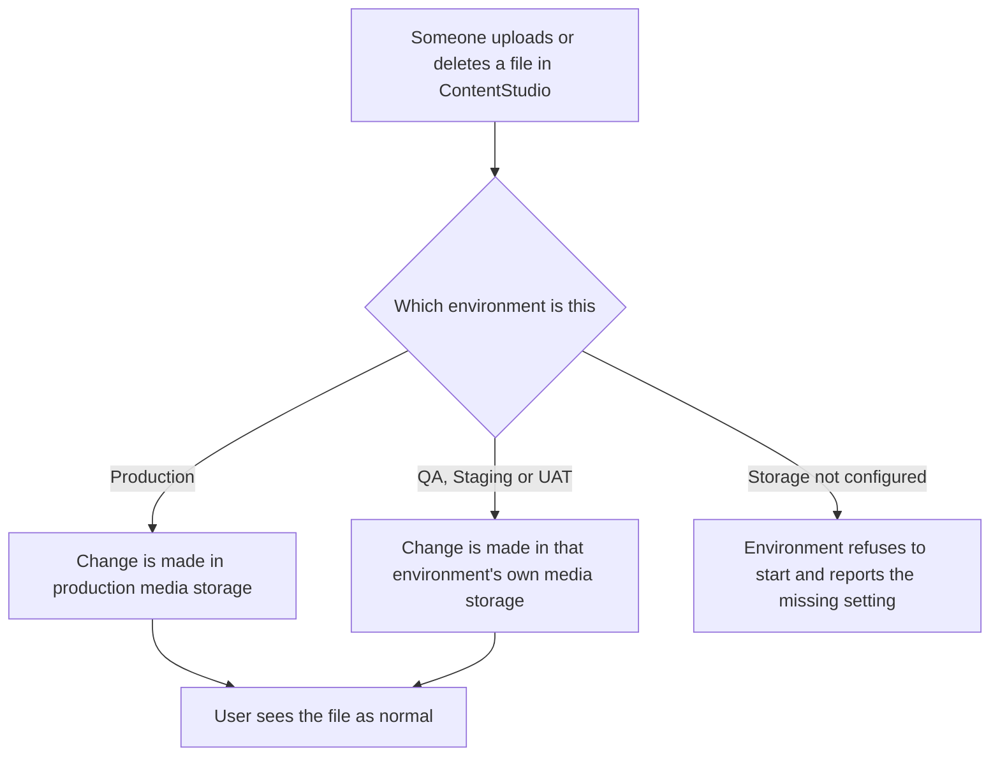

# Stories: Separate media storage per environment

---

## [BE] Give each environment its own media storage

### Description:

As a ContentStudio developer or QA tester, I want each environment (QA, Staging, UAT and Production) to keep its files in its own separate media storage, so that testing never touches, changes or deletes real customer media.

Today every environment saves and deletes files in the same storage that production uses. A tester uploading, replacing or deleting media while testing is working directly against live customer files. There is nothing preventing a test run, a broken script or a bad migration from wiping or overwriting media that a paying customer depends on. It also makes storage figures unreliable, because test files sit alongside real ones and count toward the same totals.

On top of the risk, there is no safety net: if an environment is set up without being told where its storage is, it silently falls back to production storage instead of stopping. That means the mistake is invisible until damage is already done.

### Workflow:

1. A tester signs in to the QA environment and uploads an image to the Media Library. The image uploads, appears in the library, and can be previewed, edited, used in a post and deleted, exactly as it behaves in production.
2. That image exists only in the QA environment. Nobody looking at the production Media Library, in any workspace, ever sees it.
3. The tester deletes the image in QA. Nothing in production changes.
4. The same holds the other way round. Nothing a tester does in QA, Staging or UAT can change, replace or delete a file a customer uploaded in production.
5. Shared look-and-feel images that are the same everywhere, such as default profile pictures, the "no image available" placeholder and the Discovery topic artwork, continue to load in every environment. These are read-only and are deliberately not duplicated per environment.
6. If an environment is brought up without being told where its media storage is, it refuses to start and reports which setting is missing, rather than quietly using production storage.

### Acceptance criteria:

- [ ] QA, Staging, UAT and Production each have their own separate media storage
- [ ] A file uploaded in QA, Staging or UAT does not appear in the production Media Library for any customer or workspace
- [ ] Deleting or replacing a file in QA, Staging or UAT leaves production files completely untouched
- [ ] A non-production environment has no ability to delete or overwrite production files, even if it is pointed at them by mistake
- [ ] An environment started without its media storage settings fails to start and reports which setting is missing, instead of falling back to production storage
- [ ] In a non-production environment, media can be uploaded, previewed, renamed, downloaded, replaced and deleted exactly as it works in production today
- [ ] Video thumbnails and image previews generate and display correctly in non-production environments
- [ ] Files imported from Google Drive and other connected sources in a non-production environment are saved to that environment's own storage
- [ ] CSV exports from the Media Library in a non-production environment are saved to, and downloaded from, that environment's own storage
- [ ] Images generated by AI in a non-production environment are saved to that environment's own storage
- [ ] Storage usage shown against a workspace's plan limit counts only files held in that environment's own storage
- [ ] Bulk upload by CSV in a non-production environment does not re-upload or duplicate files that environment already holds
- [ ] Shared read-only images, including default profile pictures, the "no image available" placeholder and Discovery topic artwork, continue to display in every environment and are not duplicated per environment
- [ ] Every existing production file keeps its current address, so no customer sees a broken image or video after the change
- [ ] Scheduled and published posts in production continue to show their attached media correctly after the change

### Mock-ups:

N/A — no user interface change. Behaviour is identical in every environment. The only visible difference is where the file physically lives.

### Impact on existing data:

**Production data is not moved and not renamed.** Existing files keep their current addresses, so every post, media library entry and social profile image that references them keeps working. Nothing needs backfilling in production.

Two consequences worth planning for:

- **Non-production environments start empty.** QA, Staging and UAT will no longer see the media that is currently visible to them, because that media lives in production storage. Any test data needed in those environments has to be uploaded there, or seeded deliberately.
- **Restored database copies will point at production files.** When a non-production environment is refreshed from a copy of the production database, the media entries in it will reference production addresses. Those files will display, because they are publicly readable, but the environment must not be able to delete or overwrite them. This is the main reason the separated credentials matter, and it should be explicitly tested.

**Open item for the team:** test files created by non-production environments over the years are already sitting in production storage. Deciding whether to identify and clean those up is separate work and is deliberately not part of this story.

### Impact on other products:

- **Mobile app (Flutter):** No change. The app displays media using the address the API gives it, so production behaviour is unchanged. Anyone testing the app against a non-production environment will see that environment's own media.
- **Chrome extension:** No change, for the same reason.
- **AI agents:** No change. Generated assets are handed to ContentStudio to store, so they follow whichever environment's storage is configured.
- **Social inbox:** Handled separately — see **[BE] Point social inbox attachments at the environment's own media storage**. Until that ships, the social inbox in non-production environments will still write into production storage.
- **White-label:** No change. Media addresses are not customer-branded today, and this story does not change that.

### Dependencies:

- Storage for QA, Staging and UAT must be provisioned, with separate access credentials per environment, before this can be released. A non-production environment must only be granted access to its own storage, plus read-only access to the shared read-only images.
- Related work: **[BE] Point social inbox attachments at the environment's own media storage**

### Global quality & compliance (wherever applicable)

- [ ] Mobile responsiveness — N/A, backend-only story with no interface change
- [ ] Multilingual support — N/A, no user-facing copy is introduced or changed
- [ ] UI theming support — N/A, no interface change
- [ ] White-label domains impact review
- [ ] Cross-product impact assessment (web, mobile apps, Chrome extension)

---

## [BE] Point social inbox attachments at the environment's own media storage

### Description:

As a ContentStudio developer or QA tester, I want attachments that arrive through the social inbox to be saved in the storage belonging to the environment that received them, so that testing inbox conversations never adds files to, or interferes with, production storage.

When a customer receives a message, comment or review with an image or video attached, ContentStudio saves a copy of that attachment so it stays viewable even after the social network expires the original link. Today that copy is always written to production storage, whatever environment is running. A QA run that syncs inbox conversations is therefore adding files directly into production storage, and does so regardless of how the rest of the environment is configured.

### Workflow:

1. A tester connects a social account in the QA environment and syncs the inbox.
2. A conversation comes in with an image attached. The image is saved to the QA environment's own media storage.
3. The tester opens the conversation in QA and sees the image exactly as a customer would in production.
4. Nothing about that sync creates, changes or removes any file in production storage.
5. In production, inbox attachments continue to be saved and displayed exactly as they are today.

### Acceptance criteria:

- [ ] Attachments received through the social inbox in QA, Staging or UAT are saved to that environment's own media storage
- [ ] Images and videos in inbox conversations display correctly in non-production environments
- [ ] No inbox activity in a non-production environment creates, changes or deletes any file in production storage
- [ ] Attachments across all supported inbox platforms, including Facebook, Instagram and LinkedIn, follow the environment they were received in
- [ ] Production inbox attachments continue to be saved and displayed exactly as they are today, with no change to their addresses
- [ ] An environment started without its media storage setting reports a clear error rather than defaulting to production storage
- [ ] Attachments already saved before this change continue to display in production

### Mock-ups:

N/A — no user interface change.

### Impact on existing data:

No existing attachment is moved or renamed, so every conversation that already has an attachment keeps displaying it. Non-production environments will not see attachments saved before this change unless the conversation is re-synced in that environment.

### Impact on other products:

- **Mobile app (Flutter):** No change. Inbox attachments display from whichever address the API returns.
- **Chrome extension:** Not affected.
- **White-label:** No change.

### Dependencies:

- Depends on: **[BE] Give each environment its own media storage** — the per-environment storage and credentials created there are what this story points the social inbox at.

### Global quality & compliance (wherever applicable)

- [ ] Mobile responsiveness — N/A, backend-only story with no interface change
- [ ] Multilingual support — N/A, no user-facing copy is introduced or changed
- [ ] UI theming support — N/A, no interface change
- [ ] White-label domains impact review
- [ ] Cross-product impact assessment (web, mobile apps, Chrome extension)
