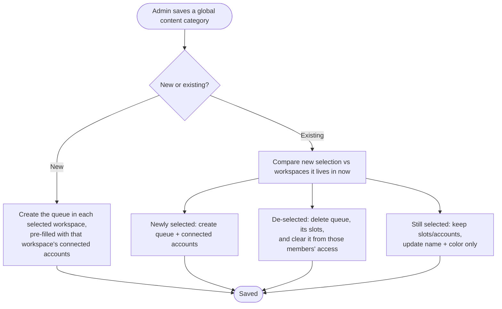
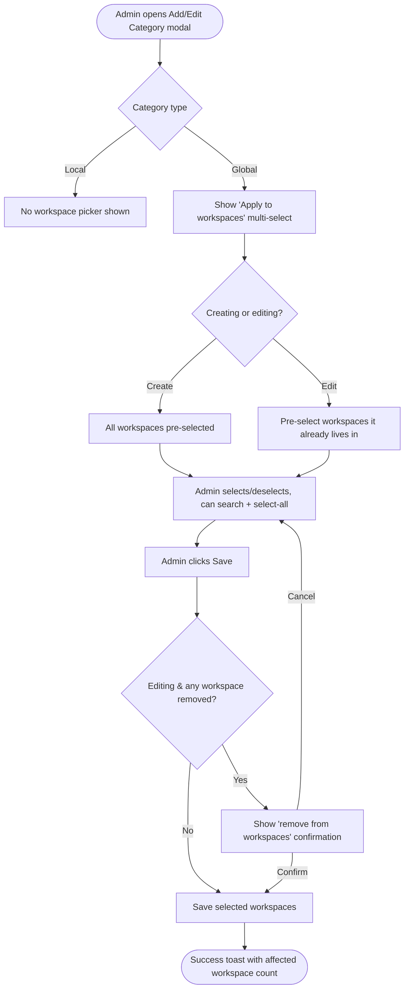

# Stories — Global Content Category: per-workspace access/visibility

Two stories: `[BE]` (workspace-scoped create/edit/delete + a read endpoint) and `[FE]` (the "Apply to workspaces" picker and copy). Create the `[BE]` story first; the `[FE]` story depends on it.

---

## Story 1 — [BE] Scope global content categories to selected workspaces

### Description:

As an agency owner or workspace admin managing many workspaces, I want to choose **which** of my workspaces a global content category applies to, so a shared posting queue only appears in the workspaces I pick and stays completely hidden from the rest until I add them.

Today, when an admin creates a global content category it is automatically pushed into **every** workspace they belong to — an owner with 50 workspaces gets it in all 50 with no way to limit it. This story lets the create/edit flow accept an explicit set of target workspaces, and keeps each workspace's queue in sync as that set changes.

> This is **workspace-level** scoping (which workspaces the category exists in). It is independent of the existing **member-level** access ("Allowed Team Members", which members inside a workspace can use a category) — both must keep working.

---

### Workflow:

1. An admin (super admin, or team-membership admin) creates or edits a global content category and submits the chosen set of target workspaces along with the name, color, and accounts.
2. **On create**, the system creates the per-workspace queue only in the selected workspaces, each pre-filled with that workspace's connected accounts (the existing default-account behavior). Non-selected workspaces get nothing.
3. **On edit**, the system compares the new selection against where the category currently lives and reconciles: it creates the queue in newly added workspaces (pre-filled with their connected accounts), deletes it (and its scheduled slots, and its entry in members' category access) from de-selected workspaces, and on the workspaces that stay it preserves slots/accounts while updating the shared name and color.
4. The system only acts on workspaces the admin actually has access to; any workspace outside that set is ignored.
5. A separate read returns the workspace IDs a given global category currently lives in, so the edit screen can show the current selection.

---

### Acceptance criteria:

- [ ] Creating a global content category with a set of selected workspace IDs creates the queue **only** in those workspaces; non-selected workspaces have no record of the category
- [ ] On create, each selected workspace's queue is pre-filled with that workspace's connected accounts (existing default behavior preserved)
- [ ] An admin can only target workspaces they have access to; workspace IDs outside their accessible set are not created and do not error the whole request
- [ ] Editing a global category to **add** a workspace creates the queue in that workspace, pre-filled with its connected accounts
- [ ] Editing a global category to **remove** a workspace deletes that workspace's queue, deletes its scheduled slots, and removes the category from that workspace's members' content-category access
- [ ] Editing a global category leaves queues in still-selected workspaces intact — their slots and selected accounts are preserved
- [ ] Renaming or recoloring a global category updates the name and color across **all** workspaces where it still applies
- [ ] Saving with an empty workspace selection is rejected with a validation error and makes no changes (no queue created, none deleted)
- [ ] A read endpoint returns the list of workspace IDs where a given global content category currently exists
- [ ] Deleting a global content category continues to remove it — queue, slots, and member access — from every workspace it applies to (unchanged behavior)
- [ ] Per-workspace category fetch used by the web app, mobile apps, and extension is unchanged in shape — non-selected workspaces simply return fewer categories

---

### Mock-ups:

N/A — backend only.

---

### Impact on existing data:

- **No schema migration required.** The set of workspaces a global category applies to is already represented by which per-workspace `content_categories` documents exist for a given `global_content_category_id`. Existing global categories currently live in all of their creator's workspaces; after this change they are simply treated as "applied to all those workspaces", and the edit screen will pre-select wherever they already exist.
- Removing a workspace during edit permanently deletes that workspace's queue document and its posting slots — this is a destructive operation gated behind the frontend confirmation (see the `[FE]` story).

---

### Impact on other products:

- **Mobile apps & Chrome extension:** consume categories per workspace and are unaffected by the change in contract — they will simply see fewer categories in workspaces that weren't selected. No app changes required. Global-category **management** remains web-only.
- **White-label:** no impact (backend logic only).

---

### Dependencies:

None. (The `[FE]` story **[FE] Let admins choose which workspaces a global content category applies to** depends on this story.)

---

### Global quality & compliance (wherever applicable)

- [ ] Mobile responsiveness — N/A, backend-only story
- [ ] Multilingual support (frontend + backend, translations available or fallback handled)
- [ ] UI theming support — N/A, backend-only story
- [ ] White-label domains impact review
- [ ] Cross-product impact assessment (web, mobile apps, Chrome extension)

---

### Implementation references
*Pointers from research — not a contract. Engineering may choose a different approach.*

**Primary entry points:**
- `contentstudio-backend/app/Http/Controllers/Settings/ContentCategories/GlobalContentCategoriesController.php` — `store()` holds both create and edit branches. The create branch currently calls `WorkspaceTeamRepo::getWorkspaceIdsByUserId(Auth::id())` and loops **all** workspaces (around lines 70–106); this is exactly the loop that should iterate the **selected** `workspace_ids` instead. `delete()` already handles full teardown.
- `contentstudio-backend/app/Repository/Settings/ContentCategoriesRepository.php` — `getByGlobalCategoryId()` (drives the new "which workspaces" read — map to `workspace_id`), `removeByGlobalCategoryId()`, `createOrUpdate()`.
- `contentstudio-backend/app/Services/Settings/ContentCategoryAccessService.php` — `removeCategoryFromAllMembers($workspaceId, $categoryId)` already exists; reuse it when a workspace is de-selected (the `delete()` flow already does this per linked category).
- `contentstudio-backend/routes/web/settings.php` — `global/categories/*` route group (~line 208). Add the new read route here; note this group is `auth`-protected.

**Existing patterns to follow:**
- The per-workspace account pre-fill on create (`(new Platforms('Facebook'))->getItems(...)` etc.) should run for **newly added** workspaces during edit too, so an added workspace behaves like a freshly created one.
- Guard target workspaces by intersecting the requested `workspace_ids` with `WorkspaceTeamRepo::getWorkspaceIdsByUserId(Auth::id())` so an admin can't target workspaces they don't belong to.

**Suggested shapes (not binding):**
- Store payload gains `workspace_ids: string[]`. Validation: `required|array|min:1`.
- Read endpoint: `GET global/categories/{global_content_category_id}/workspaces` → `{ status: true, workspace_ids: [...] }`.

**Gotcha:**
- `GlobalContentCategoriesRepository::createOrUpdate()` unsets `workspace_id` when a `global_content_category_id` is present, so the master record's `workspace_id` is the original creating workspace — don't rely on it to represent the full applied set; derive the set from the linked `content_categories` docs.

---

### Shortcut fields

- **Template:** New Feature Template
- **Story type:** feature
- **Project:** Web App
- **Group:** Backend
- **Epic:** Q2 - 2026: Miscellaneous
- **Priority:** Medium
- **Product Area:** Settings
- **Skill Set:** Backend
- **Estimate:** _(leave empty — set during sprint planning)_
- **Labels:** _none_
- **Iteration:** _(PO assigns current/target sprint at creation)_

---

## Story 2 — [FE] Let admins choose which workspaces a global content category applies to

### Description:

As an agency owner or workspace admin, I want to pick which of my workspaces a global content category appears in — directly in the Add/Edit Category modal — so I can, for example, give a shared posting queue to just 5 of my 50 workspaces and keep it out of the other 45.

Today the modal tells the admin a global category will be created in **all** of their workspaces, with no choice. This story adds an **"Apply to workspaces"** multi-select to the global-category flow, pre-selects the right workspaces on create and edit, and warns before any change that would delete a queue from a workspace.

---

### Workflow:

1. The admin opens the Add/Edit Category modal and chooses the **Global** category type (the option is only enabled for super admins / team-membership admins, as today).
2. An **"Apply to workspaces"** selector appears. When creating, **all** of the admin's workspaces are pre-selected; when editing, the workspaces the category already lives in are pre-selected.
3. The admin ticks/unticks workspaces, can **Select all**, and can **search** the list by workspace name. A summary shows how many are selected.
4. The admin clicks Save. If they are editing and have **removed** one or more workspaces, a confirmation explains those workspaces will lose the queue and its scheduled slots before the change is applied.
5. On success, a toast confirms the category was saved and reflects how many workspaces it now applies to. Local categories never show the selector.

---

### Acceptance criteria:

- [ ] When the category type is **Global**, an **"Apply to workspaces"** multi-select appears in the modal; it does **not** appear for **Local** categories
- [ ] When **creating** a new global category, all of the admin's workspaces are pre-selected by default
- [ ] When **editing** an existing global category, the workspaces it currently applies to are pre-selected (fetched from the backend)
- [ ] The selector supports **Select all** (selects/clears every workspace) and a **search** field that filters the list by workspace name
- [ ] The selector shows each workspace's name and logo/avatar, and a count summary (e.g., "5 workspaces selected", "1 workspace selected")
- [ ] If the admin deselects every workspace, Save is blocked with the validation message: "Select at least one workspace for this global content category."
- [ ] When **editing** and the admin removes one or more workspaces, clicking Save first shows a confirmation dialog naming the affected workspaces and stating their queue and scheduled posting slots will be permanently deleted
- [ ] Cancelling the confirmation returns to the modal with the selection unchanged; confirming proceeds with the save
- [ ] On a successful save, a success toast appears reflecting the number of workspaces the category now applies to
- [ ] The old static warning text stating the category "will be created in all your workspaces" is removed/replaced with the new helper copy
- [ ] If the admin has only one workspace, that workspace is shown and pre-selected (the flow still works)
- [ ] Loading state: while the current workspace selection is being fetched on edit, the selector shows a loading indicator
- [ ] Search with no matches shows: "No workspaces match your search"
- [ ] When a global content category is created, a `publishing_queues_created` Usermaven event fires with `{ category_state: 'global', number_of_workspaces }`

---

### UI copy

**Workspace selector (shown when type = Global):**
- **Label:** `Apply to workspaces`
- **Info icon (`CircleHelp`) tooltip:** "Choose which of your workspaces this global content category appears in. For example, pick 5 of your 50 workspaces and only those 5 get this queue — the rest won't see it until you add them here."
- **Helper note (replaces the old warning list):** "This queue is only created in the workspaces you select. Workspaces you don't select won't see it until you add them here."
- **Trigger placeholder (when none selected):** `Select workspaces`
- **Selected summary:** `{count} workspaces selected` / `1 workspace selected`
- **Select-all label:** `Select all`
- **Search placeholder:** `Search workspaces`
- **No search matches:** `No workspaces match your search`
- **Validation (none selected):** `Select at least one workspace for this global content category.`

**Removal confirmation dialog (edit only, when workspaces were removed):**
- **Title:** `Remove this queue from {count} workspace(s)?`
- **Body:** "This global content category and its scheduled posting slots will be permanently deleted from these workspaces: {workspace names}. Posts that already went out aren't affected. This can't be undone."
- **Confirm button:** `Yes, remove`
- **Cancel button:** `Keep them`

**Success toast (reuses existing count-based copy):**
- Created: `Global content category created in {count} workspaces`
- Updated: `Global content category updated across {count} workspaces`

---

### Mock-ups:

N/A — reuses the existing Add/Edit Category modal layout. The new selector mirrors the existing "Allowed Team Members" dropdown in the same modal.

---

### Impact on existing data:

None directly (frontend). The destructive removal is performed by the backend and gated behind the confirmation dialog above.

---

### Impact on other products:

- **Mobile apps & Chrome extension:** no UI change — they only display the categories that exist in each workspace.
- **White-label:** the new selector and copy must use design-system components and theme-aware classes so they render correctly on white-label domains (no hardcoded colors).

---

### Dependencies:

- Depends on: **[BE] Scope global content categories to selected workspaces** (provides the `workspace_ids` payload, the validation, the edit-sync behavior, and the read endpoint that returns where a global category currently lives).

---

### Global quality & compliance (wherever applicable)

- [ ] Mobile responsiveness (frontend only, N/A for backend-only stories)
- [ ] Multilingual support (frontend + backend, translations available or fallback handled)
- [ ] UI theming support (default + white-label, design library components are being used)
- [ ] White-label domains impact review
- [ ] Cross-product impact assessment (web, mobile apps, Chrome extension)

---

### Implementation references
*Pointers from research — not a contract. Engineering may choose a different approach.*

**Primary entry points:**
- `contentstudio-frontend/src/modules/setting/components/content-categories/dialogs/AddCategory.vue` — the right column already branches on `category_state`. The new selector belongs in the **global** branch; the old `global_category_warnings.*` list (the `<template v-else>` warning box) is what gets replaced.
- `contentstudio-frontend/src/modules/setting/composables/useAddCategory.ts` — mirror the existing **Allowed Team Members** logic (`selectedMemberIds`, `toggleSelectAllMembers`, `filteredMembers`, search handlers) for a `selectedWorkspaceIds` equivalent. `loadMembersData()` is the natural sibling for pre-selecting workspaces on edit.
- `contentstudio-frontend/src/stores/setting/useContentCategoryStore.ts` — `storeGlobalCategory()` posts the add payload; include `workspace_ids`. Its success block already shows count-based toasts (`categories_created` / `categories_updated`) — update that copy.
- `contentstudio-frontend/src/stores/setting/useWorkspaceStore.ts` — `getWorkspaces.items` is the candidate workspace list (each has `_id`, `name`, logo); no new "list workspaces" call needed.
- `contentstudio-frontend/src/api/content-categories.ts` + `contentstudio-frontend/src/modules/setting/config/api-utils.js` — add the call/URL for the backend read endpoint that returns a global category's current workspaces.

**Existing patterns to follow:**
- Components: reuse `Dropdown`, `DropdownItem`, `Checkbox`, `SearchInput`, `Icon` from `@contentstudio/ui` (all already imported in `AddCategory.vue` — all confirmed available in `docs/ui-components.md`). The removal confirmation can use `$cstuModal.msgBoxConfirm(...)`, the same helper already used in `useAddCategory.ts` (`handleModalClose`).
- i18n: add the new keys under `settings.add_category.*` in **every** locale directory under `src/locales/` (English is source of truth).

**Gotchas:**
- Theme-aware classes only — the existing "admins always have access" note in `AddCategory.vue` uses hardcoded `bg-blue-50` / `text-blue-500`; do **not** copy that for the new helper note — use `bg-primary-cs-50` / `text-primary-cs-500`.
- `validateAndStoreCategory()` currently fires `trackUserMaven('publishing_queues_created')` on **both** create and edit of any category. Scope the new `{ category_state: 'global', number_of_workspaces }` payload to global creation; consider gating the event so it doesn't fire on plain edits.
- `isEnableGlobalCategoryOption` in `usePermissions.js` has a stray `console.log` — remove it if you touch that computed (violates the no-console rule).

---

### Shortcut fields

- **Template:** New Feature Template
- **Story type:** feature
- **Project:** Web App
- **Group:** Frontend
- **Epic:** Q2 - 2026: Miscellaneous
- **Priority:** Medium
- **Product Area:** Settings
- **Skill Set:** Frontend
- **Estimate:** _(leave empty — set during sprint planning)_
- **Labels:** _none_
- **Iteration:** _(PO assigns current/target sprint at creation)_
