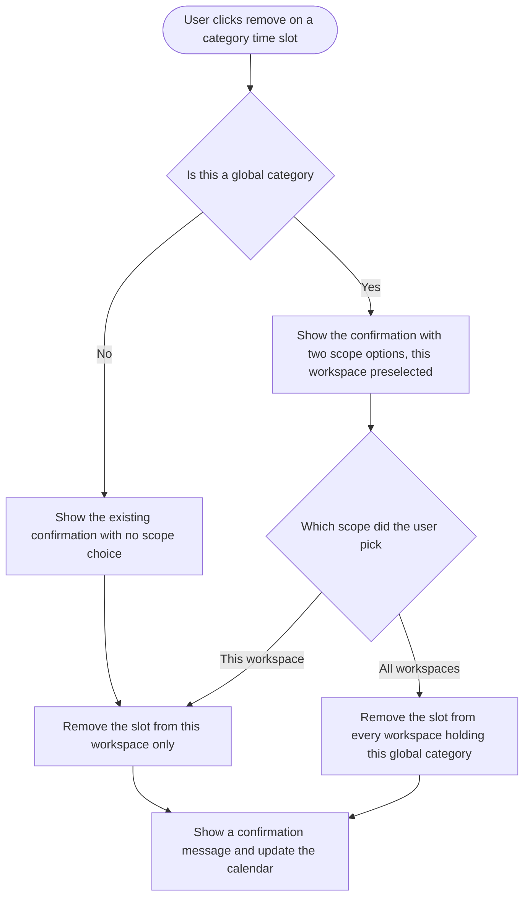

# Stories: remove a global category slot from all workspaces

**Date:** 2026-09-08

Two stories. The Add Slot modal already lets a user add a slot to every workspace where a global category exists. Removing one only ever affects the current workspace, so a user can add a slot to twelve workspaces in one click and then has to visit all twelve to take it back. These stories close that gap by mirroring the existing add pattern.

---

## Story 1

### Title

**[BE] Support removing a global category slot from all workspaces**

### Description

As a user who manages a global content category across several workspaces, I want to be able to remove one of its time slots from every workspace in a single action, so that I do not have to repeat the same removal in each workspace by hand.

---

### Workflow

The reader of this story is a developer, so the steps are described in terms of the operation rather than the interface. All user-facing copy and behaviour lives in **[FE] Add a workspace scope choice when removing a global category slot**.

1. A removal request arrives for a single content category slot, carrying the scope the user chose: this workspace only, or all workspaces.
2. When the scope is this workspace only, the slot is removed exactly as it is today, with no change in behaviour.
3. When the scope is all workspaces, the slot's category is resolved to its global category, every workspace copy of that global category is found, and the matching slot is removed from each one.
4. A slot in another workspace is matched on the same values the add-to-all-workspaces action uses when it creates them: weekday, hour, minute and period. Slot identifiers cannot be used, because each workspace holds its own separate slot record.
5. For every workspace a slot was removed from, that workspace's back-filled occurrences of the slot are cleared, the same way they are cleared today for a single workspace removal.
6. The response reports how many workspaces the slot was removed from, so the interface can confirm it accurately.

---

### Acceptance criteria

**Scope behaviour**

- [ ] A removal with the scope set to this workspace only behaves exactly as removal does today, including clearing that slot's back-filled occurrences
- [ ] A removal with the scope set to all workspaces removes the matching slot from every workspace that holds a copy of the same global content category, including the workspace the request came from
- [ ] Matching across workspaces is done on weekday, hour, minute and period, not on slot identifiers
- [ ] The same twelve-hour normalisation the add-to-all-workspaces action applies when creating slots is applied when matching them, so a 12 o'clock slot is found correctly
- [ ] Back-filled occurrences are cleared separately for each workspace the slot was removed from, using that workspace's own scheduling state
- [ ] Removing from all workspaces is rejected for a local category, since a local category exists in one workspace only
- [ ] The response states how many workspaces the slot was removed from

**Permissions and validation**

- [ ] The caller's access to the content category is verified before anything is removed, matching the check the add-to-all-workspaces action already performs
- [ ] A caller with access to the category in their own workspace but not in a sibling workspace does not remove the slot from that sibling workspace
- [ ] A request for a slot that does not exist returns a not-found result and removes nothing
- [ ] A request with a missing or unrecognised scope value is rejected rather than defaulting to all workspaces
- [ ] An invalid request leaves every slot in every workspace unchanged

**Edge cases**

- [ ] If a sibling workspace has no slot matching the weekday and time, that workspace is skipped and the removal still succeeds for the others
- [ ] If a sibling workspace holds more than one slot matching the same weekday and time, all of them are removed there
- [ ] If the global category exists in only one workspace, an all-workspaces removal behaves the same as a single-workspace removal
- [ ] A removal that fails partway through does not leave some workspaces cleared of back-filled occurrences while their slot still exists
- [ ] Two simultaneous removals of the same slot resolve without error, and the slot ends up removed once
- [ ] Posts already scheduled into the removed slot behave exactly as they do after a single-workspace removal today. This story introduces no new rule for existing scheduled posts

---

### Mock-ups

Not applicable. No user-facing interface in this story.

---

### Impact on existing data

- Content category slot records are deleted in the workspaces covered by the chosen scope. This is the intended effect.
- Each affected workspace's record of back-filled slot occurrences is updated, the same way a single-workspace removal updates it today.
- No content categories are deleted, renamed or unlinked. Only slots are removed.
- Already-scheduled posts are not modified by this story.
- No migration or backfill required. Existing slots in every workspace are untouched until a user removes one.

---

### Impact on other products

- **Web app:** the removal gains a scope. Existing single-workspace removals are unchanged.
- **Mobile apps:** none. Content category slots are configured on web only.
- **Chrome extension:** none.
- **Public API:** none, unless the API exposes slot removal. Confirm during build. If it does, it should keep today's single-workspace behaviour by default so no existing integration changes meaning.
- **Publishing:** removing a slot stops future posts being scheduled at that time in the affected workspaces. That is the point of the feature, and it now applies to several workspaces at once, which is why the confirmation copy in the paired frontend story states the scope explicitly.

---

### Dependencies

- Pairs with **[FE] Add a workspace scope choice when removing a global category slot**, which sends the scope and shows the confirmation.
- Independent of the two inconsistencies noted during research, which are worth their own tickets: the existing remove-all-slots action does not clear back-filled occurrences for global categories, and the existing single-slot removal performs no category access check. The second is addressed by this story for the removal path.

---

### Global quality & compliance (wherever applicable)

- [ ] Mobile responsiveness (frontend only, N/A for backend-only stories)
- [ ] Multilingual support (frontend + backend, translations available or fallback handled)
- [ ] UI theming support (default + white-label, design library components are being used) — N/A, no user-facing interface in this story
- [ ] White-label domains impact review
- [ ] Cross-product impact assessment (web, mobile apps, Chrome extension)

---

## Story 2

### Title

**[FE] Add a workspace scope choice when removing a global category slot**

### Description

As a user who manages a global content category across several workspaces, I want to choose whether removing a time slot applies to just this workspace or all of them, so that undoing a slot is as quick as adding it was.

---

### Workflow

1. User goes to Settings and opens Content Categories.
2. User finds a time slot on the calendar or in the slot table and clicks remove.
3. If the slot belongs to a local category, the existing confirmation appears with no scope options, exactly as today.
4. If the slot belongs to a global category, the confirmation shows two choices: remove from this workspace only, or remove from all workspaces. This workspace only is preselected.
5. Each choice has a help icon next to it explaining what it does.
6. User picks a scope and confirms.
7. The slot disappears from the calendar and a confirmation message appears, stating which scope was applied.
8. If the user cancels or closes the dialog, nothing is removed.

---

### Acceptance criteria

**When the scope choice appears**

- [ ] Removing a slot on a global content category shows the two scope options
- [ ] Removing a slot on a local content category shows the existing confirmation with no scope options and no change in behaviour
- [ ] "Remove slot from this workspace only" is preselected every time the dialog opens
- [ ] The preselected option is never remembered from a previous removal. The safer option is always the default
- [ ] The scope options appear on both entry points, the calendar view and the slot table

**Copy**

- [ ] Dialog title: "Remove slot?"
- [ ] Dialog body: "This will stop new posts being scheduled at this time. Posts you have already scheduled in this slot are not affected."
- [ ] First option label: "Remove slot from this workspace only"
- [ ] First option help icon tooltip: "This time slot will be removed only in the workspace you are in now. Every other workspace keeps it. For example, remove your Monday 9:00 AM slot here and your other workspaces still post at Monday 9:00 AM."
- [ ] Second option label: "Remove slot in all workspaces"
- [ ] Second option help icon tooltip: "This time slot will be removed from every workspace where your global category is present. For example, remove your Monday 9:00 AM slot and no workspace will post at Monday 9:00 AM any more."
- [ ] Secondary button: "Cancel"
- [ ] Primary button: "Remove"
- [ ] Success message after removing from this workspace only: "Slot removed from this workspace."
- [ ] Success message after removing from all workspaces: "Slot removed from all workspaces where this category is present."
- [ ] Error message if the removal fails: "We could not remove this slot just now. Please try again."
- [ ] Error message if the user does not have access to the category: "You do not have permission to change this category's slots."
- [ ] The wording of the two options deliberately mirrors the Add Slot modal, so the pair reads as one feature rather than two
- [ ] All copy is added as translation keys with English values, and other locales fall back to English rather than showing a raw key

**Components and presentation**

- [ ] The confirmation is built with the `Modal` component, since the current message box cannot host inputs
- [ ] The two scope options use the `Radio` component, and each help icon uses the `Icon` component, matching how the Add Slot modal presents the same choice
- [ ] Both actions use the `Button` component. The remove action uses the destructive variant, consistent with today's removal confirmation
- [ ] No hardcoded colour classes. Primary colour comes from theme-aware classes so the dialog renders correctly on white-label domains
- [ ] The dialog is readable and both buttons reachable without horizontal scrolling at 1280px, 1024px, 768px and 375px widths
- [ ] Long option labels wrap rather than overflowing

**States**

- [ ] While the removal is in flight, both buttons are disabled and the remove button shows a loading indicator
- [ ] On success the dialog closes, the slot is removed from the calendar and the slot table without a page reload, and the success message appears
- [ ] On failure the dialog stays open, the slot remains on the calendar, and the failure message appears so the user can retry
- [ ] Cancelling or closing the dialog removes nothing and leaves the calendar unchanged
- [ ] After removing from all workspaces, switching to another affected workspace shows the slot gone there too, without a page reload being required to see it

**Edge cases**

- [ ] A global category that currently exists in only one workspace still shows the scope options, and both choices produce the same outcome
- [ ] If the slot was already removed by someone else before the user confirms, the dialog reports it is no longer there and the calendar updates rather than showing an unexplained error
- [ ] The dialog does not appear on top of another open modal
- [ ] A user viewing a read-only workspace cannot reach the removal action, matching today's behaviour

**Tracking**

- [ ] Confirming a removal fires a `content_category_slot_removed` event with `{ scope: 'workspace' }` or `{ scope: 'all_workspaces' }`

---

### Mock-ups

To be attached if wanted, though the layout copies an existing pattern one for one:

- A `Modal` roughly the width of the current removal confirmation, with a close icon top right.
- Title: "Remove slot?"
- One line of body text.
- Below it, two stacked `Radio` options, each followed by a small help `Icon`, laid out exactly as the equivalent block in the Add Slot modal so the two dialogs read as a matched pair.
- Footer divider, then right-aligned "Cancel" and a destructive "Remove".
- For local categories, the same dialog without the radio block.

---

### Impact on existing data

None written by this story directly. The removal itself is performed by **[BE] Support removing a global category slot from all workspaces**.

Worth being explicit with QA: choosing all workspaces deletes slots in workspaces the user is not currently looking at. That is the intended behaviour, and the confirmation copy names the scope before the user commits.

---

### Impact on other products

- **Web app:** the slot removal confirmation gains two options for global categories. Local category removal is unchanged.
- **Mobile apps:** none. Content category slots are configured on web only.
- **Chrome extension:** none.
- **Publishing:** an all-workspaces removal stops future posts being scheduled at that time across several workspaces at once. This is why the scope is named in both the options and the success message.

---

### Dependencies

- Depends on **[BE] Support removing a global category slot from all workspaces** for the scope to have any effect.
- Copy deliberately mirrors the existing Add Slot modal. If that modal's wording changes, this dialog should change with it.

---

### Global quality & compliance (wherever applicable)

- [ ] Mobile responsiveness (frontend only, N/A for backend-only stories)
- [ ] Multilingual support (frontend + backend, translations available or fallback handled)
- [ ] UI theming support (default + white-label, design library components are being used)
- [ ] White-label domains impact review
- [ ] Cross-product impact assessment (web, mobile apps, Chrome extension)
