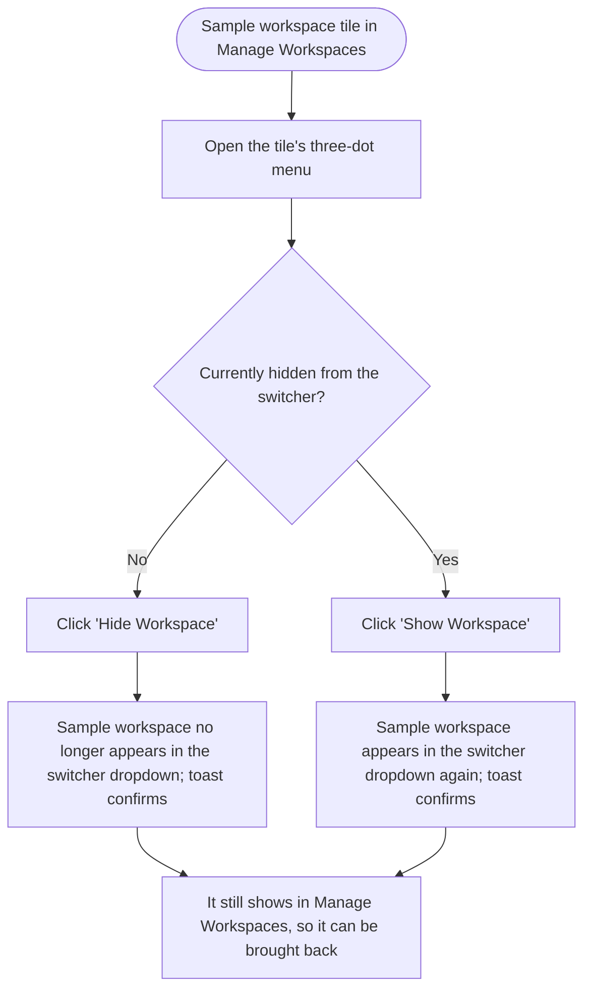

# Story — Hide the sample workspace from the workspace switcher

One full-stack story. Create with the **New Feature Template**. Nothing is pushed to Shortcut.

---

## [Full Stack] Let users hide the sample workspace from the workspace switcher

### Description
As a user who has finished exploring the **sample (demo) workspace**, I want to hide it from the workspace-switcher dropdown so that my everyday switcher only shows my real workspaces — while still being able to bring the sample workspace back whenever I want.

The action lives on the sample workspace's tile in **Manage Workspaces** (where all workspaces are listed): a three-dot menu with **"Hide Workspace"**, and its inverse **"Show Workspace"** once hidden. Hiding is **per user** — it only affects the switcher of the person who does it, not their teammates.

### Workflow

1. The user goes to **Manage Workspaces** and finds the **sample workspace** tile (marked as the sample/demo workspace).
2. The user opens the tile's **three-dot menu** and selects **"Hide Workspace."**
3. The sample workspace immediately disappears from the workspace-switcher dropdown (in the top header and the navigation rail); a toast confirms it.
4. The sample workspace **still appears in Manage Workspaces**, and its menu now reads **"Show Workspace."**
5. To bring it back, the user opens the same menu and selects **"Show Workspace"** — it reappears in the switcher dropdown.
6. The preference is personal: another teammate's switcher is unaffected, and the setting sticks across sessions and devices.

### Acceptance criteria

**Manage Workspaces — sample tile menu**
- [ ] The sample workspace tile in Manage Workspaces shows a three-dot menu (today the "more options" menu is suppressed for the sample workspace).
- [ ] The menu shows **"Hide Workspace"** when the sample workspace is currently visible in the switcher, and **"Show Workspace"** when it is currently hidden.
- [ ] Selecting the action toggles the state and shows a confirmation toast (copy below).
- [ ] The menu action does not remove, pause, or otherwise change the sample workspace — it only affects switcher visibility.

**Switcher dropdown**
- [ ] When the sample workspace is hidden, it does **not** appear in the workspace-switcher dropdown (top header and navigation rail).
- [ ] When it is not hidden (default), it appears in the switcher as it does today (including its "Sample" badge).
- [ ] Hiding/showing reflects **immediately**, without a page refresh.
- [ ] If the sample workspace is the user's active workspace when they hide it, the user is **not** switched out of it — it simply stops appearing in the switcher list (they can still return to it via Manage Workspaces).

**Persistence & scope**
- [ ] The hidden state is **per user** — hiding it for one teammate does not hide it for others.
- [ ] The state persists across sessions and devices for that user.
- [ ] The sample workspace always remains listed in **Manage Workspaces** regardless of the hidden state, so the user can always toggle it back.

### UI copy
- **Menu item (currently visible):** "Hide Workspace"
- **Menu item (currently hidden):** "Show Workspace"
- **Menu item tooltip (hide):** "Hides the sample workspace from your workspace switcher. It stays here in Manage Workspaces, so you can show it again anytime."
- **Menu item tooltip (show):** "Adds the sample workspace back to your workspace switcher."
- **Toast — on hide:** "Sample workspace hidden from your workspace switcher. Bring it back anytime from Manage Workspaces."
- **Toast — on show:** "Sample workspace is back in your workspace switcher."
- **Toast — on error:** "Something went wrong. Please try again."

### Mock-ups
N/A — no mockups provided; placement and copy are in the acceptance criteria.

### Impact on existing data
- Adds a **per-user preference** recording whether that user has hidden the sample workspace from their switcher. Users who never toggle it have no preference stored (default = visible). No migration required.
- The workspace/list payload gains a field indicating, for the current user, whether the sample workspace is hidden from the switcher.

### Impact on other products
- **Mobile apps:** out of scope. The hidden flag is returned by the API, so the mobile switcher could honor it in a future enhancement.
- **Chrome extension:** not affected.
- **White-label:** no impact (behavior only; uses design-system components/tokens).

### Dependencies
None.

### Global quality & compliance (wherever applicable)
- [ ] Mobile responsiveness (frontend only, N/A for backend-only stories)
- [ ] Multilingual support (frontend + backend, translations available or fallback handled)
- [ ] UI theming support (default + white-label, design library components are being used)
- [ ] White-label domains impact review
- [ ] Cross-product impact assessment (web, mobile apps, Chrome extension)

### Implementation references
*Pointers from research — not a contract. Engineering may choose a different approach.*

**Frontend (`contentstudio-frontend/`):**
- `src/modules/setting/components/workspace/reusable/WorkspaceActiveTile.vue` — the tile's "more options" `Dropdown` is gated `v-if="!isLocked && !isSample"`; relax this so the sample tile gets a menu (or give the sample tile a dedicated minimal menu) and add the hide/show `DropdownItem` (suggest `EyeOff` / `Eye` icons). Reuse `isSampleWorkspace` from `src/utils/demoWorkspace.ts`.
- `src/composables/useWorkspaceCore.ts` — `filteredWorkspaces` (consumed by `TopHeaderBar.vue` and `DesktopNavigationRail.vue`) is where the hidden sample workspace should be filtered out of the switcher list.
- `src/components/layout/WorkspaceSwitcherDropdown.vue` — display only; already detects the sample workspace (`isSampleWorkspace(item.workspace)`) for its "Sample" badge — no logic change needed beyond the filtered input.
- New user-facing strings under the workspace/settings i18n namespace (menu items + toasts) — add to **all 8 locale dirs**.

**Backend (`contentstudio-backend/`):**
- Add a **per-user** flag for "sample workspace hidden from switcher" (a user-scoped workspace preference), an endpoint to set/unset it, and include the resolved value on the workspace/list response the switcher reads. *(Confirm the exact workspace/preferences controller + `contentstudio-backend develop` currency during BE work.)*

**Note on analytics:** hiding the sample workspace is a minor per-user preference toggle, not a monetization/adoption milestone — no Usermaven event specced (per story guidelines §19). Flag for the PO if product wants to track "graduated from the demo."

---

## Shortcut fields

### [Full Stack] Let users hide the sample workspace from the workspace switcher
- **Template:** New Feature Template
- **Story type:** feature
- **Project:** Web App
- **Group:** Full Stack
- **Epic:** Q2 - 2026: Miscellaneous (id `115078`) — *PO: confirm the current-quarter Miscellaneous epic; config lists Q2-2026.*
- **Priority:** Medium
- **Product Area:** Settings
- **Skill Set:** Backend + Frontend
- **Estimate:** _(empty — set during sprint planning)_
- **Labels:** _(none)_
- **Iteration:** _(PO assigns current/target sprint)_
