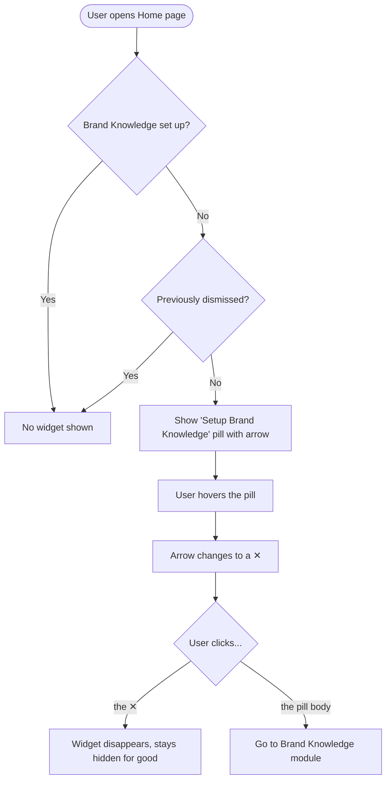

# Stories — Home hero: Brand Knowledge widget + heading polish

One `[FE]` story. Web app only — no backend, no mobile.

---

## [FE] Replace home hero AI shortcuts with a "Setup Brand Knowledge" widget

### Description

On the Home page, the AI Studio hero has two small text links under the prompt input — **"Recent chats"** and **"My AI creations"** — plus a wide horizontal **Brand Knowledge** setup banner near the top of the page. Both compete for attention and don't do much to move new users toward the one setup step that makes AI content genuinely useful: creating their **Brand Knowledge** profile.

This story cleans up the hero and replaces those two links with a single, focused **"Setup Brand Knowledge" widget** — a compact pill that nudges users who haven't set up brand knowledge yet to do so, and gets out of the way once they have (or once they dismiss it). It also removes the redundant banner and gives the hero heading a bit more breathing room and prominence.

**Who:** Every user on the Home page who has not yet set up their Brand Knowledge profile.
**What:** A dismissible "Setup Brand Knowledge" pill under the AI prompt that links to the Brand Knowledge module, replacing the two old shortcut links and the setup banner.
**Why:** Focuses new users on the highest-value setup step, reduces clutter, and stops nagging users who've already set up brand knowledge or chosen to dismiss the prompt.

### Workflow

1. The user opens the **Home** page. The two old links under the prompt input ("Recent chats", "My AI creations") are gone, and the wide Brand Knowledge banner near the top is gone.
2. If the user **has not** set up Brand Knowledge yet **and** has not previously dismissed the widget, a small **"Setup Brand Knowledge"** pill appears directly under the AI prompt input (where the two links used to be), with an **arrow (→)** on its right.
3. When the user **hovers** the pill, the arrow changes into a **cross (✕)**.
4. If the user clicks **anywhere on the pill except the ✕**, ContentStudio takes them to the **Brand Knowledge** setup page.
5. If the user clicks the **✕**, the pill disappears and does **not** navigate anywhere. It stays hidden on every future visit, on any device.
6. If the user has **already** set up Brand Knowledge, or previously dismissed the pill, no widget is shown at all.

### UI copy

- **Pill label:** `Setup Brand Knowledge`
- **Default trailing icon:** right arrow (→) — `ArrowRight`
- **Hover trailing icon:** cross (✕) — `X` (this is the dismiss control)
- **Dismiss control accessibility:** `aria-label` = `Dismiss Brand Knowledge setup`; hover tooltip (optional) = `Dismiss`
- No modal, no toast, no confirmation on dismiss.

### Acceptance criteria

**Widget — placement & default state**
- [ ] On Home, the "Recent chats" and "My AI creations" text links no longer appear under the AI prompt input.
- [ ] The wide horizontal Brand Knowledge setup banner no longer appears on Home.
- [ ] For a user who has **not** set up Brand Knowledge and has **not** dismissed the widget, a "Setup Brand Knowledge" pill appears directly below the AI prompt input, showing the label "Setup Brand Knowledge" with a right arrow (→) on the right.
- [ ] The widget does not flicker/flash on page load before the brand-knowledge status is known (it appears only once status is resolved).

**Widget — interaction**
- [ ] Hovering the pill changes the trailing arrow (→) into a cross (✕).
- [ ] Clicking the pill body (anywhere except the ✕) navigates the user to the Brand Knowledge module (Settings → Brand Knowledge).
- [ ] Clicking the ✕ dismisses the widget and does **not** navigate.
- [ ] The pill is keyboard accessible: it is focusable, Enter/Space activates navigation, and the ✕ is a separate focusable control with the label "Dismiss Brand Knowledge setup".

**Widget — visibility rules**
- [ ] The widget is shown **only** when the user has not yet set up Brand Knowledge.
- [ ] Once the user sets up Brand Knowledge, the widget no longer appears.
- [ ] After the user dismisses the widget with ✕, it stays hidden permanently — it does not reappear after reload, re-login, or on a different device.

**Heading polish**
- [ ] The hero heading ("Plan, create & schedule smarter with AI Studio") renders at ~28px (up from ~24px), keeping the "AI Studio" gradient styling.
- [ ] There is visibly more vertical spacing between the heading and the tab row below it (AI Chat / Featured / Image / Video / Content).

**Theming & responsiveness**
- [ ] The pill uses theme-aware colors and renders correctly on white-label domains (no hardcoded blues).
- [ ] The widget and heading render correctly across desktop and mobile-web breakpoints without overlap or clipping.

### Mock-ups

Screenshots provided by the requester (to be attached in Shortcut when the story is created):
- **Image 1** — widget on hover: pill with the ✕ dismiss control.
- **Image 2** — widget default state: "Setup Brand Knowledge" pill with the → arrow.
- **Image 3** — the current "Recent chats" / "My AI creations" links being replaced (for reference).

> When creating the story in Shortcut, embed the uploaded images inline using Markdown image syntax (``) so they render as previews.

### Impact on existing data

- No schema or data-model changes. Dismissal is stored as a per-user preference (a new key in the existing flexible user-preferences store) — no backend or migration work.

### Impact on other products

- **Mobile apps:** none — this is the web dashboard hero. Brand Knowledge is a web-only AI-generation setup feature.
- **Chrome extension:** none.
- **White-label:** the pill inherits the domain's primary color via theme-aware classes. The Brand Knowledge entry point is already hidden for API-centric plans; the widget should respect the same "brand knowledge available" conditions.

### Dependencies

- None. (This supersedes the earlier left-nav-rail popover concept for the Brand Knowledge setup nudge — the nudge now lives inline in the hero.)

### Global quality & compliance checklist

- [ ] Mobile responsiveness tested (frontend only) — verify hero + pill on mobile-web breakpoints.
- [ ] Multilingual support verified (new pill label + dismiss aria-label added to all 8 locale dirs, or fallback handled).
- [ ] UI theming supported (default + white-label; theme-aware color classes / design-library components used).
- [ ] White-label domains impact reviewed.
- [ ] Cross-product impact assessed (web, mobile apps, Chrome extension) — web-only; mobile/Chrome N/A.

### Implementation references
*Pointers from research — not a contract. Engineering may choose a different approach.*

**Where each change lives (baseline = `develop`):**
- `contentstudio-frontend/src/components/dashboard/AIAssistantSection.vue` — the hero component. It currently holds everything this story touches:
  - **Remove** the two shortcut links below the suggestion-chips block: "Recent chats" (`dashboard.ai_assistant.recent_chats`, opens the chat-history modal) and "My AI creations" (`dashboard.ai_assistant.my_ai_creations`, routes to the media-library AI folder). Also drop the now-unused script they depend on (`useChatsQuery`, `checkForAIFolders`, `hasAIFolder`, `openHistoryModal`, `viewAIGenerations`, `inject('root')`, and related imports).
  - **Heading font size** — the hero `<h2>` is currently `class="... text-[22px] lg:text-[24px] ..."`; bump to ~28px (e.g. `text-[28px]`), keeping the "AI Studio" gradient span intact.
  - **Spacing** — the mode-tabs wrapper is currently `class="mt-4 ..."`; increase the gap above it (e.g. `mt-6`) for more room between the heading and the tab row.
  - **Add the new widget** directly below the suggestion-chips block (where the removed links were).
- `contentstudio-frontend/src/views/DashboardNew.vue` — **remove** the `CstAlert` Brand Knowledge banner (`dashboard.brand_knowledge_banner_message` + `dashboard.brand_knowledge_banner_action`). If the widget's visibility gate lives in `AIAssistantSection.vue`, also remove the banner's now-orphaned `showBanner` computed, `handleBrandKnowledgeSetup`, and `useSetup()` bindings; otherwise repurpose that `useSetup()` wiring to drive the widget's visibility.

**Building blocks:**
- **Not-set-up signal:** `useSetup()` in `contentstudio-frontend/src/modules/publisher/ai-content-library/composables/useSetup.js` exposes `AIUserProfile` and `getProfileAttempted`; the removed banner gated on `getProfileAttempted && !AIUserProfile`. If the gate moves into `AIAssistantSection.vue`, make sure the profile is actually fetched on the dashboard (the old banner's `useSetup` wiring in `DashboardNew.vue` was the fetch trigger).
- **Permanent dismissal (FE-only, no backend):** follow `contentstudio-frontend/src/components/common/NewNavigationModal.vue` — persist with `setPreferenceStatus(key, value)` from `useHelper` (`src/composables/useHelpers.ts`, backed by `setUserPreferencesApi` in `src/api/profile.ts`), plus a `localStorage` fallback flag. Suggested key: `home_brand_knowledge_widget_dismissed`. Preferences are a flexible key/value store — a new key needs no backend change (same as `new_left_navigation_modal`). `src/composables/useFrillSurvey.ts` is a second live example.
- **Navigation target:** `router.push({ name: 'brand-settings', params: { workspace } })` — the "Brand Knowledge | Settings" page (`src/modules/setting/config/routes/setting.js`). Same target the removed banner used.
- **Components/styling (`docs/ui-components.md`):** no dedicated Pill/Chip component — build the pill with Tailwind + theme-aware classes (`bg-primary-cs-50`, `text-primary-cs-500`, …), reusing the existing suggestion-chip visual style in `AIAssistantSection.vue`. Use `@contentstudio/ui` `Icon` for the → / ✕ (bind `:size` numerically), and `ActionIcon` for the icon-only dismiss control. The arrow→cross swap is a CSS `group` / `group-hover` pattern — no popover library required.
- **i18n:** add the pill label + dismiss aria-label under the `dashboard` namespace (`dashboard.ai_assistant.*`) in all 8 locale dirs (`src/locales/*/dashboard.json`). The now-unused `recent_chats` / `my_ai_creations` keys can be left or removed.

**Analytics:** no new Usermaven event — the pill click is navigation (page views tracked globally), dismiss is a trivial UI interaction, and setup completion already fires `brand_profile_created`.

---

### Shortcut fields

- **Template:** New Feature Template
- **Story type:** feature
- **Project:** Web App
- **Group:** Frontend
- **Epic:** Q2 - 2026: Miscellaneous
- **Priority:** Medium
- **Product Area:** Dashboard
- **Skill Set:** Frontend
- **Estimate:** _(empty — set during sprint planning)_
- **Labels:** _(none)_
- **Iteration:** _(PO assigns the current/target sprint at creation)_
