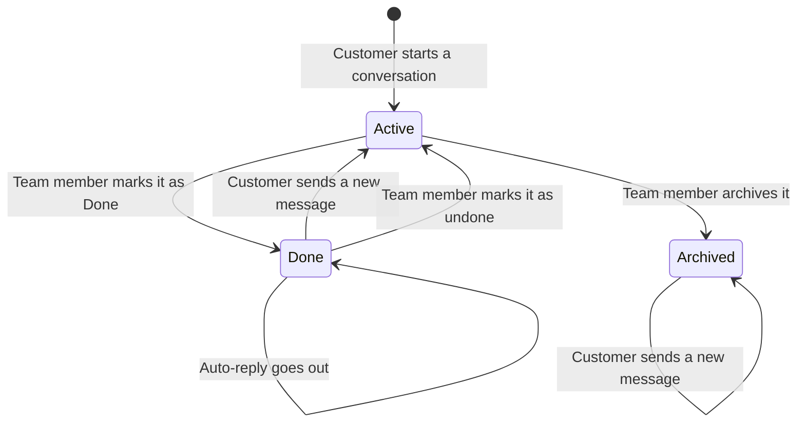

# Stories — Reopen an inbox conversation when a new inbound message arrives

One `[BE]` story. No frontend work is required: the inbox already decides tab membership from the conversation's Done state and already inserts a newly active conversation at the top of the list in real time.

---

## Story 1 — `[BE]` Reopen a conversation marked as Done when a new inbound message arrives

### Description

As a team member handling the ContentStudio inbox, I want a conversation I marked as Done to come back to my active inbox the moment the customer writes again, so that a new question on a closed thread never goes unanswered.

Today, marking a conversation as Done is permanent until someone manually marks it as undone. When the customer replies, the conversation stays buried in the **Marked as Done** tab and the new message is never surfaced. There is no notification badge, no unread count in an active tab, and no way to discover it other than opening Marked as Done and reading through closed threads. For a support team, this is a silently dropped customer.

### Workflow

"Active" means whichever of **Unassigned**, **Assigned**, or **Mine** the conversation belongs to based on who it is assigned to. Reopening does not change the assignment, so a conversation that was assigned to someone before being marked as Done comes back to that person rather than to Unassigned.

1. A team member is on the **Unassigned** tab in Inbox and opens a conversation from a connected Facebook or Instagram account.
2. They answer the customer and click **Mark as Done**. The conversation leaves Unassigned and appears in the **Marked as Done** tab, as it does today.
3. Later, the customer sends another message in that same conversation.
4. The conversation leaves **Marked as Done** and returns to **Unassigned**, at the top of the list, carrying the new message as its latest message and an unread indicator.
5. If the team member is looking at the Unassigned tab when the message lands, the conversation appears there straight away without a page refresh. The sidebar counts move with it: Unassigned goes up by one, Marked as Done goes down by one.
6. If the conversation had been assigned to a specific team member before being marked as Done, it returns to **Assigned** and to that person's **Mine** tab instead of Unassigned. The assignment is untouched.
7. When the team member replies to a Done conversation from ContentStudio, or an auto-reply goes out, the conversation stays in **Marked as Done**. Only a message from the customer brings it back. This includes the existing **Send & Mark as Done** action, which continues to close the conversation and keep it closed.
8. A conversation the team member archived stays archived when the customer writes again. Archiving is a deliberate "hide this" and is not affected by this change.

### Acceptance criteria

- [ ] A Facebook conversation marked as Done leaves the **Marked as Done** tab and appears in **Unassigned** when the customer sends a new message
- [ ] The same behaviour applies to Instagram conversations
- [ ] A Google Business Profile review marked as Done returns to the active tabs when new activity arrives on that review
- [ ] The reopened conversation shows the customer's new message as its latest message, with the unread count increased by one
- [ ] The reopened conversation appears at the top of the list when sorted by most recent activity
- [ ] Sidebar counts are consistent with the move: **Unassigned** increases by one and **Marked as Done** decreases by one, verified after a tab switch or page refresh
- [ ] A conversation that was assigned to a team member before being marked as Done returns to **Assigned** and to that member's **Mine** tab, and the assigned team member is unchanged
- [ ] A conversation stays in **Marked as Done** when a team member replies to it from ContentStudio, including via **Send & Mark as Done**
- [ ] A conversation stays in **Marked as Done** when an auto-reply is sent to it
- [ ] A conversation stays in **Marked as Done** when the platform echoes back a message that the workspace itself sent, so a reply never reopens the conversation it just closed
- [ ] An archived conversation stays in **Archived** when the customer sends a new message, and does not appear in **Unassigned**
- [ ] Running a full account sync or backfill does not reopen conversations that were previously marked as Done, even though every historical message is new to ContentStudio during that sync
- [ ] Reopening does not add a "Marked as undone by" activity line to the conversation thread, because no team member performed the action
- [ ] Reopening a conversation that is already active, or one that was never marked as Done, changes nothing about it
- [ ] The same customer message arriving twice, for example a webhook delivered twice, reopens the conversation once and does not produce duplicate unread counts
- [ ] Post comments continue to behave as they do today: a new comment on a post appears in **Unassigned** as its own item, and editing or re-syncing an existing comment does not change its Done state

### Mock-ups

N/A. Backend behaviour change only, with no new screens or copy.

### Impact on existing data

- No schema change. This reuses the existing Done and Pending state that the **Mark as undone** action already writes.
- No migration or backfill. Conversations that are stuck in **Marked as Done** today stay there until new inbound activity arrives, at which point they reopen. A one-off bulk reopen is deliberately out of scope: reopening months of closed conversations at once would flood every workspace's Unassigned tab.
- Sidebar counts and tab contents are computed from the conversation's current state on every request, so they follow the reopen with no separate update.
- Expect a one-time visible shift in workspaces that mark conversations as Done heavily: some conversations that have been sitting in **Marked as Done** will start appearing in **Unassigned** as customers reply to them. This is the intended correction, but it is worth a heads-up in release notes so teams do not read it as a regression.

### Impact on other products

- **Mobile app (Flutter):** inherits the fix with no app change. The app's inbox tabs are filtered server-side using the same conversation state, so a reopened conversation shows up in the app's Unassigned tab on the next load. Worth including in mobile regression testing.
- **Web app:** no frontend change needed. The inbox already reads Done state off the conversation and inserts a newly active conversation into the list in real time.
- **Chrome extension:** no impact, it has no inbox.
- **White-label domains:** no impact, no UI or copy changes.

### Dependencies

None.

Known limitation, not covered here: a team member who is looking at the **Marked as Done** tab at the exact moment a conversation reopens keeps seeing that conversation listed until they switch tabs or refresh, because the inbox list adds newly matching conversations in real time but does not remove ones that stopped matching. The sidebar counts lag the same way. This is cosmetic and pre-existing, and applies equally to the current **Mark as undone** action, so it is tracked separately as a frontend cleanup.

### Global quality checklist

- [ ] Mobile responsiveness tested — N/A, backend-only story with no UI
- [ ] Multilingual support verified — N/A, no user-facing strings added or changed
- [ ] UI theming supported — N/A, no UI changes
- [ ] White-label domains impact reviewed
- [ ] Cross-product impact assessed: web, mobile apps, Chrome extension
