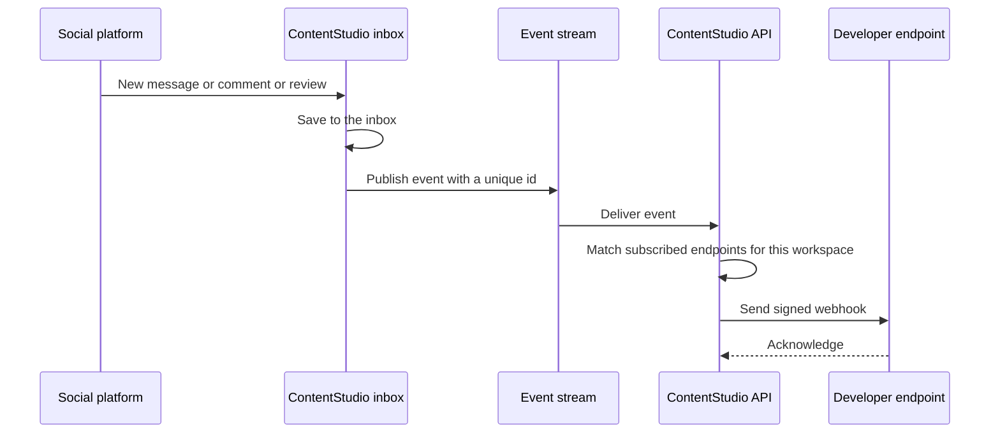

# Inbox Webhook Events — Epic & Stories

Date: August 3, 2026

---

## Epic

**Title:** Inbox Webhook Events

**Summary:** Emit outbound webhooks for inbox activity so external tools can react to messages, comments, reviews, and triage the moment they happen.

**Description:**

ContentStudio's public API now covers the inbox, so developers can read conversations, comments, and reviews and act on them programmatically. What they cannot do is find out that something happened. Today the only way to know a customer sent a message is to poll, which is slow for the developer and expensive for us.

This epic emits inbox activity as outbound webhooks on the delivery engine already built for publishing events. Endpoint management, signing, retries, delivery logs, and the test-event button all exist and are reused as-is. The ingress topic they read from was designed to accept events from other services, so the inbox service publishes onto it directly rather than anything new being built for delivery.

Seven events ship in v1, named to the Standard Webhooks convention already used for our signature headers, which is resource first with a past-tense action. Three cover arrivals: `message.received`, `comment.received`, `review.received`. Four cover team triage: `inbox.assigned`, `inbox.completed`, `inbox.archived`, `inbox.note.created`. Arrivals broadcast to the workspace owner and admins. Triage events target the people they concern.

The scope is deliberately limited to activity we already ingest. Delivery receipts, read receipts, message reactions, and message edits all need platform webhook fields we do not currently subscribe to, so they are out of v1 rather than half-built.

This unblocks the automation use cases customers ask for most: route an urgent DM into Slack, open a ticket in a help desk when a negative review lands, notify a channel when an item is assigned, and keep a CRM in step with customer conversations.

---

## Stories

---

## Story 1 — [BE] Add inbox events and payloads to the webhook catalog

### Description:

As a developer building on the ContentStudio API, I want inbox events to appear in the webhook event catalog alongside the publishing events, so that I can subscribe to inbox activity using the same endpoints, secrets, and delivery logs I already use.

Seven new event types are added to the catalog together with the payload each one carries. The delivery engine, signing, retries, and logging are unchanged. Because the settings UI and the catalog endpoint both read from the event catalog, adding the types here is what makes them selectable everywhere else.

This story also covers a naming correction to two existing events that do not follow the convention. Webhooks have not shipped to customers yet, so renaming them now costs nothing and avoids a breaking change later.

---

### Workflow:

1. Developer calls the webhook event types endpoint and sees the seven new inbox events listed with human-readable labels, grouped so the messages, comments, reviews, and inbox activity events are distinguishable.
2. Developer creates or edits a webhook endpoint and subscribes to one or more inbox events.
3. Developer clicks Send test event for an inbox event and receives a correctly shaped, correctly signed sample payload at their endpoint.
4. When real inbox activity occurs, the developer's endpoint receives the event with the same signature headers, retry behavior, and delivery-log entry as any publishing event.
5. Developer opens the delivery log for their endpoint and sees inbox deliveries listed alongside publishing deliveries, filterable and exportable in the same way.

---

### Acceptance criteria:

- [ ] The webhook event catalog includes `message.received`, `comment.received`, `review.received`, `inbox.assigned`, `inbox.completed`, `inbox.archived`, and `inbox.note.created`
- [ ] Each new event has a human-readable label suitable for display in the settings UI
- [ ] An event arriving on the ingress topic with any of the seven new types is accepted and fanned out rather than dead-lettered
- [ ] `message.received` payloads identify the workspace, the connected account, the conversation, the message, and the sender
- [ ] `comment.received` payloads identify the workspace, the connected account, the post the comment is on, the comment, whether it is a reply, and the commenter
- [ ] `review.received` payloads identify the workspace, the connected account, the review, the rating, and the reviewer
- [ ] Triage payloads identify the workspace, the inbox item, the item type of conversation, post or review, and the team member who performed the action
- [ ] No payload contains platform access tokens, internal service URLs, or any workspace's data other than the subscribing one
- [ ] Send test event produces a valid sample payload for each of the seven events without requiring real inbox activity
- [ ] Inbox deliveries appear in the existing delivery log with the same fields, filtering, and CSV export as publishing deliveries
- [ ] Subscribing to an inbox event on one workspace never delivers another workspace's inbox activity
- [ ] A decision is recorded on renaming `post.comment`, which today means an internal post discussion comment and is easily confused with the new `comment.received`
- [ ] A decision is recorded on renaming `post.inreview`, which does not follow the past-tense action convention the other events use

---

### Mock-ups:

N/A. No user-facing interface in this story.

---

### Impact on existing data:

No schema change. Existing webhook endpoints keep working untouched, and any endpoint that has not subscribed to an inbox event sees no change in behavior.

If the team accepts the `post.comment` and `post.inreview` renames, any endpoint already subscribed to those events in a pre-release environment needs its subscription updated. No customer-facing endpoints exist yet, so there is no migration for live data.

---

### Impact on other products:

- **Inbox Public API.** Developers will pair these events with the existing inbox endpoints, receiving an event and then fetching the full item. Payloads should carry enough identifiers to make that follow-up call without guesswork.
- **Billing.** Each delivery draws on the shared API credit pool. Inbox events are far more frequent than publishing events, so expected volume should be sized before the events are enabled for customers.

---

### Dependencies:

- Depends on **[BE] Build the webhook event dispatch & delivery engine (with metering)**
- Depends on **[BE] Build webhook delivery-log & test-event APIs**
- Paired with **[BE] Publish inbox events from the social inbox manager**, which produces the events this story defines

---

### Global quality & compliance (wherever applicable)

- [ ] Mobile responsiveness (frontend only, N/A for backend-only stories) — N/A, backend only
- [ ] Multilingual support (frontend + backend, translations available or fallback handled) — N/A, event names and payloads are API surface and stay in English
- [ ] UI theming support (default + white-label, design library components are being used) — N/A, no UI
- [ ] White-label domains impact review
- [ ] Cross-product impact assessment (web, mobile apps, Chrome extension)

---

### Implementation references

*Pointers from research — not a contract. Engineering may choose a different approach.*

**Primary entry points:**
- `contentstudio-backend/app/Data/Webhooks/Enums/WebhookEventType.php` — the catalog. Adding a case is what makes an event selectable in the UI and acceptable to the consumer
- `contentstudio-backend/app/Services/Webhooks/PostWebhookPayload.php` — the payload-builder pattern to mirror for an inbox equivalent
- `contentstudio-backend/app/Kafka/Handlers/WebhookEventHandler.php` — validates the type against the enum and dead-letters unknown types. No change expected here

**Existing behavior to preserve (no change needed):**
- Routing is resolved from current workspace membership, never from the envelope. The producing service cannot influence who receives an event, which is the property that keeps cross-tenant leakage impossible
- Deduplication is handled by the consumer on the envelope's event id
- Delivery, signing, retry with backoff, the credit-pool check, and delivery logging are all event-type agnostic and need no change

**Gotcha:**
- The enum's own comments note that adding an event is one case plus a payload builder plus an emit call, with no plumbing changes. If this story turns out to need plumbing changes, that is a signal the payload shape is fighting the existing contract

---

## Story 2 — [BE] Publish inbox events from the social inbox manager

### Description:

As a developer subscribed to inbox webhooks, I want events to arrive within seconds of the activity happening, so that my automation reacts while the customer is still waiting rather than on the next poll.

The social inbox manager owns inbox ingestion and is the only service that knows the moment a message, comment, or review lands, or that a team member assigned or completed an item. This story has it publish those moments onto the webhook ingress topic that the backend already consumes.

The ingress topic was designed to accept events from other services, so this is a new producer on an existing contract rather than new delivery infrastructure.

---

### Workflow:

1. A customer sends a direct message, leaves a comment, or posts a review on a connected account.
2. ContentStudio ingests it into the inbox as it does today, and the item appears in the user's inbox unchanged.
3. In the same moment, an event is published describing what arrived.
4. Any workspace endpoint subscribed to that event receives a signed webhook within seconds.
5. Separately, when a team member assigns an item, marks it done, archives it, or adds an internal note, an event is published for that action too, addressed to the people it concerns.
6. If no endpoint in the workspace subscribes to an event, nothing is delivered and nothing is charged.

---

### Acceptance criteria:

- [ ] A new inbound direct message on any connected account publishes `message.received` within seconds of being ingested
- [ ] A new inbound comment on a published post publishes `comment.received` within seconds of being ingested
- [ ] A new review on a connected business profile publishes `review.received` within seconds of being ingested
- [ ] Assigning an inbox item publishes `inbox.assigned` addressed to the assignee
- [ ] Marking an inbox item done publishes `inbox.completed`
- [ ] Archiving an inbox item publishes `inbox.archived`
- [ ] Adding an internal note publishes `inbox.note.created` addressed to any team members mentioned in the note
- [ ] Every published event carries a unique, stable id so a retried or duplicated publish is delivered to the customer only once
- [ ] Turning off notification emails does not stop webhook events from being published
- [ ] Replies sent by ContentStudio, whether by a team member in the inbox, by an auto-reply rule, or through the public API, do not publish an arrival event, so an automation replying to a message cannot trigger itself
- [ ] An inbox item that is ingested but belongs to no active workspace publishes no event
- [ ] If publishing an event fails, the inbox item is still saved and the user's inbox is unaffected
- [ ] Events that cannot be delivered are dead-lettered rather than retried indefinitely, and a failure is visible in service logs
- [ ] Existing inbox behavior is unchanged: notifications, real-time inbox updates, and auto-replies all continue to work exactly as before

---

### Mock-ups:

N/A. No user-facing interface in this story.

---

### Impact on existing data:

No schema change and no change to what is stored. This story adds an outbound publish alongside existing behavior.

The one behavioral risk to watch is that the existing notification methods return early when notification sending is switched off. Webhook publishing must not sit behind that switch, or disabling internal emails would silently stop paying customers' webhooks.

---

### Impact on other products:

- **Inbox.** No user-visible change. Ingestion, notifications, real-time updates, and auto-replies behave exactly as they do today.
- **Auto-replies.** Auto-replies run off the same ingestion path. The rule that ContentStudio's own outgoing messages do not publish arrival events is what keeps an auto-reply from appearing to a developer as a new inbound message.
- **Billing.** Publishing is free; delivery is what draws credits. A workspace with no subscribed endpoints costs nothing.

---

### Dependencies:

- Depends on **[BE] Add inbox events and payloads to the webhook catalog**, which defines the event names this story publishes
- Depends on **[BE] Build the webhook event dispatch & delivery engine (with metering)**

---

### Global quality & compliance (wherever applicable)

- [ ] Mobile responsiveness (frontend only, N/A for backend-only stories) — N/A, backend only
- [ ] Multilingual support (frontend + backend, translations available or fallback handled) — N/A, no user-facing strings
- [ ] UI theming support (default + white-label, design library components are being used) — N/A, no UI
- [ ] White-label domains impact review
- [ ] Cross-product impact assessment (web, mobile apps, Chrome extension)

---

### Implementation references

*Pointers from research — not a contract. Engineering may choose a different approach.*

**Primary entry points:**
- `social-inbox-manager/app/utils/notification_helper.py` — the natural seam. Its methods already fire at almost exactly the moments the events describe: `send_message_notification`, `send_comment_notification`, `send_assigned_notification`, `send_mark_done_notification`, `send_archived_notification`, `send_mentioned_notification`. The payloads they build already carry workspace id, account id, element id, and sender
- `social-inbox-manager/app/social_sync/facebook_strategy.py` around the comment and message save paths — representative of where the notification helper is called from per platform. The same pattern repeats in the Instagram, LinkedIn, YouTube, and WhatsApp strategies
- `social-inbox-manager/app/kafka/producer.py` and `app/config/kafka_config.py` — existing producer plumbing to extend with the ingress topic
- `social-inbox-manager/app/api/v1/routes/elements.py` and `sends.py` — where assignment, done, archive, and note actions are handled

**The envelope the backend consumer expects:**
- An event id used as the deduplication key, the event type, the workspace id, an optional list of recipient user ids, and a data object
- Including recipient user ids targets those users. Omitting it broadcasts to the workspace owner and admins. Arrivals should omit it; assignment and note events should set it
- The consumer never trusts the envelope for routing and always resolves recipients from current membership, so an incorrect recipient list cannot leak data, it can only fail to deliver

**Gotchas:**
- Every notification helper method opens with an early return when notification sending is disabled. Webhook publishing must sit outside that guard
- The notification path pushes to Redis, not Kafka. Webhook publishing is a parallel path to a different transport, not a reuse of the existing one
- The GMB strategy never calls the notification helper at all, so `review.received` needs a new emit point rather than an addition to an existing one
- Reviews can be updated as well as created. v1 covers new reviews only, so an edited review should not republish `review.received`

---

## Story 3 — [FE] Add inbox events to the webhook event picker

### Description:

As a ContentStudio user setting up a webhook, I want to see and select inbox events grouped clearly alongside the post events, so that I can subscribe to the customer activity I care about without reading API documentation to work out what each event means.

The Webhooks tab already lets a user create an endpoint and choose which events it receives. This story adds the inbox events to that picker, grouped and described in plain language.

---

### Workflow:

1. User goes to Settings and opens the API and Webhooks area, then the Webhooks tab.
2. User clicks to create a new webhook or edits an existing one.
3. In the Events section the user now sees four additional groups below Posts: Messages, Comments, Reviews, and Inbox activity.
4. Each group has a Select all control and each event has a checkbox with a one-line description of when it fires.
5. User selects the events they want and saves the webhook.
6. User clicks Send test event, picks one of the inbox events, and confirms their endpoint receives a sample payload.

---

### Acceptance criteria:

- [ ] The Events section shows four new groups below the existing Posts group, in this order: Messages, Comments, Reviews, Inbox activity
- [ ] Each group has a Select all control that toggles every event in that group
- [ ] Each event renders as a `Checkbox` from `@contentstudio/ui` with its name and description
- [ ] Group labels and event descriptions use this exact copy:
  - **Messages**
    - `message.received` — "Someone sends you a direct message on a connected account."
  - **Comments**
    - `comment.received` — "Someone comments on one of your published posts."
  - **Reviews**
    - `review.received` — "Someone leaves a new review on a connected business profile."
  - **Inbox activity**
    - `inbox.assigned` — "An inbox item is assigned to a team member."
    - `inbox.completed` — "An inbox item is marked as done."
    - `inbox.archived` — "An inbox item is archived."
    - `inbox.note.created` — "A team member adds an internal note on an inbox item."
- [ ] A webhook saved with at least one inbox event selected persists that selection and shows it again when reopened
- [ ] Saving with no events selected shows the existing validation message and does not save
- [ ] The event list is driven by the event catalog returned from the server, so an event added on the backend appears without a frontend change
- [ ] If the catalog fails to load, the Events section shows: "We could not load the event list. Please refresh the page and try again."
- [ ] While the catalog is loading, the Events section shows a skeleton placeholder rather than an empty area
- [ ] Send test event offers the inbox events in its event selector
- [ ] All labels, descriptions, and messages in this story go through i18n and exist in every supported locale
- [ ] When a user saves a webhook with at least one inbox event selected, a `webhook_created` Usermaven event fires with `{ event_count, events }`, matching the existing webhook creation tracking

---

### Mock-ups:

Covered by **[Design] Design the inbox event groups in the webhook event picker**.

---

### Impact on existing data:

None. Event subscriptions are stored on the webhook endpoint record in the existing shape. An endpoint saved before this story keeps its selections untouched.

---

### Impact on other products:

- **Mobile apps and Chrome extension.** Not affected. Webhook management is a web settings surface only.
- **White-label.** The Webhooks tab is part of settings and follows the existing theming, so the new groups inherit it with no extra work as long as design system components are used.

---

### Dependencies:

- Blocked by **[FE] Build the Webhooks tab (manage webhooks + per-webhook delivery logs)**, which does not exist yet. There is no webhook UI in the frontend today, so this story cannot start until that one lands
- Blocked by **[FE] Restructure the API page into `API` and `Webhooks` tabs with a usage readout**
- Depends on **[BE] Add inbox events and payloads to the webhook catalog** for the events to appear in the catalog
- Design input from **[Design] Design the inbox event groups in the webhook event picker**

---

### Global quality & compliance (wherever applicable)

- [ ] Mobile responsiveness (frontend only, N/A for backend-only stories)
- [ ] Multilingual support (frontend + backend, translations available or fallback handled)
- [ ] UI theming support (default + white-label, design library components are being used)
- [ ] White-label domains impact review
- [ ] Cross-product impact assessment (web, mobile apps, Chrome extension)

---

### Implementation references

*Pointers from research — not a contract. Engineering may choose a different approach.*

**Component notes:**
- `Checkbox` and `Badge` are available in `@contentstudio/ui` and should be used directly
- **Component gap:** the library has no standalone tooltip and no accordion or collapsible section. If the design calls for collapsible event groups or hover help on an event, use `CstPopup` for the popover case and flag the accordion need, since groups may need to render as plain headed sections instead

**Existing patterns:**
- The event list should render from the server's event-type catalog rather than a hardcoded frontend list, so backend additions need no frontend release
- Reuse the grouping and Select all behavior already specified for the Posts group rather than introducing a second pattern

---

## Story 4 — [Design] Design the inbox event groups in the webhook event picker

### Description:

As a ContentStudio user configuring a webhook, I want the event picker to stay readable as the number of available events grows, so that I can find the events I need without scanning a long flat list.

Adding seven inbox events roughly doubles the length of the event picker. This story covers how the picker holds up at that size and how each event is described so a non-technical user understands what they are subscribing to.

---

### Workflow:

1. Designer reviews the existing Webhooks tab design and the event picker within it.
2. Designer produces the grouped event picker covering the Posts group plus the four new groups.
3. Designer specifies group headers, Select all placement, spacing, and how a long list behaves, including whether groups collapse.
4. Designer specifies the loading and error appearance of the Events section.
5. Designer hands off with the copy for each group and event confirmed against the frontend story.

---

### Acceptance criteria:

- [ ] Designs cover the event picker with all five groups present: Posts, Messages, Comments, Reviews, Inbox activity
- [ ] Designs specify group header treatment and the placement and behavior of Select all per group
- [ ] Designs address how the picker behaves when the full list is longer than the visible area, including whether groups are collapsible and what their default state is
- [ ] Designs specify the loading and error appearance of the Events section
- [ ] Designs specify the appearance of an event row: name, description, and checkbox alignment
- [ ] Designs use existing design system components and call out explicitly anywhere a new component would be required, in particular a collapsible section, which the library does not currently provide
- [ ] Designs work at the mobile and tablet widths the settings area already supports
- [ ] Copy in the designs matches the copy in **[FE] Add inbox events to the webhook event picker** exactly, and any change is agreed with that story rather than diverging

---

### Mock-ups:

This story produces them.

---

### Impact on existing data:

None.

---

### Impact on other products:

None directly. The grouped picker pattern may be reused if account, ads, or other event families are added later, so it is worth designing as a pattern rather than a one-off.

---

### Dependencies:

- Depends on **[Design] Design the Webhooks experience + the API page restructure**, which establishes the tab this picker lives in
- Paired with **[FE] Add inbox events to the webhook event picker**

---

### Global quality & compliance (wherever applicable)

- [ ] Mobile responsiveness (frontend only, N/A for backend-only stories)
- [ ] Multilingual support (frontend + backend, translations available or fallback handled) — design should allow for longer translated strings in event descriptions
- [ ] UI theming support (default + white-label, design library components are being used)
- [ ] White-label domains impact review
- [ ] Cross-product impact assessment (web, mobile apps, Chrome extension) — N/A, web settings surface only
