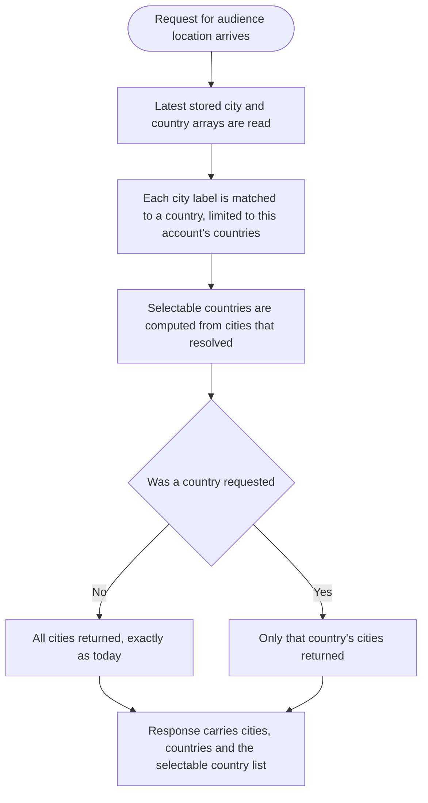
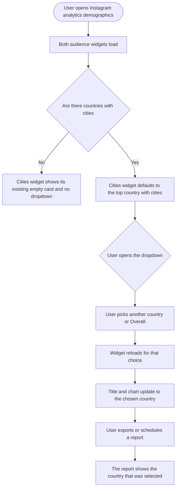

# Stories: Instagram audience top cities, broken down by country

**Date:** 2026-09-11
**Stories:** 3
**Research:** `01-research.md`

---

> # READ THIS FIRST: verify with the Instagram API before building
>
> **Do not start development on these stories until the check below is done.** Research found that Instagram may not give us the one thing this feature needs: which country each city belongs to. That question decides whether this feature gets built at all, and it can only be settled against the live API.
>
> ## What research found
>
> - Cities and countries are requested as **two separate calls** to the `follower_demographics` metric, one per breakdown. Nothing in either response links them.
> - The only **combined** breakdown Meta documents for this metric is `age,gender`. There is no documented `city,country`.
> - There is **no country filter parameter** on the metric.
> - A city arrives as a single opaque label. Meta's documented shape is **"City, Region"**, for example "Lahore, Punjab", where the second part is a subdivision and **not** a country.
> - What we store matches: two flat arrays with no link between them, and no country column on city data.
>
> ## But there is a real reason to check rather than take that as final
>
> **Our own test fixtures disagree with each other about the shape of a city label.** One fixture carries a country code in the label and another does not:
>
> - one shows city values like `"New York, US:1000"`, which **does** contain a country
> - another shows city values like `"New York:100"`, which does not
>
> Fixtures are not evidence of what live accounts return. So the shape of real data is genuinely unknown to us, and it is the single most valuable thing to confirm.
>
> ## The checks to run
>
> Against a **real Instagram Business account with audience in more than one country**, not a fixture and not a test account:
>
> 1. Call `follower_demographics` with `breakdown=city` and look at the **raw** `dimension_values` for several city results. Does the label contain a country, an ISO country code, or only a city and a region? Capture the exact strings.
> 2. Try `breakdown=city,country`. Does Meta accept it, or reject it as an unsupported combination?
> 3. Check whether any country or location filter parameter is accepted on the metric.
> 4. Check the current Graph API version's changelog and reference for this metric, in case a combined breakdown or a country dimension has been added since. Note which API version we are calling on, and whether a newer one offers more.
> 5. Repeat check 1 for `engaged_audience_demographics` and `reached_audience_demographics`, in case their city breakdown is shaped differently from the follower one.
>
> ## What to do with the answer
>
> **If Instagram does give us the country**, whether as its own dimension or reliably inside the city label: build these three stories as written. That is the path they are specced for, and it is clean.
>
> **If Instagram does not give us the country**: stop and report back, so it can go to the marketing team as a platform limitation rather than a missed commitment. Do **not** quietly substitute a workaround. There is one possible fallback, described in the appendix at the end of this document, but it produces **derived and approximate** figures rather than numbers Instagram reported, and it needs an explicit product decision before anyone writes code for it.
>
> Record the answer, with the captured raw strings, in the backend story before closing this gate either way. Whatever is found is worth writing down, because the same question governs the equivalent Facebook and LinkedIn widgets.

---

## Overview

Instagram analytics shows two audience widgets side by side: **Audience Top Countries** and **Audience Top Cities**. Both stay as they are. The Cities widget gains a dropdown so a user can look at one country's cities at a time instead of a single global list where the largest market crowds everything else out.

The widget title becomes **"Audience Top Cities by {country}"**. The dropdown defaults to the user's top audience country, offers **Overall** plus every country that actually has cities in the data, and whichever option is selected is what appears in the generated report.

### The constraint this feature is built around

This feature needs one thing Instagram may not provide: which country each city belongs to. **Read the verification note above before starting.** These stories are written for the case where Instagram does supply it, whether as its own dimension or reliably inside the city label.

If verification shows it does not, the finding goes back to the marketing team rather than being worked around. A fallback exists and is described in the appendix at the end of this document, but it yields derived rather than reported figures and needs a product decision first.

One contrast worth knowing either way: **Facebook already carries the country inside its city label**, so the same feature is close to free there and genuinely hard here.

### Scope

- The Instagram Audience Top Cities widget on the analytics demographics section.
- The same widget in the generated report, honouring the selected country, on **both** report paths.
- The Audience Top Countries widget is unchanged.

### Out of scope

- **Facebook's forked copy of the same widget.** It is a near-duplicate file and would not be covered automatically. It is also the platform where this is easiest, so it is a good follow-up rather than a silent omission.
- **LinkedIn, YouTube, Meta Ads and Google Ads demographics.** Each has its own widget and its own data shape.
- **Changing what the Countries widget shows**, or how either widget ranks.
- **Backfilling or reprocessing stored demographics.** The attribution is computed when the data is read.

### Sequencing

The backend story leads. The frontend cannot build a dropdown until the API both accepts a country and reports which countries are selectable.

### Decisions taken

- **The country list comes from the response, not from the Countries widget.** The API returns the countries that have at least one attributable city, ordered by follower count. This matters because the two sets differ: Instagram returns a globally-ranked, capped city list, so a country can rank well on followers and still have no city in it. Driving the dropdown from the Countries widget would let a user pick a country and get an empty chart.
- **The default is the first entry in that list**, which is the top audience country that has cities.
- **Overall is the current behaviour**, so an unfiltered request returns exactly what it returns today.
- **Filtering does not rescale values.** Selecting a country changes which cities are shown, not the follower count shown against each one.

### Open before build

1. **The API verification above.** This one gates everything. Nothing else in this list matters until it is answered.
2. **What happens to a city Instagram gives us without a country?** Even on the clean path there may be cities Instagram cannot place, for example where it returns a region we do not recognise. They must still appear under Overall, since dropping them would silently change what the widget shows today. The question is whether they are simply absent from country views or surfaced some other way. Recommend absent, with the unplaced proportion recorded so a problem is visible to us rather than to customers.

If, and only if, verification says Instagram cannot supply the country and the team decides to pursue the fallback in the appendix, two further questions open up: who owns the geographic reference data and keeps it current, and whether derived figures are acceptable to show customers without qualification.

---

## Story 1

### Title

**[BE] Attribute Instagram audience cities to countries and serve the cities widget filtered by country**

### Description

As someone reviewing where my Instagram audience is, I want to look at one country's cities at a time, so that a single large market does not crowd every other city out of the list and I can actually see how my audience is distributed within a country that matters to me.

Instagram gives us a globally ranked list of top cities and, separately, a list of top countries, with nothing connecting the two. This story derives that connection, exposes it as a country filter on the existing audience location endpoint, and tells the client which countries can actually be selected.

It also carries the selection into report generation, which is new: report widgets are currently a flat list of ids with no options, and where a widget has a choice today the catalog works around it by registering one widget per option. That does not generalise to a country, because the list is user data and differs per account.

---

### Endpoints

| Endpoint | Description |
|---|---|
| **Instagram audience location** (the existing endpoint serving both widgets) | Accepts an optional country. When absent or empty, behaves exactly as today and returns the global city list. When present, returns only the cities attributed to that country. The response gains a list of selectable countries, ordered by follower count, containing only countries with at least one attributed city. |
| **Instagram audience location, public API proxy** | The same country parameter, which must be added to the proxy's allowed query parameters or it will be silently dropped before reaching the service. |
| **Report generation** | The report definition gains an additive, report-level options map keyed by widget id, so the cities widget can carry a selected country. Additive rather than reshaping the existing widget list, because that list is already persisted in two collections and changing its shape would break stored documents. |
| **Report save and schedule** | The selected country is persisted with the report and carried onto every run of a scheduled report, so a recurring report keeps showing the country the user picked. |

---

### Workflow

The user here is a developer, so developer terms are used deliberately.

1. A request arrives for a workspace, an account and optionally a country.
2. The stored city and country lists are read as they are today.
3. Each city label is matched against the geographic reference data, with candidate countries restricted to those present in this account's own country list.
4. The selectable country list is computed from the countries that at least one city resolved to, ordered by that country's follower count.
5. If no country was requested, every city is returned, exactly as today.
6. If a country was requested, only the cities attributed to it are returned, with their follower counts unchanged.
7. The response carries the city list, the country list and the selectable country list.

---

### Acceptance criteria

**The verification gate**

- [ ] The API verification described at the top of this document is completed before any code is written, against a real Instagram Business account with audience in more than one country
- [ ] The raw city label strings that account returns are captured and recorded in this story, so the answer is evidence rather than recollection
- [ ] If Instagram cannot supply the country, work stops here and the finding is reported back rather than worked around

**Capturing the country per city**

- [ ] Each city carries the country Instagram reports for it, taken from whatever the verification established as the reliable source, whether a separate dimension or a component of the city label
- [ ] The country is normalized to the same ISO two-letter form the countries list already uses, so the two widgets agree and the frontend can reuse its existing country name and flag lookups
- [ ] Parsing the country out of a city label, if that is the source, tolerates the label shapes actually observed rather than assuming one, and a label that does not match any known shape leaves the city unplaced rather than guessing
- [ ] A city Instagram gives us without a usable country is left unplaced rather than assigned to a guess
- [ ] The proportion of cities left unplaced is recorded, so a change in what Instagram returns is visible to the team before it is visible to customers
- [ ] The city label shown to the user stays the label Instagram gave, so extracting a country does not change what the chart reads

**The country filter**

- [ ] The audience location endpoint accepts an optional country
- [ ] With no country supplied, the response is byte-for-byte what it is today, so existing callers are unaffected
- [ ] With a country supplied, only cities attributed to that country are returned
- [ ] Cities keep the follower counts Instagram reported. Filtering changes which cities appear, never their values
- [ ] Cities stay ordered by follower count, as they are today
- [ ] Requesting a country with no attributed cities returns an empty city list rather than an error
- [ ] Requesting a country that is not in the account's audience at all returns an empty city list rather than an error
- [ ] The country parameter is accepted by the public API proxy rather than being dropped before it reaches the service

**The selectable country list**

- [ ] The response includes the list of countries that can be selected
- [ ] The list contains only countries with at least one attributed city, so selecting any entry always produces a non-empty chart
- [ ] The list is ordered by the country's follower count, highest first, so the first entry is the top audience country that has cities
- [ ] When no city could be attributed to any country, the list is empty
- [ ] The unchanged audience country list is still returned alongside it, so the Countries widget is unaffected

**Reports**

- [ ] The report definition can carry a selected country for the cities widget, as an additive field that older services ignore rather than fail on
- [ ] The generated report renders the cities widget filtered to the selected country
- [ ] A report with no selected country renders the cities widget exactly as it does today
- [ ] The selection is persisted when a report is saved
- [ ] A scheduled report carries the selection onto every run, so a recurring report does not silently revert to the global list
- [ ] Adding the field does not change the shape of the existing widget list, so report documents already stored remain valid

---

### Mock-ups

N/A, backend only.

---

### Impact on existing data

No schema change, no migration and no backfill. The country is read out of what Instagram already returns, at the point the data is read, so nothing stored has to change and nothing historical has to be reprocessed.

Note that demographics are a lifetime snapshot rather than a per-day figure. The read path already reads only the single latest stored row and ignores the requested date range, which is existing behaviour and unchanged here, but it means the widget does not respond to the date picker and never did. Worth knowing before someone reports it as a bug caused by this work.

Two pre-existing risks are worth knowing while someone is in this code, neither introduced here:

- Three different encodings for these stored arrays exist historically, and rows still carrying the oldest one are silently skipped by the current parser rather than erroring. Worth confirming whether any live account is still affected.
- The parser does not know which breakdown it is parsing and infers it from the shape of the string, so a two-character city name would be misfiled as a country.

---

### Impact on other products

- **Public API:** the new country parameter and the selectable country list are additive. Existing integrations are unaffected, but the API reference should document both.
- **Facebook:** unchanged by this story. Worth noting that Facebook's city labels already contain the country, so the same feature there needs no derivation and is a much smaller piece of work.
- **Meta Ads:** already has an equivalent country filter with a selectable country list, and its request and response shape is the model this story follows. No change to it.
- **Mobile app and Chrome extension:** no impact, neither surfaces Instagram audience demographics.

---

### Dependencies

None. This story leads.

---

### Global quality & compliance (wherever applicable)

- [ ] Mobile responsiveness, N/A for this backend-only story
- [ ] Multilingual support (frontend + backend, translations available or fallback handled)
- [ ] UI theming support, N/A for this backend-only story
- [ ] White-label domains impact review
- [ ] Cross-product impact assessment (web, mobile apps, Chrome extension)

---

## Story 2

### Title

**[FE] Add the country dropdown to the Instagram Audience Top Cities widget and carry it into reports**

### Description

As someone looking at where my Instagram audience is, I want to pick a country and see that country's cities, so that I can understand how my audience is spread inside a market I care about instead of reading one global list dominated by my largest country.

The Cities widget gains a dropdown in its header. It defaults to the top audience country that has cities, offers **Overall** plus every selectable country, and the widget title reads **"Audience Top Cities by {country}"**. The Countries widget beside it does not change.

The selection also has to survive into the generated report, which the product has done exactly once before, for the top-posts limit. That chain is the one to follow, and it has to be wired for both report paths, because the two render completely differently.

---

### Workflow

1. User opens Instagram analytics and goes to the demographics section.
2. Both audience widgets load side by side, as they do today.
3. The Cities widget shows a dropdown in its header, preselected to the top audience country that has cities. The title reads "Audience Top Cities by India".
4. User opens the dropdown and sees **Overall** first, then every country with cities, each with its flag and full country name.
5. User picks a different country. The widget reloads and the chart and title update to that country.
6. User picks Overall and the widget shows the global city list, which is what it shows today.
7. User exports, schedules or emails a report. The cities widget in that report shows whichever country was selected.
8. If the account has too few followers for Instagram to return demographics, both widgets show their existing empty card and the Cities widget shows no dropdown at all.

---

### Acceptance criteria

**The dropdown**

- [ ] The Cities widget header carries a dropdown listing **Overall** first, then every selectable country reported by the API
- [ ] Countries are labelled with their full name, not the two-letter code, reusing the shared country display helper that already normalizes codes and names
- [ ] The list is ordered as the API returns it, highest audience first, so the most relevant country is nearest the top
- [ ] The dropdown defaults to the first country in that list, being the top audience country that has cities
- [ ] Only countries that actually have cities appear, so picking any option always produces a chart with data
- [ ] Selecting a country reloads the widget for that country and leaves every other widget on the page untouched
- [ ] Selecting **Overall** shows the global city list, matching the widget's behaviour today
- [ ] The widget title reads "Audience Top Cities by {country}" when a country is selected, and "Audience Top Cities" when Overall is selected
- [ ] The Countries widget beside it is completely unchanged
- [ ] The selection persists while the user stays on the page, including when the widget is expanded into its larger modal view
- [ ] Changing account or date range resets the selection to the new default, since the available countries will differ

**States**

- [ ] While the widget is loading, the dropdown is disabled and the chart shows its existing skeleton
- [ ] When the account has no audience country data, which is the common case below Instagram's follower threshold, no dropdown is shown and the widget keeps its existing empty card and its existing follower-threshold message
- [ ] When a country switch fails, the widget shows an error with a way to retry, rather than an empty chart that reads as "this country has no cities"
- [ ] The widget's existing follower-threshold empty message is unchanged

**Reports**

- [ ] The selected country is included when a user exports a report, schedules a report, and sends a report by email
- [ ] The generated report shows the cities widget for the selected country, on both report paths
- [ ] A report generated with Overall selected shows the global city list, as today
- [ ] Reopening a saved or scheduled report configuration shows the country that was saved
- [ ] The dropdown itself is not rendered inside the report, matching how the other in-widget dropdowns hide themselves there
- [ ] The report's widget title names the country, so a reader of the PDF knows which country the chart covers

**Translations**

- [ ] The dropdown label, the Overall option, the "by {country}" title form and the error message are added as translation keys across every supported locale in the same change, with no hardcoded English left in a component

---

### UI copy

**Widget title**

> **Overall selected:** Audience Top Cities
> **A country selected:** Audience Top Cities by India

**Dropdown**

> **First option:** Overall
> **Other options:** the country's full name, with its flag, for example "India", "Pakistan", "United States"
> **Tooltip on the control:** Show cities for one country at a time, or Overall for every city.

**Help popover**, added to the widget's existing help icon

> Instagram reports your top cities and your top countries separately, so we work out which country each city belongs to. Pick a country to see just its cities, or choose Overall to see them all.

**Error state**

> **Message:** We could not load cities for that country.
> **Action label:** Try again

**Empty and loading states**

> **Loading:** the existing chart skeleton, with the dropdown disabled.
> **No demographics available:** the existing empty card and its existing message, "You'll need 100 followers (who aren't your friends) to view this demographic information." No dropdown is shown.
> **A country with no cities:** cannot occur, because only countries with cities are offered.

**Component notes**

> Uses the existing analytics dropdown components that the top-posts selector already uses, and the shared country display helper for labels. No new component is required.
>
> **Worth knowing for estimation.** The two audience widgets are the same component rendered twice with a type prop, so the dropdown must appear for the cities instance only. Facebook has a forked near-duplicate of that file which this story deliberately does not touch. The report work spans two independent paths: the primary renderer composes the PDF from a widget list on the server, while the fallback renders these same Vue components headlessly and fetches its own data, so the selection has to be threaded through both. The report payload is assembled in three separate places, for export, schedule and email, and read back in a fourth when the fallback PDF renders.

---

### Mock-ups

See **[Design] Design the Instagram audience cities country dropdown**.

---

### Impact on existing data

None on the frontend. The selection is held for the session and, when a report is created, stored with that report by the backend.

---

### Impact on other products

- **Facebook:** its copy of this widget is untouched and keeps its current behaviour. Worth scheduling as a follow-up, since the country is already present in Facebook's city labels.
- **Mobile app and Chrome extension:** no impact.
- **Public API:** no impact from this story.

---

### Dependencies

Depends on **[BE] Attribute Instagram audience cities to countries and serve the cities widget filtered by country**, for both the country filter and the selectable country list.

Design input from **[Design] Design the Instagram audience cities country dropdown** should land before build starts.

---

### Global quality & compliance (wherever applicable)

- [ ] Mobile responsiveness (frontend only, N/A for backend-only stories)
- [ ] Multilingual support (frontend + backend, translations available or fallback handled)
- [ ] UI theming support (default + white-label, design library components are being used)
- [ ] White-label domains impact review
- [ ] Cross-product impact assessment (web, mobile apps, Chrome extension)

---

## Story 3

### Title

**[Design] Design the Instagram audience cities country dropdown**

### Description

As the developers adding a control to a chart card that sits beside an almost identical card, we want an agreed treatment, so that the Cities widget gaining a dropdown does not visually unbalance the pair or make the two look like different components.

The two audience widgets sit side by side and are the same component today. Giving one of them a header control and a longer, variable title is the whole design problem, and the longest country names are where it will break.

---

### Workflow

1. Designer reviews the copy specified in the frontend story, which is agreed and should be treated as the content to design around rather than placeholder text.
2. Designer reviews the two widgets as they render side by side today, and the same pair in a generated report.
3. Designer produces the states listed below.
4. Designer reviews with product and frontend, and the agreed designs become the reference for the frontend story.

---

### Acceptance criteria

- [ ] The Cities widget header with its dropdown, shown beside the unchanged Countries widget, confirming the pair still reads as a set
- [ ] The title at its longest, using a long country name, confirming it does not wrap awkwardly or push the dropdown out of the card
- [ ] The dropdown open, showing Overall separated from the country list, with flags and full country names
- [ ] The dropdown in its disabled loading state
- [ ] The widget in its empty state with no dropdown, which is what small accounts will see
- [ ] The widget's error state with its retry action, which this widget does not have today and now needs
- [ ] The widget expanded into its larger modal view with a country selected
- [ ] The pair at the narrower single-column width, where the two cards stack instead of sitting side by side
- [ ] The widget as it appears inside a generated report, with the dropdown absent and the country named in the title
- [ ] A view on whether the help popover should carry the note that city-to-country grouping is derived rather than reported by Instagram, and how prominent that should be
- [ ] Every state uses components from the existing design system, and any genuine gap is called out explicitly rather than drawn as a one-off
- [ ] All colour use is theme-aware, with no hardcoded colours, and designs are delivered for both the default primary colour and a non-blue white-label primary colour

---

### Mock-ups

This story produces them.

---

### Impact on existing data

None.

---

### Impact on other products

- **Facebook:** its equivalent widget is out of scope here, but if this treatment is adopted it should be reusable there unchanged.
- **Mobile app and Chrome extension:** no impact.

---

### Dependencies

None. Should start first, before **[FE] Add the country dropdown to the Instagram Audience Top Cities widget and carry it into reports**.

---

### Global quality & compliance (wherever applicable)

- [ ] Mobile responsiveness (frontend only, N/A for backend-only stories)
- [ ] Multilingual support (frontend + backend, translations available or fallback handled)
- [ ] UI theming support (default + white-label, design library components are being used)
- [ ] White-label domains impact review
- [ ] Cross-product impact assessment (web, mobile apps, Chrome extension)

---

## Appendix: the fallback, only if verification fails

**Do not build this without an explicit product decision.** It exists so the option is written down, not because it is the plan.

If verification shows Instagram genuinely cannot tell us which country a city is in, the only remaining way to deliver the feature is to work it out ourselves: take the city label, split it into its city and region parts, and match it against a geographic reference dataset to get a country.

The one thing that makes this more viable than general city-name matching: **restrict candidate matches to the countries that already appear in that account's own country list.** "Punjab" is ambiguous between Pakistan and India in the abstract, but not for an account whose audience is in one of them and not the other. Instagram returns on the order of 45 cities and 45 countries, so the matching problem is small and bounded.

Doing it at read time rather than at ingest is preferable: the volume is tiny, the read path already loads a single row, there is no migration or backfill, and a correction ships as new reference data rather than a data repair.

**Why it still needs a decision rather than just being done:**

- The figures become **derived, not reported**. These are audience numbers customers put in front of clients, and we would be presenting our own inference as Instagram's data.
- Accuracy depends entirely on a reference dataset that somebody has to own and keep current.
- Some cities will not resolve, so the unplaced behaviour has to be defined and the resolution rate monitored.
- If it is built, the widget's help text should say the grouping is derived rather than implying Instagram reported it.

**The honest alternative**, if derived figures are unacceptable: leave the Instagram widgets as they are, report the platform limitation to the marketing team, and build the same feature for **Facebook** instead, where Meta already includes the country inside each city label and no derivation is needed.
