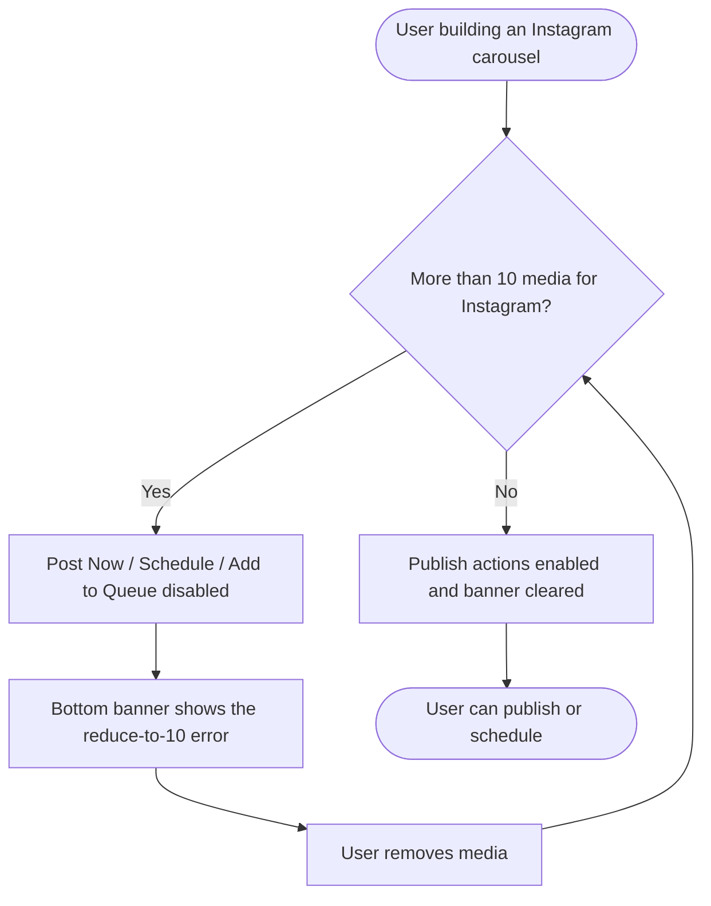

# Story — Block Instagram carousel publishing until media is reduced to 10

One frontend story for the web composer. Create with the **New Feature Template**. Nothing is pushed to Shortcut.

---

## [FE] Block Instagram carousel publishing until media is reduced to 10

### Description
As a user creating an Instagram carousel, I want ContentStudio to stop me from publishing when I've added more than 10 media — and clearly tell me to reduce it to 10 — instead of letting me post and silently dropping the extras. Today the post goes out missing the media beyond the 10th with no warning, so I only find out after it's published.

Instagram's publishing API allows a maximum of **10 media** per carousel. This story makes ContentStudio enforce that in the composer: the **Post Now / Schedule / Add to Queue** actions stay disabled, with a clear error, until the Instagram post is within 10 media.

### Workflow

1. The user selects an Instagram account and adds media to the post.
2. If the Instagram post has **more than 10 media**, the **Post Now / Schedule / Add to Queue** button is **disabled** and an error banner appears at the bottom of the composer telling the user to reduce the media to 10.
3. Hovering the disabled button shows a short tooltip explaining why it's disabled.
4. The user removes media until the Instagram post has 10 or fewer.
5. The error banner clears and the publish/schedule actions become available again — and the post publishes with exactly the media the user sees (nothing is silently dropped).

### Acceptance criteria
- [ ] When an Instagram account is selected and the Instagram post has **more than 10 media**, the **Post Now**, **Schedule**, and **Add to Queue** actions are **disabled**.
- [ ] While over the limit, the bottom error banner shows the reduce-to-10 message (copy below), and it is treated as a **blocking error** (not an advisory warning).
- [ ] Hovering the disabled publish/schedule button shows the tooltip (copy below).
- [ ] When the user reduces the Instagram post to **10 or fewer** media, the error clears and the publish/schedule actions re-enable **without needing a page refresh**.
- [ ] ContentStudio no longer silently drops media beyond the 10th for Instagram — a post can only be published/scheduled when it is within the limit, so what publishes matches what the user sees.
- [ ] If multiple platforms are selected and only the Instagram post exceeds 10 media, publishing is still blocked, and the error banner identifies **Instagram** as the reason.
- [ ] The enforced number reflects Instagram's configured maximum (currently **10**); the copy shows that number.
- [ ] Saving the post as a **draft** remains available while over the limit (the block applies to publishing/scheduling, not to parking a draft).

### UI copy
- **Bottom error banner:** "Instagram allows up to 10 media per post. Please reduce the number of media to 10."
- **Disabled button tooltip:** "Reduce this Instagram post to 10 media items to publish or schedule it."

### Mock-ups
N/A — no mockups; behavior and copy are in the acceptance criteria.

### Impact on existing data
None — client-side validation/gating change in the composer. No schema or API changes.

### Impact on other products
- **Mobile apps:** not covered by this story (web composer only). If the mobile composers have the same silent-drop behavior, that's a separate ticket.
- **Chrome extension:** not affected.
- **White-label:** no impact — reuses the existing composer validation banner and button styling (design-system components/tokens).

### Dependencies
None.

### Global quality & compliance (wherever applicable)
- [ ] Mobile responsiveness (frontend only, N/A for backend-only stories)
- [ ] Multilingual support (frontend + backend, translations available or fallback handled)
- [ ] UI theming support (default + white-label, design library components are being used)
- [ ] White-label domains impact review
- [ ] Cross-product impact assessment (web, mobile apps, Chrome extension)

### Implementation references
*Pointers from research — not a contract. Engineering may choose a different approach.*

- **The core change** is in `src/modules/composer/views/social-modal/useComposerValidationSurface.ts`: today an over-limit Instagram post pushes a non-blocking `max_images_warning` (~lines 751–800, from `channelConfig.warnings.image.max_images`). Move the Instagram over-limit into the **blocking** `socialPostErrors` computed (~line 965) instead. The button-disable flag already derives from it — `disableScheduleButton` (~944–953) is driven by `socialPostErrors.value.length > 0`, and the footer CTAs read `disableScheduleButton` / `forceDisableButton` (`useComposerDraftState.ts`). So flipping warning → error yields both the disabled CTA and the banner message with no new plumbing.
- Media-count limits live in `src/modules/composer/features/validation/mediaLimits.ts` — source the Instagram max from there / the channel config rather than hardcoding `10`.
- The current silent cap is at `useComposerSharing.ts:342` and `components/main-composer/useMediaEditing.ts:220` (`images.slice(0, 10)`). With the gate in place this becomes a redundant safety net — engineering can keep or remove it.
- New/updated copy (banner + disabled-button tooltip) goes to **all 8 locale dirs** under the `composer` i18n namespace.
- No Usermaven event — this is a UI gating/validation change (per story guidelines §19).

---

## Shortcut fields

### [FE] Block Instagram carousel publishing until media is reduced to 10
- **Template:** New Feature Template
- **Story type:** feature
- **Project:** Web App
- **Group:** Frontend
- **Epic:** Q2 - 2026: Miscellaneous (id `115078`) — *PO: confirm the current-quarter Miscellaneous epic; config lists Q2-2026.*
- **Priority:** Medium
- **Product Area:** Composer
- **Skill Set:** Frontend
- **Estimate:** _(empty — set during sprint planning)_
- **Labels:** _(none)_
- **Iteration:** _(PO assigns current/target sprint)_
