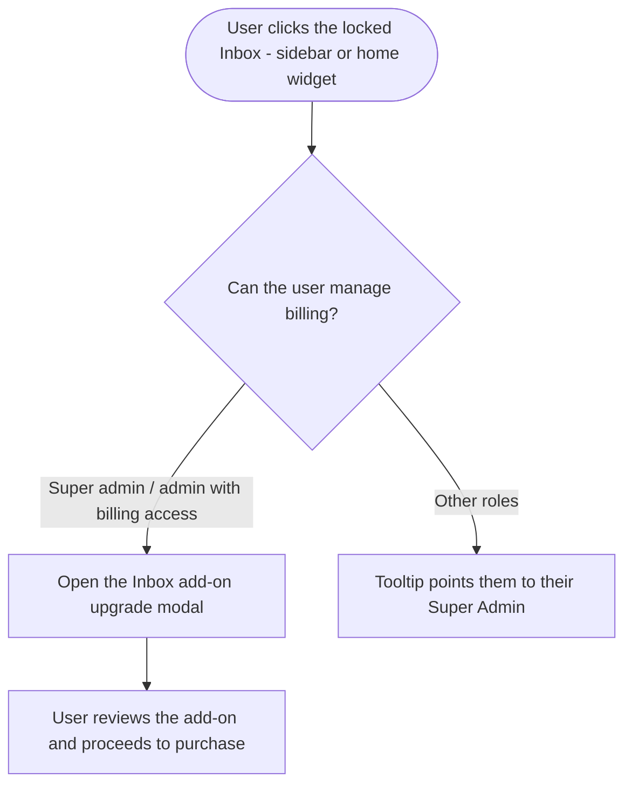

# Lifetime Add-ons: Billing Migration + Inbox Upgrade Modal · Stories

**Platform:** Web only. **Scope:** 1 × `[BE]` + 1 × `[FE]`. No mobile.

| # | Story | Priority |
|---|---|---|
| S-1 | [BE] Migrate lifetime users' add-ons from legacy Paddle to the new Paddle Billing version | High |
| S-2 | [FE] Replace the lifetime "contact support" inbox lock with the add-on upgrade modal and role-based tooltips | High |

> Requested by: dev team lead (S-1) and CEO (S-2). S-2 depends on S-1 so lifetime users can actually purchase the add-on through the new billing flow.

---

## S-1 · [BE] Migrate lifetime users' add-ons from legacy Paddle to the new Paddle Billing version
**Project:** Web App · **Group:** Backend · **Skill:** Backend · **Product area:** Billing · **Priority:** High · **Type:** Chore

### Description
As a lifetime-plan customer, I want my add-ons (e.g., Inbox) to run on ContentStudio's current billing system so that I can buy and manage add-ons through the same modern checkout everyone else uses — instead of being stuck on the legacy Paddle integration that no longer supports self-serve add-on purchase.

Today, add-ons for lifetime users sit on the **old (legacy/classic) Paddle billing version**. They need to move to the **new Paddle Billing version** so add-on purchase/management works for them like it does for other plans. This unblocks showing the add-on purchase modal to lifetime users (see **[FE] Replace the lifetime "contact support" inbox lock with the add-on upgrade modal and role-based tooltips**).

### Acceptance criteria
- [ ] Lifetime users' add-ons are served/processed through the new Paddle Billing version rather than the legacy Paddle integration.
- [ ] A lifetime user can purchase an add-on (starting with the Inbox add-on) through the new billing checkout, and the add-on is provisioned on success.
- [ ] Existing lifetime customers who already hold an add-on retain access after migration (no loss of entitlements).
- [ ] Add-on entitlement/feature flags used by the app (e.g., the inbox access check) resolve correctly for lifetime users after the move.
- [ ] Add-on cancellation/refund handling for lifetime users works through the new billing version (no orphaned legacy subscriptions).
- [ ] Migration is safe to run against existing lifetime accounts (idempotent; no duplicate charges or double-provisioning).

### Mock-ups
N/A — backend billing change.

### Impact on existing data
Existing lifetime add-on subscription records move from the legacy Paddle representation to the new Paddle Billing representation. Requires a careful migration/backfill of existing lifetime add-on holders; preserve entitlements and avoid duplicate subscriptions.

### Impact on other products
- Unblocks the inbox add-on purchase modal on web for lifetime users (FE story).
- No mobile or Chrome extension impact. Pricing for the inbox add-on is still to be finalized (provided separately by the team).

### Dependencies
- Blocks **[FE] Replace the lifetime "contact support" inbox lock with the add-on upgrade modal and role-based tooltips** (the FE "click to buy" only completes a purchase once lifetime add-ons are on new billing).

### Global quality & compliance (wherever applicable)
- [ ] Mobile responsiveness — N/A, backend-only story
- [ ] Multilingual support (frontend + backend, translations available or fallback handled)
- [ ] UI theming support — N/A, backend-only story
- [ ] White-label domains impact review
- [ ] Cross-product impact assessment (web, mobile apps, Chrome extension)

### Implementation references
*Pointers from research — not a contract. Engineering may choose a different approach.*

**Primary entry points (contentstudio-backend):**
- `app/Repository/Account/AddonsLifetimeRepository.php` — lifetime add-on records (the legacy side being migrated).
- `app/Repository/Billing/Paddle/PaddleAddonsSubscriptionRepository.php`, `app/Repository/Billing/Paddle/PaddleAddonsRepository.php` — add-on subscription handling.
- `app/Repository/Billing/Subscriptions/AddonSubscriptionRepo.php` — add-on subscription abstraction.
- `app/Services/PaddleBillingService.php`, `app/Repository/Billing/Paddle/PaddleBillingSubscriptionRepo.php` — the new Paddle Billing integration to migrate onto.
- `app/Libraries/Account/Addons.php` — add-on entitlement library used by feature checks.

**Note:** Confirm with the dev team lead which add-ons are in scope (Inbox first, but verify others held by lifetime users) and the exact legacy→new mapping per add-on.

---

## S-2 · [FE] Replace the lifetime "contact support" inbox lock with the add-on upgrade modal and role-based tooltips
**Project:** Web App · **Group:** Frontend · **Skill:** Frontend · **Product area:** Inbox · **Priority:** High · **Type:** Feature

### Description
As a lifetime-plan user who doesn't have the Inbox add-on, I want to unlock Inbox myself by seeing a clear add-on purchase modal — the same way Social Listening and White Label are offered — instead of being told to email support. And as a workspace member who can't manage billing, I want a tooltip that points me to the right person, so I'm not stuck.

Today, lifetime users see a locked Inbox with a "contact support" tooltip and a dead click (both in the left sidebar and the home dashboard Inbox widget). This replaces that with the standard add-on unlock experience: the lock stays, but the tooltip becomes role-aware and clicking opens the Inbox add-on modal.

### Workflow

1. A lifetime user without the Inbox add-on sees Inbox **locked** (lock icon stays) in the left sidebar and in the home dashboard Inbox widget.
2. **If the user can manage billing** (super admin, or admin with billing access): hovering shows a "click to buy" tooltip, and clicking opens the **Inbox add-on upgrade modal** (same pattern as the Social Listening / White Label unlock modal).
3. **If the user can't manage billing:** hovering shows a tooltip telling them to contact their Super Admin; there is no purchase action for them.
4. From the modal, a billing-capable user can proceed to purchase the Inbox add-on (pricing shown once finalized).

### Acceptance criteria
- [ ] The Inbox lock icon **remains** in both the left sidebar nav item and the home dashboard Inbox widget for users without the add-on.
- [ ] The old "contact support" copy is removed for lifetime users (no more "email support{'@'}contentstudio.io to purchase the Inbox add-on").
- [ ] For a **super admin, or an admin with billing access**, clicking the locked Inbox (sidebar **or** home widget) opens the **Inbox add-on upgrade modal** (modeled on the Social Listening unlock modal).
- [ ] For a **super admin / admin with billing access**, the lock tooltip reads: **"The Inbox add-on is locked for your account. Click to buy."**
- [ ] For **users without billing access**, the lock tooltip reads: **"Contact your Super Admin to unlock the Inbox add-on."** and clicking does not open the purchase modal.
- [ ] This behavior applies to **both lifetime users and other locked (non-lifetime) inbox states** consistently — locked Inbox always offers the add-on modal to billing-capable users instead of a generic/contact-support dead end.
- [ ] The Inbox add-on upgrade modal shows the Inbox add-on value proposition and a purchase CTA; pricing is shown when finalized (placeholder until then) — visual/structure mirrors the existing Social Listening unlock modal.
- [ ] No other modules change. (Confirmed in research: only Inbox uses the lifetime "contact support" lock; Analytics/Discover use different gating and are out of scope.)
- [ ] When a billing-capable user opens the Inbox add-on modal, an `inbox_upgrade_modal_opened` Usermaven event fires with `{ entry_point: 'sidebar' | 'home_widget', gate_state: 'lifetime_locked' | 'locked' }`.
- [ ] When the user completes an Inbox add-on purchase from the modal, the existing `addon_purchased` Usermaven event fires with `{ addon: 'social_inbox' }`.
- [ ] All new/changed copy is added to the relevant namespaces across every locale directory under `src/locales/`, English first; the obsolete contact-support keys are removed.

### Mock-ups
N/A — reuse the existing Social Listening / White Label unlock-modal pattern. (Pricing values pending from the team.)

### Impact on existing data
None on the frontend. The actual purchase relies on lifetime add-ons being available on the new billing version (see the BE story).

### Impact on other products
- Web only. The locked-Inbox tooltip/click also appears wherever the inbox nav/widget renders; no mobile or Chrome extension change.
- White-label safe — tooltips and modal use theme tokens.

### Dependencies
- **[BE] Migrate lifetime users' add-ons from legacy Paddle to the new Paddle Billing version** — required for a lifetime user's "click to buy" to actually complete a purchase.

### Global quality & compliance (wherever applicable)
- [ ] Mobile responsiveness (frontend only, N/A for backend-only stories)
- [ ] Multilingual support (frontend + backend, translations available or fallback handled)
- [ ] UI theming support (default + white-label, design library components are being used)
- [ ] White-label domains impact review
- [ ] Cross-product impact assessment (web, mobile apps, Chrome extension)

### Implementation references
*Pointers from research — not a contract. Engineering may choose a different approach.*

**Primary entry points:**
- `contentstudio-frontend/src/components/layout/useHeaderNavigation.ts` — the inbox nav item sets `disabledAction: is_lifetime ? 'none' : 'upgrade'` and `inboxDisabledTooltip` returns `header.tooltips.inbox_lifetime_locked` for lifetime. Change lifetime to open the add-on modal and make the tooltip role-based.
- `contentstudio-frontend/src/components/layout/TopHeaderBar.vue` — `handlePrimaryNavSelect` only opens a modal when `disabledAction === 'upgrade'`; route locked-Inbox clicks to the Inbox add-on modal for billing-capable users.
- `contentstudio-frontend/src/components/dashboard/InboxCard.vue` — home widget: `onClickInboxLock` short-circuits for `is_lifetime` and the tooltip uses `dashboard.inbox_card.addon_contact_support`. Apply the same modal + role-tooltip change here.

**Patterns to mirror:**
- Social Listening unlock modal + role-based copy: `contentstudio-frontend/src/modules/listening/components/ListeningUpgradeModal.vue` and `useListeningAccess.ts` (`listeningLockedTooltip`: `landing.locked.heading` = "…Click to buy." vs `landing.locked.contact_super_admin` = "Contact your Super Admin…"). The Inbox modal/tooltips should follow this structure (consider an `useInboxAccess`-style tooltip helper).
- Role detection: `hasPermission('can_see_subscription')` (used by listening) distinguishes billing-capable users from those who should be told to contact their super admin.

**Usermaven:**
- `const { trackUserMaven } = useUserMaven()`. Reuse `addon_purchased` for the purchase; `inbox_upgrade_modal_opened` is new (mirrors the existing `listening_upgrade_modal_opened`).

**Cleanup:**
- Remove obsolete keys `header.tooltips.inbox_lifetime_locked` and `dashboard.inbox_card.addon_contact_support` (and their translations) once the new tooltips are in.
