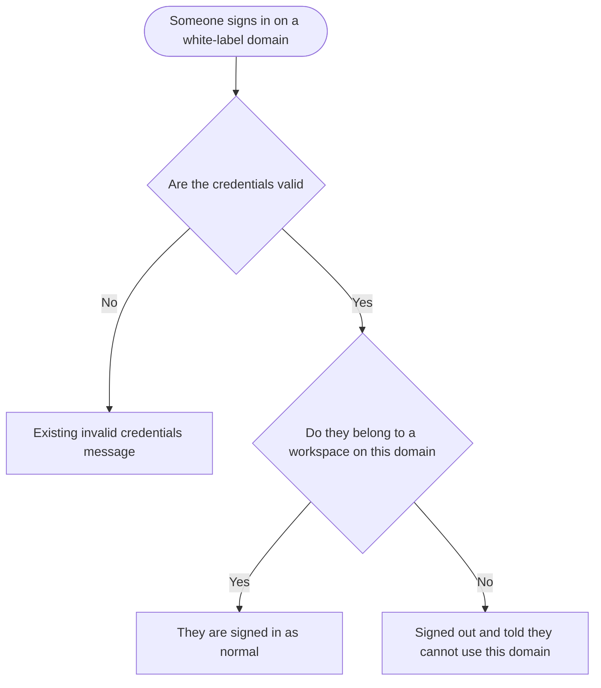
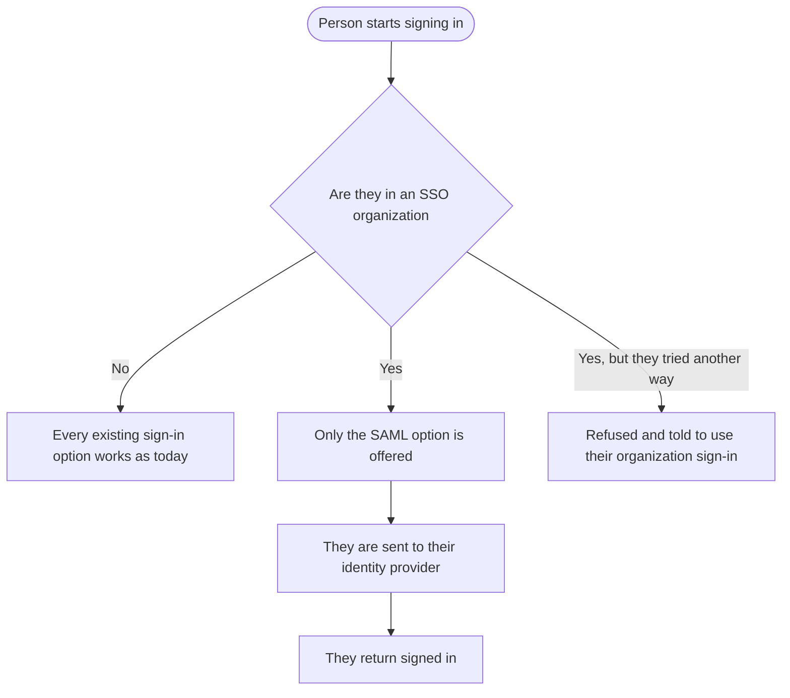

# Stories: Login access restrictions

**Date:** 2026-09-16
**Stories:** 2

Two independent restrictions on who may sign in and how. They can ship in either order.

---

## Story 1

### Title

**[Full Stack] Only allow a user to sign in on a white-label domain if they belong to a workspace on that domain**

### Description

As an agency running ContentStudio on our own domain, we want only our own people to be able to sign in there, so that our clients and staff see a login page that belongs to us rather than a door into our brand that any ContentStudio account in the world can open.

Today a white-label domain accepts any valid ContentStudio account. Someone who has never had anything to do with that agency can sign in on the agency's branded domain and land inside the product wearing that agency's branding. Nothing of the agency's is exposed, because the person still only sees their own workspaces, but the impression is wrong and the agency has no control over who reaches their front door.

The check is simple to state: a person may sign in on a white-label domain only if they are a member of at least one workspace that belongs to that domain. Anyone else is turned away with a clear message.

---

### Workflow

1. Someone opens an agency's white-label domain and signs in, by any of the available methods.
2. Their credentials are checked as they are today.
3. If the credentials are wrong, they see the existing message. Nothing changes there.
4. If the credentials are right, the product then checks whether that person belongs to any workspace on this domain.
5. If they do, they are signed in and everything continues as it does now.
6. If they do not, they are not signed in. They stay on the login page and are told they cannot use this domain, with a way to reach the main ContentStudio login instead.
7. The main ContentStudio domain is unaffected, and anyone can still sign in there as they do today.

---

### Acceptance criteria

**The check**

- [ ] On a white-label domain, a person is only signed in if they are a member of at least one workspace belonging to that domain
- [ ] Someone who belongs to a workspace on the domain signs in exactly as they do today, with no extra step
- [ ] Someone who does not belong to any workspace on the domain is not signed in, and no session is created for them
- [ ] The check applies to **every** way of signing in, not only email and password. That includes the social options and the magic link
- [ ] The check happens after the credentials are confirmed, so someone with the wrong password still sees the existing wrong-credentials message rather than the domain message
- [ ] The main ContentStudio domain is unaffected and continues to accept any valid account

**Who counts as belonging**

- [ ] A person who owns a workspace on the domain can sign in
- [ ] A person who is a member of a workspace on the domain, in any role, can sign in
- [ ] A person who has been invited to a workspace on the domain but has not yet accepted **cannot** sign in, since they are not a member yet. Their invitation link continues to work and completes as it does today
- [ ] A person who was removed from the last workspace they had on the domain can no longer sign in there
- [ ] A person who belongs to workspaces on a different white-label domain, but none on this one, cannot sign in here

**The message**

- [ ] The message does not reveal whether the account exists, so it reads the same for an account that exists but does not belong here as it would for one that does not exist at all. This is deliberate and stops the login page being used to find out who does business with the agency
- [ ] The message offers a way to continue at the main ContentStudio login
- [ ] The message is styled as the domain's own branding, like the rest of the white-label login page

**Sessions already open**

- [ ] Someone who is already signed in and then loses their last workspace on the domain is signed out the next time their session is checked, rather than continuing to browse
- [ ] Being signed out this way sends them to the login page with the same message

**Elsewhere in the flow**

- [ ] Password reset requested on a white-label domain by someone who does not belong there behaves the same way, and does not confirm whether the account exists
- [ ] Signing up fresh on a white-label domain is unchanged, since a new account joins a workspace as part of that flow
- [ ] Nothing changes for an agency's own staff or clients, who all belong to a workspace on the domain

---

### UI copy

**Turned away at sign-in**

> **Heading:** You cannot sign in here
> **Body:** This login page belongs to a different organization, and this account is not part of it. If you have a ContentStudio account, sign in at contentstudio.io instead.
> **Action:** Go to ContentStudio sign in

**Signed out because access was lost**

> **Heading:** You no longer have access here
> **Body:** Your access to this organization has ended, so you have been signed out. If you think this is a mistake, contact whoever invited you.

**Password reset on a domain the account does not belong to**

> Unchanged from the existing reset-request confirmation, which should not say whether an account was found.

**Loading and error states**

> No new loading state. If the check itself cannot be completed, the person is not signed in and sees the existing generic sign-in error, so a failure never lets someone through by accident.

---

### Mock-ups

N/A. This adds a message to the existing white-label login page, using its existing error treatment.

---

### Impact on existing data

None. No new information is stored. This reads existing workspace membership at the moment of sign-in.

Worth knowing before release: **anyone currently signing in on a white-label domain who does not belong to a workspace there will stop being able to.** That is the point of the change, but it is a behaviour change for real people, so agencies should be told before it ships rather than after.

---

### Impact on other products

- **Mobile app:** the app should apply the same rule if it can be used against a white-label domain. Worth confirming whether it can before this ships, since an app that ignores the rule leaves the door open.
- **Chrome extension:** same question, same reason.
- **Public API:** worth confirming whether API access is scoped by domain in the same way, or whether the restriction is only about the login page.
- **Main ContentStudio domain:** no impact.

---

### Dependencies

None.

---

### Global quality & compliance (wherever applicable)

- [ ] Mobile responsiveness (frontend only, N/A for backend-only stories)
- [ ] Multilingual support (frontend + backend, translations available or fallback handled)
- [ ] UI theming support (default + white-label, design library components are being used)
- [ ] White-label domains impact review
- [ ] Cross-product impact assessment (web, mobile apps, Chrome extension)

---

## Story 2

### Title

**[Full Stack] Force users in an SSO organization to sign in through SAML only**

### Description

As an organization that has set up SAML single sign-on, we want our people to be able to sign in **only** through our identity provider, so that the controls we rely on there actually apply. Those controls are the whole reason we bought SSO.

Today someone in an SSO organization can still sign in with a password, or with Google, Facebook, X or Apple, or with a magic link. Every one of those bypasses the identity provider completely. When the organization removes someone from their directory, that person keeps their ContentStudio access through any of those other routes, which is exactly the scenario SSO exists to prevent.

Anyone who belongs to an SSO organization should be able to sign in one way only: through their organization's SAML login.

---

### Workflow

1. Someone opens the ContentStudio login page and enters their email address.
2. If they are not part of an SSO organization, nothing changes. Every existing option works as it does today.
3. If they are part of an SSO organization, the other options are no longer offered to them, and they are pointed at their organization's sign-in instead.
4. They continue to their identity provider, sign in there, and come back signed in.
5. If they try to reach ContentStudio another way, for example by using a social button, an old password, or a magic link from an old email, they are refused and told to use their organization sign-in.
6. Password reset is not available to them, because their password is not what signs them in.

---

### Acceptance criteria

**The restriction**

- [ ] Someone who belongs to an SSO organization can only sign in through SAML
- [ ] **Every other route is refused for them**, specifically: email and password, Google, Facebook, X, Apple, and the magic link
- [ ] The refusal happens regardless of whether the other method would otherwise have worked, so an existing password or a linked social account does not get them in
- [ ] A magic link generated before the organization moved to SSO no longer signs them in
- [ ] Someone who does not belong to an SSO organization is completely unaffected, and every existing sign-in method works as it does today

**What they see**

- [ ] Once the product knows the person is in an SSO organization, the options that no longer apply are not presented to them, so they are not invited to try something that will be refused
- [ ] If they do reach a refusal, the message says plainly that their organization requires its own sign-in, and offers the way to continue
- [ ] The message does not reveal whether the account exists to someone who is guessing at email addresses

**Password and recovery**

- [ ] Password reset is not offered to someone in an SSO organization, and requesting it does not send them a reset email
- [ ] If they somehow reach a reset link generated earlier, it does not let them set a password and sign in

**Changes of state**

- [ ] When an organization turns SSO on, its existing members are moved onto the restriction, and any sessions they have open are ended so the next sign-in goes through the identity provider
- [ ] When someone joins an SSO organization, the restriction applies to them from that point
- [ ] When someone leaves an SSO organization and belongs to no other, their ordinary sign-in options are available again
- [ ] Someone who belongs to both an SSO organization and a non-SSO one **still has to use SSO**, because the stricter rule is the one that protects the organization that asked for it

**Not being locked out**

- [ ] There is a way for an organization that has misconfigured its SSO to recover without every member being permanently locked out. **How that works needs deciding before build**, and it is called out below as an open question rather than assumed
- [ ] A failure to reach the identity provider shows a clear message and does not silently fall back to another sign-in method

---

### UI copy

**Pointed at the organization sign-in**

> **Heading:** Your organization uses single sign-on
> **Body:** Sign in through your organization to continue. The other sign-in options are not available for your account.
> **Action:** Continue to your organization sign-in

**Refused after trying another way**

> **Heading:** Use your organization sign-in
> **Body:** Your organization requires single sign-on, so this way of signing in is not available for your account.
> **Action:** Continue to your organization sign-in

**Password reset requested**

> **Body:** Your organization uses single sign-on, so there is no password to reset. Sign in through your organization instead.
> **Action:** Continue to your organization sign-in

**Identity provider could not be reached**

> **Heading:** We could not reach your organization sign-in
> **Body:** Something went wrong on the way to your organization's login. Try again in a moment, and contact your administrator if it keeps happening.
> **Action:** Try again

**Loading state**

> While the person is being sent to their identity provider, the existing sign-in loading treatment applies.

---

### Mock-ups

N/A. This changes which options appear on the existing login page and adds messages using its existing treatment.

---

### Impact on existing data

None stored beyond what already records which organizations use SSO and who belongs to them.

Two things worth knowing before release, both behaviour changes for real people:

- **Anyone in an SSO organization who currently signs in with a password or a social account will stop being able to.** Those organizations should be told before it ships.
- **Open sessions end when the restriction starts applying**, so people will be asked to sign in again. That is intended, because a session created outside SSO is exactly what this closes.

---

### Impact on other products

- **Mobile app:** if the app allows any sign-in method, the same restriction has to apply there, or it becomes the way around this. Worth confirming what the app supports before this ships.
- **Chrome extension:** same question, same reason.
- **Public API:** API keys are a separate route in. Worth confirming whether an SSO organization expects those to be restricted too, since from their point of view it is another way in that their identity provider does not control.
- Related: **[BE] Store last login method on successful authentication** records how someone signed in. Once this ships, an SSO organization's members will only ever have one, which is worth knowing if anything reports on it.

---

### Dependencies

None.

---

### Open before build

1. **Recovery from a broken SSO setup.** If an organization's identity provider is misconfigured or goes down, every member is locked out. There has to be an answer, whether that is a support-side override, a grace period, or an exempted administrator. This needs deciding rather than discovering.
2. **Whether API access is in scope**, or whether this restriction is only about signing in to the product.

---

### Global quality & compliance (wherever applicable)

- [ ] Mobile responsiveness (frontend only, N/A for backend-only stories)
- [ ] Multilingual support (frontend + backend, translations available or fallback handled)
- [ ] UI theming support (default + white-label, design library components are being used)
- [ ] White-label domains impact review
- [ ] Cross-product impact assessment (web, mobile apps, Chrome extension)
