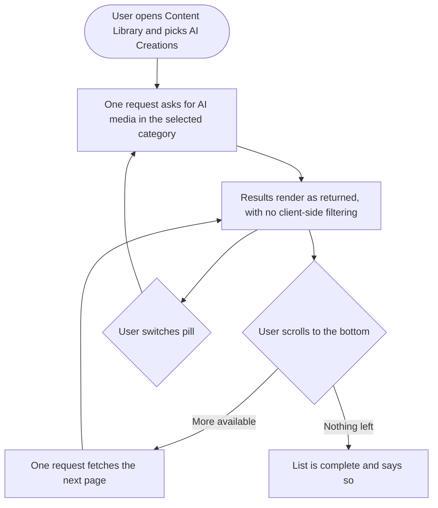
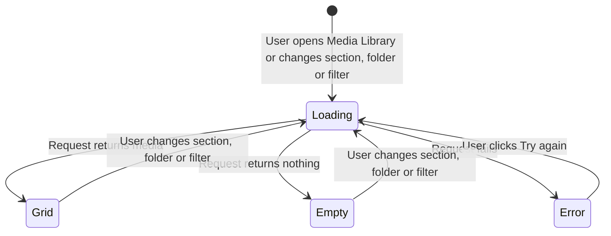

# Epic: AI Creations in the Content Library, and Media Library request state

## Problem

The media library API cannot filter by AI-generated. The frontend sends `is_ai_generated` on every request for AI Creations, All uploads and My AI creations, and the backend silently drops it: the controller never maps it into the filter set, and the repository's list query applies only folder, search, mime type, sort, usage and archived.

So opening AI Creations asks the server for the workspace's entire media library, filters it in the browser, finds too few in-scope items on that page, and requests the next page. And the next. That loop is capped at five extra pages with an empty-streak guard, both of which are scar tissue from earlier bugs the code comments still describe: one where the loop "fetched empty pages forever", another where "pagination ran past the end" because `total` counts unfiltered rows while the visible list is filtered.

It is not only AI Creations. All uploads sends `is_ai_generated: false` and is ignored identically, so the default view pays the same cost. My AI creations stacks a second client-side narrowing on top, filtering ownership in the browser.

Separately, the sidebar count is wrong. AI Creations has three pills (AI Studio, Video Clips, AI Posts) served by two different systems: the first two come from the media collection, AI Posts comes from a different collection entirely and the media fetch explicitly bails out for it. The count is a single `is_ai_generated` tally over media rows, so it silently excludes AI Posts. The pills also overlap, since AI Studio currently returns all AI media including clips.

And underneath all of it, the empty state renders before the first request is even in flight, because the loading flag starts false and every fetch is triggered by a watcher that fires after the first paint.

## Goal

Make the server answer the question the UI is actually asking. AI Creations should be a request that returns AI creations, with counts that match what the section contains and pagination that describes the filtered set. Then delete the client-side filtering and the refetch loop it exists to compensate for, and fix the request lifecycle so the loader leads.

## Scope

Five stories: two backend, two frontend, one design. Web only.

## Sequencing

The backend filter story comes first; the frontend consumption story is meaningless without it. The count story is separate because it spans two collections and can land independently. The request-state fix depends on nothing and can ship at any point, though doing it after the frontend rework avoids touching the same file twice. Design should start immediately.

## Decisions needed before implementation

- **What the AI Creations count means.** A single total across all three pills, or a count per pill. A total spans two collections, which means an extra query on a sidebar that renders on every page load.
- **Whether AI Studio should exclude clips.** It currently includes them, so the pills overlap and one asset appears under two. Making them partition needs a positive definition of "generated by AI Studio", which needs a field recording which surface produced an asset. Confirm whether that exists on the media record today.
- **Backfill.** If an origin field has to be added, existing AI media needs classifying, or a documented default bucket.

These three are related and should be answered together, before the backend story starts.

## Out of scope

- Tracking the progress of in-flight AI generations. That was the original framing of this epic and it was wrong. If per-generation status is wanted later, it is separate work.
- Changing what AI Studio, Video Clips or AI Posts generate.
- Rewriting the folder tree or the upload flow.
- Mobile. The Media Library is web only.

## Stories

1. `[BE] Filter media by AI origin on the library API instead of returning everything`
2. `[BE] Make the AI Creations count reflect all three categories`
3. `[FE] Consume the AI-filtered media API and remove the page-refetch loop`
4. `[FE] Fix Media Library request and loading state so the loader leads the empty state`
5. `[Design] AI Creations pills, counts and empty states`

---
---

# 1. [BE] Filter media by AI origin on the library API instead of returning everything

### Description

The media library list endpoint has no way to return only AI-generated media. The web app asks for it on every AI Creations request and the parameter is discarded, so the endpoint returns the workspace's whole library and the browser is left to sort it out. This story makes the filter real, so a request for AI creations returns AI creations, with counts and pagination that describe what was actually returned.

### Workflow

*(Backend story. The "user" is the web client calling the endpoint.)*

1. The client requests media for a workspace and asks for AI-generated media only.
2. The endpoint returns only AI-generated media.
3. The client asks instead for media that is not AI-generated. The endpoint returns only that.
4. The client asks for a specific AI category. The endpoint returns only that category.
5. In every case the pagination totals describe the filtered result, so the client can page to the end and know when it got there.
6. The client asks for AI media created by a specific user. The endpoint filters by owner server-side.

### Acceptance criteria

- [ ] The media list endpoint accepts an AI-origin filter and honours it. Asking for AI-generated media returns only AI-generated media.
- [ ] Asking for non-AI media returns only non-AI media, so the All uploads view is served correctly by the same mechanism.
- [ ] Omitting the filter returns everything, unchanged from today, so existing callers are unaffected.
- [ ] The endpoint can return a single AI category, so AI Studio and Video Clips are separately requestable rather than both being derived from one unfiltered response.
- [ ] The category values the endpoint accepts match the categories the product exposes, and are documented.
- [ ] Pagination metadata describes the filtered set: the total reflects rows matching the filter, and paging to the last page reports completion accurately without the client inferring it from a short page.
- [ ] Filtering by owner is supported server-side for AI media, so the My AI creations view does not filter ownership in the browser.
- [ ] The AI filter composes correctly with the existing filters: folder, search, media type, sort, usage and archived. Combining them narrows rather than conflicts.
- [ ] Sort order is applied across the filtered set, not within a page, so the first page of a sorted AI request is genuinely the first page.
- [ ] Requesting media for a workspace the caller cannot access returns a permission error, unchanged from today.
- [ ] A workspace with no AI media returns an empty result with a success status and a total of zero, distinguishable from an error.
- [ ] Response time for an AI-filtered first page is no worse than an unfiltered first page on a workspace with a large library.
- [ ] The query is indexed appropriately for the new filter, so filtering does not degrade as libraries grow.

### Mock-ups

N/A. API change.

### Impact on existing data

No change to stored media. If the category distinction requires a field recording which surface generated an asset, existing AI media needs classifying per the backfill decision recorded in the epic. Assets that cannot be attributed land in the documented default bucket rather than disappearing from the section.

### Impact on other products

- Web app: consumed by the frontend stories in this epic.
- Public API: unaffected unless the team chooses to expose the same filter there, which is not in this epic.
- Mobile apps and Chrome extension: unaffected, the Media Library is web only.

### Dependencies

- The three decisions in the epic (what the count means, whether AI Studio excludes clips, backfill) must be answered first, since they determine whether a new field is needed.

### Global quality and compliance checklist

- [ ] Mobile responsiveness tested (frontend only, N/A for backend-only stories) — N/A, backend only
- [ ] Multilingual support verified (frontend + backend, translations available or fallback handled)
- [ ] UI theming supported (default + white-label, design library components are being used) — N/A, no UI
- [ ] White-label domains impact reviewed
- [ ] Cross-product impact assessed (web, mobile apps, Chrome extension)

### Implementation references

*Pointers from research — not a contract. Engineering may choose a different approach.*

- The two places to change are `contentstudio-backend/app/Http/Controllers/Storage/MediaLibrary/MediaLibraryAssetsController.php::fetchMediaAssets()` (line 653), which currently only adds `workspace_ids` and `user_id` to `$filters`, and `contentstudio-backend/app/Repository/Utilities/MediaRepository.php::findMediaAssets()` (line 731), which applies `brand_asset`, `fetch_archived`, `folder_id`, `search`, `type`, `sort`, `usage_filter`, `page` and `limit` and nothing else.
- The client already sends `is_ai_generated` as a boolean, so honouring that key keeps the existing frontend payload working during the transition. The category filter is the genuinely new parameter.
- The `Media` model already carries `is_ai_generated`; it is set on upload in the controller (lines 170, 459) and in `MediaRepository` (lines 588, 1161). What does not exist is any read path using it as a filter. Whether the record also distinguishes *which* AI surface produced the asset is the open question that decides how much work the category filter is.
- The `clips` case is the one that already half-works: the client sends `type: 'video'`, which the repository does honour via `mime_type LIKE '%video%'`. Worth checking whether the category filter should supersede that or compose with it.
- `MediaRepository` line 701's `(clone $query)->where('is_ai_generated', true)->count()` is the existing precedent for querying the flag, and is the count the sibling story fixes.

---
---

# 2. [BE] Make the AI Creations count reflect all three categories

### Description

The number beside AI Creations in the Content Library sidebar counts AI-flagged rows in the media collection. AI Posts are not in that collection, so they are not in that number. The label promises the section's contents and delivers a subset, and because the All uploads count is derived by subtracting this number from the total, a wrong AI count makes that one wrong too.

### Workflow

*(Backend story. The user-visible result is specified in the frontend and design stories.)*

1. The client requests the Content Library section counts for a workspace.
2. The AI Creations figure reflects everything the section contains, across all three of its categories.
3. The All uploads figure reflects non-AI uploads, and is not distorted by the AI figure.
4. A workspace with AI Posts but no AI media reports a non-zero AI Creations count.

### Acceptance criteria

- [ ] The AI Creations count includes all three categories the section exposes, including AI Posts, which live outside the media collection.
- [ ] A workspace whose only AI content is AI Posts reports a non-zero AI Creations count.
- [ ] Per-pill counts are available if the design calls for them, so the UI does not have to derive a breakdown from a single total.
- [ ] The All uploads count reflects non-AI uploads directly, rather than being derived by subtracting the AI count from a grand total.
- [ ] Counts are consistent with what the list endpoint returns for the same section and filters: the number beside a section matches the number of items a user can actually page through in it.
- [ ] Counts respect the same scoping rules as the list: workspace, archived and brand-asset exclusions behave identically, so a count never includes something the list would hide.
- [ ] Counts exclude archived and brand assets consistently with today's behaviour.
- [ ] The counts endpoint answers within a budget acceptable for a sidebar that renders on every page load, and the cost of spanning two collections is measured rather than assumed.
- [ ] A failure to compute one category's count does not fail the whole response, and the UI can tell that a figure is unavailable rather than zero.

### Mock-ups

N/A. Backend. Presentation is covered by the design and frontend stories.

### Impact on existing data

None. Read-only counting.

### Impact on other products

- Web app: consumed by the Content Library sidebar.
- Mobile apps and Chrome extension: unaffected.

### Dependencies

- The epic's decision on what the count means (single total versus per-pill) determines this story's shape and must be answered first.
- Related to **[BE] Filter media by AI origin on the library API instead of returning everything**: if that story introduces a category field, the per-pill counts should use it rather than a parallel definition.

### Global quality and compliance checklist

- [ ] Mobile responsiveness tested (frontend only, N/A for backend-only stories) — N/A, backend only
- [ ] Multilingual support verified (frontend + backend, translations available or fallback handled)
- [ ] UI theming supported (default + white-label, design library components are being used) — N/A, no UI
- [ ] White-label domains impact reviewed
- [ ] Cross-product impact assessed (web, mobile apps, Chrome extension)

### Implementation references

*Pointers from research — not a contract. Engineering may choose a different approach.*

- The current count is `contentstudio-backend/app/Repository/Utilities/MediaRepository.php` line 701: `$aiCreations = (clone $query)->where('is_ai_generated', true)->count();`, returned in the stats array at lines 724 to 729 alongside `all`, `uncategorized` and `archived`.
- The missing source is the AI Posts collection, which the frontend reads through `useAiPostsInfiniteQuery` in `contentstudio-frontend/src/modules/publisher/ai-content-library/queries/`. That is the other side to count.
- The consumer to keep in mind is `contentstudio-frontend/src/modules/publish/components/media-library/components/SideBar.vue`, which reads `filesCount.aicreations` and derives `allUploadsCount` as `all_uploads ?? uploads`, falling back to `Math.max(allCount - aiCreationsCount, 0)`. That fallback is why an inaccurate AI count corrupts a second figure, and is worth removing once All uploads is counted directly.
- The stats endpoint is reached via `fetchMediaStatsUrl` in `contentstudio-frontend/src/api/media-library.ts`.

---
---

# 3. [FE] Consume the AI-filtered media API and remove the page-refetch loop

### Description

Opening AI Creations fires the same media request repeatedly, because the server returns the whole library and the browser filters it, then goes back for another page whenever a page did not yield enough in-scope items. Users see a slow, stuttering load; the app makes up to six requests where one should do; and the item count shown can never be trusted because it describes a different set than the one on screen.

This story moves that filtering to the server request and deletes the loop that existed to compensate for its absence.

### Workflow

1. User opens the Content Library and selects AI Creations. One request goes out and the results render.
2. User switches between AI Studio, Video Clips and AI Posts. Each switch issues one request for that category.
3. User scrolls to the bottom. One request fetches the next page, and it appends.
4. When there is nothing left, the list says so rather than continuing to request.
5. User switches to All uploads. Only non-AI uploads are shown, again in one request.
6. User opens My AI creations. Only their own AI media appears, filtered by the server.
7. The count beside the section matches what the user can actually page through.

### Acceptance criteria

- [ ] Opening AI Creations issues a single list request for the first page. No follow-up request is made unless the user scrolls or changes the selection.
- [ ] Switching pills issues one request for the newly selected category.
- [ ] Scrolling to the bottom issues exactly one request per page.
- [ ] No client-side filtering narrows the rendered list. What the server returns is what is shown.
- [ ] The recursive page-fill behaviour is removed entirely, along with its page cap and empty-streak guard.
- [ ] All uploads shows only non-AI uploads, served by the server filter, with no client-side exclusion.
- [ ] My AI creations shows only the current user's AI media, filtered server-side, with no client-side ownership check.
- [ ] The three pills no longer overlap: an asset shown under Video Clips does not also appear under AI Studio, per the partition decided in the epic.
- [ ] Pagination is driven by the server's metadata for the filtered set, and the end of the list is detected from that rather than inferred from a short page.
- [ ] Sorting, search, media type, uploaded-by and used-or-unused filters continue to work in every section, and compose with the AI filter.
- [ ] Switching workspace, section, folder or filters cancels or discards in-flight responses so a stale page cannot append into a fresh list.
- [ ] Rapidly switching pills leaves the most recently selected pill's results rendered, never an earlier one's.
- [ ] The number of network requests to open AI Creations on a large workspace is measurably lower than before, and the section reaches first paint faster.
- [ ] AI Posts continue to render through their existing path, and the section switch between media-backed pills and AI Posts is seamless to the user.
- [ ] Existing behaviour is preserved for folders, archived and uncategorized views.

### UI copy

No new user-facing strings expected. If the end-of-list state needs wording, use:

- End of list: `That's everything in this section.`

Any string introduced goes through translation and lands in every locale directory in the same change.

### Mock-ups

Provided by **[Design] AI Creations pills, counts and empty states**.

### Impact on existing data

None. Fetching and rendering only.

### Impact on other products

- Web app only.
- Reduces load on the media list endpoint substantially, since the repeated page requests stop.
- The media picker that opens the library from Composer shares this fetch layer and inherits the improvement.

### Dependencies

- Depends on **[BE] Filter media by AI origin on the library API instead of returning everything**. Without it there is nothing to consume.
- Depends on **[Design] AI Creations pills, counts and empty states** for the pill and count presentation.
- Best sequenced before **[FE] Fix Media Library request and loading state so the loader leads the empty state**, or immediately after, since both change the same file.

### Global quality and compliance checklist

- [ ] Mobile responsiveness tested (frontend only, N/A for backend-only stories)
- [ ] Multilingual support verified (frontend + backend, translations available or fallback handled)
- [ ] UI theming supported (default + white-label, design library components are being used)
- [ ] White-label domains impact reviewed
- [ ] Cross-product impact assessed (web, mobile apps, Chrome extension)

### Implementation references

*Pointers from research — not a contract. Engineering may choose a different approach.*

- Everything to remove is in `contentstudio-frontend/src/modules/publish/components/media-library/composables/useMediaLibraryFetch.ts`: the `fillScopedPage` parameter and the `while` loop at lines 441 to 475, `MAX_FILL_PAGES` (line 75), the `emptyStreak` guard, `filterAssetsBySection()`, `filterAssetsByUploader()`, `isOwnedByCurrentUser()`, and `isSectionScopedType()`. `applyLibraryScopeToPayload()` stays but should now send parameters the server honours.
- The `completed` heuristic at lines 427 to 434 (`rawPageCount < limit || (media.to ?? 0) >= (media.total ?? 0)`) exists only because the server's totals described an unfiltered set. Once totals are honest it can go back to a straightforward check, and the comment block above it documenting the two historical failure modes can go with it.
- The `fetchGeneration` counter guarding against stale responses is worth keeping regardless; it is the mechanism behind the stale-append acceptance criterion.
- `isAiPostsLibrarySection()` (lines 304 to 310) early-returns for the AI Posts pill because that data comes from `useAiPostsInfiniteQuery` via `ContentLibraryAiPosts.vue`. That split is correct and should stay; only the media-backed pills change.
- The repo standard is TanStack Query for server state, and this composable is hand-rolled refs. Moving the list onto a query would also deliver the cancellation and stale-response behaviour the acceptance criteria ask for, rather than hand-rolling it again. The module has no `queries/` directory yet, so per placement rules that would be `src/modules/publish/queries/` with the key factory registered in `src/queries/keys.ts`.
- `useMediaImportRealtime.ts` mutates the asset array in place for background imports and warns against clearing or replacing the list. Whatever owns the list afterwards must keep in-place patching possible.

---
---

# 4. [FE] Fix Media Library request and loading state so the loader leads the empty state

### Description

Opening the Media Library shows "no media yet" and an upload prompt for a moment before the real content appears, and the same flash repeats on every section, folder and filter change. It reads as though the library is empty and then corrects itself, which makes users think something went wrong or that their media was lost. A failed request looks identical, because there is no error state at all.

### Workflow

1. User opens Publish, then Media Library. Skeleton tiles appear immediately, before any content decision is made.
2. Their media loads and replaces the skeletons. The empty state never appeared.
3. User switches section, folder or pill, or applies a filter. Skeletons appear the moment they click, not after the response.
4. If the selection genuinely has nothing in it, the empty state appears once loading has finished, worded for what was asked for.
5. If the request fails, an error message with a "Try again" button appears instead of an empty library.
6. User clicks "Try again" and the request is retried.

### Acceptance criteria

- [ ] Opening the Media Library shows skeleton tiles on the first rendered frame. The empty state never appears before the first request has settled.
- [ ] Changing section (All uploads, AI Creations and its pills, My AI creations, Uncategorized, Archived, a folder) shows the loading state immediately on click, before the response arrives.
- [ ] Changing sort, media type, search, used-or-unused or uploaded-by shows the loading state immediately on interaction.
- [ ] Switching workspace shows the loading state immediately and never shows the previous workspace's media or a stale empty state.
- [ ] The empty state is shown only when a request has completed successfully and returned zero items for the current selection.
- [ ] Loading, empty and error are mutually exclusive. No two are ever visible at once.
- [ ] A failed request shows an error state with the copy below and a "Try again" button, not the empty state.
- [ ] "Try again" re-issues the request for the current selection and returns to the loading state.
- [ ] Loading more via infinite scroll shows the bottom loading indicator and does not replace the visible grid with skeletons.
- [ ] Rapidly changing selections leaves the most recent selection rendered, never an earlier one.
- [ ] The empty state wording reflects the active selection, so a user in AI Creations does not see the generic upload prompt.

### UI copy

**Error state**
- Headline: `We couldn't load your media`
- Subtext: `Something went wrong on our end. Your files are safe. Try again in a moment.`
- Button: `Try again`

**Empty state, All uploads** — existing copy, unchanged.

**Empty state, a folder with nothing in it**
- Headline: `This folder is empty`
- Subtext: `Upload files here, or move existing media into this folder from your library.`
- Button: `Upload files`

**Empty state, a filter that matched nothing**
- Headline: `No media matches these filters`
- Subtext: `Try widening your filters, or clear them to see everything in your library.`
- Button: `Clear filters`

**Empty state, AI Creations pills** — per-pill wording comes from the design story, replacing the single shared AI empty state, so a user with no clips is not told they have no AI creations at all.

All new keys go into every locale directory in the same change. Note the deliberate absence of em dashes.

### Mock-ups

Reuses existing skeleton and empty-state layouts. Per-pill empty states come from **[Design] AI Creations pills, counts and empty states**.

### Impact on existing data

None. Display and request sequencing only.

### Impact on other products

- Web app only.
- The media picker opened from Composer shares this fetch layer, so its first-open flash is fixed as a side effect.

### Dependencies

- Independent of the backend stories, but shares a file with **[FE] Consume the AI-filtered media API and remove the page-refetch loop**. Sequence them adjacently so the file is not reworked twice.

### Global quality and compliance checklist

- [ ] Mobile responsiveness tested (frontend only, N/A for backend-only stories)
- [ ] Multilingual support verified (frontend + backend, translations available or fallback handled)
- [ ] UI theming supported (default + white-label, design library components are being used)
- [ ] White-label domains impact reviewed
- [ ] Cross-product impact assessed (web, mobile apps, Chrome extension)

### Implementation references

*Pointers from research — not a contract. Engineering may choose a different approach.*

- The race is between two places. `useMediaLibraryFetch.ts` triggers every fetch from a non-immediate `watch` (`route.query.type`, `route.query.folderId`, `route.query.aiContentType`, `combinedFilters`, active workspace id), and `MediaLibraryMain.vue:66` gates the empty state on `allMediaAssets.length === 0 && isMediaFetching === false`, which is true on the first frame.
- `isMediaFetching` is cleared only on the outer `clear` call (line 477), so today it also spans the whole recursive fill run. Once that loop is gone the flag becomes a straightforward per-request state.
- Moving the resource onto TanStack Query gives `isPending` from the first frame and `isError` for free, and pairs with the sibling story's recommendation. A smaller fix (fetch during setup plus a dedicated error ref) is viable if the team prefers to keep the change contained.
- `getLoadingMessage()` already returns `fetching_media` / `fetching_folder` strings, so some loading vocabulary exists and simply is not driving the render decision.

---
---

# 5. [Design] AI Creations pills, counts and empty states

### Description

AI Creations groups three things that come from two different systems, and the current UI does not make that legible: the pills overlap, the count describes only part of the section, and all three pills share one empty state. The backend work in this epic makes a correct partition and correct counts possible; this story decides how they should read.

### Workflow

N/A. Design deliverable.

### Acceptance criteria

- [ ] The AI Creations section is specified with its three pills, including what each is called and what a user should understand each to contain.
- [ ] Count presentation is specified: whether a single total sits beside AI Creations in the sidebar, whether each pill carries its own count, or both.
- [ ] The behaviour when a count is unavailable is specified, so an unknown figure does not render as zero.
- [ ] A per-pill empty state is specified, so a user with AI images but no clips sees an empty Video Clips state rather than being told they have no AI creations.
- [ ] The empty states distinguish "you have never made one of these" from "your filters matched nothing here", since the two need different wording and different actions.
- [ ] The loading state for the section is specified, including switching between a media-backed pill and AI Posts, which load from different sources and may settle at different speeds.
- [ ] The error state for a pill is specified, including whether one pill failing should affect the others.
- [ ] The All uploads count and label are specified alongside, since they are affected by the same correction.
- [ ] Specifications hold at every breakpoint the Content Library supports, including the narrower grid used when the library opens as a picker from Composer.
- [ ] Colours are specified as theme tokens, so white-label domains render correctly.
- [ ] The design names the design-library components to reuse and flags anything unavailable as a component gap.

### Mock-ups

This story produces them.

### Impact on existing data

None.

### Impact on other products

- Web app only.

### Dependencies

None. Should start immediately so it does not block the frontend stories. Its output feeds the epic's open decision on what the count means.

### Global quality and compliance checklist

- [ ] Mobile responsiveness tested (frontend only, N/A for backend-only stories)
- [ ] Multilingual support verified (frontend + backend, translations available or fallback handled) — pill labels and counts must tolerate longer translated strings
- [ ] UI theming supported (default + white-label, design library components are being used)
- [ ] White-label domains impact reviewed
- [ ] Cross-product impact assessed (web, mobile apps, Chrome extension)

### Implementation references

*Pointers from research — not a contract. Engineering may choose a different approach.*

- The current pills are defined in `contentstudio-frontend/src/modules/publish/components/media-library/components/FiltersBar.vue` (lines 169 to 193) as `ai_studio | clips | ai_posts`, defaulting to `ai_studio`.
- The current sidebar count is in `components/SideBar.vue`, reading `filesCount.aicreations` and deriving `allUploadsCount` with a `Math.max(allCount - aiCreationsCount, 0)` fallback.
- The existing shared AI empty state is `publisher.media_library.empty_state.ai_creations` with the `ai_cta` button, and `my_ai_creations` for the personal view. Those are what per-pill states would replace.
- Worth knowing while designing: AI Posts render through a different component (`ContentLibraryAiPosts.vue`, backed by `useAiPostsInfiniteQuery`) than the other two pills, so their loading and empty behaviour is genuinely independent rather than merely inconsistent.
