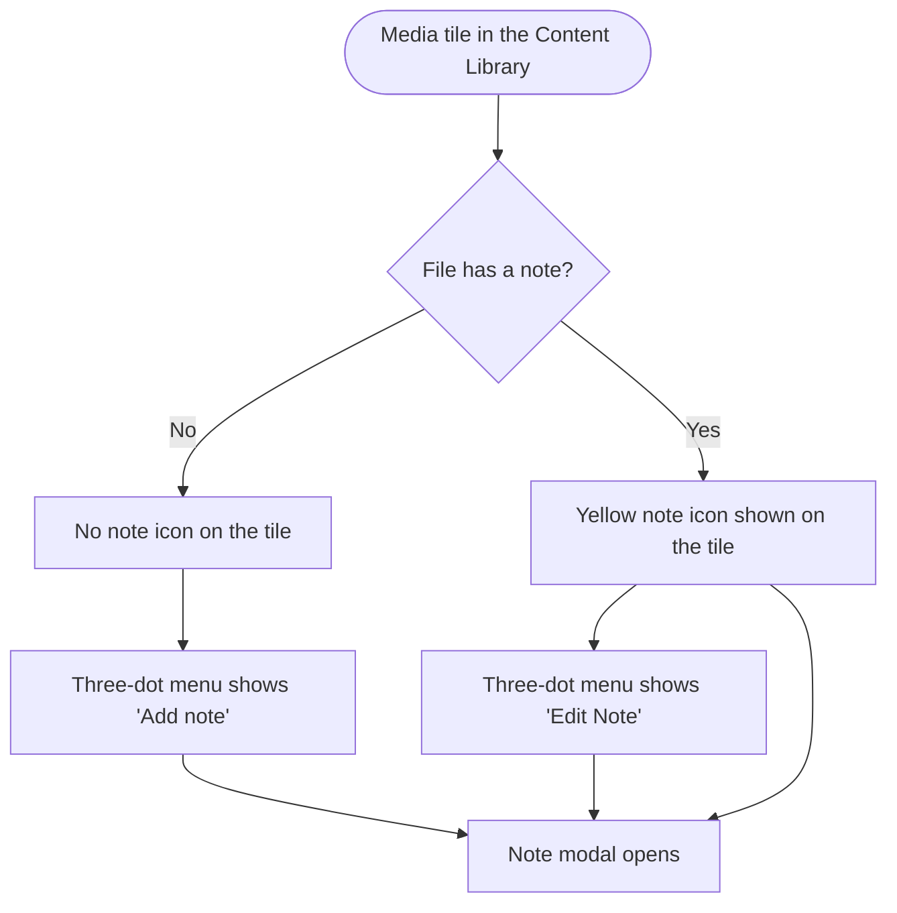
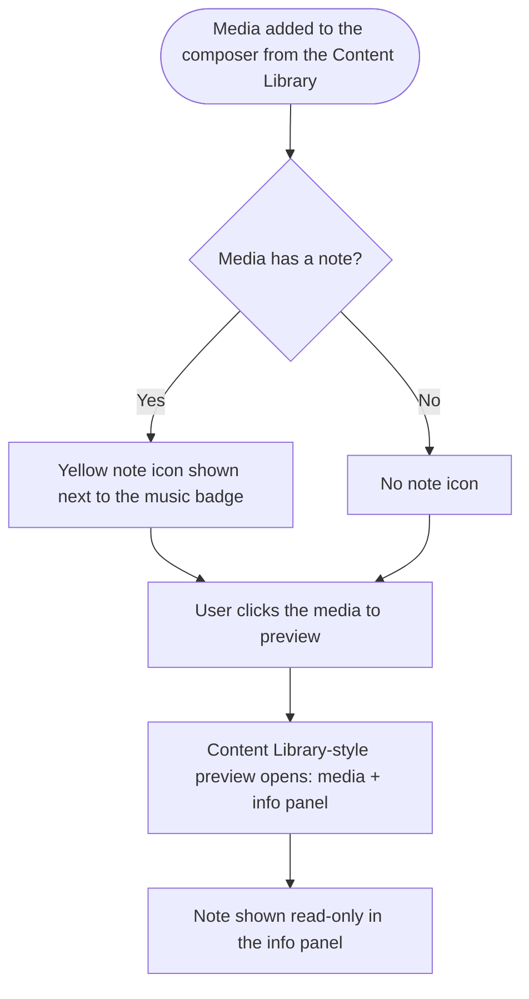

# Stories — Media Notes follow-ups (CL tile menu + composer surfacing)

Two frontend stories refining the shipped **Media Notes** feature. Both build on the existing note data returned with each asset. "Anyone can edit" is already implemented and is not part of these stories. Create both with the **New Feature Template**.

---

## Story 1

# [FE] Content Library: show the note icon only when a note exists and move Add/Edit into the tile menu

### Description
As a user browsing the Content Library, I want each media tile to stay clean — the note icon only appears when a file actually has a note — and I want a clear way to add or edit a note from the tile's menu, so the library isn't cluttered with note icons on every file and the action is where I expect it.

Today the note icon shows on every tile (dark when there's no note, yellow when there is). This story hides it unless a note exists and moves the add/edit action into the tile's three-dot menu.

### Workflow

1. In the Content Library, a media tile shows the yellow note icon **only if that file already has a note**. Files with no note show no note icon.
2. The user opens the tile's three-dot menu. It shows **"Add note"** when the file has no note, or **"Edit Note"** when it already has one.
3. Selecting either opens the existing note modal — empty for a new note, pre-filled for an existing one — where the user writes or edits the note and saves.
4. After a note is saved, the yellow note icon appears on the tile and the menu item reads **"Edit Note"**; if the note is cleared, the icon disappears and the item reverts to **"Add note"**.

### Acceptance criteria
- [ ] In the Content Library grid, a tile shows the note icon **only when the file has a note**; tiles with no note show **no** note icon (the previous always-visible "no note" state is removed).
- [ ] When shown, the note icon keeps its filled yellow style and, on hover, a tooltip reads **"Edit note"**.
- [ ] Clicking the note icon opens the note modal pre-filled with the existing note.
- [ ] The tile's three-dot menu includes a note item: **"Add note"** when the file has no note, **"Edit Note"** when it has one.
- [ ] Selecting the menu item opens the note modal (empty for "Add note", pre-filled for "Edit Note").
- [ ] After saving a note, the tile's note icon appears and the menu item switches to **"Edit Note"** without a page refresh; clearing the note removes the icon and reverts the item to **"Add note"**.
- [ ] These changes apply to the **Content Library grid**; the pre-upload "Upload to Content Library" modal keeps its current note behavior.

### UI copy
- **Three-dot menu item — no note:** "Add note"
- **Three-dot menu item — has note:** "Edit Note"
- **Note icon tooltip (tile, when shown):** "Edit note"
- *(Note modal title, placeholder, counter, and buttons are unchanged from the shipped feature.)*

### Mock-ups
N/A — no mockups provided; visual behavior and copy are in the acceptance criteria.

### Impact on existing data
None — frontend only. Reads the `note` already returned with each asset.

### Impact on other products
- **Mobile / Chrome extension:** not affected.
- **White-label:** the note icon uses the fixed yellow accent (not the brandable primary), so it looks the same across white-label domains.

### Dependencies
None. Builds on the shipped Media Notes feature. Independent of **[FE] Composer: show a note indicator on media tiles and open the Content-Library-style preview**.

### Global quality & compliance (wherever applicable)
- [ ] Mobile responsiveness (frontend only, N/A for backend-only stories)
- [ ] Multilingual support (frontend + backend, translations available or fallback handled)
- [ ] UI theming support (default + white-label, design library components are being used)
- [ ] White-label domains impact review
- [ ] Cross-product impact assessment (web, mobile apps, Chrome extension)

### Implementation references
*Pointers from research — not a contract. Engineering may choose a different approach.*

- `contentstudio-frontend/src/modules/publish/components/media-library/components/Asset.vue` — the note button (`v-if="showNote"`, bottom-left) styles by `hasNote` today (`hasNote = !isEmpty(info.note)`). Gate the icon on `hasNote` (in the library-grid contexts) and add the note item to the existing three-dot `Dropdown` (alongside "Add to composer"/"Restore" `DropdownItem`s), labelled by `hasNote`. The `showNote=true` grid contexts are `MediaLibraryMain.vue` and `MediaTabs/MediaLibraryTab.vue`; the pre-upload `UploadFilesTab.vue` (`:show-note="!isUploading"`) is out of scope.
- Reuse `MediaNoteModal.vue` (already opened via the `open-note` emit / `$cstuModal`) for both menu paths.
- New menu labels under the existing `publisher.media_tabs.*` i18n namespace — add to **all 8 locale dirs**.
- Analytics: the existing `media_note_added` event already fires on save inside the modal — no new event.

---

## Story 2

# [FE] Composer: show a note indicator on media tiles and open the Content-Library-style preview

### Description
As a user building a post in the composer, I want to see when a media file I pulled from the Content Library has a note, and I want clicking it to open the same rich preview I get in the Content Library — with the file details and the note on the right — so I keep the context of that asset while composing, instead of a bare image/video preview.

### Workflow

1. When a user adds media to the composer **from the Content Library** and that file has a note, a **yellow note icon** appears on the media tile, **next to the existing yellow music icon**.
2. The user clicks the media tile to preview it.
3. Instead of the plain image/video lightbox, the preview opens as the **Content-Library-style modal** — the media on the left/center and a file-info panel on the right, including the note shown **read-only** with its "Added by [uploader] · at upload" attribution.
4. Media with no note (or not sourced from the Content Library) shows no note icon and still opens the rich preview (just without a note card).

### Acceptance criteria
- [ ] When a media added to the composer from the Content Library has a note, a **yellow note icon** appears on the tile, positioned **next to the music/audio icon**.
- [ ] Media without a note (or not sourced from the Content Library) shows **no** note icon.
- [ ] Hovering the note icon shows a tooltip: **"This file has a note"**.
- [ ] Clicking a media tile to preview opens the **Content-Library-style preview** (media + right-hand file-info panel) instead of the previous basic lightbox.
- [ ] When the media has a note, the info panel shows the **read-only Note card** with the note text and the "Added by [uploader] · at upload" attribution (identical to the Content Library preview).
- [ ] The note is **read-only** in the composer preview — no add/edit/delete affordance is shown there.
- [ ] Media with no note opens the same rich preview with no Note card.
- [ ] The behavior works wherever the composer media tiles appear (the composer's media/editor box).

### UI copy
- **Note icon tooltip (composer tile):** "This file has a note"
- *(The preview's Note card label, info tooltip, and "Added by … · at upload" attribution are reused verbatim from the Content Library preview — no new copy.)*

### Mock-ups
N/A — no mockups provided; behavior and copy are in the acceptance criteria.

### Impact on existing data
None — frontend only. Requires the asset's `note` (and asset id / uploader) to be carried onto the composer media object when the file is selected from the Content Library, so the tile and preview can display it.

### Impact on other products
- **Mobile / Chrome extension:** not affected.
- **White-label:** the note icon uses the fixed yellow accent (matching the music icon), consistent across white-label domains.

### Dependencies
None. Builds on the shipped Media Notes feature (the `note` is already returned with each asset). Independent of **[FE] Content Library: show the note icon only when a note exists and move Add/Edit into the tile menu**.

### Global quality & compliance (wherever applicable)
- [ ] Mobile responsiveness (frontend only, N/A for backend-only stories)
- [ ] Multilingual support (frontend + backend, translations available or fallback handled)
- [ ] UI theming support (default + white-label, design library components are being used)
- [ ] White-label domains impact review
- [ ] Cross-product impact assessment (web, mobile apps, Chrome extension)

### Implementation references
*Pointers from research — not a contract. Engineering may choose a different approach.*

- `contentstudio-frontend/src/modules/composer/features/media/editor-media/MediaThumbnailItem.vue` — add the note indicator next to the existing audio/music badge (the `Icon name="Music"` button with `bg-[#FFC555]`), shown when the media object carries a `note`. Reuse the `NotepadText` glyph and the yellow accent for consistency with the Content Library tile.
- Preview: `useMediaLightbox.ts` / `useMediaItemActions.ts` currently trigger the basic preview (`vue-easy-lightbox` for images, `display-file-modal` for files). Route the media preview through the Content Library's `PreviewMediaAssetModal.vue` instead so the file-info panel (incl. the read-only Note card) renders. The uploader/name and note card logic already exist in that modal.
- **Plumbing:** the composer media object needs the asset `note` (and `_id`/uploader) to be present. Carry these when media is selected from the Content Library into the composer (the asset fetch already returns `note` + uploader). For non-library media these fields are simply absent (no icon, no note card).
- New tooltip string under the composer i18n namespace — add to **all 8 locale dirs**.

---

## Shortcut fields

### For **[FE] Content Library: show the note icon only when a note exists and move Add/Edit into the tile menu**
- **Template:** New Feature Template
- **Story type:** feature
- **Project:** Web App
- **Group:** Frontend
- **Epic:** Media Notes for Content Library Uploads *(if that epic exists in Shortcut; otherwise Q2 - 2026: Miscellaneous, id `115078` — PO: confirm the current-quarter Miscellaneous epic)*
- **Priority:** Medium
- **Product Area:** Media Library
- **Skill Set:** Frontend
- **Estimate:** _(empty — set during sprint planning)_
- **Labels:** _(none)_
- **Iteration:** _(PO assigns current/target sprint)_

### For **[FE] Composer: show a note indicator on media tiles and open the Content-Library-style preview**
- **Template:** New Feature Template
- **Story type:** feature
- **Project:** Web App
- **Group:** Frontend
- **Epic:** Media Notes for Content Library Uploads *(if that epic exists in Shortcut; otherwise Q2 - 2026: Miscellaneous, id `115078` — PO: confirm the current-quarter Miscellaneous epic)*
- **Priority:** Medium
- **Product Area:** Composer
- **Skill Set:** Frontend
- **Estimate:** _(empty — set during sprint planning)_
- **Labels:** _(none)_
- **Iteration:** _(PO assigns current/target sprint)_
