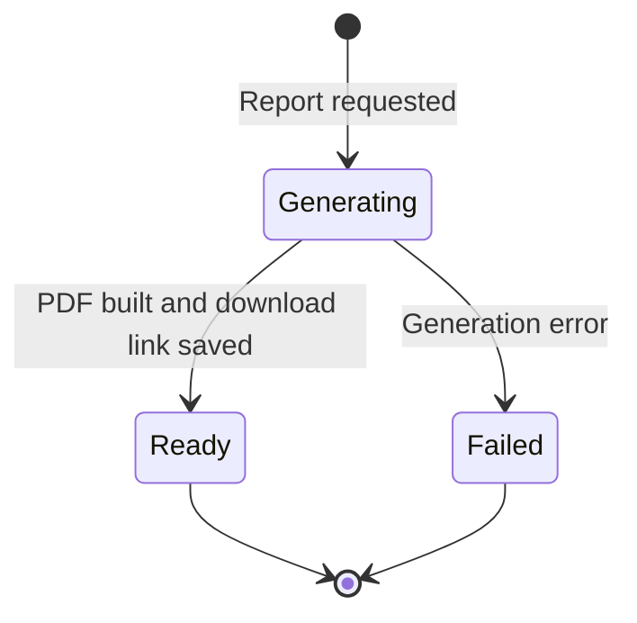
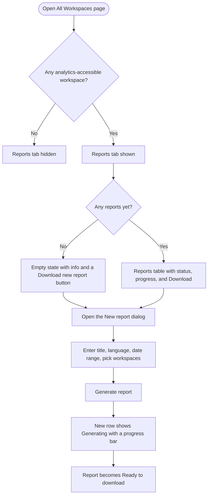

# Stories: Combined multi-workspace analytics report

Three stories (2 backend, 1 frontend) for a new "Reports" tab on the All Workspaces page that lets a user generate and download one PDF report combining the Overview Analytics of several workspaces. Web only. Local markdown for Helpin. Team is shown by the title prefix; product area is Analytics.

Suggested build order: the two backend stories first (API + access, then generation), then the frontend tab.

---

## 1. [BE] Add combined multi-workspace analytics report API, model, and access checks

### Description
As a user who manages multiple workspaces, I want to request a single analytics report that combines the workspaces I have analytics access to, so I can get one consolidated view without opening each workspace separately. This story provides the backend that lists a user's combined reports, tells the frontend which of their workspaces are eligible, and accepts a new report request (title, language, date range, selected workspaces) with the right access checks.

### Workflow
1. The system works out which of the user's workspaces are eligible for a combined report: the user has access to the workspace, their role has analytics access, and the plan has analytics access.
2. The user submits a report request with a title, a language, a date range, and one or more eligible workspaces.
3. The system validates the request, creates a report record in a "generating" state, and queues the generation work.
4. The user can list their combined reports and see each report's status: generating (with progress), ready (with a download link), or failed.

### Acceptance criteria
- [ ] An endpoint returns the current user's combined reports, each with: title, created date, date range, included workspaces, language, status (generating, ready, or failed), progress, and a download link once ready.
- [ ] An endpoint returns the workspaces eligible for a combined report for the current user: only workspaces the user has access to, where the role has analytics access, and where the plan has analytics access.
- [ ] An endpoint accepts a new combined report request with a title, a language, a date range, and a list of selected workspace ids.
- [ ] The request is rejected with a clear error if no workspaces are selected, if any selected workspace is not eligible for the user (access, role, or plan check fails), or if the date range is invalid.
- [ ] On a valid request the system creates a report record in the "generating" state, queues generation, and the report appears in the user's list right away.
- [ ] Combined reports are scoped to the requesting user: a user only sees and can act on their own reports.
- [ ] The languages available for a combined report match the languages already offered by the existing analytics report export.

### Mock-ups
N/A, backend only.

### Impact on existing data
Adds a new record for combined reports (title, user, selected workspaces, language, date range, status, progress, generated file link, timestamps). No change to existing analytics data.

### Impact on other products
Web only. No mobile app or Chrome extension impact. White-label: the generated report should follow white-label branding where the existing analytics reports do (handled in the generation story).

### Dependencies
Blocks "[BE] Generate the combined multi-workspace analytics report PDF" and "[FE] Add the Reports tab on the All Workspaces page".

### Global quality & compliance (wherever applicable)
- [ ] Mobile responsiveness, N/A, backend only
- [ ] Multilingual support (report language selection is part of this story)
- [ ] UI theming support, N/A, no UI
- [ ] White-label domains impact review
- [ ] Cross-product impact assessment (web, mobile apps, Chrome extension)

### Implementation references
*Pointers from research, not a contract. Engineering may choose a different approach.*
- Reuse the existing analytics report record and dispatch pattern (`GenerateReportJob`, `ReportsHelper`) rather than inventing a new one; a combined report is a report over multiple workspaces.
- The eligible-workspaces check combines the user's workspace access with the analytics role permission and the plan analytics entitlement. Confirm the exact permission and plan flag used by the analytics module today.
- Related but separate from the "Analytics Reports Architecture Improvement" research story, which reviews the same report pipeline for the screenshot and loading-timeout problem.

---

## 2. [BE] Generate the combined multi-workspace analytics report PDF

### Description
As the system, once a combined report is requested I need to gather each selected workspace's Overview Analytics for the chosen date range, aggregate it into one combined dataset, and render a branded PDF, so the user receives a single consolidated report to download.

### Workflow

1. When a report is requested, the system gathers the Overview Analytics data for each selected workspace over the chosen date range.
2. It aggregates the data across all selected workspaces into one combined dataset.
3. It renders a PDF with a cover page and the four aggregated widgets, in the selected language, updating progress as it goes.
4. On success the report is marked ready with a download link; on failure it is marked failed.

### Acceptance criteria
- [ ] For each selected workspace, the report gathers the Overview Analytics for the chosen date range for the first four overview widgets: summary tiles, publishing behavior, engagement breakdown, and performance comparison.
- [ ] The data from all selected workspaces is aggregated into one combined dataset (for example, the engagement breakdown shows the combined totals across the selected workspaces).
- [ ] The report is rendered as a PDF with a cover page containing the app logo, the title "Workspace Analytics", and the list of included workspaces, followed by the four aggregated widgets.
- [ ] The PDF is produced in the language selected for the report.
- [ ] While generating, the report's progress updates so the frontend can show a progress bar; on completion the report is marked ready with a download link; on error it is marked failed.
- [ ] The report includes only the selected workspaces and only the selected date range.
- [ ] The rendered report follows white-label branding wherever the existing analytics reports do (logo and branding).
- [ ] Report generation runs in the background and does not block or slow the user's normal analytics viewing.

### Mock-ups
Report layout: design images to be provided by the PO. Cover page plus the four aggregated widgets.

### Impact on existing data
Reads per-workspace Overview Analytics. Writes the generated PDF file and updates the report record's status and progress.

### Impact on other products
Web only. No mobile app or Chrome extension impact.

### Dependencies
Depends on "[BE] Add combined multi-workspace analytics report API, model, and access checks".

### Global quality & compliance (wherever applicable)
- [ ] Mobile responsiveness, N/A, backend only
- [ ] Multilingual support (the report renders in the selected language)
- [ ] UI theming support, N/A, no UI
- [ ] White-label domains impact review
- [ ] Cross-product impact assessment (web, mobile apps, Chrome extension)

### Implementation references
*Pointers from research, not a contract. Engineering may choose a different approach.*
- Reuse the existing PDF pipeline: `GenerateReportJob` to `ReportsHelper` to `GotenbergService` (headless Chromium renders an HTML report to PDF). The combined report is a new report template over aggregated multi-workspace data.
- The four widgets' data comes from the Overview Analytics endpoints used by the `analytics_v3` module. Aggregation combines the per-workspace metrics; confirm the exact combine semantics per widget (summary tile totals, publishing counts, engagement totals, and how performance comparison should read when spanning multiple workspaces).
- Coordinate with the "Analytics Reports Architecture Improvement" work, since both touch the same PDF pipeline (that story addresses reports capturing loading states or timing out on slow renders).

---

## 3. [FE] Add the Reports tab on the All Workspaces page

### Description
As a user who manages multiple workspaces, I want a Reports tab on the All Workspaces page where I can generate and download one analytics report that combines several workspaces, so I can get a consolidated view in a few clicks instead of exporting each workspace separately.

### Workflow

1. The user opens the All Workspaces page. If they have at least one workspace they can access with analytics access, they see a "Reports" tab after Manage Workspaces, Manage Team, and Manage Limits.
2. With no reports yet, the tab shows an info empty state and a "Download new report" button. With reports, it shows a table.
3. The user clicks "Download new report", fills in a title, language, date range, and picks the workspaces to include, then clicks "Generate report".
4. A new row appears in the table as "Generating" with a progress bar. When it is ready the user downloads the PDF.

### Acceptance criteria

Tab visibility
- [ ] A "Reports" tab appears on the All Workspaces page, after Manage Workspaces, Manage Team, and Manage Limits, only when the user has at least one workspace they can access with analytics access (role and plan). If there are none, the tab is not shown.

Empty state (no reports yet)
- [ ] The tab shows a heading "Workspace analytics reports" and subtext "Generate one report that combines the overview analytics of the workspaces you choose. Pick your workspaces, a date range, and a language, and we compile it into a single downloadable PDF."
- [ ] The empty state shows a primary button "Download new report" and a "Learn more" link to the docs.

Reports table (has reports)
- [ ] The tab shows a table of the user's reports with columns: Title, Date range, Workspaces, Language, Status, and an action. A "Download new report" button sits above the table.
- [ ] A report that is still generating shows a "Generating" status with a progress bar, matching the existing analytics reports table. A ready report shows a "Download" action. A failed report shows a "Failed" status with a "Try again" action.

New report dialog
- [ ] Clicking "Download new report" opens a dialog titled "New workspace analytics report".
- [ ] Title: a text input, placeholder "For example, Q2 performance across brands", helper text "A name to recognize this report in the list."
- [ ] Language: a dropdown, defaulting to the user's current language.
- [ ] Date range: a date range picker offering the same presets used in analytics.
- [ ] Workspaces: a multi-select that lists only workspaces the user can access with analytics access, with helper text "Only workspaces you can access with analytics are shown." Workspaces without analytics access are not listed.
- [ ] The primary button "Generate report" is disabled until a title is entered, a date range is set, and at least one workspace is selected. Validation messages: "Enter a title", "Select a date range", and "Select at least one workspace".
- [ ] The secondary button is "Cancel".
- [ ] On submit, the dialog closes, a new row appears in the table in the "Generating" state with a progress bar, and a toast appears: "Your report is being generated. It will appear in the list when it is ready."

States
- [ ] The table shows a loading state (skeleton or spinner) while reports load, and an error state with the message "We could not load your reports. Please try again." and a retry action.

Analytics event
- [ ] When the user submits a new combined report, a `workspace_analytics_report_generated` Usermaven event fires with `{ workspace_count, language }`. (Confirm this event name is new before adding it.)

### Mock-ups
Design images for the tab, empty state, table, and dialog to be provided by the PO.

### Impact on existing data
None. This is UI that consumes the combined-report endpoints.

### Impact on other products
Web only. No mobile app or Chrome extension. White-label: the tab and its copy follow white-label theming.

### Dependencies
Depends on "[BE] Add combined multi-workspace analytics report API, model, and access checks" and "[BE] Generate the combined multi-workspace analytics report PDF".

### Global quality & compliance (wherever applicable)
- [ ] Mobile responsiveness (desktop-first page; degrade gracefully)
- [ ] Multilingual support (all UI copy via i18n keys in every locale; report language selection)
- [ ] UI theming support (default and white-label, design library components)
- [ ] White-label domains impact review
- [ ] Cross-product impact assessment (web, mobile apps, Chrome extension)

### Implementation references
*Pointers from research, not a contract. Engineering may choose a different approach.*
- The All Workspaces tabs (Manage Workspaces, Manage Team, Manage Limits) live in the frontend setting/workspace module; add the conditional "Reports" tab alongside them (confirm the exact parent component and how tabs are declared).
- The existing analytics reports table (generation status plus progress bar) is the closest pattern for the reports table; reuse its status and progress treatment with better copy and the richer empty state described above.
- Reuse the analytics date-range picker and the language selector from the existing report export. Component gaps to confirm against `docs/ui-components.md`: there is no dedicated date-range picker, multi-select, or table component in the catalog, so reuse the existing analytics patterns for those and use `Progress` for the progress bar, `Modal` or `Dialog` for the dialog, `TextInput`, `Dropdown`, `Button`, `Badge` for status, and `Loader` for loading.
- Analytics access is a combination of the user's workspace access, the role's analytics permission, and the plan's analytics entitlement (confirm the exact `useFeatures().canAccess` flag and permission used in analytics today).
- Search `contentstudio-frontend/src/` for `userMaven.track(` to confirm `workspace_analytics_report_generated` is not already used before adding it.
