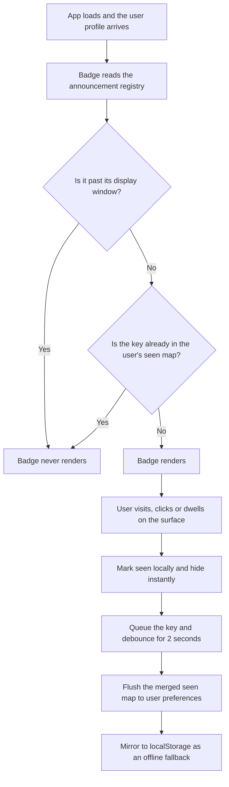
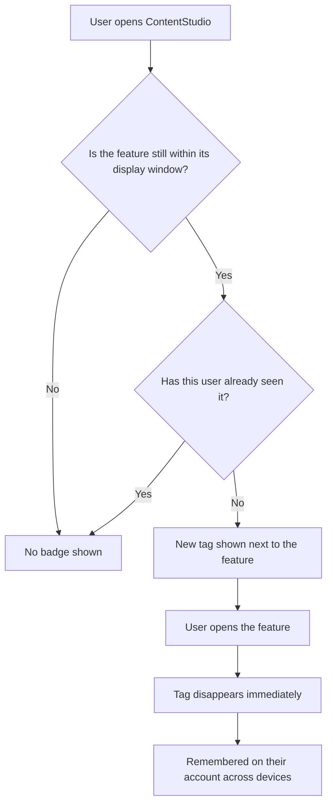

# Per-user "New" feature badges · Stories

**Platform:** Web only. **Scope:** Frontend + Design. No backend story (reuses the existing user-preferences endpoint), no mobile.

**Problem:** "New" tags are hand-placed `` tags in 12 different components. Nothing tracks who has seen what, so a badge only disappears when a developer removes it in a PR. In practice nobody does. Users who signed up months after a feature shipped still see it flagged as new, and daily users of AI Studio still see NEW on AI Studio. Nine of the twelve surfaces have no flag at all, so there is not even a switch to turn off.

**Solution:** one central announcement registry plus a per-user "seen" map on the user's profile preferences. A badge shows while the feature is inside its announcement window and that user has not yet engaged with it. Viewing the feature clears it for that user. The window is a backstop that retires the badge for people who never open it, so no cleanup PR is ever needed.

| # | Story | Priority |
|---|---|---|
| S-1 | [FE] Build a per-user "New" badge system with automatic dismissal | Medium |
| S-2 | [FE] Migrate all existing "New" tags to the shared badge system | Medium |
| S-3 | [Design] Define the "New" badge visual and its lifecycle states | Medium |

---

## Suggested architecture

Three pieces: a **registry** that declares what is new, a **per-user seen map** persisted on the profile, and a **composable plus component** that combines them.

### Decision flow



### 1. Announcement registry

One file is the single source of truth for every New badge in the product. Adding a badge becomes a one-line entry rather than an `` tag copy-pasted into a template.

```ts
// contentstudio-frontend/src/constants/featureAnnouncements.ts  (suggested location)

// Backstop only. The primary dismissal is the user viewing the feature.
// This is what retires a badge for someone who never opens it.
export const DEFAULT_BADGE_WINDOW_DAYS = 30

export const FEATURE_ANNOUNCEMENTS = {
  'ai-studio':            { releasedAt: '2026-05-20', surface: 'nav-rail',          seenOn: 'route',
                            windowDays: 60,
                            children: ['ai-tool.image-to-video', 'ai-tool.brand-voice'] },
  'social-listening':     { releasedAt: '2026-06-10', surface: 'nav-rail',          seenOn: 'route' },
  'meta-ads-analytics':   { releasedAt: '2026-04-02', surface: 'analytics-sidebar', seenOn: 'route' },
  'sso-domains':          { releasedAt: '2026-02-14', surface: 'settings-sidebar',  seenOn: 'route' },
  'approval-workflows':   { releasedAt: '2026-03-05', surface: 'settings-sidebar',  seenOn: 'route' },
  'ai-model.veo3.1-lite': { releasedAt: '2026-07-15', surface: 'model-selector',    seenOn: 'click' },
  'integration.telegram': { releasedAt: '2026-07-01', surface: 'dashboard-card',    seenOn: 'dwell' },
}
```

- `releasedAt` plus the window is the **only** thing that decides whether a badge is eligible. It is deliberately not compared against the user's signup date, see rule 1 below.
- `windowDays` is optional per entry, defaulting to `DEFAULT_BADGE_WINDOW_DAYS`. A major launch can hold the badge longer, a minor model addition shorter.
- `seenOn` declares what counts as engagement for that surface: `route` for navigation items, `click` for pickers and list items, `dwell` for cards that are simply looked at.
- `children` lets a parent badge stay lit while any of its nested badges are unseen.

### 2. Per-user seen map

Stored as one key inside the existing `preferences` object. Timestamps rather than booleans, so we can measure time-to-discovery and garbage-collect safely.

```json
"seen_feature_badges": {
  "seen": {
    "ai-studio": "2026-07-14T09:12:33.120Z",
    "social-listening": "2026-07-20T16:02:10.885Z"
  }
}
```

Written through the existing `POST /preferences/setPreferences` endpoint via `useHelper().setPreferenceStatus`. No new API, no schema migration, no backend deploy dependency. The value must stay wrapped in an object rather than a bare map or array, matching the constraint already documented in `useAiToolFavorites.ts`.

### 3. Composable and component

```ts
const { isNew, markSeen } = useFeatureBadge('ai-studio')
```

```vue
<FeatureBadge feature-key="ai-studio" />
```

`FeatureBadge` renders nothing when the badge does not apply, so call sites need no `v-if`. This replaces all 12 hand-placed `` tags and both SVG variants with one component.

### The six rules that make it intelligent

1. **Viewing clears it.** This is the primary mechanism and does almost all the work. Everything else is a backstop.
2. **Window expiry as the backstop.** After `releasedAt + windowDays`, the badge disappears for everyone regardless of seen state. This only catches the user who never opens the feature at all, and is what removes the need for cleanup PRs and retires badges that have been lit for months.
3. **Engagement, not render.** A badge clears when the user actually lands on the route, clicks the item, or keeps the surface on screen for at least one second. A dropdown flashing open, or a sidebar mounting behind a modal, does not burn the badge.
4. **Parent rollup.** Visiting AI Studio clears the nav-rail badge but not the badges on individual tools inside it. If a parent declares `children`, its badge stays lit while any child remains unseen, so a section badge keeps advertising genuinely new contents.
5. **Optimistic and batched.** The badge disappears the instant the user engages, before any network call. Keys are queued and flushed as one merged write after a 2 second debounce, so clicking through five new tools is one request, not five. A localStorage mirror keeps badges hidden for the rest of the session if the write fails, matching the existing `new_left_navigation_modal_dismissed` behaviour.
6. **Self-cleaning.** On each flush, keys that are no longer in the registry or already past their window are dropped from the stored map, so the preference cannot grow without bound.

Badge state is **per user, not per workspace**. Someone managing five workspaces sees each badge once, not five times.

### Design decision: signup date is deliberately not used

An earlier draft suppressed a badge whenever the user's account was created after the feature's release date. That is wrong, and it is worth recording why.

The release window already produces the correct behaviour on its own:

| Situation | Feature released | User signed up | Result |
|---|---|---|---|
| Old feature, long-standing user | 8 months ago | 2 years ago | Outside window, hidden. Correct. |
| Old feature, brand new user | 8 months ago | yesterday | Outside window, hidden. Correct, and no signup rule needed. |
| **Current announcement, brand new user** | **last week** | **yesterday** | **Inside window, shown. Correct.** A signup cutoff would have wrongly hidden it. |
| Current announcement, long-standing user | last week | 2 years ago | Inside window, shown. Correct. |

A signup cutoff is therefore redundant in the two cases it gets right and actively harmful in the third: it would hide a genuinely current announcement from the newest users, who are the least likely to have found the feature by other means. Eligibility is release date and window only.

The one thing the window does not cover is a long-standing user who already adopted a feature before badges shipped. They will see its badge once and clear it on their next visit. That is a single-visit cost at rollout, not worth a rule.

### Deliberately out of scope

- No admin or settings UI to reset badges. If it is ever needed, clearing the one preference key does it.
- No server-driven registry. A static file ships with the frontend and is simpler to reason about. If marketing later wants to light up a badge without a deploy, the composable can read the same shape from an API without touching call sites.
- No native mobile work. Mobile has no equivalent badge system and is mid-migration to Flutter.

---

## S-1 · [FE] Build a per-user "New" badge system with automatic dismissal
**Project:** Web App · **Group:** Frontend · **Skill:** Frontend · **Product area:** Throughout product · **Priority:** Medium · **Type:** Feature

### Description
As a user, I want the "New" tags on features to disappear once I have actually looked at those features, so that my sidebar stops shouting about things I already use every day and a "New" tag actually means something is new to me.

This story builds the shared system: the announcement registry, the per-user seen state, the composable, and the badge component. It does not change any existing surface yet, that is the migration story.

### Workflow



1. A user opens ContentStudio and sees a **New** tag next to a recently released feature they have not opened yet.
2. They click into that feature.
3. The tag disappears right away, before the page even finishes loading.
4. They log in later from a different browser or device and the tag is still gone.
5. A teammate in the same workspace who has not opened the feature still sees the tag on their own account.
6. A brand new user who signs up while a feature is still being announced sees that tag too, and clears it the same way.
7. Tags for features released long ago do not appear for anyone, including brand new users.
8. Any tag that has been live for longer than its display window disappears for everyone, whether or not they opened the feature.

### Acceptance criteria
- [ ] A central feature-announcement registry exists as the single source of truth for every "New" badge in the web app. Each entry declares the feature key, its release date, the surface it appears on, what counts as the user seeing it, and an optional display-window length.
- [ ] A reusable badge component renders the "New" tag and renders nothing at all when the badge does not apply, so call sites do not need their own visibility check.
- [ ] A badge is shown when **both** of these are true: the badge is still inside its display window, and this user has not yet seen it.
- [ ] A badge stops showing for **everyone** once its display window has passed, regardless of whether the user opened the feature. The window defaults to 30 days from the release date and is overridable per registry entry.
- [ ] **The user's signup date has no effect on badge visibility.** A user who signed up after a feature was released still sees that feature's badge while it is inside its display window. Features released long before a user signed up are already excluded by the window, not by a signup check.
- [ ] Badges are marked seen by real engagement, not by rendering: landing on the feature's route, clicking the item, or the surface staying visible for at least 1 second, depending on what the registry declares for that entry.
- [ ] A badge does **not** clear when its surface merely mounts off-screen or flashes open and closed in under 1 second.
- [ ] When a registry entry declares child entries, the parent badge stays visible while any child badge is still unseen, and clears once the parent surface has been visited and no unseen children remain.
- [ ] The badge disappears immediately on engagement, before the save request completes.
- [ ] Multiple badges cleared in quick succession are saved as a single merged request rather than one request per badge.
- [ ] Seen state is stored **per user** and applies across all of that user's workspaces, browsers, and devices.
- [ ] Seen state for one user has no effect on any other user in the same workspace.
- [ ] If the save request fails, the badge stays hidden for the rest of the browser session and is retried on the next badge dismissal.
- [ ] Keys that are no longer present in the registry, or whose display window has passed, are dropped from the user's stored state the next time it is saved.
- [ ] A user who has never seen any badge, and a user with no stored badge state at all, both get correct behaviour with no errors.
- [ ] Saving badge state never overwrites unrelated user preferences such as sidebar layout, planner columns, or AI Studio favourites, including when another preference save is in flight at the same time.
- [ ] When a badge is dismissed, a `feature_badge_seen` Usermaven event fires with `{ feature_key, surface, days_since_release }`.
- [ ] No Usermaven event fires for a badge merely being displayed.
- [ ] Any new user-facing copy is added across every locale directory under `src/locales/`, English first.

### Mock-ups
The badge visual is unchanged from today's asset. See the **[Design] Define the "New" badge visual and its lifecycle states** story for the consolidated asset and states.

### Impact on existing data
Adds one new key inside the existing user `preferences` object. No schema migration and no backfill. Users with no stored value are treated as having seen nothing, and the display window keeps that from producing a wall of badges, since only genuinely recent features are eligible.

### Impact on other products
Web only. No mobile app, Chrome extension, or public API change. The badge asset is a fixed SVG and is unaffected by white-label theming.

### Dependencies
- **[Design] Define the "New" badge visual and its lifecycle states** for the consolidated asset and the dwell/parent-rollup behaviour.

### Global quality & compliance (wherever applicable)
- [ ] Mobile responsiveness (frontend only, N/A for backend-only stories)
- [ ] Multilingual support (frontend + backend, translations available or fallback handled)
- [ ] UI theming support (default + white-label, design library components are being used)
- [ ] White-label domains impact review
- [ ] Cross-product impact assessment (web, mobile apps, Chrome extension)

### Implementation references
*Pointers from research — not a contract. Engineering may choose a different approach.*

**Persistence — everything needed already exists, no API work:**
- `contentstudio-frontend/src/modules/common/composables/useHelper.js:64` — `setPreferenceStatus(key, value)` is the write wrapper.
- `app/Repository/Account/UsersRepository.php:896` — the write is a Mongo dot-path update (`preferences.$key`), so any key with any JSON value is accepted. `UserPreferencesRequest` validates only that `key` is a string and `value` is present. No whitelist, no backend deploy needed.
- `app/Repository/Account/UsersRepository.php:910` — `setPreferencesBulk` exists if a multi-key write is ever preferable.
- `contentstudio-frontend/src/stores/core/useProfileStore.ts:82-112` — where `preferences` defaults live. Add the badge key here and to `src/types/common/auth.ts`.

**Closest patterns to follow:**
- `contentstudio-frontend/src/modules/ai-studio/composables/useAiToolFavorites.ts` — the template for a structured preference: optimistic store write, then fire-and-forget `setPreferenceStatus`. **Gotcha it documents:** the backend's `required` rule on `value` rejects a bare empty array, so the value must stay wrapped in an object.
- `contentstudio-frontend/src/views/DashboardNew.vue:48-84` and `src/components/common/NewNavigationModal.vue` — already implements the localStorage-mirror plus server-preference combination by hand for a single announcement. The badge system generalises exactly this. Note it also has a hardcoded signup cutoff (`isNewUserAfterNavigationLaunch`), which is correct **there** because that announcement explains a UI change that only pre-existing users experienced. It is not the right rule for feature badges, see the design decision above.

**Gotchas:**
- `app/Data/Auth/UserPreferencesData.php` is **already out of date** — `ai_studio_favorite_tools`, `new_left_navigation_modal` and `nav_sidebar_layout` are all live but missing from it. `ProfileResponseData` is not referenced by any controller, so the DTO is a TypeScript type source only and does not strip unknown keys at runtime. Adding the badge field to it is a one-line consistency fix worth bundling in, not a blocker.
- The badge asset ships in two variants today, `new_tag.svg` and `new_tag_no_shadow.svg`. Consolidate to one in the component rather than exposing a variant prop, unless Design says otherwise.
- Nav-rail badges sit inside an absolutely positioned span with negative offsets. Keep positioning at the call site and let the component own only the asset, otherwise every surface needs a positioning prop.

---

## S-2 · [FE] Migrate all existing "New" tags to the shared badge system
**Project:** Web App · **Group:** Frontend · **Skill:** Frontend · **Product area:** Throughout product · **Priority:** Medium · **Type:** Chore

### Description
As a user, I want every "New" tag in the product to behave the same way and go away once I have seen the feature, so that no corner of the app keeps flagging something as new months after I started using it.

Today the tags are hand-placed in 12 different components, nine of which have no flag at all and simply show forever. This story replaces every one of them with the shared badge component and gives each an entry in the registry with its real release date.

### Workflow
1. A long-standing user opens ContentStudio and no longer sees "New" on the features they already use.
2. They still see "New" on genuinely recent additions they have not opened.
3. They open one of those and the tag disappears everywhere it appeared for that feature.
4. A user who joined recently sees tags only on features that are still being announced, not on everything that predates them.
5. Every remaining tag in the product looks identical, wherever it appears.

### Acceptance criteria
- [ ] Every surface below renders its "New" tag through the shared badge component, with a matching registry entry carrying that feature's real release date:
  - [ ] Left navigation rail items, `DesktopNavigationRail.vue`, currently AI Studio and Social Listening
  - [ ] Analytics sidebar platforms, `AnalyticsSidebar.vue`, all 6 render sites including Meta Ads
  - [ ] AI Studio tool list, `AiStudioSidebar.vue`
  - [ ] Settings sidebar, `SettingSidebar.vue`, SSO Domains and Approval Workflows, including the duplicated locked and unlocked variants
  - [ ] Dashboard integration cards, `IntegrationCard.vue`
  - [ ] AI image and video model selector, `MediaGenerationOptions.vue`, replacing the hardcoded model-id list
  - [ ] Approval sidebar "Workflows" tab, `SendForApprovalSidebar.vue`
  - [ ] Inbox, `InboxView.vue` and `TagsDropdown.vue`
  - [ ] Home settings dropdown, `HomeSettingsDropdown.vue`
  - [ ] CSV automation listing, `CsvProcessListing.vue`
- [ ] The "New" tag in the blog selection screen is **removed**, not migrated. Blog publishing is sunset.
- [ ] The legacy text-style `NEW` label in the old analytics sidebar is either migrated to the shared badge or removed if that view is no longer routable. Either way no text-style `NEW` label remains.
- [ ] After migration, no component renders `new_tag.svg` or `new_tag_no_shadow.svg` directly. A search for those filenames outside the badge component returns no results.
- [ ] The per-item `isNew` and `newTag` booleans in the navigation, analytics-routes, AI-tool-catalog and integration-card data sources are removed, since the registry now owns that knowledge.
- [ ] The hardcoded new-model id list in the AI model selector is removed and those models are declared as registry entries instead.
- [ ] Every migrated badge clears on the trigger that fits its surface: navigation and sidebar items clear on visiting the feature, list and picker items clear on click, dashboard cards clear after being visible for at least 1 second.
- [ ] Clearing the AI Studio nav-rail badge does not clear the badges on individual AI Studio tools.
- [ ] The nav-rail AI Studio badge remains visible while any AI Studio tool badge is still unseen.
- [ ] Badges whose display window has already passed at the time of the migration do not appear for any user. In practice this immediately clears the long-stale SSO Domains and Approval Workflows tags.
- [ ] Badges for features released recently enough to still be inside their window continue to show, to every user including those who signed up after the release, until each user views the feature.
- [ ] Badge positioning and spacing on each surface visually match the current implementation. No layout shift is introduced when a badge is absent.
- [ ] The badge's alternative text remains available to screen readers and is translated in every locale directory under `src/locales/`.

### Mock-ups
No visual change intended, this is a like-for-like replacement. Positioning per surface matches today. See the **[Design] Define the "New" badge visual and its lifecycle states** story for the consolidated asset.

### Impact on existing data
None beyond the badge state introduced by **[FE] Build a per-user "New" badge system with automatic dismissal**. Removing the `isNew` and `newTag` booleans changes only frontend data shapes, no API contract is affected.

### Impact on other products
Web only. No mobile app or Chrome extension change.

### Dependencies
- **[FE] Build a per-user "New" badge system with automatic dismissal** must land first.
- Release dates for each existing badge need confirming with the PO before the registry is filled in. Where a date is unknown, use the feature's original ship date rather than today's date, otherwise the badge relights for everyone.

### Global quality & compliance (wherever applicable)
- [ ] Mobile responsiveness (frontend only, N/A for backend-only stories)
- [ ] Multilingual support (frontend + backend, translations available or fallback handled)
- [ ] UI theming support (default + white-label, design library components are being used)
- [ ] White-label domains impact review
- [ ] Cross-product impact assessment (web, mobile apps, Chrome extension)

### Implementation references
*Pointers from research — not a contract. Engineering may choose a different approach.*

**Full inventory with current gating mechanism:**

| Surface | File | Gated by today |
|---|---|---|
| Nav rail | `contentstudio-frontend/src/components/layout/DesktopNavigationRail.vue:439` | `item.isNew` set in `src/components/layout/useHeaderNavigation.ts:197,282` |
| Analytics sidebar | `contentstudio-frontend/src/modules/analytics_v3/components/AnalyticsSidebar.vue` (6 sites) | `platform.isNew` from `src/modules/analytics/components/common/composables/useAnalyticsRoutes.js` |
| AI Studio tools | `contentstudio-frontend/src/modules/ai-studio/components/AiStudioSidebar.vue:99` | `tool.isNew` from `src/modules/ai-studio/composables/useAiToolCatalog.ts:310,335` |
| Settings sidebar | `contentstudio-frontend/src/modules/setting/components/SettingSidebar.vue:215,230,312,328` | nothing, hardcoded |
| Integration cards | `contentstudio-frontend/src/components/dashboard/IntegrationCard.vue:49` | `integration.newTag` |
| AI model selector | `contentstudio-frontend/src/modules/AI-tools/components/MediaGenerationOptions.vue:538` | hardcoded `NEW_MODEL_VALUES` array of 7 ids |
| Approval sidebar | `contentstudio-frontend/src/modules/approval-workflows/components/SendForApprovalSidebar.vue:1230` | nothing, hardcoded |
| Inbox | `contentstudio-frontend/src/modules/inbox-revamp/views/InboxView.vue`, `components/TagsDropdown.vue` | nothing, hardcoded |
| Home settings dropdown | `contentstudio-frontend/src/components/layout/HomeSettingsDropdown.vue` | nothing, hardcoded |
| CSV listing | `contentstudio-frontend/src/modules/automation/components/csv/listing/CsvProcessListing.vue` | nothing, hardcoded |
| Blog selection | `contentstudio-frontend/src/modules/publish/components/posting/blog/BlogSelection.vue` | nothing, hardcoded, **delete this one** |
| Legacy analytics | `contentstudio-frontend/src/modules/analytics/components/AnalyticsMain.vue:145` | hardcoded `<span class="nav-beta new-feature-available">NEW</span>` |

**Gotchas:**
- `SettingSidebar.vue` duplicates each badge across a locked and an unlocked branch of the same item. Both branches need migrating or the badge only clears in one access state.
- `AnalyticsSidebar.vue` uses `new_tag_no_shadow.svg` for Meta Ads only and `new_tag.svg` everywhere else. Confirm with Design which survives before migrating.
- The `alt` text on most badges is `t('settings.profile.new_tag_alt')`. Keep that key or move it, but do not drop it.
- `useAnalyticsRoutes.js` has around 17 route entries carrying `isNew`, almost all `false`. Removing the property means checking every consumer of those entries, not just the sidebar.

---

## S-3 · [Design] Define the "New" badge visual and its lifecycle states
**Project:** Web App · **Group:** Design · **Skill:** Design · **Product area:** Throughout product · **Priority:** Medium · **Type:** Feature

### Description
As a designer, I want one agreed "New" badge asset and a clear definition of how it behaves across every surface, so that engineering has a single component to build against instead of three visual treatments and twelve placements.

### Workflow
1. Design audits the three treatments currently in use: the standard badge asset, the no-shadow variant used only for Meta Ads analytics, and the legacy text-style label in the old analytics sidebar.
2. Design settles on one asset and specifies how it sits on each of the surface types: a narrow vertical nav rail, a sidebar list row, a dropdown or picker row, and a dashboard card.
3. Design confirms whether the badge needs a hover tooltip explaining why it is there and when it will go away.
4. Design specifies the disappearance: whether the badge fades out or is removed instantly, and whether the surrounding layout should reserve its space.
5. Engineering builds one component against the spec.

### Acceptance criteria
- [ ] One badge asset is chosen and specified. The Meta Ads no-shadow variant and the legacy text-style `NEW` label are both retired.
- [ ] Placement and spacing are specified for each surface type: narrow vertical nav rail item, sidebar list row, dropdown or picker row, dashboard card.
- [ ] The spec confirms no layout shift occurs when the badge is absent, on every surface type.
- [ ] A decision is recorded on whether the badge carries a hover tooltip. If yes, the copy is provided. Suggested copy if adopted: **"Recently added. This tag goes away once you have opened it."**
- [ ] The disappearance behaviour is specified: instant removal or a short fade, and the same treatment applies on every surface.
- [ ] The spec covers the badge appearing next to an item that is locked behind a plan, since Settings shows both states for the same item today.
- [ ] Accessible alternative text for the badge is specified.
- [ ] The badge is confirmed as unaffected by white-label theming, or a themed treatment is specified.

### Mock-ups
To be produced in this story.

### Impact on existing data
None.

### Impact on other products
Web only. No mobile app or Chrome extension change.

### Dependencies
Blocks **[FE] Build a per-user "New" badge system with automatic dismissal** and **[FE] Migrate all existing "New" tags to the shared badge system**. Both can start against the existing asset and adopt the final spec before release.

### Global quality & compliance (wherever applicable)
- [ ] Mobile responsiveness (frontend only, N/A for backend-only stories)
- [ ] Multilingual support (frontend + backend, translations available or fallback handled)
- [ ] UI theming support (default + white-label, design library components are being used)
- [ ] White-label domains impact review
- [ ] Cross-product impact assessment (web, mobile apps, Chrome extension)

### Implementation references
*Pointers from research — not a contract. Engineering may choose a different approach.*

- Current assets: `contentstudio-frontend/src/assets/img/common/new_tag.svg` and `new_tag_no_shadow.svg`.
- Legacy text treatment: `contentstudio-frontend/src/modules/analytics/components/AnalyticsMain.vue:145`, classes `nav-beta new-feature-available new-feature-available--sidebar`.
- `docs/ui-components.md` has no suitable existing component. `Badge` is for status and count indicators, not this. The badge wrapper is app-level, so no `@contentstudio/ui` release is blocked.
- The tightest placement constraint is the nav rail, where the badge is absolutely positioned with a negative top offset over the icon. Any size increase risks clipping.
