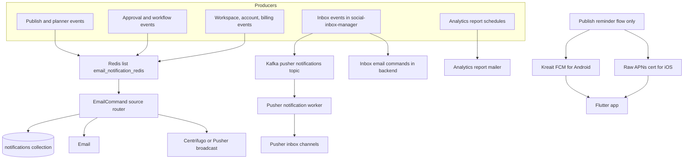

# 01 Research — Notifications architecture

Date: 2026-08-23
Scope: every notification ContentStudio sends today (web, email, mobile push, realtime), across `contentstudio-backend`, `social-inbox-manager`, `contentstudio-social-analytics-go` and `contentstudio-flutter`, plus the gap for in-review (approval) posts on mobile.

This doc is the local grounding for the epic. Nothing here goes into the story body.

---

## 1. Current state: notifications are produced in at least five independent ways

### A. In-app + email (the "main" pipeline)

- Entry point: `contentstudio-backend/app/Notifications/NotificationMain.php` plus one subclass per domain:
  - `app/Notifications/Account/` (AccountsNotification, YouTubeConsentNotification)
  - `app/Notifications/Approval/` (ApprovalNotification, WorkflowNotification, WorkflowNotificationDispatcher)
  - `app/Notifications/Automation/ContentPlannedNotification.php`
  - `app/Notifications/Discovery/` (FeedlyImportNotification, OPMLImportNotification)
  - `app/Notifications/Publish/` (CommentNotification, PlanNotification, PostNotification, ShareLinkNotification, TaskNotification)
  - `app/Notifications/Whitelabel/TeamsNotification.php`, `app/Notifications/Workspace/WorkspaceNotification.php`
- Transport: a single **Redis list** named `email_notification_redis`. Producers push with `NotificationHelper::pushNotificationToRedis()` or raw `Redis::rpush` / `EnqueueDequeue::enqueue`. At least 9 distinct call sites, including `app/Repository/Publish/Planner/PlansRepository.php`, `app/Libraries/Publish/Planning.php`, `app/Libraries/Account/WorkspacesHelper.php`, `app/Services/PaddleBillingService.php`, `app/Services/Billing/SocialAccountAutoScaleService.php`, `app/Repository/Account/SocialAuthenticationRepository.php`.
- Consumer: `app/Console/Commands/Emails/EmailCommand.php` does `$redis->lpop('email_notification_redis')` in a loop and routes on a `source` string through a **10-branch if/elseif chain** (`account`, `workspace`, `comment`, `task`, `plan`, `workflow`, `automation`, `whitelabel`, `youtube_consent`, `external_approval` / `share_link_invitation`).
- Storage: `notifications` collection (`app/Models/Notification/Notification.php`), approval dedupe rows in `notifications_approval` (`ApprovalNotification` model), per-user preferences in `notifications_settings` (`NotificationsSetting` model).
- Preference gate: `app/Libraries/Notification/NotificationsHelper.php` (`hasNotificationsEnabled`, `isEmailAllowedToSend`, `isEmailAllowedToSendInbox`, `turnOffEmailNotifications`).

Implications: a plain Redis list is not a durable queue. No retry, no DLQ, no ordering guarantee, no visibility. A crash mid-`lpop` loses the notification. The `source` router means every new notification type edits one shared command.

### B. Realtime / browser

- `NotificationsHelper::onlyBroadcastEvent($channel, $notification)` and `onlyBroadcastEventIfUserOnline(...)`, plus `isUserOnline($user_id)`.
- Provider is in flux: frontend reads `VITE_REALTIME_PROVIDER`, `VITE_CENTRIFUGO_WS_URL`, `VITE_REALTIME_AUTH_ENDPOINT` alongside six separate Pusher keys (`VITE_PUSHER_SOCKET_KEY`, `VITE_PUSHER_INBOX_KEY`, `VITE_PUSHER_INBOX_REVAMP_KEY`, `VITE_PUSHER_ANALYTICS_KEY`, `VITE_PUSHER_CAPTION_KEY`, `VITE_PUSHER_PUBLISH`). Backend has `app/Libraries/Realtime/CentrifugoAuthToken.php` and `app/Libraries/Publish/PublishPusher.php`.
- Related existing work: the `replace-pusher-with-centrifugo` story set. The notification architecture has to land on top of whatever that settles on.

### C. Mobile push: three separate, partly abandoned code paths

1. `app/Libraries/Notification/Firebase.php` — uses the `laravel-fcm` package (legacy FCM HTTP API), reads devices from the `device` collection via `App\Repository\Settings\DeviceRepo`, and hardcodes the notification title `'Lumotive'`. **No caller found anywhere in `app/`** — dead or near-dead code.
2. `app/Notifications/NotificationHelper::androidPostPushNotification()` — uses the Kreait Firebase `Factory` with credentials read straight from `env('FIREBASE_CREDENTIALS_JSON')`, reads devices from the `mobile_device` collection via `App\Repository\Publish\MobileDeviceRepo`.
3. `app/Notifications/NotificationHelper::iosPostPushNotification()` — raw APNs HTTP call using a `.pem` cert on disk (`env('CERT_DIR_PATH')`), a hardcoded cert password in source, and the legacy bundle id `com.muneeb.Lumotive`.

So: two device registries (`device` and `mobile_device`), two Firebase SDKs, one bypass of FCM entirely for iOS, and credentials read via `env()` at runtime instead of config.

Push today serves exactly one product flow: the publish reminder / confirmation for platforms that cannot be published server-side (Instagram personal, TikTok, GMB). Signals: `device_notification`, `notification_processed`, `requires_push_notification` on `Plans`, set from `app/Strategy/Planner/TikTokPosting.php`, `app/Libraries/Integrations/Platforms/Social/InstagramPlatform.php`, `FacebookPlatform.php`, and consumed by `app/Libraries/Publish/Posting/Posting.php`, `app/Jobs/UpdatePlanPostingJob.php`, `app/Services/Publishing/PlatformObserverTriggerDispatcher.php`.

### D. Inbox notifications (separate service, separate pipeline)

- `social-inbox-manager/app/utils/notification_helper.py` (`NotificationHelper` class), `social-inbox-manager/app/workers/pusher_notification_worker.py` (`PusherNotificationWorker`, consumes the Kafka `PUSHER_NOTIFICATIONS_TOPIC` and fans out to Pusher), launched by `run_pusher_consumer_workers.py`.
- Backend also has its own inbox notification stack: `app/InboxNotification/Builder`, `app/InboxNotification/Observer`, `app/Console/Commands/HandleInboxNotificationCommand.php`, `app/Console/Commands/SendInboxEmailNotificationCommand.php`, `app/Console/Commands/CleanupInboxNotifications.php`.
- Result: inbox notifications never touch `email_notification_redis` or the `notifications` collection path used by everything else.

### E. Analytics notifications

- Report emails come from `app/Libraries/Analytics/ReportsHelper.php` and `app/Services/Analytics/ReportsHelper.php` on the PHP side.
- `contentstudio-social-analytics-go` emits **no** user notifications. Existing related work: the `analytics-webhook-events` and `analytics-observability-and-data-retention` story sets.

### F. Other senders that bypass all of the above

- Customer.io (`_cio.track`) for lifecycle email.
- `app/Console/Commands/CleanupAutomationNotifications.php`, `MissedPlansNotificationCommand.php`, `NotificationCommand.php`, `TriggerAllEmailsCommand.php` — separate cron-driven senders.
- Billing mails dispatched directly: `app/Mail/Billing/LowXWalletBalanceMail.php`, `XWalletRefundMail.php`, `XWalletAvailableMail.php`, `SocialAccountAutoScaledMail.php`, `AiInboxRepliesUsageMail.php`.

---

## 2. Current state diagram

Nothing else reaches the mobile app.

---

## 3. The in-review (approval) gap on mobile

- Approval notifications are produced by `app/Notifications/Approval/ApprovalNotification.php` and `app/Notifications/Approval/WorkflowNotificationDispatcher.php` (queue constant `email_notification_redis`, payload carries `'email' => true`). They fan out to **in-app + email only**. `dispatchNotifications()` broadcasts to the dashboard and browser. There is no push branch.
- The Flutter app can already *receive* and *route* a push, but only one intent exists: `contentstudio-flutter/lib/features/notifications/domain/notification_intent.dart` defines `OpenPostIntent` and `UnknownNotification`. Anything unrecognised is a deliberate no-op. Parsing lives in `notification_payload_parser.dart`, routing in `application/notification_routing_coordinator.dart`, tap handling in `lib/app/notification_tap_listener.dart`.
- The app already has the destination screens and an approval deep-link path that is **not** push-driven: `lib/features/planner/domain/deep_link/approval_deep_link.dart`, `lib/features/planner/application/approval_deep_link_coordinator.dart`, `lib/app/approval_deep_link_listener.dart`, and the whole `lib/features/approval_workflows/` module.
- Token plumbing exists: `lib/core/notifications/firebase_push_token_source.dart`, `push_token_source.dart`, `notification_permission.dart`, and `lib/features/notifications/data/firebase_push_notification_source.dart` / `native_push_notification_source.dart` / `flutter_local_notification_presenter.dart`.

So the missing pieces for in-review posts on mobile are: an approval push branch on the producing side, a stable payload contract, a new intent type in the app, and a device-token registry that is actually shared with the approval flow (today's two registries were both built for the publish-reminder flow).

---

## 4. Questions to settle in the research ticket

1. One catalogue: what notification types exist, who receives each, and on which channels (in-app, email, push, realtime)? Nothing authoritative exists today.
2. One taxonomy: are notification types named consistently across the `source` router, the inbox stack, and the mobile payloads? Today they are not.
3. One transport: is the target a durable queue (Kafka is already in the stack for inbox and ai-agents) or Laravel queues, replacing the bare Redis list?
4. One preference model: `notifications_settings` covers the main pipeline. Inbox and mobile push are not represented. What is the target per-user, per-channel preference model, including per-workspace scoping?
5. One device registry: consolidate `device` and `mobile_device`, and decide the FCM-only vs FCM+APNs question (the Flutter app makes FCM-only viable for both platforms).
6. Ownership: which service owns delivery once inbox, analytics and ai-agents all have notification-worthy events?
7. Sequencing against the Pusher-to-Centrifugo migration and the existing `analytics-webhook-events` / `inbox-webhook-events` work.

## 5. Related existing deliverables (do not duplicate)

- `push-notification-status` (mobile planner push status)
- `replace-pusher-with-centrifugo`
- `analytics-webhook-events`, `inbox-webhook-events`, `public-webhooks`
- `email-thread-approval`, `multi-tiered-approval-workflow`
- `analytics-observability-and-data-retention`
