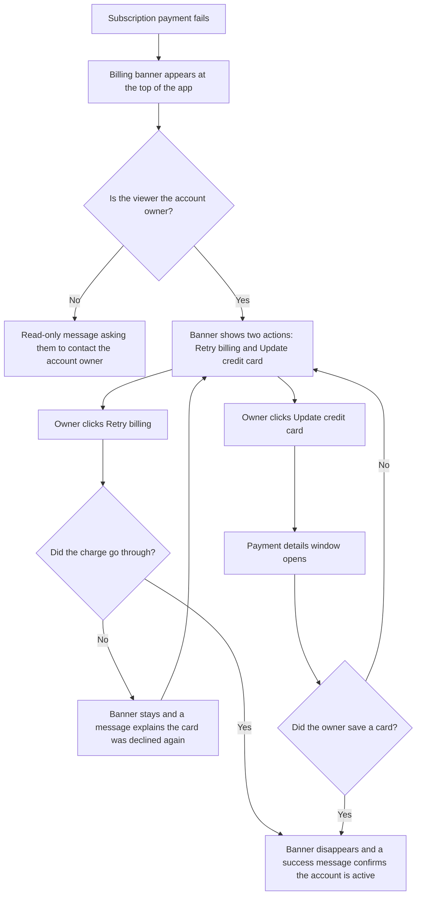

# Stories: Past-due billing banner

---

## [FE] Rewrite the past-due billing banner with Retry billing and Update credit card actions

### Description:

As a workspace owner whose subscription payment has failed, I want a billing banner that
tells me plainly what went wrong and gives me the two actions that actually fix it, so that
I can recover my account in one click instead of being pushed into changing my plan and
accidentally ending up paying for two subscriptions.

Today the banner reads "Action Required: We've been trying to charge your card several
times with no success. Please update your credit card to proceed with the charge." and its
only action takes the user to the billing page, where the most prominent button is
"Upgrade". Owners who take that route start a second subscription while the failed one is
still running, so they get billed twice and support has to unpick it. This story replaces
the wording and gives the banner its own two actions, so recovering a failed payment never
routes through the upgrade plan modal.

---

### Workflow:

**Account owner**

1. The owner's renewal payment fails, and on their next visit a red banner sits across the
   top of every page in ContentStudio.
2. The banner reads:
   - **Heading:** "Your recent payment failed!"
   - **Subtext:** "We just tried to charge your credit card, but unfortunately the payment
     did not go through. To keep your account active, please update your billing
     information."
3. Two buttons sit at the right of the banner: **Retry billing** (primary) and
   **Update credit card** (secondary).
4. The owner clicks **Retry billing** to try the card already on file again. The button
   shows a spinner with the label "Retrying...", and both buttons are disabled until the
   attempt finishes.
5. If the charge succeeds, the banner disappears and a success message confirms
   "Payment successful. Your account is active again."
6. If the charge fails again, the banner stays in place and a message explains
   "We could not charge your card. Please update your credit card to continue." Both
   buttons become clickable again so the owner can update the card instead.
7. Alternatively the owner clicks **Update credit card**, which opens the secure payment
   details window. After they save a new card, the banner disappears and a message confirms
   "Card updated. We will charge your new card shortly."
8. If the owner closes the payment window without saving, the banner stays exactly as it
   was, with both actions available.
9. The owner can dismiss the banner for the current session with the close icon at the far
   right, exactly as they can today. It reappears on their next visit while the payment is
   still outstanding.

**Team member who is not the account owner**

1. A team member sees the same banner, with the heading "Your recent payment failed!" and
   the subtext "We could not charge the card on file for this account. Please ask your
   account owner to update the billing information so your workspace stays active."
2. No action buttons are shown, because only the account owner can fix the payment.

---

### Acceptance criteria:

- [ ] While a subscription payment is outstanding, the account owner sees a banner across the top of the app with the heading "Your recent payment failed!"
- [ ] The banner subtext for the account owner reads: "We just tried to charge your credit card, but unfortunately the payment did not go through. To keep your account active, please update your billing information."
- [ ] The old "Action Required:" prefix and the old message about charging the card several times no longer appear anywhere in the banner
- [ ] The banner shows exactly two actions for the account owner: "Retry billing" as the primary button and "Update credit card" as the secondary button
- [ ] The banner no longer contains a "View Billing Details" or "Update Details" action, and no banner action opens the upgrade plan modal or lands the user on a plan-selection screen
- [ ] Clicking "Retry billing" disables both buttons and shows a spinner on the button with the label "Retrying..." until the attempt returns
- [ ] When the retry succeeds, the banner is removed and a success message appears: "Payment successful. Your account is active again."
- [ ] When the retry fails, the banner remains, both buttons become clickable again, and a message appears: "We could not charge your card. Please update your credit card to continue."
- [ ] Clicking "Update credit card" opens the secure payment details window without navigating the user away from the page they were on
- [ ] After a card is saved successfully, the banner is removed and a message appears: "Card updated. We will charge your new card shortly."
- [ ] Closing the payment details window without saving leaves the banner and both actions unchanged
- [ ] A team member who is not the account owner sees the heading "Your recent payment failed!" with the subtext "We could not charge the card on file for this account. Please ask your account owner to update the billing information so your workspace stays active." and no action buttons
- [ ] The close icon still dismisses the banner for the current session, and the banner returns on the next visit while the payment is still outstanding
- [ ] The banner uses the `CstBanner` component with `Button` components from `@contentstudio/ui` for both actions, and a `Loader` for the retrying state, replacing the current hand-rolled banner markup and inline button styles
- [ ] Banner colors come from theme-aware classes rather than hardcoded values, so white-label domains render the banner in their own palette
- [ ] All banner copy, including both button labels and all three result messages, is translatable and present in every supported language, falling back to English where a translation is missing
- [ ] The banner is readable and both actions are reachable on mobile widths, stacking below the message rather than overflowing the screen

---

### Mock-ups:

N/A. Copy and layout are specified above. The banner keeps its existing position and
full-width treatment at the top of the app.

---

### Impact on existing data:

None. No new data is stored and no existing records change shape. The banner reflects
billing state that is already available.

---

### Impact on other products:

- **Mobile apps:** not affected. The mobile app has no failed-payment banner. It shows a
  "Payment due" state on the workspace, and recovering a failed payment stays a web-only
  flow.
- **Chrome extension:** not affected.
- **White label:** affected. The banner is currently hardcoded to a fixed orange and pink
  treatment, so it ignores a white-label customer's palette. Moving it to theme-aware
  colors is part of this story.

---

### Dependencies:

The "Retry billing" action needs the retry to be available from the billing provider for
customers on the legacy billing setup. Confirm this before development starts. If a retry
cannot be performed for those customers, the action should fall back to the same payment
details window as "Update credit card", and its copy should change to say so rather than
promising a retry that cannot happen.

---

### Global quality & compliance (wherever applicable)

- [ ] Mobile responsiveness (frontend only, N/A for backend-only stories)
- [ ] Multilingual support (frontend + backend, translations available or fallback handled)
- [ ] UI theming support (default + white-label, design library components are being used)
- [ ] White-label domains impact review
- [ ] Cross-product impact assessment (web, mobile apps, Chrome extension)
