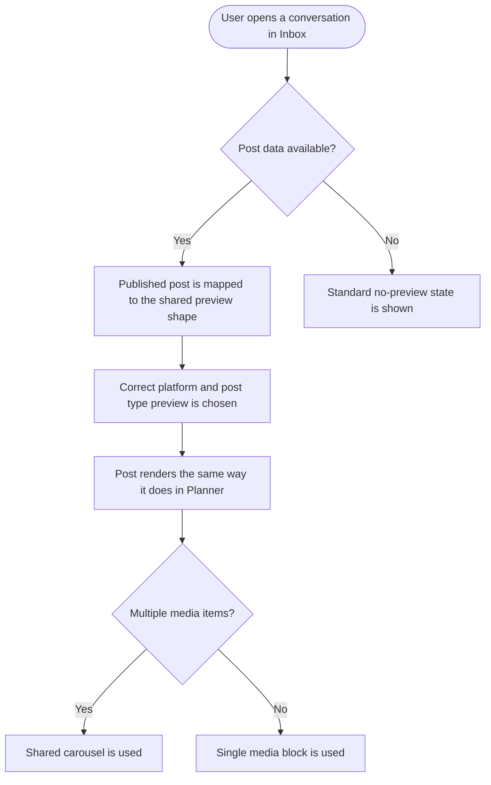

# Stories: Extend the standardized post previews to Inbox and Analytics

Composer and Planner now share one post-preview system: a shared scaffold (post chrome, caption, media, link card, engagement bar) with one component per platform and post type, and one helper deciding which variant to render. That work shipped as **[FE] Rework post previews in Composer and Planner for platform fidelity and consistent sizing**.

Inbox and Analytics never joined. Both hand-roll their own previews. Inbox builds its post display inline with platform branching, two inline carousels and its own no-preview placeholder. Analytics has a general preview modal plus at least six separate per-platform published-post preview components, one of which detects video by looking for substrings in a URL. So the same post looks different depending on which of the four surfaces you are on, and a platform UI refresh has to be applied three times.

One complication shapes the work: Composer and Planner preview a post **before** publishing from composer data, while Inbox and Analytics show a post **after** publishing from platform API data, with real engagement counts and platform media types. This is not drop-in reuse; it needs an adapter and a real-counts engagement bar.

Three stories.

| # | Title |
|---|---|
| 1 | `[FE]` Adapt the shared post previews for published posts and adopt them in Inbox |
| 2 | `[FE]` Adopt the shared post previews across Analytics |
| 3 | `[Design]` Published-post preview treatment for Inbox and Analytics |

---
---

# 1. [FE] Adapt the shared post previews for published posts and adopt them in Inbox

### Description

A user who reviews a post in Planner and then sees the same post in their Inbox sees two different renderings of it. The Inbox version is built inline with per-platform branching, its own carousels and its own no-preview placeholder, so it drifts from how the post actually looks on the network and from how the rest of ContentStudio shows it.

This story extends the shared preview system to handle published posts, then rebuilds the Inbox post view on it. The adapter it introduces is what makes the Analytics story possible, so it is deliberately first.

### Workflow

1. User opens a conversation in Inbox that relates to a published post.
2. The post renders using the same preview components Planner uses, so it looks the way it looks on the network.
3. Multiple images render in the shared carousel rather than an inline one.
4. Video renders as video, identified by its media type rather than guessed from its URL.
5. A post whose media cannot be loaded shows the standard no-preview state, with the same wording used elsewhere in the app.
6. Real engagement counts from the platform are shown, rather than placeholder engagement chrome.
7. The conversation side of the screen, comments and replies, is unchanged.

### Acceptance criteria

- [ ] The shared preview system accepts published-post data, via an adapter that maps platform API data into the shared preview shape.
- [ ] The adapter handles the Inbox attachment structures for every network Inbox supports: Facebook, Instagram, LinkedIn, YouTube, Google Business Profile and X.
- [ ] The shared engagement bar can render real engagement counts, and does so in Inbox, rather than the placeholder chrome used for unpublished previews.
- [ ] Media type drives what is rendered. No video detection by URL substring anywhere in the new path.
- [ ] Multiple images render through the shared carousel component. The two inline Inbox carousels are removed.
- [ ] The Inbox post view renders through the shared preview components for every supported network, with no per-platform branching left inline in the view.
- [ ] The correct preview variant is chosen by the shared variant helper, not by a condition local to Inbox, so Inbox cannot drift from Planner on variant choice.
- [ ] A post with no loadable media shows the standard no-preview state with the standard copy. The Inbox-specific placeholder image and tooltip are removed.
- [ ] Caption rendering, including link and hashtag handling and truncation, follows the shared caption behaviour rather than an Inbox-local implementation.
- [ ] Instagram's layout in Inbox matches how Instagram renders elsewhere, without the Inbox-specific ordering override.
- [ ] The conversation side of the Inbox view, including comments, replies and the composer, behaves exactly as before. No regression in replying, reacting or navigating conversations.
- [ ] The view renders correctly down to the smallest supported width, with no horizontal page scroll.
- [ ] The view renders correctly on a white-label domain. Platform brand chrome inside a preview stays the platform's, and is not themed.
- [ ] Every user-visible string changed is translated and present in every locale directory.
- [ ] No new module-to-module import is introduced. The shared previews are imported from the common module, following the existing precedent.

### UI copy

**No-preview state** (reuse the shared wording rather than the Inbox-specific one)
- Label: `Preview not available`
- Tooltip: `We couldn't load a preview for this post. You can still open it on the network to see it.`

**Open on network** (existing behaviour, keep the copy pattern)
- Tooltip: `View post on {platform}`

All strings go through translation and land in every locale directory in the same change. Note the deliberate absence of em dashes.

### Mock-ups

Provided by **[Design] Published-post preview treatment for Inbox and Analytics**.

### Impact on existing data

None. Rendering only.

### Impact on other products

- Web app only. The mobile apps have their own inbox screens with their own rendering, and are unaffected.
- The shared preview components gain published-post support, which Planner and Composer do not use, so their behaviour must be verified unchanged.

### Dependencies

- Depends on **[Design] Published-post preview treatment for Inbox and Analytics** for how real engagement counts and the published-post variant should look.
- Blocks **[FE] Adopt the shared post previews across Analytics**, which needs the adapter and the real-counts engagement bar this story introduces.
- Builds on **[FE] Rework post previews in Composer and Planner for platform fidelity and consistent sizing**, which must be shipped first.

### Global quality and compliance checklist

- [ ] Mobile responsiveness tested (frontend only, N/A for backend-only stories)
- [ ] Multilingual support verified (frontend + backend, translations available or fallback handled)
- [ ] UI theming supported (default + white-label, design library components are being used)
- [ ] White-label domains impact reviewed
- [ ] Cross-product impact assessed (web, mobile apps, Chrome extension)

### Implementation references

*Pointers from research — not a contract. Engineering may choose a different approach.*

- The shared system is `contentstudio-frontend/src/modules/common/components/social-previews/`: `PostPreview.vue` as the entry point, `shared/{PostChrome,CaptionBlock,MediaBlock,LinkCard,EngagementBar}.vue` as the scaffold, `SwipeCarousel.vue` for carousels, `SocialPreviews/*.vue` per platform and post type, and `types.ts` for the shape. `planner_v2` already imports from it (`PlannerFeedCard.vue`, `usePlannerFeedCard.ts`), so the import path is established.
- What to replace is in `contentstudio-frontend/src/modules/inbox-revamp/components/PostView.vue`: the profile-image-with-platform-fallback block, the `parseDescriptionHtml` call with its LinkedIn boolean, the `post_attachment.length` branching, the no-preview placeholder image and tooltip, and the two inline carousels over `postAttachments.post_image_album` and `postAttachments['sub-attachments']` (both currently using an element id of `preview-carousel` and a `facebook-carousel-preview` class regardless of platform).
- The Instagram-specific `'order-last': post?.platform === 'instagram'` binding in the same file is the kind of local override the shared variant helper should own instead.
- `types.ts` in the shared system is where the published-post shape most likely belongs, either as a variant of the existing type or as a separate input the adapter produces.
- `EngagementBar.vue` is currently placeholder chrome for unpublished previews. Giving it an optional real-counts mode is the smaller change; a second engagement component would recreate the divergence this story removes.
- Leave `CommentBlock.vue` and `ChatView.vue` alone unless the post preview is embedded in them. They are the conversation side, not the post side.

---
---

# 2. [FE] Adopt the shared post previews across Analytics

### Description

Analytics has a general post-preview modal plus separate published-post preview components for Facebook, Instagram, LinkedIn, TikTok and X, and a competitor preview modal on top. They each render captions, media and engagement their own way. One of them decides whether something is a video by checking whether its URL contains certain substrings, which is exactly as reliable as it sounds.

This story replaces all of them with the shared preview system, using the published-post adapter built for Inbox, so a post looks the same in Analytics as it does in Planner and Inbox.

### Workflow

1. User opens Top Posts on a network's analytics dashboard and clicks a post.
2. The post renders in the shared preview, matching how it looks on the network and in the rest of ContentStudio.
3. Real engagement counts from analytics are shown in the preview.
4. Videos render as video, identified by media type.
5. Carousels render in the shared carousel.
6. User opens a competitor post preview. Same rendering.
7. User exports a report containing post previews. They render correctly there too.

### Acceptance criteria

- [ ] The general Analytics post preview renders through the shared preview components for every network Analytics supports: Facebook, Instagram, LinkedIn, X, YouTube, TikTok, Pinterest and Google Business Profile.
- [ ] The per-platform published-post preview components are removed from use, replaced by the shared ones: the Facebook, LinkedIn and Instagram competitor previews, the TikTok preview and the X preview.
- [ ] The competitor post preview modal renders through the shared components.
- [ ] Real engagement counts from analytics render in the preview's engagement bar.
- [ ] Media type drives rendering. No video detection by URL substring remains anywhere in Analytics.
- [ ] Platform media types are mapped by the adapter rather than checked inline: image, video, reel and carousel album all render as their correct variant.
- [ ] Carousels render through the shared carousel component. The Instagram-specific carousel loop is removed.
- [ ] Caption rendering, including link and hashtag handling and truncation, follows the shared caption behaviour. The Analytics-local 250-character truncation is replaced by the shared rule unless the design says Analytics needs a different limit, in which case it is a prop rather than a hardcoded number.
- [ ] Profile image fallbacks and resized-image handling follow the shared media behaviour, including the failure fallback.
- [ ] A post with no loadable media shows the standard no-preview state.
- [ ] Post previews inside exported PDF reports render correctly, including media and engagement counts.
- [ ] The previews render correctly down to the smallest supported width, with no horizontal page scroll.
- [ ] The previews render correctly on a white-label domain, with platform brand chrome staying the platform's.
- [ ] Every user-visible string changed is translated and present in every locale directory.
- [ ] After this story, no post-preview markup remains in the analytics module outside the shared system. Anything that could not be migrated is documented with the reason.
- [ ] Clicking through from a preview to the post on the network still works everywhere it worked before.

### UI copy

Reuses the shared no-preview and view-on-network copy introduced by **[FE] Adapt the shared post previews for published posts and adopt them in Inbox**. No new strings expected.

### Mock-ups

Provided by **[Design] Published-post preview treatment for Inbox and Analytics**.

### Impact on existing data

None. Rendering only.

### Impact on other products

- Web app only. The mobile apps have their own analytics screens.
- Exported PDF reports render post previews, so the change is visible there.
- White-label domains.

### Dependencies

- Depends on **[FE] Adapt the shared post previews for published posts and adopt them in Inbox** for the published-post adapter and the real-counts engagement bar.
- Depends on **[Design] Published-post preview treatment for Inbox and Analytics**.
- Touches the same analytics views as the chart standardization epic. Different components, so no direct conflict, but worth sequencing so one large analytics diff is not landing on top of another.

### Global quality and compliance checklist

- [ ] Mobile responsiveness tested (frontend only, N/A for backend-only stories)
- [ ] Multilingual support verified (frontend + backend, translations available or fallback handled)
- [ ] UI theming supported (default + white-label, design library components are being used)
- [ ] White-label domains impact reviewed
- [ ] Cross-product impact assessed (web, mobile apps, Chrome extension)

### Implementation references

*Pointers from research — not a contract. Engineering may choose a different approach.*

- What to replace: `contentstudio-frontend/src/modules/analytics/components/common/AnalyticPreview.vue` (the general modal), `components/competitor/FacebookPublishedPostPreview.vue`, `components/competitor/LinkedinPublishedPostPreview.vue`, `components/competitor/InstagramPublishedPostPreview.vue`, `components/competitor/PerformancePostPreviewModal.vue`, `views/tiktok/components/TiktokPublishedPostPreview.vue`, and `views/twitter/components/TwitterPublishedPostPreview.vue`.
- The URL-substring video detection to remove is in `AnalyticPreview.vue` (`mediaUrl.includes('//video') || mediaUrl.includes('.mp4')`). The same file also checks `post.media_type` against `'VIDEO'`, `'REELS'` and `'IMAGE'`, which is the signal that should drive everything.
- `AnalyticPreview.vue` also carries the Analytics-local caption truncation at 250 characters, its own default profile image, and its own `getResizedImageURL` plus onerror fallback. Each has a shared equivalent to move to.
- The Instagram carousel loop keyed `insta-carousel_img_preview_*` in the same file is what the shared `SwipeCarousel.vue` replaces.
- Report views under `views/reports/` embed post previews, so verify the PDF path rather than only the on-screen modals.

---
---

# 3. [Design] Published-post preview treatment for Inbox and Analytics

### Description

The shared preview system was designed for posts that have not been published yet, so its engagement bar is decorative chrome rather than real numbers. Inbox and Analytics show published posts with real engagement counts, real platform media types and, in Analytics, a modal context rather than a sidebar. This story specifies the published-post variant so the two frontend stories can be built without guessing.

### Workflow

N/A. Design deliverable.

### Acceptance criteria

- [ ] The published-post variant of the shared preview is specified, and its differences from the unpublished variant are stated explicitly.
- [ ] The engagement bar is specified with real counts: which counts are shown per platform, how they are formatted and abbreviated, and what happens when a platform does not report one of them.
- [ ] The treatment is specified for the Inbox context, where the preview sits beside a conversation, and for the Analytics context, where it sits in a modal.
- [ ] The competitor preview context is covered, since it shows another brand's post rather than the user's own.
- [ ] The no-preview state is specified once, for use in both surfaces, replacing the two existing per-surface treatments.
- [ ] Caption truncation is specified: one rule, or an explicit per-surface limit if Analytics genuinely needs a shorter one.
- [ ] Media handling is specified for image, video, reel and carousel, including how a video's play affordance and duration appear on a published post.
- [ ] The view-on-network affordance is specified and placed consistently in both surfaces.
- [ ] Responsive behaviour is specified for both contexts, down to the smallest supported width.
- [ ] It is stated explicitly that platform brand chrome inside a preview is not white-label themed, and which parts of the surrounding container are.
- [ ] Rendering inside exported PDF reports is specified, since Analytics previews appear there.
- [ ] The design names the shared components being reused and flags anything that needs a new variant as a component change rather than a new component.

### Mock-ups

This story produces them.

### Impact on existing data

None.

### Impact on other products

- Web app only.
- The shared preview components are used by Composer and Planner, so any change to them has to be specified as additive rather than a redesign of the existing previews.

### Dependencies

- Needs the shipped Composer and Planner preview design as its starting point, so the published-post variant is a delta rather than a parallel design.

### Global quality and compliance checklist

- [ ] Mobile responsiveness tested (frontend only, N/A for backend-only stories)
- [ ] Multilingual support verified (frontend + backend, translations available or fallback handled) — engagement labels must tolerate longer translated strings
- [ ] UI theming supported (default + white-label, design library components are being used)
- [ ] White-label domains impact reviewed
- [ ] Cross-product impact assessed (web, mobile apps, Chrome extension)

### Implementation references

*Pointers from research — not a contract. Engineering may choose a different approach.*

- The existing shared scaffold to design against is `contentstudio-frontend/src/modules/common/components/social-previews/shared/`: `PostChrome.vue`, `CaptionBlock.vue`, `MediaBlock.vue`, `LinkCard.vue`, `EngagementBar.vue`.
- `EngagementBar.vue` is the component most affected, since it currently renders placeholder chrome. Whether real counts are a mode on it or a sibling component is a design and engineering decision worth making together.
- The two current no-preview treatments to replace are the placeholder image and tooltip in `inbox-revamp/components/PostView.vue` and the fallbacks in `analytics/components/common/AnalyticPreview.vue`.
- Worth checking the existing per-platform Analytics previews before designing, since some of them may already show engagement in a treatment worth keeping.
