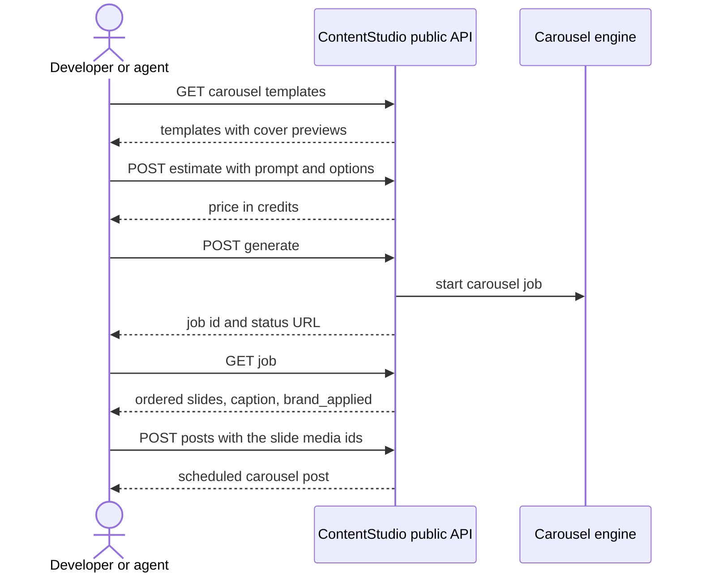

# Stories: AI carousel generation in the public API, CLI and MCP server

Epic: **AI Carousel post generation** (existing)

1. `[BE] Add AI carousel generation to the public API, CLI and MCP server`

---

# [BE] Add AI carousel generation to the public API, CLI and MCP server

### Description

As a developer, agency or AI agent building on ContentStudio, I want to generate carousels through the public API, the `contentstudio` CLI and the MCP server, with the same options AI chat and the Carousel Maker offer, so that I can create a branded, ready-to-schedule carousel from my own tools and workflows without opening the web app.

AI image and AI video generation are already on the public API, CLI and MCP server. Carousels are not. Anyone automating content has to generate slides elsewhere and upload them one by one.

This story adds carousels to all three surfaces. A caller can:

- list the carousel templates, with a cover preview for each
- get a price estimate
- start a generation with just a prompt, a chosen template, up to 2 reference images, or a written style description
- follow the job until it's done
- get back an ordered set of slides and one caption, ready to pass to the create-post endpoint as a carousel

**One set of options everywhere.** The options accepted here are the same ones AI chat and the Carousel Maker tool use: prompt, number of slides, size, look (let AI decide, template, reference, or custom description) and brand on or off. There is one definition of them, and all three entry points use it, so a new template or option appears everywhere at once.

It follows the existing AI video pattern, since a carousel takes a minute or more: estimate, generate, then poll the job.

---

### Workflow

1. A developer calls the templates endpoint and sees every template with its name, a "best for" line, supported sizes and a cover preview image.
2. They ask for an estimate for "5 tips for better LinkedIn headlines", 6 slides, portrait, template "clean-minimal", and see the credit cost.
3. They start the generation and get back a job ID and a status URL.
4. They poll the job. When it's done, it returns 6 slides in order, each saved to the workspace media library with a media ID, plus one caption.
5. They pass the media IDs and caption to the create-post endpoint and schedule a LinkedIn carousel.
6. Another time, they send only a prompt. The AI picks the look, just as when a chat user says "you decide".
7. Another time, they pass 2 reference images, and the carousel matches their style.
8. From the terminal, the same flow works with the CLI, for example `contentstudio carousels:templates` then `contentstudio carousels:generate --prompt "..." --template clean-minimal --slides 6`.
9. In Claude Desktop, an agent using the MCP server lists templates, generates a carousel and schedules it, all in one conversation.

---

### Acceptance criteria

**Templates**

- [ ] `GET /api/v1/workspaces/{workspace_id}/ai/carousels/templates` returns every library template with: id, display name, one-line "best for" description, supported sizes, and cover preview image URL
- [ ] The list comes from the same source as the template picker in AI chat and the Carousel Maker, so a new template appears on the API with no API change

**Options (same contract as AI chat and Carousel Maker)**

- [ ] Generate and estimate accept: `prompt` (required), `slide_count`, `size` (`square` or `portrait`), `style` and `use_brand`
- [ ] `style.mode` accepts `auto`, `template`, `reference` or `custom`:
    - `template` needs `style.template_id` from the templates list
    - `reference` takes up to 2 references, as media IDs from the workspace library or public image URLs
    - `custom` takes `style.description` in plain text
- [ ] Omitting `style` altogether means `auto`: the AI picks the look, and the request never stops to ask a question
- [ ] Defaults for `slide_count` and `size`, and the allowed `slide_count` range, match AI chat and the Carousel Maker exactly
- [ ] `use_brand` behaves as it does on the image API: omitted honours the workspace's brand setting, explicit overrides it for that request, and the response reports `brand_applied`
- [ ] The options are defined once and used by the API, AI chat and the Carousel Maker. A test proves the three accept the same set

**Estimate and generate**

- [ ] `POST /api/v1/workspaces/{workspace_id}/ai/carousels/estimate` returns the credit cost for the given options without generating or charging anything
- [ ] `POST /api/v1/workspaces/{workspace_id}/ai/carousels/generate` starts the carousel and returns `202` with a job ID and status URL, like AI video
- [ ] The job appears in and is followed through the existing AI jobs endpoints (`GET ai/jobs`, `GET ai/jobs/{job_id}`, `DELETE ai/jobs/{job_id}` to cancel)
- [ ] A finished job returns the slides in order, each with its position, media ID, URL, width and height, plus one caption, the template or style used, and `brand_applied`
- [ ] While running, the job reports progress as slides done out of total
- [ ] Every slide is saved to the workspace media library and appears in `GET /media`
- [ ] The returned media IDs and caption can be passed to `POST /posts` to create a carousel post on platforms that support carousels

**Editing**

- [ ] `POST /api/v1/workspaces/{workspace_id}/ai/carousels/{carousel_id}/edit` takes a plain-language instruction and an optional slide number, regenerates only what the instruction targets, and returns a job like generate
- [ ] The edited result keeps slide order and returns the updated slides and caption

**Credits, limits and errors**

- [ ] Generation and edits charge the same credits as the same carousel made in AI chat. Failed or refused generations charge nothing
- [ ] Carousel routes sit in the existing AI tools route group, with the same API key check, permissions, request logging, locale and `ai-tools` rate limit as images and videos
- [ ] Errors follow the v1 error shape, with distinct machine-readable codes for:
    - an unknown `template_id` (`422`)
    - too many references (`422`)
    - a reference that can't be read (`422`)
    - `slide_count` out of range (`422`)
    - out of API credits and out of AI credits (`403`, separate codes)
    - a content-policy refusal (`422`)
    - an upstream failure that's safe to retry (`502`)

**CLI**

- [ ] The `contentstudio` CLI gains commands following the existing AI image and video naming: list templates, estimate, generate, edit, and follow the job, with `--json` output in the standard `{ok, data}` envelope and `--dry-run` support
- [ ] `generate` can wait for the job to finish and print the slide media IDs, or return the job ID straight away with a flag
- [ ] The agent skill documents the carousel commands with an example of generating and scheduling a carousel

**MCP server**

- [ ] The MCP server exposes carousel templates, estimate, generate, edit and job status, either as dedicated tools or through `discover` plus `execute_read` / `execute_write`, matching how AI image and video are exposed
- [ ] An agent can go from "make a carousel about X and schedule it Friday on LinkedIn" to a scheduled post using MCP tools only
- [ ] Automation apps (Zapier, Make, n8n) can reach carousel generation through the MCP server or public API. Checked and noted in the pull request

**Documentation**

- [ ] The OpenAPI spec and the `/guide` reference include every carousel endpoint, the option schema, the job result shape and the error codes
- [ ] The public API docs have a short "Generate and schedule a carousel" quickstart

---

### Mock-ups:

None. Developer-facing.

---

### Impact on existing data:

Generated slides are saved to the workspace media library like AI images, and carousels are recorded like those made in chat. No schema changes to existing data.

---

### Impact on other products:

- **AI chat and Carousel Maker:** they must use the same option definition as this API. If either currently defines options on its own, it moves to the shared one.
- **Web, mobile, Chrome extension:** no visible change.
- **Automation apps:** gain carousel generation through the MCP server and public API.

---

### Dependencies:

- **[BE] Generate carousels as an ordered, themed slide set with one caption**
- **[BE] Edit a carousel by regenerating the slide the user names**
- **[BE] Ask for a carousel template before generating, with a cover preview for every template** (the template list and cover previews)
- **[BE] Send each carousel slide to the chat as soon as it is ready** (optional: lets the job report slide-by-slide progress)

---

### Global quality & compliance (wherever applicable)

- [ ] Mobile responsiveness: N/A, backend only
- [ ] Multilingual support (frontend + backend, translations available or fallback handled)
- [ ] UI theming support: N/A, backend only
- [ ] White-label domains impact review
- [ ] Cross-product impact assessment (web, mobile apps, Chrome extension)
- [ ] Developer surfaces coverage (any new or changed API is reflected in the public API, CLI, MCP server and automation apps, N/A when nothing API-facing changes)
