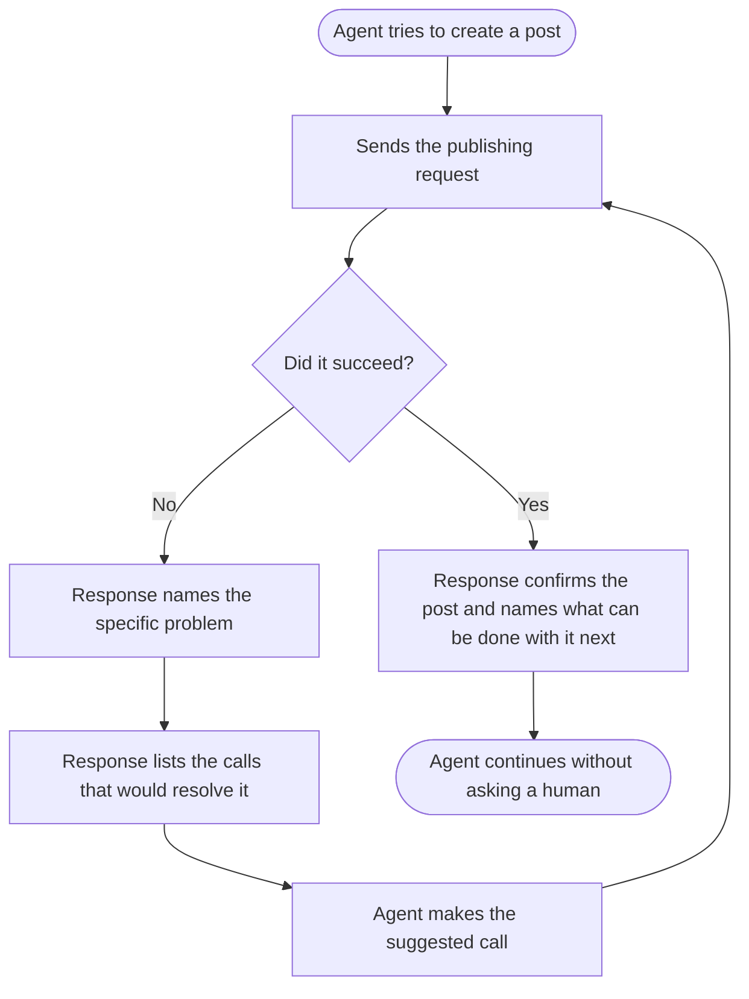

# Public API: Next Actions in Responses · Story

---

## [BE] Tell API callers what to do next when a publishing request fails

### Description

As a developer or AI agent using the ContentStudio public API, I want each response to tell me what to do next, so that when a call fails I can recover on my own instead of guessing from an error sentence or asking a human.

Today an agent that calls the publishing endpoints with a workspace it cannot use gets back a plain sentence and, in the most common cases, no machine-readable error identifier at all. It cannot tell that the problem was the workspace rather than the content, and nothing points it at the call that would fix the situation. The agent either stalls, retries the same failing request, or hands the problem back to the user.

The knowledge already exists in the product. It is written down as a static help guide for one integration surface, describing the sequence to follow: get the workspaces, then the accounts in that workspace, then create the post. That guidance is only useful to an agent that already knows to go looking for it, and it cannot tell the agent which step it actually got wrong. Putting the same guidance into the response, tailored to what just happened, turns a dead end into a recoverable step.

This matters more now that our own AI tooling is being rebuilt on top of the public API. Every tool that consumes these responses currently has to invent its own recovery logic from error text.

### Workflow

The caller here is a developer or an AI agent, so this describes what they send and receive.

1. An agent sends a request to create a post, giving a workspace and one or more accounts.
2. If the workspace cannot be used, the response says specifically that the workspace was the problem, distinguishable from a content problem or a permission problem, and lists retrieving the caller's workspaces as the next step.
3. If the accounts are the problem, the response says so and points at retrieving the accounts available in that workspace.
4. If the content itself fails validation, the response says which parts failed and what an acceptable value looks like.
5. If the account has run out of API credits, the response says so and points at the way to resolve it, rather than looking like a generic failure.
6. The agent follows the suggested step, retries, and succeeds without a human intervening.
7. On success, the response also names what can be done with the post next, so the agent knows whether it still needs approval, is scheduled, or is already published.

### Acceptance criteria

**Making failures identifiable**

- [ ] Every error response from the publishing endpoints carries a stable identifier for what went wrong, with no case returning an empty or missing one
- [ ] An unusable or unknown workspace returns its own distinct identifier, separate from a permission failure and separate from a content failure
- [ ] A locked or suspended workspace returns its own distinct identifier
- [ ] Running out of API credits returns its own distinct identifier, distinguishable from being denied access
- [ ] Invalid or unavailable social accounts return their own distinct identifier
- [ ] Content that fails validation returns its own distinct identifier along with which fields failed
- [ ] Identifiers are stable values that never change with the caller's language

**Telling the caller what to do next**

- [ ] Every error response from the publishing endpoints includes a list of next actions the caller can take
- [ ] Each next action names a capability of the public API that the caller can actually call
- [ ] Next actions are ordered, most useful first, when more than one applies
- [ ] Next actions are expressed in terms of the public API's own capabilities, never in terms of internal services
- [ ] An unusable workspace returns a next action pointing at retrieving the caller's workspaces
- [ ] Invalid accounts return a next action pointing at retrieving the accounts available in that workspace
- [ ] Running out of API credits returns a next action explaining how the limit is raised
- [ ] A validation failure returns a next action naming the fields to correct
- [ ] When nothing useful can be suggested, the field is present and empty rather than missing, so callers can rely on it always being there

**Success responses**

- [ ] A successful publishing response states the resulting state of the post, so the caller knows whether it is a draft, awaiting approval, scheduled, or published
- [ ] A successful publishing response lists what can be done with the post next, appropriate to that state
- [ ] A post that was created but still needs approval says so explicitly rather than reading as fully published

**Not breaking anyone**

- [ ] The existing response fields are unchanged in name, meaning and position, so current integrations keep working untouched
- [ ] The next actions are an addition to the response, never a replacement for the existing message
- [ ] The human-readable message continues to be translated as it is today
- [ ] The machine-readable identifiers and next actions are never translated, and are identical regardless of the caller's language
- [ ] A caller that ignores the new field sees no change in behaviour

**Consistency**

- [ ] The shape of the next-actions field is defined once and is identical across every endpoint that returns it, rather than differing per endpoint
- [ ] The publishing endpoints are covered in full by this story
- [ ] The identifiers and their next actions are published in the API reference documentation, including the full list of identifiers a caller can expect
- [ ] The documentation states that the list of identifiers may grow over time and that callers should handle unknown ones gracefully

### Mock-ups

N/A. Developer-facing API surface.

### Impact on existing data

None. No stored data changes. This affects the shape of responses only.

### Impact on other products

- **Public API consumers:** additive change, no action required from existing integrators.
- **AI agents platform:** directly benefits. The internal tooling being built on the public API can rely on typed failures and suggested recovery instead of parsing error sentences.
- **MCP and CLI surfaces:** these should eventually carry the same next actions so all developer surfaces behave alike. Out of scope here, but the shape defined by this story should be the one they adopt. Relates to the developer surface parity contract work.
- **Mobile app:** no impact.
- **Chrome extension:** no impact.

### Dependencies

None.

### Global quality & compliance (wherever applicable)

- [ ] Mobile responsiveness — N/A, backend-only story
- [ ] Multilingual support (frontend + backend, translations available or fallback handled) — the human message stays translated, the machine-readable parts must not be
- [ ] UI theming support — N/A, backend-only story
- [ ] White-label domains impact review
- [ ] Cross-product impact assessment (web, mobile apps, Chrome extension)
