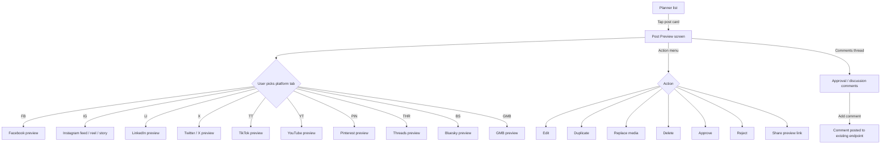

# Stories — Q2 2026: Android Improvements

**Epic (notional, not in Shortcut):** Q2 2026: Android improvements
**Platform:** Android
**Type:** UI parity revamp + new Post Preview surface
**Pipeline:** local `/story` (no Shortcut push)

**Story order / dependency:**
Story 1 (Planner revamp) and Story 2 (Post Preview) can ship independently, but Post Preview is most useful **after** the Planner revamp lands because both share the same post-card / status / filter visual language. Engineering can sequence as preferred.

| # | Story |
|---|---|
| 1 | [Android] Revamp the Planner screen for parity with iOS (list, status, sort, filters, sections) |
| 2 | [Android] Add a Post Preview screen in the Planner for per-platform post previews |

---

## Story 1 — [Android] Revamp the Planner screen for parity with iOS (list, status, sort, filters, sections)

### Description
As an Android user planning and reviewing posts, I want the Android Planner to look and behave the same way the iOS Planner does, so that I can move between devices without re-learning the screen and so that every option available on iOS is also available to me on Android.

This is a UI parity revamp — same Planner functionality (list posts, filter, sort, approve, reject, edit, delete, replace media) but with the visual layout, status pills, filter sheets, sort options, section headers, and empty states styled to match iOS. No data-model or API changes.

### Workflow
1. The user opens the **Planner** tab on Android. They see a list of scheduled, published, and pending posts grouped by date sections (e.g. "Today, 17 May", "Tomorrow, 18 May", "Mon, 19 May"). Section headers stick to the top while scrolling.
2. Each post is rendered as a card matching iOS: thumbnail or media preview, platform icons (multiple if cross-posted), scheduled-for time, status pill (Scheduled, Published, Failed, Rejected, Draft, In Review, Missed Review, External Action), social-account row showing avatars + handles, an action menu (`⋯`), and a repeat / evergreen indicator when applicable.
3. The user taps the **Status filter** in the top bar. A bottom sheet appears with the full iOS list of statuses (All, Scheduled, Published, Failed, Rejected, Draft, In Review, Missed Review, Content Category, External Action). Selecting one closes the sheet and refreshes the list.
4. The user taps the **Sort** icon. A bottom sheet appears with the iOS sort options: Date (newest first), Date (oldest first), By social account, By post type, By label, By member. The selected option is highlighted and persists across sessions.
5. The user taps the **Filter** icon. A bottom sheet opens with a single consolidated filter view (replacing today's separate ByLabel / ByMember / ByOrder / ByType screens). Sections are: Social accounts, Labels, Members, Post types. Each section supports multi-select chips. A sticky footer shows **Clear all** and **Apply (X)** with the active-count.
6. The user taps a post's action menu (`⋯`). The same menu appears as on iOS: Edit, Duplicate, Replace media, Delete, Approve, Reject, Add comment, View on platform.
7. The user pulls down to refresh. The user can scroll to the bottom to load more.

### Acceptance criteria
- [ ] Each Planner row uses the new post-card layout: media thumbnail (left), platform icons row, scheduled-for time, status pill, social-account row, action menu (`⋯`), repeat / evergreen indicator. Layout matches iOS `PlannerPostCardView` visually.
- [ ] Status pill colors and labels match iOS exactly for: Scheduled, Published, Failed, Rejected, Draft, In Review, Missed Review, Content Category, External Action.
- [ ] Date section headers render with the same format as iOS (e.g. "Today, 17 May 2026"), stick to the top on scroll, and show a count badge of posts in the section.
- [ ] The **Status filter** opens as a bottom sheet (not a separate Activity / full-screen Fragment) and lists every iOS status option in the same order.
- [ ] The **Sort** option opens as a bottom sheet and offers every iOS sort: Date (newest first), Date (oldest first), By social account, By post type, By label, By member. The user's choice persists across app restarts.
- [ ] The consolidated **Filter** sheet replaces today's four separate filter screens (`PlannerOtherFilter/ByLabel`, `ByMember`, `ByOrder`, `ByType`) — those screens are removed from the navigation graph.
- [ ] The Filter sheet supports multi-select chips per section, with a "(X selected)" subhead per section header, and a sticky footer with **Clear all** and **Apply (N)** showing the post count that would result.
- [ ] Applied filters render as a horizontally scrollable chip row above the list. Tapping a chip's `×` removes that single filter.
- [ ] The post action menu (`⋯`) offers: **Edit**, **Duplicate**, **Replace media**, **Delete**, **Approve**, **Reject**, **Add comment**, **View on platform** — same items as iOS, same enabled/disabled rules per status.
- [ ] The Approve / Reject flow opens with the same visual layout as iOS `ApproveRejectPostSwiftUI`: status header, post preview, comment input, Approve / Reject CTAs.
- [ ] The Social account selector matches the iOS `PlannerSocialAccountSelection` layout: avatars + handles + platform icon, multi-select chips with "Select all" and "Clear".
- [ ] The empty state (no posts at all, or no posts after filtering) uses the same illustration + headline + sub-copy as iOS, with a "Compose post" CTA when no posts at all.
- [ ] The loading state shows skeleton cards (not a full-screen spinner over a blank screen).
- [ ] Error state on list load failure shows the same illustration + retry CTA as iOS.
- [ ] Pull-to-refresh works on the list.
- [ ] Infinite scroll / "load more" works on the list with a skeleton card at the bottom while loading the next page.
- [ ] All copy is loaded from the existing `values*/planner_strings.xml` files (en, de, el, es, fr, it, pl, zh). New strings introduced for parity are added to **all 8 locales** (English source + translation placeholders or fallbacks per the existing localization policy).
- [ ] All colors, dimensions, and typography come from existing app-wide resources (`colors.xml`, `dimens.xml`, `styles.xml`); no inlined hex codes or magic dp values inside layouts/views.
- [ ] No regression in supported behavior: the user can still complete every action available on the current Android Planner (filter, sort, approve, reject, edit, delete, replace, add comment, view on platform, navigate to social-account selection).
- [ ] Existing analytics events on Planner actions continue to fire with the same names + payloads.
- [ ] Notification-status confirm dialog (`PlannerNotificationStatusConfirmDialogFragment`) is preserved or styled to match the iOS equivalent.

### Mock-ups
N/A — visual parity is judged against the live iOS Planner. iOS reference views in `contentstudio-ios-v2/ContentStudio/Views/Planner/SwiftUI/` and `Controllers/Nav Menu VCs/Planner/` are the canonical reference for layout, copy, and option order.

### Impact on existing data
None. Same endpoints, same payloads, same `Submission` / `PlannerListItem` model.

### Impact on other products
- **Backend / API:** no changes.
- **iOS:** no changes — iOS is the reference; nothing changes there.
- **Web app, Chrome extension:** no changes.

### Dependencies
- None — uses existing Android resources, models, and API client.

### Global quality & compliance (wherever applicable)
- [ ] Mobile responsiveness (frontend only, N/A for backend-only stories) — verify on small phones, tablets, and landscape.
- [ ] Multilingual support (frontend + backend, translations available or fallback handled) — verify all 8 locales for both existing strings and any new ones.
- [ ] UI theming support (default + white-label, design library components are being used) — N/A for white-label on Android.
- [ ] White-label domains impact review — N/A.
- [ ] Cross-product impact assessment (web, mobile apps, Chrome extension) — verified none.

### Implementation references
*Pointers from research — not a contract. Engineering may choose a different approach.*

**Primary entry points (today):**
- `Planner/PlannerActivity.java` (787 lines)
- `Planner/PlannerStateData.java`
- `Planner/Fragments/PlannerFilterFragment.java`
- `Planner/Fragments/PostsFragment.java` + `BasePostsFragment.java`
- `Planner/Fragments/PlannerListViewAdapter.java`, `PlannerListItem.java`, `SectionHeaderPlannerList.java`
- `Planner/Fragments/ApproveRejectFragment/`
- `Planner/Fragments/PlannerNotificationStatusConfirmDialogFragment.java`
- `Planner/PlannerOtherFilter/{ByLabel,ByMember,ByOrder,ByType}` — consolidate / remove
- `Planner/PlannerSocialAccountSelection/PlannerSocialAccountSelectionFragment.java`

**iOS reference (read-only — source of truth for parity):**
- `Controllers/Nav Menu VCs/Planner/PlannerBaseViewController.swift`
- `Controllers/Nav Menu VCs/Planner/PlannerFilterOptionsView.swift`
- `Controllers/Nav Menu VCs/Planner/PlannerStatusBottomSheet.swift`
- `Controllers/Nav Menu VCs/Planner/PlannerSortBottomSheetPreview.swift`
- `Controllers/Nav Menu VCs/Planner/PlannerStatusFilterViewController.swift`
- `Views/Planner/SwiftUI/PlannerPostCardView.swift`
- `Views/Planner/SwiftUI/PlannerDataTableViewCellSwiftUI.swift`
- `Views/Planner/Approve Reject/SwiftUI/ApproveRejectPostSwiftUI.swift`

**Layout / resource files (today):**
- `res/layout/activity_planner.xml`, `content_planner.xml`, `item_planner.xml`, `planner_filters.xml`, `section_header_planner_view.xml`, `fragment_planner_*.xml`
- `res/values*/planner_strings.xml` (8 locales)
- `res/drawable*/planner_*.png` — may need new vector drawables for new status pills / chips

**Gotchas:**
- Date-section sticky headers in `RecyclerView` need an `ItemDecoration` (sticky header) — Android's stock `RecyclerView` does not provide this out of the box. The current implementation may or may not have sticky headers; preserving the iOS behavior likely requires adding one.
- Multiple `Planner` filter sub-screens are launched as separate Fragments today — consolidating them into a single bottom-sheet means removing 4 Fragments and their layouts. Make sure no other screen deep-links to them.
- Status pill colors must be defined as `ColorStateList` / theme attributes so they stay consistent if the app ever introduces dark theme (currently out of scope but cheap to do correctly).
- The app is on Java + XML — Compose is not adopted elsewhere. Stay on Java + XML unless engineering decides to introduce Compose for this story (would be a much larger decision).

---

## Story 2 — [Android] Add a Post Preview screen in the Planner for per-platform post previews

### Description
As an Android user reviewing scheduled posts, I want to see a per-platform preview of each post before it publishes (the same preview I see on iOS), so that I can verify how the post will appear on Facebook, Instagram, LinkedIn, X, TikTok, YouTube, Pinterest, Threads, Bluesky, and GMB without leaving the Planner.

This story adds a brand-new screen on Android — there is no post-preview surface today. It mirrors the iOS `PostPreviewView` (3334 lines, SwiftUI). No data-model or API changes — the preview consumes the same `Submission` / `PlannerListItem` data the Planner list already loads.

### Workflow

1. From the Planner list, the user taps a post card. The **Post Preview** screen opens.
2. The user sees: a top app bar with the post title or scheduled time, an overflow action menu (`⋯`), and a horizontally scrollable tab row of the platforms the post is targeting (only the platforms in this submission show as tabs — not all 10).
3. The user picks a platform tab. The body re-renders as a faithful preview of how the post will look on that network: avatar + handle + timestamp, media (image grid / video player / carousel / story / reel as appropriate), caption with hashtags + mentions, first-comment if set, link preview / OG card if a URL is in the caption, location chip if set.
4. Below the preview, a **Comments / approval discussion** section shows the existing in-app conversation about this post (same data as today's approval comments). The user can scroll the thread and post a new comment.
5. The action menu (`⋯`) offers: Edit, Duplicate, Replace media, Delete, Approve, Reject, Share preview link. Each routes to the same flow used elsewhere in the Planner today.
6. The user taps back to return to the Planner list with scroll position preserved.

### Acceptance criteria
- [ ] Tapping a post card in the Planner list opens the new Post Preview screen.
- [ ] The Post Preview screen shows only the platform tabs that exist in the current submission (e.g. a post going to Facebook + Instagram + LinkedIn shows 3 tabs, not 10).
- [ ] Each platform tab renders a preview that visually matches the iOS `PostPreviewView` for that platform — same layout, same iconography for likes/comments/shares, same media handling (image grid for IG feed, full-bleed for IG story, vertical video for reel, etc.).
- [ ] **Facebook preview** shows: profile avatar + page name + timestamp + privacy icon, caption (with link preview / OG card if a URL is in the caption), media (image carousel or video), reactions row (mocked counts).
- [ ] **Instagram preview** supports three modes — Feed, Reel, Story — selectable via a sub-tab when the post type permits it. Feed shows square media + caption truncated with "more"; Reel shows full-bleed vertical video + caption overlay; Story shows full-bleed media without caption.
- [ ] **LinkedIn preview** shows: profile / company avatar + name + headline + timestamp, caption, media, reactions row.
- [ ] **Twitter / X preview** shows: avatar + name + handle + timestamp, caption (truncated to platform limit with character counter), media, reply / repost / like icons.
- [ ] **TikTok preview** shows: full-bleed vertical video, profile avatar + handle, caption overlay, right-side action stack (like / comment / share).
- [ ] **YouTube preview** shows: video thumbnail + title + channel, description with first 2 lines visible.
- [ ] **Pinterest preview** shows: pin image (tall aspect), title, description, board name.
- [ ] **Threads preview** shows: avatar + name + timestamp, caption, media, reply / repost / like icons.
- [ ] **Bluesky preview** shows: avatar + name + handle + timestamp, caption, media, reply / repost / like icons.
- [ ] **GMB preview** shows: business avatar + name, post-type label (Update / Event / Offer), media, caption, optional CTA button.
- [ ] Below the preview, a **Comments / approval discussion** section reuses the existing approval-comment endpoint and renders comments with: avatar, name, timestamp, comment body, attachments. The user can post a new comment via an input bar at the bottom.
- [ ] The action menu (`⋯`) offers the same items as the Planner row's action menu: Edit, Duplicate, Replace media, Delete, Approve, Reject, Share preview link. Enabled/disabled rules match the Planner row exactly (per post status).
- [ ] **Share preview link** generates / copies the same shareable URL used by iOS and the web.
- [ ] Loading state: skeleton platform tab + skeleton preview block (no full-screen blank).
- [ ] Error state: illustration + retry CTA when the post fails to load.
- [ ] Empty media: a "No media" placeholder renders where media would appear.
- [ ] All copy is loaded from a new `values*/post_preview_strings.xml` resource added to all 8 locales (en, de, el, es, fr, it, pl, zh). English source strings are authored; non-English locales use the existing translation policy.
- [ ] All colors / dimens / typography come from existing app-wide resources — no inlined hex codes, no magic dp values.
- [ ] Existing analytics tracking (post viewed, post approved, post rejected, etc.) fires when those actions happen on the preview screen — verify the same event names + payloads are used as in the Planner list.
- [ ] Posting a new analytics event for `post_preview_opened` (or reusing an existing one if there is one) is added so we can track preview adoption. Check for an existing event before introducing a new name.
- [ ] No regression: opening the Planner list, approving / rejecting from the list, and every existing Planner action continue to work — Post Preview is an additive screen.

### Mock-ups
N/A — iOS `PostPreviewView.swift` (3334 lines) and the per-platform sub-views are the reference. Engineering / design should pull screenshots from iOS for the implementation review.

### Impact on existing data
None. No new endpoints, no schema changes, no migration. Consumes the existing `Submission` / `PlannerListItem` data already loaded by `PostsFragment`.

### Impact on other products
- **Backend / API:** no changes.
- **iOS:** no changes — iOS is the reference.
- **Web app, Chrome extension:** no changes.

### Dependencies
- **[Android] Revamp the Planner screen for parity with iOS** is highly recommended to ship first (or alongside this one). The post-card visual language, action-menu items, and shared filter/sort patterns are easier to keep consistent if both stories use the same base.

### Global quality & compliance (wherever applicable)
- [ ] Mobile responsiveness — verify on small phones, tablets, landscape.
- [ ] Multilingual support — add new strings to all 8 locales.
- [ ] UI theming support — N/A for white-label on Android.
- [ ] White-label domains impact review — N/A.
- [ ] Cross-product impact assessment — verified none.

### Implementation references
*Pointers from research — not a contract. Engineering may choose a different approach.*

**iOS reference (source of truth for visual parity):**
- `Views/Planner/SwiftUI/PostPreviewView.swift` (3334 lines)
- `Views/Planner/SwiftUI/MediaPreviewView.swift`
- `Views/Comments/PostPreviewCommentsView.swift`, `PostPreviewCommentBubbleView.swift`, `PostPreviewCommentInputBar.swift`, `PostPreviewApprovalRowView.swift`

**Existing Android entry points (to integrate with):**
- `Planner/Fragments/PostsFragment.java` — tap handler on a post row needs to launch the new Post Preview Activity / Fragment
- `Planner/Fragments/PlannerListItem.java` — already carries enough data for the preview; no new fields needed
- `Planner/Fragments/PlannerListViewAdapter.java` — wire the tap target
- `ComposerActivity/` — for the **Edit** action's destination (already exists)
- Approval comments — find the existing endpoint that loads approval discussion (`grep` for `approval_comment` / `discussion` in `Network/`)

**Suggested module layout:**
- New `Planner/PostPreview/PostPreviewActivity.java` (Activity host) **or** `Planner/PostPreview/PostPreviewFragment.java` (Fragment host) — engineering's call
- `Planner/PostPreview/PlatformTabAdapter.java` (ViewPager2 adapter)
- `Planner/PostPreview/platforms/`:
  - `FacebookPreviewFragment.java`
  - `InstagramPreviewFragment.java` (with feed / reel / story sub-modes)
  - `LinkedInPreviewFragment.java`
  - `TwitterPreviewFragment.java`
  - `TikTokPreviewFragment.java`
  - `YouTubePreviewFragment.java`
  - `PinterestPreviewFragment.java`
  - `ThreadsPreviewFragment.java`
  - `BlueskyPreviewFragment.java`
  - `GMBPreviewFragment.java`
- Layouts:
  - `res/layout/activity_post_preview.xml` (or `fragment_post_preview.xml`)
  - `res/layout/fragment_post_preview_facebook.xml`, `_instagram.xml`, … one per platform
  - `res/layout/item_post_preview_media.xml`, `item_post_preview_comment.xml`
- Strings: `res/values*/post_preview_strings.xml`
- Drawables: per-platform chrome glyphs (like, comment, share, reaction icons)

**Gotchas:**
- Instagram has three sub-modes (Feed / Reel / Story) — iOS handles this with a segmented sub-tab inside the IG tab. Match that pattern.
- TikTok's full-bleed vertical video preview needs to honor the system status bar — make sure it doesn't break edge-to-edge.
- Link previews (OG cards) need URL extraction from the caption — iOS likely uses the existing share-preview-link service. Check `Network/` for an existing link-preview endpoint before adding a new one.
- The approval-discussion comments thread already exists on the iOS side and on the web — the API endpoint should already be in use somewhere in `Network/`. Reuse, do not re-introduce.
- Per-platform character-count truncation must match the platform's actual limit (FB ~63K, X 280, IG ~2200, LinkedIn ~3000, etc.) — pull the constants from a shared place if iOS already centralized them.
- `Submission.java` is the existing model name in `Planner/PlannerItems/` — make sure all the per-platform data is reachable from it (media URLs, caption variants per platform, scheduled time per platform).
