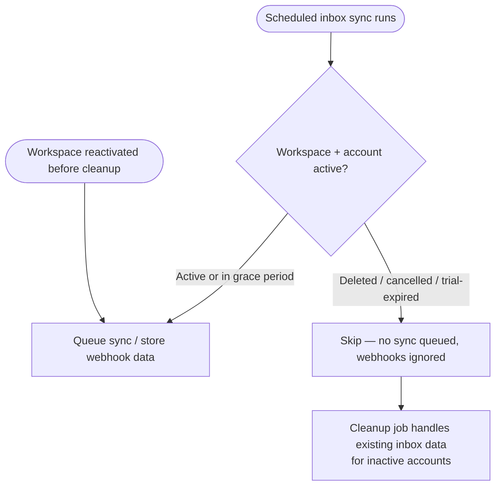
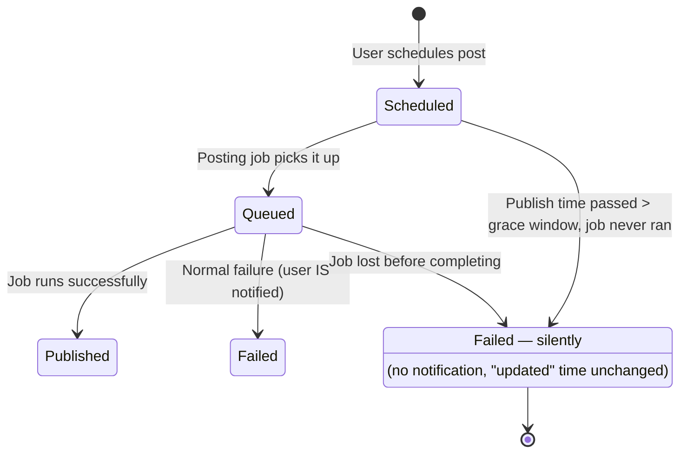

# Stories — Q2 Misc batch

Four standalone stories for the **Q2 - 2026: Miscellaneous** epic. Each carries its own Shortcut fields block. Nothing is pushed to Shortcut — the Product Owner creates these manually using the **New Feature Template**.

---

## 1. [BE] Stop fetching and clean up inbox data for deleted / expired accounts

### Description:
As ContentStudio, we want the social inbox to **stop ingesting new data** for accounts that belong to deleted, cancelled, or trial-expired workspaces, and to **clean up the inbox data we already store** for them — so we don't spend fetch/storage/compute on accounts no longer entitled to the product, and we don't retain inbox content (conversations, messages, comments, reviews) for customers who have left.

We already do this for **Analytics** — it stops fetching data for inactive accounts. This brings the **Inbox** to parity (stop fetching) and goes one step further (cleans up existing data, which Analytics does not do).

---

### Workflow:

1. On each scheduled inbox sync run, the system considers only accounts whose workspace is active (or in a paying grace/past-due period) and whose account is valid and not deleted — the same rule Analytics already uses.
2. Accounts on deleted, cancelled, or trial-expired workspaces are skipped: no new sync job is queued for them.
3. When an inbox webhook arrives for an account on an inactive/deleted workspace, it is ignored (not stored).
4. Existing inbox data (conversations, messages, comments, reviews) belonging to inactive/deleted accounts is cleaned up according to the **data-handling approach agreed with the team lead** (see Open decision below).
5. If a workspace is reactivated before its data is cleaned up, syncing resumes normally for its accounts.

---

### Acceptance criteria:

- [ ] Scheduled inbox sync jobs are queued **only** for accounts on active workspaces (matching the Analytics rule — active or paying grace/past-due workspaces, with valid, non-deleted accounts).
- [ ] No new inbox sync job is queued for accounts on deleted, cancelled, or trial-expired workspaces.
- [ ] This behavior applies across **all** inbox platforms: Facebook, Instagram, LinkedIn, YouTube, and Google Business.
- [ ] Incoming inbox webhooks for accounts on inactive/deleted workspaces are not stored.
- [ ] Existing inbox data (conversations, messages, comments, reviews) for inactive/deleted accounts is handled per the approach agreed with the team lead — verified that the targeted data is no longer fetched or surfaced after the cleanup runs.
- [ ] Cleanup is scoped per **workspace + account**: an account that is still active in one workspace keeps its data and syncing there, even if it is inactive in another workspace.
- [ ] If a workspace is reactivated before cleanup runs, syncing resumes for its accounts.
- [ ] The cleanup job is safe to re-run (idempotent) and logs how many accounts/records it processed.

---

### Open decision (confirm with team lead):
**How to handle existing inbox data** for inactive accounts — to be planned with the team lead. Options on the table:
- **Hard delete** — permanently remove the documents (frees storage; not recoverable on reactivation).
- **Soft delete** — flag and exclude from queries, keep in MongoDB (reversible; storage not freed).
- **Delete after a retention window** — soft-delete now, hard-purge after e.g. 30 days inactive (safer against temporary expiry).

The "stop fetching" behavior above is fixed regardless of which option is chosen; only the existing-data handling depends on this decision.

---

### Mock-ups:
N/A — backend-only.

---

### Impact on existing data:
Existing inbox documents (`inbox_details`, `inbox_messages`, `inbox_comments`) for inactive/deleted accounts will be removed or flagged depending on the approach chosen above. Potentially large volume — must be scoped per workspace + account so shared accounts are not affected in workspaces where they remain active.

---

### Impact on other products:
- **Web + mobile inbox:** after cleanup, inactive accounts show no inbox data — the intended outcome. No mobile dev work needed; clients simply reflect the cleaned data.
- **White-label:** white-label workspaces follow the same active/inactive rule.
- **Chrome extension:** N/A.

---

### Dependencies:
None blocking. Mirrors the existing Analytics "stop fetching for inactive accounts" behavior — reuse that account/workspace-status rule as the source of truth.

---

### Global quality & compliance (wherever applicable)

- [ ] Mobile responsiveness — N/A, backend-only
- [ ] Multilingual support — N/A, no user-facing copy
- [ ] UI theming support — N/A, no UI
- [ ] White-label domains impact review
- [ ] Cross-product impact assessment (web, mobile apps, Chrome extension)

---

### Implementation references
*Pointers from research — not a contract. Engineering may choose a different approach.*

**Codebase:** `social-inbox-manager/` (Python — FastAPI, Kafka, MongoDB, Redis), not the Laravel backend.

**Pattern to mirror (Analytics):**
- `contentstudio-social-analytics-go/src/db/mongodb/client.go` → `buildNeedingUpdateFilter()` filters accounts at scheduler time: `validity = "valid"`, `state ∈ {added, syncing, processed, failed}` (never `deleted`), `super_admin_state ∈ {active, past_due}`. Reuse the same rule for inbox.

**Primary entry points (one per platform — apply the same change to each):**
- `social-inbox-manager/app/jobs/facebook_inbox_job.py` (+ `instagram_`, `youtube_`, `linkedin_`, `gmb_` siblings) — the daily sync trigger; today queries `{"validity": "valid", "type": "Page"}` with no status check.
- `social-inbox-manager/app/database/mongo/repository/facebook_account_repository.py` (+ siblings) — `find_by_filters()` has no status filtering; add an "active accounts only" query.
- `social-inbox-manager/app/workers/facebook_inbox_worker.py` (+ siblings) — webhook ingestion; add an account-status pre-filter before storing.
- New: an inbox-data cleanup/purge job (no equivalent exists today).

**Status source of truth:** the shared `social_integrations` collection (`super_admin_state` is set by the backend Workspace/subscription state). There is currently no Kafka event stream for status changes, so the filter must run at job/sync time (direct Mongo read), not via an event listener.

**Gotchas:**
- Check **both** the account's `super_admin_state` and the workspace subscription state (Analytics only checks account level).
- One account can belong to multiple workspaces — key the purge on `workspace_id` + `account_id`, never `account_id` alone.
- Webhooks can arrive for a just-deleted account — the worker-level pre-filter handles that race.

---

### Shortcut fields
- **Template:** New Feature Template
- **Story type:** Chore
- **Project:** Web App
- **Group:** Backend
- **Epic:** Q2 - 2026: Miscellaneous
- **Priority:** High
- **Product area:** Inbox
- **Skill set:** Backend
- **Estimate:** _(empty — devs estimate at sprint planning)_
- **Labels:** none
- **Iteration:** assigned by PO at creation

---

## 2. [Design] Unify the two desktop-rail notification panels into one consistent design

### Description:
As a ContentStudio user, I want the two notification panels that open from the bottom of the desktop left rail — **approval notifications** and **general notifications** — to share the **same visual design language and UI patterns**, so they feel like one product instead of two designs bolted together.

**The two panels remain separate** — separate components, separate functionality, and separate notification data. This story does **not** merge them. It only makes them visually consistent: the same building-block elements (panel shell, header, list item, read/unread indicator, filters, empty/loading/error states, mark-as-read) drawn from one shared design pattern, so each panel keeps its own content and behavior but looks like it belongs to the same family.

Today there are two panels anchored at the bottom of the desktop rail: a newer **approval notifications** panel (modern design library, semantic status colors, "Unread / All" filters, rich empty state) and an older **general notifications** panel (legacy icon styling, everything tinted blue, four tabs, minimal empty state). This story produces the shared design pattern both panels adopt. (Frontend implementation is a separate follow-up story.)

---

### Workflow:
1. The user clicks the approval-notifications icon at the bottom of the desktop left rail and sees the approval panel.
2. The user clicks the general-notifications (bell) icon and sees the general panel.
3. Today the two panels look different even though they sit side by side (header style, list-item design, status colors, filter styling, empty states, mark-as-read styling).
4. After this redesign, both panels are built from the same visual elements and design pattern — shell, list-item, icon/color system, filter styling, empty/loading/error states, and mark-as-read treatment — so switching between them feels seamless. Each panel still shows its own notifications and keeps its own functionality; only the look-and-feel is shared.

---

### Acceptance criteria:

- [ ] A single notification-panel design pattern is delivered in Figma and applied to **both** the approval panel and the general notifications panel — the panels stay separate, only the design language is shared.
- [ ] Shared panel shell: consistent width, max-height, header, padding, border/shadow, and open/close behavior from the desktop rail.
- [ ] Consistent list-item design across both panels: icon/avatar, title, body text, timestamp, and read/unread indicator are visually identical.
- [ ] One icon + color system that conveys notification type/tone consistently — replacing today's mismatch where the approval panel uses semantic colors (approved/rejected/pending) and the general panel tints everything blue.
- [ ] Consistent filter/tab **styling** — the approval panel's "Unread / All" pills and the general panel's "All / System / Team / Inbox" tabs use the same visual treatment, while each panel keeps the filters relevant to its own content.
- [ ] Defined and visually consistent **empty**, **loading**, and **error** states for both panels (headline, subtext, illustration/icon, and CTA where relevant).
- [ ] Consistent **mark-as-read** and **mark-all-as-read** styling/treatment across both panels.
- [ ] All elements specified using `@contentstudio/ui` design-library components (no legacy icon-font styling), so the implementation can drop legacy classes.
- [ ] Design uses theme tokens/variables (no hardcoded brand colors) so both panels render correctly under white-label theming.
- [ ] Hand-off includes a spec/redline for spacing, type, and color tokens, plus notes on which existing design-system components are reused vs. need updates.

---

### Mock-ups:
This story produces the mock-ups (Figma).

---

### Impact on existing data:
None.

---

### Impact on other products:
- **Desktop web only** — both panels live in the desktop left rail.
- **Mobile apps** have their own notification UI and are **not** in scope here.
- **White-label:** the unified design must use theme variables so it adapts to white-label brand colors.
- **Chrome extension:** N/A.

---

### Dependencies:
A follow-up **[FE]** story will implement the unified design across both panels — out of scope for this design story.

---

### Global quality & compliance (wherever applicable)

- [ ] Mobile responsiveness — N/A, desktop-rail panels (mobile has a separate notifications UI)
- [ ] Multilingual support — design must accommodate longer translated strings without breaking layout
- [ ] UI theming support (default + white-label, design library components are being used)
- [ ] White-label domains impact review
- [ ] Cross-product impact assessment (web, mobile apps, Chrome extension)

---

### Implementation references
*Pointers from research — not a contract. Engineering may choose a different approach.*

**Components to reconcile (for the designer's and the follow-up FE story's reference):**
- `contentstudio-frontend/src/components/layout/DesktopNavigationRail.vue` — the desktop rail; both notification icons (Stamp = approval, BellRing = general) sit at the bottom and anchor both panels.
- `contentstudio-frontend/src/modules/approval-workflows/components/ApprovalNotificationsPanel.vue` — the **newer** panel. Fully `@contentstudio/ui` (Icon, Button, ActionIcon) + Tailwind; gradient header; "Unread / All" pill filters with counts; tone-aware item icons (green/red/yellow); rich empty state with CTA.
- `contentstudio-frontend/src/components/common/TopNotificationDropdown.vue` — the **older** panel. Legacy `icon-*-cs` icon-font classes + `_dropdown.css`; plain header; "All / System / Team / Inbox" tabs; item backgrounds default to blue; minimal empty state; infinite-scroll pagination.

**Key inconsistencies the unified design must resolve:** icon + color system (semantic vs. all-blue), component library (modern vs. legacy classes), header/layout, filter pattern, empty/loading/error states, and the read/unread indicator + mark-read interaction model.

---

### Shortcut fields
- **Template:** New Feature Template
- **Story type:** Chore
- **Project:** Web App
- **Group:** Design
- **Epic:** Q2 - 2026: Miscellaneous
- **Priority:** Medium
- **Product area:** Throughout Product
- **Skill set:** Design
- **Estimate:** _(empty — devs estimate at sprint planning)_
- **Labels:** none
- **Iteration:** assigned by PO at creation

---

## 3. [BE] Silently fail posts stuck in "scheduled" past their publish time

### Description:
As ContentStudio, we want posts that were scheduled but **never actually published** — stuck in "scheduled" long after their publish time because their background job got lost — to be automatically marked as **failed**, **quietly**. This way the planner reflects the truth (these posts did not go out) without spamming users with notifications and without resurfacing very old posts at the top of their "recently updated" lists.

A stuck "scheduled" post currently misleads the user into thinking content is still going out, when in fact nothing will ever happen.

---

### Workflow:

1. A post's scheduled time passes, but its publishing job never ran (it got lost), so the post stays "scheduled" indefinitely.
2. A background sweep periodically looks for posts still in "scheduled" (or "queued") whose scheduled time passed more than the grace window ago and that were never processed.
3. The sweep marks each such post as **Failed**.
4. **No notification** of any kind (in-app, email, or push) is sent for these silent failures.
5. The post's **"last updated" time is left unchanged**, so it does not jump to the top of lists sorted by recently updated.
6. The user sees the post as Failed in the planner the next time they look — accurately reflecting that it did not publish — and can retry or delete it like any other failed post.

---

### Acceptance criteria:

- [ ] A scheduled background sweep identifies posts still in `scheduled` (and `queued`) status whose scheduled publish time passed more than the grace window ago (default **6 hours** — see Open decision) and that were never processed/published.
- [ ] Each identified post's status is changed to `failed`.
- [ ] **No notification** of any kind (in-app, email, push, or websocket/real-time) is sent for these failures.
- [ ] The post's **"updated" timestamp is not changed** — swept posts do not move to the top of lists sorted by "recently updated."
- [ ] Any leftover scheduling entry for a swept post is cleaned up so it cannot be re-picked or get re-stuck.
- [ ] Posts whose scheduled time is still within the grace window are left untouched — the sweep never races posts that are still legitimately being processed.
- [ ] Normal publishing and normal failures (which DO notify the user) are unaffected — only genuinely-stuck posts are touched.
- [ ] The sweep is idempotent and logs how many posts it silently failed (for audit), without producing any user-facing notification.
- [ ] After being swept, a post behaves like any other failed post (the user can retry or delete it).

---

### Open decision (confirm with team lead):
- **Grace window:** how far past the scheduled time before a post counts as stuck. It must exceed the normal posting window (posting jobs can run up to ~4 hours). Proposed default: **6 hours**. Tunable.
- **Statuses swept:** `scheduled` only, or also `queued`? Proposed: **both**, since a lost job can leave a post in either.

---

### Mock-ups:
N/A — backend-only, no UI change beyond the status the user already sees on failed posts.

---

### Impact on existing data:
Existing stuck plans (status `scheduled`/`queued`, scheduled time well in the past, never processed) have their status set to `failed`. Their "updated" timestamp is deliberately left unchanged. No other fields are altered.

---

### Impact on other products:
- **Web + mobile planner** will show the corrected `failed` status for these posts. No mobile dev work needed — clients reflect the status.
- **Chrome extension:** N/A.
- **White-label:** applies to all workspaces equally.

---

### Dependencies:
None.

---

### Global quality & compliance (wherever applicable)

- [ ] Mobile responsiveness — N/A, backend-only
- [ ] Multilingual support — N/A, silent operation with no user-facing copy
- [ ] UI theming support — N/A, no UI
- [ ] White-label domains impact review
- [ ] Cross-product impact assessment (web, mobile apps, Chrome extension)

---

### Implementation references
*Pointers from research — not a contract. Engineering may choose a different approach.*

**Codebase:** `contentstudio-backend/` (Laravel 10, MongoDB, Redis, Horizon).

**Primary entry points:**
- `app/Models/Publish/Planner/Plans.php` (collection `plans`) — the post model; `status` field and `execution_time.date` (scheduled time).
- `app/Data/Enums/PostStatus.php` — status values; use the exact strings `scheduled`, `queued`, `failed`.
- `app/Console/Commands/Planner/MissedPlansCommand.php` — closest existing command pattern to follow for a new scheduled sweep command (query → group → act).
- `app/Console/Commands/Planner/PlanPostingCommand.php` — shows the Redis set `plan_posting` and the `scheduled → queued` transition; clean up the swept plan id from this set (`srem`).

**Pattern for the silent status change (skip `updated_at`):**
- Use a raw MongoDB `$set` rather than the Eloquent update helper — e.g. `Plans::raw(fn($c) => $c->updateOne(['_id' => ...], ['$set' => ['status' => 'failed']]))`. Laravel-MongoDB only bumps `updated_at` on Eloquent `.update()`/`.save()`, not on raw `$set`. Precedent: `database/migrations/2026_02_26_000000_backfill_plan_comment_counts.php` (raw `bulkWrite`). Batch (~500) if sweeping many.

**Paths to AVOID (these are the notify + timestamp-bump path):**
- `app/Repository/Publish/Planner/PlansRepository.php::updatePlanDetails()` — Eloquent `.update()`, bumps `updated_at`.
- `app/Jobs/PlanFinalizerJob.php::broadcastEvent()` — fires in-app + email notifications and writes a PlanActivity. Do **not** route the silent sweep through this.

**Gotchas:**
- The grace window must exceed the posting supervisor timeouts (~4h) so the sweep never marks a post that's still legitimately mid-publish.
- The sweep command runs via Argo CronWorkflows (not Laravel's `schedule()`); a matching cron manifest goes in the `argo-cronworkflows` repo (see backend `AGENTS.md` §12.3).
- A silent log/audit entry is fine; just no user-facing notification.

---

### Shortcut fields
- **Template:** New Feature Template
- **Story type:** Chore
- **Project:** Web App
- **Group:** Backend
- **Epic:** Q2 - 2026: Miscellaneous
- **Priority:** High
- **Product area:** Publishing
- **Skill set:** Backend
- **Estimate:** _(empty — devs estimate at sprint planning)_
- **Labels:** none
- **Iteration:** assigned by PO at creation

---

## 4. [BE] Improve Horizon queue reliability and observability

### Description:
As the ContentStudio engineering and operations team, we want our background job system (Laravel Horizon) to be more **reliable** and **observable** — so transient failures retry instead of silently losing work, we get alerted when jobs fail or queues back up, and we can see queue-health trends over time. Today most jobs run with a single attempt and no alerting, so a brief hiccup can permanently drop a user's work (e.g., a post that never publishes) with nobody noticing.

This story bundles four improvement areas. **Final scope, thresholds, and prioritization to be confirmed with the team lead.**

---

### Workflow:
Technical/infrastructure change — no user-facing flow. The behavior is described in the acceptance criteria.

---

### Acceptance criteria:

**Alerting**
- [ ] Horizon sends an alert (Slack and/or email, on the team's chosen channel) when a job fails and when a queue's wait time exceeds a defined threshold; alerting is enabled in production.
- [ ] Long-wait thresholds are defined for the high-traffic queues (e.g., posting, emails, notifications), not just the default queue.

**Per-job reliability**
- [ ] High-traffic jobs (posting, finalizer, email, notifications, retry-posting) define an explicit retry count, timeout, and backoff, so a transient failure retries instead of being lost on the first attempt.
- [ ] Jobs that call external services (social platforms, inbox, analytics) use exponential backoff between retries.
- [ ] Retries are safe (idempotent) — a retried job does not duplicate its effect (e.g., no double-publish, no double-email).

**Metrics**
- [ ] Horizon metrics snapshots are scheduled so the dashboard shows queue throughput and wait-time trends over time.

**Queue hygiene**
- [ ] Supervisors/queues that are no longer dispatched are removed from the Horizon config.
- [ ] Every queue that jobs are dispatched to has a supervisor processing it — including the reports queues, which currently have none.
- [ ] Critical user-facing queues are isolated/prioritized so long-running jobs (e.g., posting) cannot starve them.

**Safety**
- [ ] No regression: existing jobs continue to process, validated in a non-production environment before rollout.

---

### Open decision (confirm with team lead):
Final scope, alert channels, retry/timeout/backoff values, and long-wait thresholds to be set with the team lead. The four areas above (alerting, per-job reliability, metrics, queue hygiene) are the candidate scope.

---

### Mock-ups:
N/A — backend/infrastructure.

---

### Impact on existing data:
None at the data level. Config and job-class changes only; `failed_jobs` handling may change (e.g., retry tooling). No schema changes.

---

### Impact on other products:
Backend infrastructure — affects the reliability of all queued work (posting, emails, notifications, reports) that powers **web and mobile** alike. No client-side code changes; the improvement is in how reliably background work completes.

---

### Dependencies:
None. (Related but independent: the stuck-`scheduled`-posts sweep benefits from healthier queues, but neither story blocks the other.)

---

### Global quality & compliance (wherever applicable)

- [ ] Mobile responsiveness — N/A, backend/infrastructure
- [ ] Multilingual support — N/A, no user-facing copy
- [ ] UI theming support — N/A, no UI
- [ ] White-label domains impact review — N/A, shared infrastructure
- [ ] Cross-product impact assessment (web, mobile apps, Chrome extension)

---

### Implementation references
*Pointers from research — not a contract. Engineering may choose a different approach.*

**Codebase:** `contentstudio-backend/` (Laravel 10, Redis, Laravel Horizon).

**Primary entry points:**
- `config/horizon.php` — ~35 dedicated supervisors + a default fallback; all `balance: auto`; long-wait detection only on `redis:default` (60s). Add thresholds for high-traffic queues; remove orphaned supervisors; add a supervisor for the `reports-*` queues.
- `config/queue.php` — Redis connection, `retry_after: 1500s`, `failed_driver: database-uuids`.
- `app/Providers/HorizonServiceProvider.php` — `routeMailNotificationsTo()` / `routeSlackNotificationsTo()` are commented out; enable for alerting.
- `app/Console/Kernel.php` — `horizon:snapshot` scheduling is commented out (note: the team runs scheduled commands via Argo CronWorkflows, not Laravel's scheduler — see backend `AGENTS.md`).
- `app/Jobs/*` — ~44 job classes; most have no `$tries`/`$timeout`/`$backoff`/`$maxExceptions` and inherit supervisor defaults (often `tries: 1`).

**Good pattern to follow:** the approval-cascade jobs (`CascadeApprovalWorkflowChangesChunkJob`) already set `$tries`, `$timeout`, and exponential `$backoff` ([10,30,90]s) and add Sentry context — use them as the template for per-job reliability config.

**Known gaps surfaced in research:**
- Orphaned supervisors/queues never dispatched (e.g. `OnboardingPlans2018Job`, `OnboardingPlans2019Job`, `validate_accounts`).
- `GenerateReportJob` dispatches to `reports-*` queues that have **no** matching supervisor.
- No failed-job retry/alert mechanism today; `failed_jobs` accumulates unchecked.

---

### Shortcut fields
- **Template:** New Feature Template
- **Story type:** Chore
- **Project:** Web App
- **Group:** Backend
- **Epic:** Q2 - 2026: Miscellaneous
- **Priority:** High
- **Product area:** Throughout Product
- **Skill set:** Backend
- **Estimate:** _(empty — devs estimate at sprint planning)_
- **Labels:** none
- **Iteration:** assigned by PO at creation
