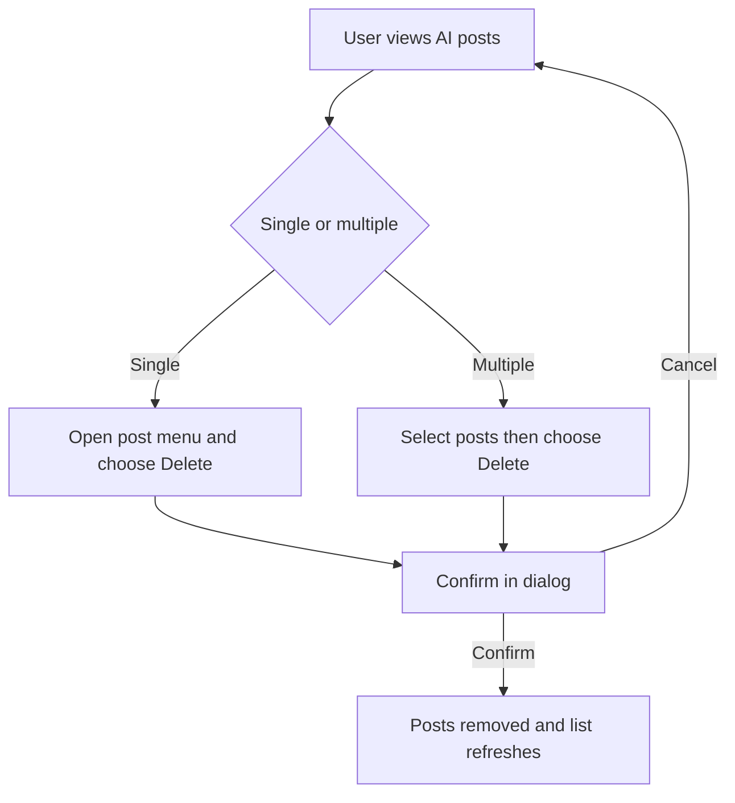
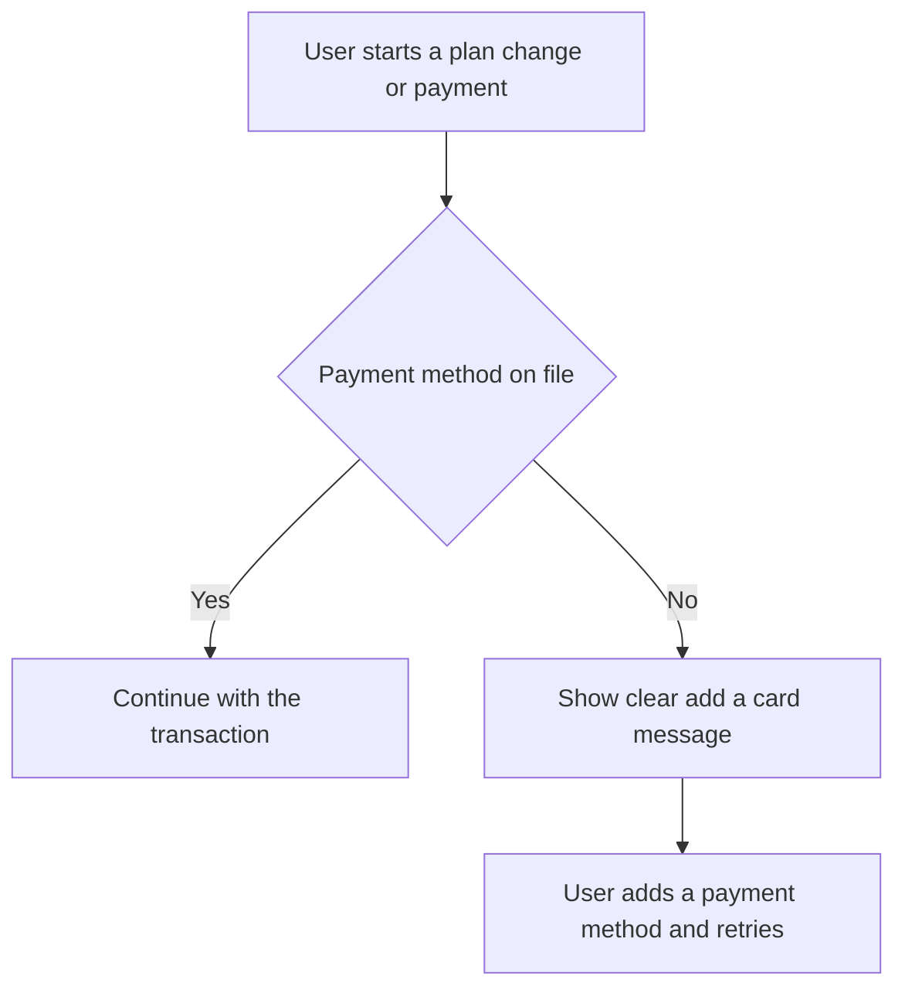

# Stories: Q3 misc product fixes

A batch of eight independent fixes across the planner status model, the content library AI creations section, billing, and AI chat. Web only. Local markdown for Helpin. Team is shown by the title prefix. Product area is noted per story.

Suggested build order: items 1 then 2 (status backend then frontend), then the content library items (4 then 3, since the render change affects where delete lives), then 5, 6, 7, 8 which are independent.

---

## 1. [BE] Expose "partially failed" as a first-class post status

### Description
As a user viewing my scheduled and published posts, I want a post that only published to some of its accounts to clearly read as "Partially failed" everywhere I see its status, so I can trust the status column, the filters, and the counts instead of the post pretending to be fully published.

Today the system marks these posts as published and keeps the partial failure in a separate flag, so the real state is hidden from anything that looks at the status.

### Workflow
1. A post is sent to multiple accounts and publishes to some but not all of them.
2. The system records that post's status as partially failed, as its own status value, rather than published.
3. Everywhere the post's status is read (the list, the single post view, the status filter, and the status counts) it reports as partially failed.

### Acceptance criteria
- [ ] When a post publishes to some but not all of its accounts, its status value is returned as "partially failed" (a dedicated status), not "published".
- [ ] The single post response and the list responses both return the partially failed status for these posts.
- [ ] Filtering posts by the partially failed status returns exactly those posts, and filtering by published no longer includes them.
- [ ] Status counts (per status) count partially failed posts under the partially failed status, not under published.
- [ ] Existing partially failed posts (already in the system) also report the partially failed status, not published.
- [ ] A fully published post is unaffected and still reports as published.

### Mock-ups
N/A, backend only.

### Impact on existing data
No new stored data is required if the status is derived from the existing partial-failure information. If the status is persisted, existing partially failed posts must be backfilled so they report the new status. Engineering to confirm whether to derive on read or persist and backfill.

### Impact on other products
Web only for the surfaces in this batch. Any consumer of the post status (web, mobile apps, Chrome extension, public API) will now receive "partially failed" as a possible status value. Note this so mobile and API consumers handle the value rather than treating it as unknown.

### Dependencies
Blocks "[FE] Show and filter posts by the partially failed status".

### Global quality & compliance (wherever applicable)
- [ ] Mobile responsiveness, N/A, backend only
- [ ] Multilingual support, N/A, no user-facing copy in this story
- [ ] UI theming support, N/A, no UI
- [ ] White-label domains impact review, N/A
- [ ] Cross-product impact assessment (web, mobile apps, Chrome extension, public API all read post status)

### Implementation references
*Pointers from research, not a contract. Engineering may choose a different approach.*
- Today `contentstudio-backend/app/Services/PlannerViewService.php` returns `status` and a separate `partially_failed` boolean side by side (around lines 24-25 and 169-175). The status derivation should treat a partial failure as `status = 'partially_failed'`.
- `contentstudio-backend/app/Repository/Publish/Planner/PlansRepository.php` filters and counts on the `partially_failed` boolean in several places (list filters, count aggregation). Those should key off the status value so the filter and the counts stay consistent.
- Decide whether to keep the `partially_failed` boolean in sync for backward compatibility or retire it once the status carries the meaning.

---

## 2. [FE] Show and filter posts by the partially failed status

### Description
As a user viewing my posts in the planner, I want the "Partially failed" status to behave like any other status, shown from the post's status, available as a filter, and reflected in the counts, so partial failures are consistent with the rest of the status system.

Today the frontend shows the badge by reading a separate flag before it looks at the status, which is inconsistent with how every other status works.

### Workflow
1. The user opens the planner list or calendar.
2. A post that partially failed shows a "Partially failed" status badge, read from the post's status.
3. The user opens the status filter, selects "Partially failed", and sees only the partially failed posts.

### Acceptance criteria
- [ ] The "Partially failed" badge is shown based on the post's status value, not a separate flag.
- [ ] "Partially failed" is a selectable option in the planner status filter, and selecting it shows only partially failed posts.
- [ ] Any per-status counts in the planner reflect partially failed as its own status.
- [ ] The badge keeps its existing "Partially failed" label and its existing status color and pill styling.
- [ ] Published posts continue to show the "Published" badge and are not shown when filtering for partially failed.

### UI copy
- Status badge label: "Partially failed" (unchanged from today).
- Status filter option label: "Partially failed".

### Mock-ups
N/A, uses the existing status badge and filter styling.

### Impact on existing data
None. This reads the status returned by the backend.

### Impact on other products
Web only. No mobile app or Chrome extension changes in this story.

### Dependencies
Depends on "[BE] Expose partially failed as a first-class post status".

### Global quality & compliance (wherever applicable)
- [ ] Mobile responsiveness (planner list and calendar)
- [ ] Multilingual support (badge and filter labels via i18n in every locale)
- [ ] UI theming support (default and white-label, existing status tokens)
- [ ] White-label domains impact review
- [ ] Cross-product impact assessment (web only in this story)

### Implementation references
*Pointers from research, not a contract. Engineering may choose a different approach.*
- `contentstudio-frontend/src/modules/planner_v2/composables/usePlannerStatusBadge.ts` `getPostStatusText()` currently checks `postData.partially_failed` before the `status` switch. Drive it from `status` instead. The status switch already has a `partially_failed` branch.
- The status helpers in `contentstudio-frontend/src/modules/planner_v2/utils/index.ts` (`getStatusBgClass`, `getStatusColorClass`, `getStatusPillClasses`, `getStatusColorCode`) already handle `partially_failed`, so the color and pill styling is in place.
- Confirm the planner status filter (`FilterSidebar.vue`) lists partially failed as its own option.

---

## 3. [FE] Render content library AI creations "AI posts" as media items only

### Description
As a user browsing the AI creations section of the content library, I want the "AI posts" view to simply show my generated items like the rest of the content library, so I can browse them as media without the full AI Posts generation tool loading inside the library.

Today this view embeds the whole publisher AI Posts experience (generate new, brand knowledge setup, credits, and generation settings), which does not belong in the content library.

### Workflow
1. The user opens the content library and selects the AI creations section.
2. The user selects the "AI posts" pill.
3. The user sees their AI posts rendered as a media grid, consistent with the other content library views, with no generate action, no brand knowledge setup, and no credits.

### Acceptance criteria
- [ ] In the content library AI creations "AI posts" pill, the generated AI posts render as a media grid consistent with the other content library views (for example the AI studio and clips pills).
- [ ] The embedded publisher AI Posts UI is not shown here: no "generate new" action, no brand knowledge setup gate, no credits usage, and no generation or settings modals.
- [ ] When there are no AI posts yet, the view shows a simple empty state (no setup prompt).
- [ ] Selecting, previewing, and the standard content library item actions work the same as the other content library media views.
- [ ] The AI posts still load and paginate correctly when there are many items.

### UI copy
- Empty state heading: "No AI posts yet"
- Empty state subtext: "AI posts you generate will show up here."

### Mock-ups
N/A. Reuses the existing content library media grid layout.

### Impact on existing data
None. This changes how the existing AI posts are displayed in the content library.

### Impact on other products
Web only. No mobile app or Chrome extension impact. AI generation is web only.

### Dependencies
Related to "[FE] Allow deleting AI posts (single and bulk) from the AI Library and the content library". Once this view renders as standard content library media, the standard media delete applies here.

### Global quality & compliance (wherever applicable)
- [ ] Mobile responsiveness (content library grid)
- [ ] Multilingual support (empty state copy via i18n in every locale)
- [ ] UI theming support (default and white-label, design library components)
- [ ] White-label domains impact review
- [ ] Cross-product impact assessment (web only)

### Implementation references
*Pointers from research, not a contract. Engineering may choose a different approach.*
- `contentstudio-frontend/src/modules/publish/components/media-library/components/ContentLibraryAiPosts.vue` currently renders `<AIPosts :hide-search :hide-header />` plus `CustomGenerateModal` and `PostSettingsModal`, and a "setup required" gate that pushes the user into brand knowledge setup. Replace this with a plain media grid over the AI posts, matching the sibling pills in the AI creations section.
- The AI creations section and its pills are defined in `FiltersBar.vue` and `SideBar.vue` (type `ai_creations`, pills `ai_studio | clips | ai_posts`). Follow how the `ai_studio` and `clips` pills render their items.

---

## 4. [FE] Allow deleting AI posts, single and bulk, from the AI Library and the content library

### Description
As a user managing my generated AI posts, I want to delete posts I do not want, one at a time or several at once, from the AI Library and from the AI posts section of the content library, so I can keep my library tidy.

Today deletion is not available in the UI even though the underlying capability exists.

### Workflow

1. In the AI Library, the user opens a post's menu and chooses Delete, or selects several posts and chooses a bulk Delete.
2. A confirmation dialog asks the user to confirm.
3. On confirm, the selected posts are removed and the list refreshes.
4. The same delete actions are available in the content library AI posts section.

### Acceptance criteria
- [ ] Each AI post offers a Delete action (for example in the post overflow menu) in the AI Library.
- [ ] Selecting multiple AI posts shows a bulk Delete action that deletes all selected posts.
- [ ] Deleting asks for confirmation before removing anything, and Cancel leaves everything unchanged.
- [ ] After a successful delete, the removed posts no longer appear and the list reflects the change without a manual refresh.
- [ ] A success message confirms the deletion, and a clear error message is shown if a delete fails.
- [ ] The same single and bulk delete actions are available in the content library AI posts section.

### UI copy
- Single delete menu item: "Delete"
- Bulk delete button: "Delete"
- Confirmation dialog title (single): "Delete AI post"
- Confirmation dialog title (multiple): "Delete AI posts"
- Confirmation dialog body (single): "This AI post will be removed from your library. This cannot be undone."
- Confirmation dialog body (multiple): "These AI posts will be removed from your library. This cannot be undone."
- Confirm button: "Delete"
- Cancel button: "Cancel"
- Success toast (single): "AI post deleted."
- Success toast (multiple): "AI posts deleted."
- Error toast: "We could not delete the AI post. Please try again."

### Mock-ups
N/A. Reuses the existing content library delete and confirmation patterns.

### Impact on existing data
Deletes the selected AI posts. No change to other stored data.

### Impact on other products
Web only. No mobile app or Chrome extension impact.

### Dependencies
Related to "[FE] Render content library AI creations AI posts as media items only".

### Global quality & compliance (wherever applicable)
- [ ] Mobile responsiveness (AI library and content library grids)
- [ ] Multilingual support (all delete copy via i18n in every locale)
- [ ] UI theming support (default and white-label, design library components)
- [ ] White-label domains impact review
- [ ] Cross-product impact assessment (web only)

### Implementation references
*Pointers from research, not a contract. Engineering may choose a different approach.*
- The delete and bulk logic already exists: `useAILibraryOperations.js` and `useAIPostActions.ts` (post CRUD including delete, selection, bulk actions) under `contentstudio-frontend/src/modules/publisher/ai-content-library/composables/`. `AIPostCard.vue` already supports selection (`selectable`, `selectionMode`, `selectedPosts`, select/deselect). This story is about surfacing those in the UI.
- `AIPostCardMenu.vue` currently offers Schedule with AI, Add to composer, and Save as draft only. Add Delete there for the single case.
- After the content library AI posts render as standard media (the related story), that surface should reuse the standard media library single and bulk delete rather than a separate implementation.

---

## 5. [BE] Stop auto-creating the "My AI creations" and "AI Video Clips" folders

### Description
As a user generating AI content, I do not want extra folders ("My AI creations", "AI Video Clips") created automatically in my content library, because AI content now lives in the dedicated AI creations section. Those auto-created folders are redundant and clutter the library.

### Workflow
1. The user generates AI content (an image, a video clip, or an AI post).
2. The content is saved and appears in the dedicated AI creations section.
3. No "My AI creations" or "AI Video Clips" folder is created as a side effect.

### Acceptance criteria
- [ ] Generating AI content no longer auto-creates a "My AI creations" folder.
- [ ] Generating AI video clips no longer auto-creates an "AI Video Clips" folder (or the legacy "Reels" folder).
- [ ] Generated AI content is still saved and still appears in the dedicated AI creations section of the content library.
- [ ] Existing AI content that users generated before this change is still accessible.
- [ ] Workspaces that never generated AI content do not get these folders created.

### Mock-ups
N/A, backend only.

### Impact on existing data
Existing "My AI creations" and "AI Video Clips" folders and their contents are left in place (handling or cleanup of already-created folders is out of scope for this story). This story stops new auto-creation only.

### Impact on other products
Web only. AI generation is web only.

### Dependencies
None. The dedicated AI creations section already exists.

### Global quality & compliance (wherever applicable)
- [ ] Mobile responsiveness, N/A, backend only
- [ ] Multilingual support, N/A, no user-facing copy change
- [ ] UI theming support, N/A, no UI
- [ ] White-label domains impact review, N/A
- [ ] Cross-product impact assessment (web only)

### Implementation references
*Pointers from research, not a contract. Engineering may choose a different approach.*
- The auto-create helpers are `getOrCreateAiFolder()` ("My AI creations", `is_ai_folder`), `getOrCreateAiVideoClipsFolder()` ("AI Video Clips", `is_ai_video_folder`, migrates legacy "Reels"), and the deprecated `getOrCreateReelsFolder()` in `contentstudio-backend/app/Repository/Storage/MediaLibraryFoldersRepo.php`.
- Callers to review: `contentstudio-backend/app/Services/ChatMessageService.php` (around lines 123 and 237) and `contentstudio-backend/app/Services/AI/AiToolMediaPersistenceService.php` (around line 34). Persist the generated AI media so it still surfaces in the AI creations section without creating these root folders.
- Confirm how the AI creations section resolves AI content (by an AI flag or content type) so persistence keeps working once the folders are gone.

---

## 6. [FE] Billing: show a clear "add a card" message instead of the generic error

### Description
As a user trying to change my plan or make a payment without a card on file, I want a clear message telling me I need to add a payment method, so I know exactly what to do instead of seeing a generic error that says support has been notified.

### Workflow

1. The user starts a plan change or a payment.
2. If the account has no payment method on file, the app shows a clear message explaining that a card is required and how to add one.
3. The user adds a payment method and retries.

### Acceptance criteria
- [ ] When a plan change or payment fails because there is no card on file (or a card issue), the user sees a clear message explaining a payment method is required, not the generic "support has been notified" error.
- [ ] The message tells the user what to do next (add a payment method).
- [ ] The generic unknown-error message is still shown for genuinely unknown failures, so this change only affects the missing-card case.
- [ ] The behavior is consistent across the plan change and payment entry points in billing.

### UI copy
- No-card message: "You do not have a payment method on file. Please add a card to change your plan, then try again."
- The generic fallback for truly unknown errors stays as it is today.

### Mock-ups
N/A. Uses the existing error toast or dialog style.

### Impact on existing data
None.

### Impact on other products
Web only. Billing is web only.

### Dependencies
None.

### Global quality & compliance (wherever applicable)
- [ ] Mobile responsiveness (billing screens)
- [ ] Multilingual support (the new message via i18n in every locale)
- [ ] UI theming support (default and white-label)
- [ ] White-label domains impact review
- [ ] Cross-product impact assessment (web only)

### Implementation references
*Pointers from research, not a contract. Engineering may choose a different approach.*
- The generic fallback is `UNKNOWN_ERROR()` = "Uh-oh! An unknown error occurred, support has been notified.", shown in the catch blocks of `contentstudio-frontend/src/modules/setting/components/billing/dialogs/UpgradePlanConfirmation.vue` (around lines 110 and 166) and `UpgradePlanComponent.vue` (around line 212).
- A "credit card issue" case already exists in the codebase (the string "Could not upgrade/downgrade due to credit card issue" is handled in `CancelRecurringPlanDialog.vue` and `CancelPlanDialog.vue`). Use that signal (or the backend error) to detect the missing-card case and show the clear message. Add the new copy as an i18n key.

---

## 7. [FE] AI chat: rename the bottom link to "Learn more"

### Description
As a user in AI chat, I see a link at the bottom of the chat that currently reads "Explore AI Studio". It should read "Learn more" so the label matches its purpose (it opens the help article), and it is clearer and more consistent.

### Workflow
1. The user opens AI chat.
2. At the bottom of the normal chat view, the link reads "Learn more".
3. Clicking it opens the same help article as before.

### Acceptance criteria
- [ ] The link at the bottom of the AI chat view reads "Learn more" instead of "Explore AI Studio".
- [ ] The link still opens the same destination it opens today.

### UI copy
- Link text: "Learn more"

### Mock-ups
N/A, copy change only.

### Impact on existing data
None.

### Impact on other products
Web only.

### Dependencies
None.

### Global quality & compliance (wherever applicable)
- [ ] Mobile responsiveness, N/A, copy change
- [ ] Multilingual support (the link text via i18n in every locale)
- [ ] UI theming support, N/A, no styling change
- [ ] White-label domains impact review, N/A
- [ ] Cross-product impact assessment (web only)

### Implementation references
*Pointers from research, not a contract. Engineering may choose a different approach.*
- The link is at `contentstudio-frontend/src/modules/AI-tools/ChatBox.vue` (around line 374), currently the hardcoded text "Explore AI Studio". Change the text to "Learn more" and, since the string is currently hardcoded, move it to an i18n key while you are there.

---

## 8. [FE] AI chat: show bulk-generated images in a carousel

### Description
As a user who generates several images at once in AI chat, I want those images shown in a carousel inside the chat message, so I can swipe through them neatly instead of a tall stack of images that pushes the rest of the conversation down.

Today all generated images render in a wrapping grid, which gets long and awkward when the batch has several images.

### Workflow
1. The user asks AI chat to generate images, and the response returns more than one image.
2. The images are shown in a carousel within that chat message, one focused at a time, with controls to move between them.
3. Each image keeps its existing actions (preview, info, download, add to media library, add to composer).

### Acceptance criteria
- [ ] When an AI chat image response contains more than one image, the images are shown in a carousel within that message rather than a wrapping grid.
- [ ] The user can move between images with next and previous controls, and can see which image they are on and how many there are (for example dots or a "2 of 5" indicator).
- [ ] Each image in the carousel keeps its existing actions: preview, info, download, add to media library, and add to composer.
- [ ] A single-image response still displays correctly (no broken or empty carousel controls).
- [ ] The carousel fits within the chat message width and does not overflow the chat panel or push the layout sideways.
- [ ] Image load errors are handled per image the same way they are today (the unavailable state and disabled actions still apply).

### UI copy
- Previous control accessible label: "Previous image"
- Next control accessible label: "Next image"
- Position indicator (if using text): "{current} of {total}"

### Mock-ups
N/A. Uses the existing chat image cards inside a carousel.

### Impact on existing data
None. This changes how existing generated images are displayed in chat.

### Impact on other products
Web only. AI image generation is web only. Note: AI chat exists on mobile, so if the chat images surface there, the mobile app team should confirm the multiple-image display separately. This story covers web.

### Dependencies
None.

### Global quality & compliance (wherever applicable)
- [ ] Mobile responsiveness (chat panel widths)
- [ ] Multilingual support (carousel control labels via i18n in every locale)
- [ ] UI theming support (default and white-label, design library components)
- [ ] White-label domains impact review
- [ ] Cross-product impact assessment (web here, AI chat also exists on mobile)

### Implementation references
*Pointers from research, not a contract. Engineering may choose a different approach.*
- The images render in `contentstudio-frontend/src/modules/AI-tools/components/BotMessageImages.vue`, currently a `flex flex-wrap gap-2` grid over `images`. Wrap the multiple-image case in a carousel while keeping the existing per-image hover toolbar and emits (`preview`, `image-error`, `download`, `add-to-library`, `add-to-composer`).
- There is an existing `contentstudio-frontend/src/components/dashboard/HorizontalCarousel.vue` that may be reusable, and the planner already uses carousels for multi-media previews. Confirm the best fit and check `docs/ui-components.md` for a catalog carousel before adding a new dependency (the catalog currently lists none, so flag the component choice).
- Keep the single-image path rendering inline as it does today, or as a one-item carousel with the controls hidden.
