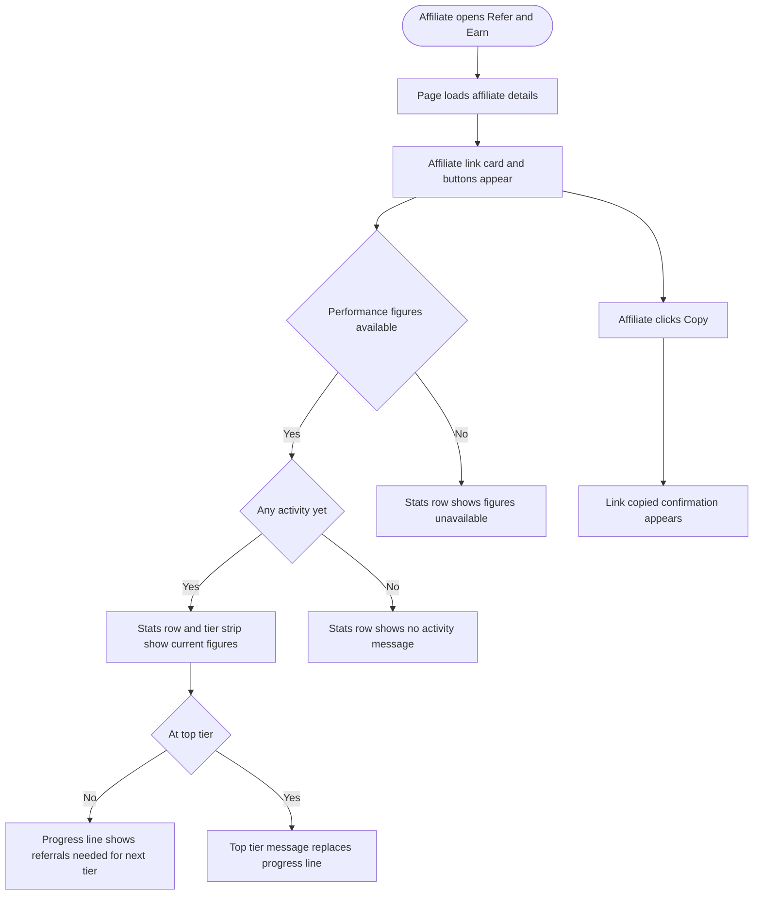

# Stories: Refer & Earn page update

## Epic description

Bring the in-app Refer & Earn page in line with the current affiliate program: replace the outdated "30% forever" promise with the real tiered rates and 12 month commission term, and give approved affiliates their referral link, performance figures and tier in the page itself instead of an embedded third party dashboard.

Copy and program terms are approved by marketing here: https://docs.google.com/document/d/18VUPrWFss092jpAH-DoXRoSkJlQhwznbUxhdSTAK6QU/edit?usp=sharing

---

Three stories: one per page state, plus a design story. Each state is a single end to end story rather than a split backend and frontend pair.

The program pitch story is copy only and can ship on its own. The affiliate view story carries its own data work, since the page cannot show a referral link or any performance figures until ContentStudio can read them from the affiliate platform.

**Requirements source:** [Refer & Earn in-app copy, marketing](https://docs.google.com/document/d/18VUPrWFss092jpAH-DoXRoSkJlQhwznbUxhdSTAK6QU/edit?usp=sharing)

---

## [Design] Design the updated Refer & Earn page states

### Description:

As a designer, I want to produce the visual design for both states of the Refer & Earn page so that the build happens against an agreed layout instead of stretching the existing one.

The page keeps its current structure wherever the new content fits it. The design work is about the pieces that have no home today: a second button and a trust line in the program card, a facts box that replaces the current info box, a bonus line, an affiliate link field with a copy action, a five metric stats row, and a tier strip.

Requirements and approved copy: [Refer & Earn in-app copy, marketing](https://docs.google.com/document/d/18VUPrWFss092jpAH-DoXRoSkJlQhwznbUxhdSTAK6QU/edit?usp=sharing)

### Workflow:

1. Designer reviews the current Refer & Earn page in Settings, both as a user who has not joined the program and as a user who has.
2. Designer produces the non affiliate state: header strip, program card with a primary and a secondary button plus a trust line beneath them, the three step strip, the "How the program works" facts box, the new affiliate bonus line, and the footer line with an inline link.
3. Designer produces the affiliate state: header strip, affiliate link card with a read only field and a copy action, a five metric stats row with its empty variant, a tier strip with rate and progress line, a primary and secondary button with a tertiary text link, and the payout reminder line.
4. Designer produces the affiliate state variants: stats loading, stats unavailable, no activity yet, and top tier reached.
5. Designer confirms every surface uses existing design system components and theme colour tokens so the page stays correct on white label domains, and flags anything that needs a new component.
6. Designer hands off both states, including mobile widths.

### Acceptance criteria:

- [ ] Designs delivered for the non affiliate state and the affiliate state at desktop and mobile widths
- [ ] Affiliate state includes all four variants: stats loading, stats unavailable, no activity yet, and top tier reached
- [ ] Stats row design works with five metrics at mobile width without horizontal scrolling
- [ ] Affiliate link field design accommodates a long link without breaking the card layout
- [ ] Tier strip design works when only the commission rate is known and no tier or progress line is shown
- [ ] All colours use theme tokens rather than fixed values, so the page renders correctly on a white label domain with a non blue primary colour
- [ ] Any element that cannot be built from the existing component library is called out explicitly in the handoff
- [ ] Copy in the designs matches the approved marketing copy exactly, including the interpunct separators in the trust line

### Mock-ups:

This story produces them.

### Impact on existing data:

None.

### Impact on other products:

None. There is no Refer & Earn surface in the mobile app or the Chrome extension.

### Dependencies:

None.

### Global quality & compliance (wherever applicable)

- [ ] Mobile responsiveness (frontend only, N/A for backend-only stories)
- [ ] Multilingual support (frontend + backend, translations available or fallback handled)
- [ ] UI theming support (default + white-label, design library components are being used)
- [ ] White-label domains impact review
- [ ] Cross-product impact assessment (web, mobile apps, Chrome extension)

---

## [FE] Update the Refer & Earn program pitch with the new affiliate program copy

### Description:

As a ContentStudio account owner who has not joined the affiliate program yet, I want the Refer & Earn page to tell me what the program actually pays and on what terms so that I can decide whether to join without having to find the program page on the website first.

The current page promises "30% recurring commission" and states that commission is paid for as long as the referred account stays active. Both are now wrong: the program starts at 15% and rises to 40% by tier, and commission runs for the first 12 months rather than indefinitely. This story replaces the copy on the pitch state, adds the elements the new copy needs, and removes the claims that contradict the real terms.

The page layout stays as it is wherever the new content fits it. The additions are a secondary button, a trust line under the buttons, a bonus line, and a link inside the footer text.

Requirements and approved copy: [Refer & Earn in-app copy, marketing](https://docs.google.com/document/d/18VUPrWFss092jpAH-DoXRoSkJlQhwznbUxhdSTAK6QU/edit?usp=sharing)

### Workflow:

1. Account owner opens Settings and selects Refer & Earn.
2. Account owner sees the header strip, then a card explaining the program with two buttons, then the three step strip, then a box setting out how the program works, then a bonus line, then a footer line about eligibility.
3. Account owner clicks "See full program details" and the public affiliate program page opens in a new tab. The Refer & Earn page stays where it was.
4. Account owner clicks "Become an affiliate". They are enrolled in the program, and the affiliate sign in page opens in a new tab so they can finish setting up their affiliate account.
5. Once enrolled, the page switches to the affiliate view.
6. If enrolment fails, the account owner stays on the pitch state and sees an error message telling them to try again.

### Acceptance criteria:

**Header strip**

- [ ] Heading reads "Refer and Earn"
- [ ] Subtext reads "Invite others to ContentStudio and earn recurring commission on every payment they make."

**Program card**

- [ ] Heading reads "Start at 15% recurring, grow to 40%"
- [ ] Body reads "Join the ContentStudio affiliate program, share your unique link, and earn on every payment your referrals make. Your rate rises as you refer more customers."
- [ ] A primary `Button` labelled "Become an affiliate" sits below the body
- [ ] A secondary `Button` labelled "See full program details" sits beside the primary button
- [ ] A trust line sits directly under the buttons reading "Free to join · No minimum commitment · Applications reviewed in 3 business days"

**Three step strip**

- [ ] The first step reads "Join" with the subtext "Apply in minutes"
- [ ] The second step reads "Refer" with the subtext "Share your link"
- [ ] The third step reads "Earn" with the subtext "15% to 40% recurring"

**Facts box**

- [ ] The box previously headed "Recurring means recurring" is gone, along with both of its lines. It is not reworded, retitled, or kept in a collapsed form anywhere on the page
- [ ] A box headed "How the program works" appears in its place, with these six points in this order:
  - [ ] "Your rate starts at 15% and rises with active referrals: 20% at Silver, 30% at Gold, 40% at Elite."
  - [ ] "You earn on every payment a referred customer makes during their first 12 months. At Elite, the commission period extends to 24 months."
  - [ ] "Cookie window is 90 days, last click attribution."
  - [ ] "Commission is approved once your referral completes 30 paid days."
  - [ ] "Payouts go out monthly by the 15th, once you have $200 in approved commission and at least 2 active referrals."
  - [ ] "Get paid by bank transfer, PayPal, Wise or Payoneer."

**Bonus line**

- [ ] A line sits under the facts box reading "New affiliate bonus: earn an extra $50 when your first three referred Agency plan customers each complete 60 days. Available during your first year in the program."

**Footer line**

- [ ] The footer reads "Referring your own accounts, additional workspaces under the same billing entity, or accounts you control does not earn commission. Program eligibility and payout terms apply."
- [ ] The phrase "Program eligibility and payout terms apply" is a link to `https://contentstudio.io/affiliate-terms-and-conditions?utm_source=app&utm_medium=referral&utm_campaign=refer_and_earn&utm_content=terms`

**Link and button behaviour**

- [ ] "See full program details" opens `https://contentstudio.io/affiliate-program?utm_source=app&utm_medium=referral&utm_campaign=refer_and_earn` in a new tab
- [ ] "Become an affiliate" enrols the user in the affiliate program and opens `https://contentstudio.firstpromoter.com/?utm_source=app&utm_medium=referral&utm_campaign=refer_and_earn` in a new tab
- [ ] Every external link on the page opens in a new tab and leaves the Refer & Earn page untouched
- [ ] Every external link carries the tracking parameters listed above exactly, with no parameters added, dropped, or reordered
- [ ] While enrolment is in progress the "Become an affiliate" button shows a loading state and cannot be clicked again
- [ ] After successful enrolment the page switches to the affiliate view without the user needing to reload
- [ ] If enrolment fails, the user stays on the pitch state and sees the error "We couldn't enroll you in the affiliate program. Please try again."
- [ ] If the user is already enrolled on the affiliate platform, they are not shown an error. The page moves them to the affiliate view

**States**

- [ ] While the page is working out whether the user is already an affiliate, a `Loader` is shown rather than the pitch state, so an existing affiliate never sees the pitch flash on screen first
- [ ] If the account details cannot be loaded, an `Alert` with colour `danger` shows "We couldn't load your affiliate details. Please refresh and try again."

**Tracking**

- [ ] When enrolment completes successfully, an `affiliate_program_joined` Usermaven event fires

**Copy and theming**

- [ ] All new and changed copy is available through the app's translation system for every supported language, with English as the fallback
- [ ] The facts box strings removed by this story are also removed from every language, leaving no orphaned entries
- [ ] No hardcoded colour values are introduced. Primary colours use the theme tokens so the page renders correctly on white label domains
- [ ] The page is readable at mobile width, with the two buttons and the trust line stacking rather than overflowing

### Mock-ups:

Covered by **[Design] Design the updated Refer & Earn page states**.

### Impact on existing data:

None. Copy and layout only.

### Impact on other products:

None. There is no Refer & Earn surface in the mobile app or the Chrome extension. The page is already hidden on white label domains and shown only to account owners, and this story does not change who can see it.

### Dependencies:

- **[Design] Design the updated Refer & Earn page states**

### Global quality & compliance (wherever applicable)

- [ ] Mobile responsiveness (frontend only, N/A for backend-only stories)
- [ ] Multilingual support (frontend + backend, translations available or fallback handled)
- [ ] UI theming support (default + white-label, design library components are being used)
- [ ] White-label domains impact review
- [ ] Cross-product impact assessment (web, mobile apps, Chrome extension)

---

## [FE] Replace the affiliate dashboard embed with a native link, stats and tier view

### Description:

As an affiliate, I want Refer & Earn to show my referral link, how it is performing, and where I stand in the tier structure so that I can copy my link and check my earnings without logging into a separate affiliate portal.

Today an affiliate opening this page sees the affiliate platform's own dashboard embedded in the page. There is nothing to copy without going into the embed, no ContentStudio styling, and no indication of the user's tier or what the next tier pays. This story replaces the embed with a native view: an affiliate link card with a copy action, a row of performance metrics, a tier strip, and links out to the full affiliate dashboard and the promotional assets.

This story covers the whole change end to end. ContentStudio currently holds nothing about an affiliate except the access token used to render the embed, so reading the referral link and the performance figures from the affiliate platform is part of this story, not a separate one.

Requirements and approved copy: [Refer & Earn in-app copy, marketing](https://docs.google.com/document/d/18VUPrWFss092jpAH-DoXRoSkJlQhwznbUxhdSTAK6QU/edit?usp=sharing)

### Workflow:

1. Affiliate opens Settings and selects Refer & Earn.
2. Affiliate sees the header strip, then a card containing their affiliate link.
3. Affiliate clicks "Copy" and sees a confirmation that the link was copied. The link is now on their clipboard, ready to paste.
4. Affiliate sees a row of five figures showing how their link is performing. If they have not shared their link yet, the row tells them so instead of showing five zeros.
5. Affiliate sees their current tier and commission rate, and how many more active referrals they need to reach the next tier. If they are at the top tier, they see that instead.
6. Affiliate clicks "Open affiliate dashboard" and the full affiliate dashboard opens in a new tab.
7. Affiliate clicks "Get promo assets" and the affiliate resource library opens in a new tab.
8. Affiliate reads the payout reminder line at the bottom of the page so they know when they will next be paid and what they need to qualify.

### Acceptance criteria:

**Header strip**

- [ ] Heading reads "Refer and Earn"
- [ ] Subtext reads "Share your link and earn recurring commission on every payment your referrals make."

**Affiliate link card**

- [ ] The card is labelled "Your affiliate link"
- [ ] The affiliate link appears in a read only field the user cannot edit, alongside a "Copy" button
- [ ] The full link is visible or, when it is too long for the field, truncated in a way that still lets the user copy the whole link
- [ ] Clicking "Copy" places the complete affiliate link on the clipboard and shows a confirmation reading "Link copied"
- [ ] Helper text under the field reads "Anyone who signs up through this link within 90 days is attributed to you."
- [ ] The link shown is the one issued for this user by the affiliate platform, and it is never assembled in the page from parts

**Stats row**

- [ ] The row shows five figures, labelled in this order: "Clicks", "Signups", "Active referrals", "Pending commission", "Approved commission"
- [ ] Commission figures are shown as currency amounts in the currency the affiliate is paid in
- [ ] When the affiliate has no activity at all, the whole row is replaced with "No activity yet. Share your link to get started." rather than showing five zeros
- [ ] While the figures are loading, a `Loader` appears in place of the row and the affiliate link card above it stays usable
- [ ] When the figures cannot be loaded, the row is replaced with "We couldn't load your latest numbers. Open your affiliate dashboard to see them." and the affiliate link card, buttons, and payout reminder all still work
- [ ] A failure to load the figures never blocks the affiliate from copying their link

**Tier strip**

- [ ] The strip shows "Your tier:" followed by the affiliate's tier name, one of Partner, Silver, Gold, Elite, or Agency Partner
- [ ] The strip shows "Your rate:" followed by that tier's commission rate and the word "recurring", for example "15% recurring"
- [ ] A progress line reads "[number] more active referrals to reach [tier name] and earn [rate]." using the affiliate's real figures
- [ ] When the affiliate is at the Elite tier, the progress line is replaced with "You are at the top tier, earning 40% for 24 months per referral."
- [ ] When no tier information is available, the strip shows the commission rate on its own, with no tier name and no progress line. A tier name is never assumed, defaulted, or hardcoded in the page
- [ ] When neither a tier nor a rate is available, the strip is hidden entirely rather than showing empty labels

**Buttons and links**

- [ ] A primary `Button` labelled "Open affiliate dashboard" opens the affiliate dashboard in a new tab
- [ ] A secondary `Button` labelled "Get promo assets" opens the affiliate resource library in a new tab
- [ ] A tertiary text link labelled "Program details and terms" opens `https://contentstudio.io/affiliate-program` in a new tab
- [ ] Every external link opens in a new tab and leaves the Refer & Earn page untouched

**Payout reminder**

- [ ] A line at the bottom of the page reads "Payouts run monthly by the 15th. You need $200 in approved commission and at least 2 active referrals to receive a payment."

**Affiliate data the page relies on**

- [ ] A signed in affiliate can retrieve their own referral link, link clicks, signups, active referrals, pending commission, and approved commission
- [ ] Commission amounts come back with their currency so the page can format them correctly
- [ ] The current commission rate is returned
- [ ] The tier name is returned when the affiliate platform provides it, and is omitted rather than guessed or defaulted when it does not
- [ ] When a tier is returned, the number of active referrals still needed for the next tier and the rate at that next tier come back with it, so the progress line can be rendered
- [ ] When the affiliate is already at the top tier, the response says so
- [ ] A user who has not joined the program gets a clear "not an affiliate" response rather than a row of zeros
- [ ] A user who is not signed in cannot retrieve affiliate details, and no user can retrieve another user's affiliate details
- [ ] When the affiliate platform is unreachable or times out, the referral link still comes back and the performance figures are reported as unavailable, instead of the whole request failing
- [ ] Figures are cached per user for a short period so that repeat visits within the same session do not call the affiliate platform on every render
- [ ] No affiliate platform credentials or access tokens are exposed beyond what the page needs to render
- [ ] Affiliates who joined the program before this change see their link and figures with no migration step or re enrolment

**Embed removal**

- [ ] The embedded affiliate platform dashboard no longer appears anywhere on the Refer & Earn page

**Tracking**

- [ ] When the affiliate clicks "Copy" and the link is copied, an `affiliate_link_copied` Usermaven event fires

**Copy and theming**

- [ ] All copy on this view is available through the app's translation system for every supported language, with English as the fallback
- [ ] No hardcoded colour values are introduced. Primary colours use the theme tokens so the page renders correctly on white label domains
- [ ] At mobile width the five figures reflow into a readable grid rather than overflowing or forcing horizontal scrolling, and the link field and "Copy" button stay usable

### Mock-ups:

Covered by **[Design] Design the updated Refer & Earn page states**.

### Impact on existing data:

The affiliate platform's issued referral link is not currently stored against the user, only the affiliate identifiers and the access token. The link is therefore either read live from the affiliate platform or stored alongside the existing identifiers. Affiliates who enrolled before this change have no stored link, so the page must work without one being present.

The embedded affiliate dashboard is removed from the page, so anything an affiliate previously reached only from inside that embed is now reached through "Open affiliate dashboard" instead.

### Impact on other products:

None. There is no Refer & Earn surface in the mobile app or the Chrome extension. The page is already hidden on white label domains and shown only to account owners, and this story does not change who can see it.

### Dependencies:

- **[Design] Design the updated Refer & Earn page states**

### Global quality & compliance (wherever applicable)

- [ ] Mobile responsiveness (frontend only, N/A for backend-only stories)
- [ ] Multilingual support (frontend + backend, translations available or fallback handled)
- [ ] UI theming support (default + white-label, design library components are being used)
- [ ] White-label domains impact review
- [ ] Cross-product impact assessment (web, mobile apps, Chrome extension)
