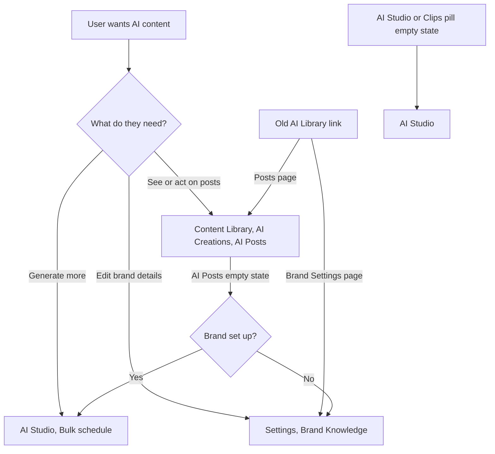

# Stories: Remove the AI Library from Publisher

## [FE] Remove the AI Library from Publisher and move its remaining actions to Content Library

### Description:

As a ContentStudio user, I want one place to find and act on my AI generated posts, so that I am not confused by two libraries showing the same posts in different ways.

Everything the AI Library in Publisher offers now has a home elsewhere: bulk generation lives in AI Studio, AI posts are shown in Content Library under AI Creations, and brand setup lives in Brand Knowledge settings. Two things still only work in the AI Library: scheduling a single AI post or adding it to the queue, and saving default post generation settings. This story moves both, the first to Content Library and the second into the Bulk schedule window, then removes the AI Library from the Publisher sidebar and makes sure old links still land in the right place.

---

### Workflow:

1. The user opens **Publisher**. The sidebar no longer shows the **AI Posts** and **Brand Settings** items. Everything else in the sidebar is unchanged.
2. The user wants to see their AI posts. They open **Content Library**, choose **AI Creations**, then the **AI Posts** pill.
3. On any AI post card, the user opens the card menu and picks **Schedule** or **Add to queue**, the same as on Home. The same two options are in the post preview.
4. The user wants more posts. They open **AI Studio** and use **Bulk schedule**, or use **Generate post** on Home. The Bulk schedule setup step is filled in with their saved defaults.
5. The user changes the settings, ticks **Save as my default settings**, and clicks **Generate**. Next time they open Bulk schedule, from anywhere, it starts with these settings.
6. The user wants to update brand details. They open **Settings**, then **Brand Knowledge**.
7. A user opens an old bookmark or link to the AI Library:
   - The AI Posts page takes them to Content Library, AI Creations, AI Posts.
   - The Brand Settings page takes them to Brand Knowledge settings.
8. A user with nothing generated yet opens Content Library, AI Creations:
   - On the **AI Posts** pill, the empty state shows a **Generate posts** button that opens Bulk schedule. If their brand is not set up yet, they are taken to Brand Knowledge settings first, the same as from AI Studio.
   - On the **AI Studio** or **Clips** pill, or in **My AI Creations**, the **Generate Content** button opens **AI Studio**, where images, videos and clips are made.

---

### Acceptance criteria:

**Content Library AI Posts**
- [ ] Each AI post card menu in Content Library, AI Creations, AI Posts shows **Schedule** and **Add to queue**
- [ ] Picking **Schedule** opens the same schedule flow as on Home (choose accounts, then time) with the post's caption and image filled in
- [ ] Picking **Add to queue** opens the same flow as on Home (choose accounts, then add) with the post's caption and image filled in
- [ ] The post preview opened from Content Library shows **Schedule** and **Add to queue** and they behave the same way
- [ ] Once the schedule flow opens, the preview closes. If the user dismisses the unsaved draft warning instead, the preview stays open
- [ ] The existing actions (Schedule with AI, open in composer, save as draft, delete, bulk actions) keep working

**Default post generation settings in Bulk schedule**
- [ ] The Bulk schedule setup step starts with the user's saved default settings, as it does today
- [ ] Below the settings, just above **Generate**, there is a checkbox **Save as my default settings**, unticked by default
- [ ] Tooltip on the checkbox info icon: "Use these settings every time you open Bulk schedule. For example, always start with 5 LinkedIn posts in English with short captions."
- [ ] When the box is ticked and the user clicks **Generate**, all settings in the form are saved as the defaults: social platform, language, post type, number of posts, caption length, emoji usage, hashtag usage, image style, aspect ratio and image model options
- [ ] After saving, the existing success message shows: "Post settings saved successfully"
- [ ] If saving fails, generation still goes ahead, and the existing error message shows: "Failed to save post settings"
- [ ] When the box is left unticked, the settings apply to this run only and the saved defaults stay as they were
- [ ] Saved defaults apply wherever Bulk schedule opens from: AI Studio, Home, the Composer menu and the Content Library empty state
- [ ] Defaults are saved per workspace, as they are today

**AI Creations empty states**
- [ ] No empty state in Content Library opens the AI Library anymore
- [ ] **AI Posts** pill empty state keeps its title "No AI posts yet" and message "AI posts you generate will show up here.", and adds a **Generate posts** button
- [ ] **Generate posts** opens **Bulk schedule** for a user with brand setup done, and takes a user without brand setup to **Brand Knowledge** settings
- [ ] On the **AI Studio** and **Clips** pills and in **My AI Creations**, the existing **Generate Content** button opens **AI Studio** for the current workspace

**Publisher**
- [ ] The Publisher sidebar no longer shows **AI Posts** or **Brand Settings**
- [ ] No other Publisher sidebar item moves, disappears or changes label
- [ ] Nothing else in the app still links to the AI Library pages (Home, AI chat, Composer, Planner, AI Studio, Content Library)

**Old links**
- [ ] Opening an old AI Library posts link lands on Content Library, AI Creations, AI Posts for the same workspace
- [ ] Opening an old AI Library Brand Settings link lands on Brand Knowledge settings for the same workspace
- [ ] Opening the old AI Library base link lands on Content Library, AI Creations, AI Posts
- [ ] Redirects replace the old address in the history, so browser back does not bounce the user into a loop

**Still working after the change**
- [ ] Home recent AI posts, Generate post and View All work as before
- [ ] AI Studio Bulk schedule generates, schedules and saves drafts as before
- [ ] AI chat can still preview, schedule and add generated posts to the composer
- [ ] Brand Knowledge first-time setup and editing work from Settings
- [ ] API Plan users see no change in what they can reach

---

### Mock-ups:

N/A. The new card and preview options reuse the Home versions exactly, with the existing copy **Schedule** and **Add to queue**. The new checkbox uses the standard `Checkbox` from `@contentstudio/ui`, and the new empty state button uses the standard `Button`.

New copy:
- Checkbox: "Save as my default settings"
- Checkbox tooltip: "Use these settings every time you open Bulk schedule. For example, always start with 5 LinkedIn posts in English with short captions."
- AI Posts empty state button: "Generate posts"

---

### Impact on existing data:

None. AI posts, brand knowledge and schedules are untouched.

Existing saved **default post generation settings** are kept and carry over as they are. Bulk schedule already starts from them, and from now on it is also the place where users change them. No migration needed.

---

### Impact on other products:

- Mobile app (Flutter): N/A, the AI Library is web only.
- Chrome extension: N/A.
- White-label: the sidebar change and redirects apply the same way on white-label domains.
- Help docs: any help article or in-app tour that points to Publisher, AI Posts needs to point to Content Library, AI Creations instead.

---

### Dependencies:

- Pairs with **[FE] Send Home "View All" on recent AI posts to Content Library AI Creations**, which moves the Home link. Either can ship first.

---

### Global quality & compliance (wherever applicable)

- [ ] Mobile responsiveness (frontend only, N/A for backend-only stories)
- [ ] Multilingual support (frontend + backend, translations available or fallback handled)
- [ ] UI theming support (default + white-label, design library components are being used)
- [ ] White-label domains impact review
- [ ] Cross-product impact assessment (web, mobile apps, Chrome extension)
- [ ] Developer surfaces coverage (N/A, no new or changed API)
