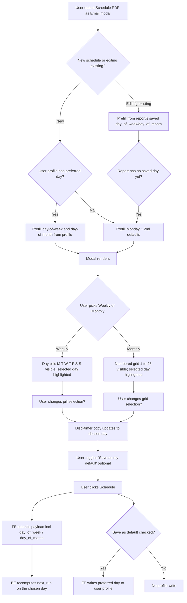

# Stories — Custom day picker for scheduled analytics reports

**Epic (notional, not in Shortcut):** Custom day picker for scheduled analytics reports
**Pipeline:** local `/story` (no Shortcut push)
**Platforms:** Web (BE + FE)

**Story order / dependency:** Story 1 (BE) must land before Story 2 (FE) — the FE story sends and reads the new fields. They can be developed in parallel against the agreed payload shape.

| # | Story |
|---|---|
| 1 | [BE] Accept day_of_week / day_of_month on scheduled reports + add schedule-day preferences on the user profile |
| 2 | [FE] Let users pick the send-day on the Schedule PDF as Email modal and save it as their default |

> **No-impact rule (applies to both stories).** Existing scheduled reports must continue firing on the same day they fire today — no migration, no backfill, no change to their next-run schedule. Existing users see no behavior change until they explicitly edit a report or save a new default through the new UI.

---

## Story 1 — [BE] Accept day_of_week / day_of_month on scheduled reports + add schedule-day preferences on the user profile

### Description
As a ContentStudio user who schedules analytics reports, I want the backend to record which day of the week or day of the month I picked, so that my report goes out on the day I chose — not on a hardcoded fallback. As a returning user, I also want my preferred schedule day saved on my profile so the next time I schedule a report it prefills my choice.

This story is the backend half of the epic. The frontend half ([FE] Let users pick the send-day on the Schedule PDF as Email modal …) consumes these changes.

### Workflow
This is a backend story — the AC describes the observable contract the frontend depends on.

1. The frontend POSTs a schedule-report payload that now optionally includes `day_of_week` (0–6, Sunday=0) and `day_of_month` (1–28).
2. The backend validates the values, stores them on the scheduled-report record, and recomputes `next_run` using the existing `ReportScheduleCalculator`.
3. The frontend can also write `preferred_schedule_day_of_week` and `preferred_schedule_day_of_month` on the user profile. The backend persists them and returns them on subsequent profile GETs.
4. Existing scheduled reports remain on their current schedule — the BE does not migrate, backfill, or recompute them.

### Acceptance criteria

**Scheduled-report write path (accept + persist the new fields):**
- [ ] The schedule-report write endpoint (the one the FE hits via `analyticsStore.scheduleReportsService(...)`) accepts an optional `day_of_week` (integer, 0–6) and an optional `day_of_month` (integer, 1–28) on the request payload.
- [ ] When `day_of_week` is provided, the value is persisted on the `ScheduleReports` record. Same for `day_of_month`.
- [ ] When neither is provided (e.g. a request still on the old payload shape, or any other consumer), the record is created/updated **exactly as today** — no new defaults applied server-side, no change to existing records' fields.
- [ ] Validation rejects `day_of_week` values outside 0–6 with a 422 and a clear error message.
- [ ] Validation rejects `day_of_month` values outside 1–28 with a 422 and a clear error message. Values 29, 30, 31 are explicitly rejected (out of UI scope; avoids February edge cases).
- [ ] When `frequency` is `weekly` and the request also sets `day_of_month`, the `day_of_month` value is ignored (not persisted). When `frequency` is `monthly` and the request sets `day_of_week`, the `day_of_week` value is ignored. (Avoids storing nonsensical combinations.)
- [ ] After persisting, `next_run` is recomputed via `ReportScheduleCalculator::calculate()`. The recomputed value reflects the new day.
- [ ] Editing an existing scheduled report through the same endpoint to change `day_of_week` or `day_of_month` updates the record, recomputes `next_run`, and the next scheduler tick fires on the new day.

**User-profile preferences (new fields):**
- [ ] The user profile gains two new fields: `preferred_schedule_day_of_week` (integer 0–6, nullable, default `null`) and `preferred_schedule_day_of_month` (integer 1–28, nullable, default `null`).
- [ ] The profile read endpoint that the FE already calls (the one feeding `useProfileStore.getProfile`) returns both fields, including `null` when not set.
- [ ] The profile write endpoint accepts updates to both fields. Validation matches the schedule-report endpoint (0–6 / 1–28).
- [ ] Setting either field to `null` is allowed and clears the preference.
- [ ] Updating a user's preference does **not** retroactively change any of that user's existing scheduled reports — preferences only affect the FE's prefill behavior for future schedule actions.

**No-impact rule for existing data:**
- [ ] No migration backfills `day_of_week` or `day_of_month` on existing scheduled-report records. Records created before this story remain with their current field values (null / whatever the existing record has).
- [ ] No migration sets the new user-profile fields for existing users — they stay `null` until the user opts in via the FE.
- [ ] `ReportScheduleCalculator` continues to use its existing fallback when `day_of_week` / `day_of_month` are null — same fallback as today, so existing reports keep firing on the same day they fire now. Specifically: do not change the existing `?? 1` fallbacks during this story.
- [ ] The scheduler cron (`RunDueReportsCommand`) is unchanged — same query, same cadence, same job dispatch.

**API surface:**
- [ ] The frontend can submit the new fields without the BE rejecting unknown keys (no allowlist regression).
- [ ] All API responses involving a scheduled-report record include `day_of_week` and `day_of_month` (so the FE edit flow can prefill correctly). Null is returned when unset.
- [ ] No new endpoint URLs are added — the new fields ride on the existing schedule-report and profile endpoints.

### Mock-ups
N/A — backend story.

### Impact on existing data
**None.** This is a critical part of the story:
- No migration that touches existing scheduled-report rows.
- No migration that sets profile preferences for existing users.
- Existing reports fire on the same day they fire today.
- New columns / fields added to the user-profile schema are added with nullable defaults so they don't perturb existing rows.

### Impact on other products
- **Frontend:** consumed by the FE story in this epic.
- **iOS / Android:** no impact — scheduling analytics reports is a web-only flow.
- **Chrome extension:** no impact.
- **White-label:** no behavioral change.

### Dependencies
None. Standalone backend work. The FE story depends on this one.

### Global quality & compliance (wherever applicable)
- [ ] Mobile responsiveness (frontend only, N/A for backend-only stories) — N/A, backend-only.
- [ ] Multilingual support (frontend + backend, translations available or fallback handled) — verify validation error messages flow through the existing localization layer (`LocalizationHelper::apiResponse` or equivalent) so the FE can render them in the user's language. Add error keys to existing API-error locale files if a new error key is introduced.
- [ ] UI theming support (default + white-label, design library components are being used) — N/A, backend-only.
- [ ] White-label domains impact review — verified: no UI surface; no behavioral change for white-label workspaces.
- [ ] Cross-product impact assessment (web, mobile apps, Chrome extension) — verified none.

### Implementation references
*Pointers from research — not a contract. Engineering may choose a different approach.*

**Primary entry points:**
- `contentstudio-backend/app/Http/Controllers/Analytics/Analytics/ScheduleReports.php` — `send()` currently reads only `interval` from the request; needs to also read and pass through `day_of_week` / `day_of_month`.
- `contentstudio-backend/app/Services/Analytics/ReportsHelper.php` — the `scheduleReports($interval)` method referenced from the controller (verify exact location; multiple `ReportsHelper.php` files exist under `app/Services/Analytics/` and `app/Libraries/Analytics/` — confirm which one is in use).
- `contentstudio-backend/app/Repository/Analytics/ReportsRepo.php` — write path for scheduled-report records (or a `ScheduleReportsRepo` if it exists — search and confirm).
- `contentstudio-backend/app/Models/Analytics/ScheduleReportsModel.php` — `fillable` already includes `day_of_week` and `day_of_month` (no schema change needed for the scheduled-report table itself).
- `contentstudio-backend/app/Services/Analytics/ReportScheduleCalculator.php` — already handles the day fields and the month-day overflow logic. Verify recompute hook fires on update (look at where `calculate()` is called after a write).
- `contentstudio-backend/app/Console/Commands/Analytics/RunDueReportsCommand.php` — leave alone.
- User profile model + controller (search for `ProfileController` / `UserModel` / `getProfile`) — add the two new preference fields with a migration.

**Existing default behavior (preserved):**
- `ReportScheduleCalculator::calculateWeeklyNextRun` falls back to `day_of_week ?? 1` (Monday).
- `ReportScheduleCalculator::calculateMonthlyNextRun` falls back to `day_of_month ?? 1` (1st).
- Do not change these fallbacks in this story. The FE will explicitly send the value users see ("Monday" / "2nd") on new records, so the legacy fallback only ever applies to records that pre-date this work.

**Suggested validation:**
- `day_of_week`: `integer|between:0,6|nullable`
- `day_of_month`: `integer|between:1,28|nullable`
- Apply the same rules on both the schedule-report endpoint and the user-profile endpoint.

**Gotchas:**
- The FE i18n disclaimer has said "On 2nd of every month" for years even though the BE calculator's fallback is the 1st. This story does not change that legacy mismatch — only new records (and edited existing records) carry the user-chosen value. Verify with QA what existing scheduled reports actually fire on in production before sign-off, so we can document the truth in the FE story's prefill behavior.
- `RemoveOldScheduledReportsCommand` and `GenerateReportJob` / `EmailReportJob` should be untouched.
- The schedule-report payload also includes `frequency` (the BE field) which maps from the FE `interval`. Don't break the existing mapping.
- Watch for any controller-level `$request->only(...)` filters that would silently drop the new fields.

---

## Story 2 — [FE] Let users pick the send-day on the Schedule PDF as Email modal and save it as their default

### Description
As a ContentStudio user scheduling an analytics report, I want to pick which day of the week (for Weekly) or which day of the month (for Monthly, 1st–28th) my report goes out, so that the report lands on a day that works for my review rhythm — not on a fixed Monday / 2nd. As a returning user, I want to optionally save my chosen day as my default so the next "Schedule" modal already has it filled in.

Existing scheduled reports keep firing on the same day they fire today — this change is opt-in: users only see a change if they edit a report or pick a day on a new one.

### Workflow



1. The user opens the Schedule PDF as Email modal from the Analytics export menu.
2. The modal renders today's structure (Export Name, Report Language, Report Type, Social Accounts, Schedule cadence, Email To).
3. Under the **Schedule** block, the existing Weekly / Monthly radio cards remain. The selected card now also shows a day picker:
   - **Weekly** card → a row of single-select day pills labeled **M T W T F S S** (week starts Monday). One pill is always selected. Default: the user's saved preference if any; otherwise Monday.
   - **Monthly** card → a 4×7 grid of numbered cells **1–28**. One number is always selected. Default: the user's saved preference if any; otherwise 2.
4. The unselected cadence card stays compact (title + subtitle only) — no picker shown.
5. The card's sub-copy updates live to reflect the picked day: e.g. "Every **Wednesday** you'll be sent a report of the previous week." or "On the **15th** of every month you'll be sent a report of the previous month."
6. Below the cadence block, a small checkbox reads **"Save as my default for future reports"**. Unchecked by default. If checked, the user's chosen day is written to their profile when they click Schedule, and the next time the modal opens it prefills from the saved preference.
7. The user clicks **Schedule**. The FE submits the existing payload plus `day_of_week` (Weekly) or `day_of_month` (Monthly). On success, the modal closes with the existing success toast.
8. Editing an existing scheduled report opens the modal pre-populated with that report's `day_of_week` / `day_of_month`. If the existing record has none (created before this story), the modal prefills with the historical defaults (Monday / 2nd) — the existing record's schedule is **not** retroactively changed unless the user clicks Schedule.

### Acceptance criteria

**Day-of-week picker (Weekly):**
- [ ] When Weekly is selected, a row of 7 day pills renders inside the Weekly card with labels **Mon, Tue, Wed, Thu, Fri, Sat, Sun** (full short names — localized; see UI copy below). Week starts on Monday.
- [ ] Exactly one pill is selected at all times. Selecting another pill deselects the previous.
- [ ] Default selection: if `useProfileStore.getProfile.preferred_schedule_day_of_week` is set (0–6), select that day. Otherwise select **Monday** (the historical default).
- [ ] The selected pill is visually distinct (uses `bg-primary-cs-50` / `border-primary-cs-500` / `text-primary-cs-700` per project theming rules — no hardcoded colors).
- [ ] Pills are keyboard-accessible: tab onto the group, arrow keys move selection, space/enter confirms.
- [ ] The Weekly sub-copy updates live to read **"Every {selectedDayName} you'll be sent a report of the previous week."** with `{selectedDayName}` interpolated from the chosen pill.
- [ ] Switching to Monthly hides the pills. Switching back to Weekly preserves the previously-selected pill within the session.

**Day-of-month picker (Monthly):**
- [ ] When Monthly is selected, a 4-row × 7-column grid renders inside the Monthly card with cells numbered **1 through 28**.
- [ ] Exactly one cell is selected at all times. Selecting another cell deselects the previous.
- [ ] Default selection: if `useProfileStore.getProfile.preferred_schedule_day_of_month` is set (1–28), select that number. Otherwise select **2** (the historical default).
- [ ] The selected cell is visually distinct (uses the same theming tokens as the pills).
- [ ] Cells are keyboard-accessible: tab onto the grid, arrow keys move selection, space/enter confirms.
- [ ] The Monthly sub-copy updates live to read **"On the {ordinal(selectedDay)} of every month you'll be sent a report of the previous month."** with `{ordinal(selectedDay)}` rendered as "1st", "2nd", "3rd", "4th"…"28th". Ordinal formatting is localized.
- [ ] No cells for 29, 30, 31 — the grid stops at 28. This is intentional and not a bug.
- [ ] Switching to Weekly hides the grid. Switching back to Monthly preserves the previously-selected day within the session.

**"Save as my default" toggle:**
- [ ] A new checkbox appears below the cadence block with the label **"Save as my default for future reports"**. Unchecked by default.
- [ ] When checked + the user submits the modal, the FE writes the chosen day to the user's profile preference:
  - If cadence is Weekly → write `preferred_schedule_day_of_week`
  - If cadence is Monthly → write `preferred_schedule_day_of_month`
  - The other preference field is left as-is.
- [ ] The profile write is fire-and-forget from the user's POV — the schedule submission and the profile update can happen in parallel; if the profile write fails, the schedule still succeeds (with a non-blocking error toast).
- [ ] The next time the user opens the modal in any session, the prefill comes from the saved preference.
- [ ] Unchecking and submitting does **not** clear an existing saved preference — clearing requires a separate action (out of scope; preferences are only ever set or kept by this checkbox in this story).

**Payload + store:**
- [ ] On Schedule submit, the payload sent to the BE includes `day_of_week` (when cadence is Weekly) or `day_of_month` (when cadence is Monthly). The other field is **omitted** from the payload (not sent as null) to keep the request clean.
- [ ] The `ScheduledReportItem` interface in `useAnalyticsStore.ts` gains `day_of_week?: number` and `day_of_month?: number`.
- [ ] A transient (not persisted to BE on the report itself) `save_as_default: boolean` flag lives in the modal-local state — it controls the profile-write side-effect only.
- [ ] When the modal closes (success or cancel), the picker state resets.

**Edit-existing-report flow:**
- [ ] When `EventBus.$emit('edit-schedule-report', { reportData })` opens the modal, the picker prefills from `reportData.day_of_week` / `reportData.day_of_month` if present.
- [ ] If the existing record has no `day_of_week` / `day_of_month` (legacy records created before this story), the picker prefills with the historical defaults (Monday / 2nd) — but the underlying record is **not** changed until the user clicks Schedule.

**No-impact rule (UI side):**
- [ ] When the modal is opened on a workspace where the user has never scheduled a report and has no profile preferences, the prefilled values are exactly Monday + 2nd — matching what the modal has historically shown.
- [ ] The "Save as my default" checkbox is off by default. Users who don't touch it do not perturb their profile preferences.
- [ ] Existing scheduled reports listed elsewhere in the UI continue to display their current schedule unchanged.

**UI copy (all locales — add to all 8 directories under `src/locales/`):**
- Cadence sub-copy templates:
  - `analytics.common.schedule_report_modal.intervals.weekly.description_dynamic` → **"Every {day} you'll be sent a report of the previous week."**
  - `analytics.common.schedule_report_modal.intervals.monthly.description_dynamic` → **"On the {day} of every month you'll be sent a report of the previous month."**
  - (Keep the existing static `weekly.description` / `monthly.description` keys for now or remove them once nothing else consumes them — do a grep before deleting.)
- Day-of-week pill labels (short and full forms, week-starts-Monday order):
  - `common.day_pills.short.mon` → **"Mon"** (similarly tue/wed/thu/fri/sat/sun)
  - `common.day_pills.full.mon` → **"Monday"** (similarly tue/wed/thu/fri/sat/sun) — used in the dynamic sub-copy
- Day-of-month ordinal helper: prefer using an existing date/ordinal localization util if one exists in `src/composables/useDateTime.ts` or elsewhere; otherwise add a small `formatOrdinal(n, locale)` helper. Do not hardcode English-only suffixes.
- "Save as my default" toggle:
  - Label: `analytics.common.schedule_report_modal.fields.save_default` → **"Save as my default for future reports"**
  - Tooltip: `analytics.common.schedule_report_modal.tooltips.save_default` → **"Next time you schedule a report, we'll prefill the same day. You can change it any time."**
- Validation errors (defensive — should never trip given defaults):
  - `analytics.common.schedule_report_modal.errors.pick_day_of_week` → **"Please pick a day of the week."**
  - `analytics.common.schedule_report_modal.errors.pick_day_of_month` → **"Please pick a day of the month."**
- A non-blocking error toast for profile-write failure:
  - `analytics.common.schedule_report_modal.errors.save_default_failed` → **"Your report was scheduled, but we couldn't save your default day. You can try again later."**

**Behavior preserved (no regressions):**
- [ ] Every other field on the modal (Export Name, Report Language, Report Type, Social Accounts, Email To, "Send a copy to myself") works exactly as today.
- [ ] The "Send PDF" and "Export Report" modes (which share this modal but hide the cadence block) are unaffected — the day picker only appears in Schedule mode.
- [ ] The existing `analyticsStore.scheduleReportsService` continues to be the entry point — no new store action needed.
- [ ] The legacy `analytics` module is touched (per `frontend/CLAUDE.md`, we usually don't add to legacy) — accepted because `analytics_v3` reuses this modal. Migration of the modal into `analytics_v3` is flagged as a separate future story.

### Mock-ups
N/A — the UI is fully described in the AC + UI copy section above. ASCII reference (week-starts-Monday, single-select):

```
Schedule
─────────────────────────────────────────────────
○ Weekly
  Send every  [Mon][Tue][Wed][Thu][Fri][Sat][Sun]     ← single-select, default Monday
  Every Monday you'll be sent a report of the previous week.

● Monthly
  Send on day  [ 1][ 2][ 3][ 4][ 5][ 6][ 7]
               [ 8][ 9][10][11][12][13][14]
               [15][16][17][18][19][20][21]
               [22][23][24][25][26][27][28]
  On the 2nd of every month you'll be sent a report of the previous month.

[ ] Save as my default for future reports
```

### Impact on existing data
**None.** This story does not migrate, alter, or rewrite any existing scheduled-report record or any existing user profile. Behavior change only kicks in when a user:
- Edits an existing scheduled report and clicks Schedule (writes their picked day to that one record), or
- Creates a new scheduled report (always carries the new fields), or
- Ticks "Save as my default" (writes to their profile preference).

### Impact on other products
- **Backend:** consumes the new BE story.
- **iOS / Android:** none — scheduling analytics reports is web-only.
- **Chrome extension:** none.
- **White-label:** no change — uses standard theming tokens.

### Dependencies
- **[BE] Accept day_of_week / day_of_month on scheduled reports + add schedule-day preferences on the user profile** must be deployed before this story can submit the new payload or read the new profile fields. Develop in parallel against the agreed contract.
- Existing `useProfileStore` and `useAnalyticsStore` are reused as-is plus the noted additions.

### Global quality & compliance (wherever applicable)
- [ ] Mobile responsiveness (frontend only, N/A for backend-only stories) — the modal renders on a desktop-class flow but should still degrade gracefully at narrow viewports. Pills wrap if needed; the day grid stays at 7 columns down to the modal's min width.
- [ ] Multilingual support (frontend + backend, translations available or fallback handled) — add every new string to all 8 locale directories; ordinal day formatting must be locale-aware.
- [ ] UI theming support (default + white-label, design library components are being used) — use CSS variables / project theming tokens (`bg-primary-cs-50`, `text-primary-cs-700`, etc.). No hardcoded hex.
- [ ] White-label domains impact review — verified: standard tokens used; no white-label regression.
- [ ] Cross-product impact assessment (web, mobile apps, Chrome extension) — verified none.

### Implementation references
*Pointers from research — not a contract. Engineering may choose a different approach.*

**Primary entry points:**
- `contentstudio-frontend/src/modules/analytics/components/reports/modals/ScheduleReportModal.vue` — the modal. Touched: Schedule block (radio cards) — add the pill row and day grid inside the selected card. Add the "Save as my default" checkbox below.
- `contentstudio-frontend/src/stores/analytics/useAnalyticsStore.ts` — extend `ScheduledReportItem` with `day_of_week?: number` and `day_of_month?: number`; update defaults; compose payload to include the relevant field on submit.
- `contentstudio-frontend/src/stores/core/useProfileStore.ts` — read `preferred_schedule_day_of_week` / `preferred_schedule_day_of_month` from the profile; expose a `savePreferredScheduleDay({ day_of_week?, day_of_month? })` action that calls the existing profile-update endpoint.
- `contentstudio-frontend/src/locales/<locale>/analytics.json` — 8 locales; new keys per UI copy section.
- `contentstudio-frontend/src/locales/<locale>/common.json` — short + full day-of-week labels.

**Suggested module layout:**
- Two small Vue child components inside the modal file (or extracted to `analytics/components/reports/modals/_internals/`):
  - `DayOfWeekPills.vue` — props `{ modelValue: number }`, emits `update:modelValue` — v-model compatible.
  - `DayOfMonthGrid.vue` — props `{ modelValue: number, maxDay?: number }` (default `28`), emits `update:modelValue`.
- A small composable for ordinal formatting if one isn't already in `useDateTime`: `useDayOrdinal(locale)`.

**Existing patterns to follow:**
- The modal already uses `<script setup>` (no Options API conversion needed). Keep it that way — convert to TypeScript per `contentstudio-frontend/CLAUDE.md` only if changes are substantial; otherwise keep JS and just add the picker components in `.vue` with `<script setup lang="ts">` (per the rule: new files must be TS).
- `useDateTime.createDate(...)` (Day.js wrapper) is already imported into the modal — use it for any day-name computation.

**Gotchas:**
- The modal is **legacy `analytics` module** — flag a follow-up to move it under `analytics_v3` once a replacement is planned. Per `frontend/CLAUDE.md` legacy-module rule, add a `TODO(analytics-v3): migrate this modal` comment at the top of the file.
- Watch for the `reset()` function (around L418) — it clears modal state; make sure the new picker values are reset there too.
- The modal also handles `'send-report-by-email'` and `'export-report-overview'` events — those modes hide the Schedule block today and should continue to hide the new picker.
- Project rule: NEVER hardcode colors like `text-blue-600`. Use `text-primary-cs-500`, `bg-primary-cs-50`, etc.
- All new strings must be added to **every** locale directory under `src/locales/` — not just English.
- This story does **not** introduce a new tracked user action that hasn't been tracked before (the existing `report_scheduled` Usermaven event already fires) — per `docs/story-guidelines.md` §19, no new analytics events needed. The schedule-submit tracking continues to fire with the existing event name; payload can carry the new `day_of_week` / `day_of_month` if the team wants the funnel visibility, but that's an optional add — not required by this story.
