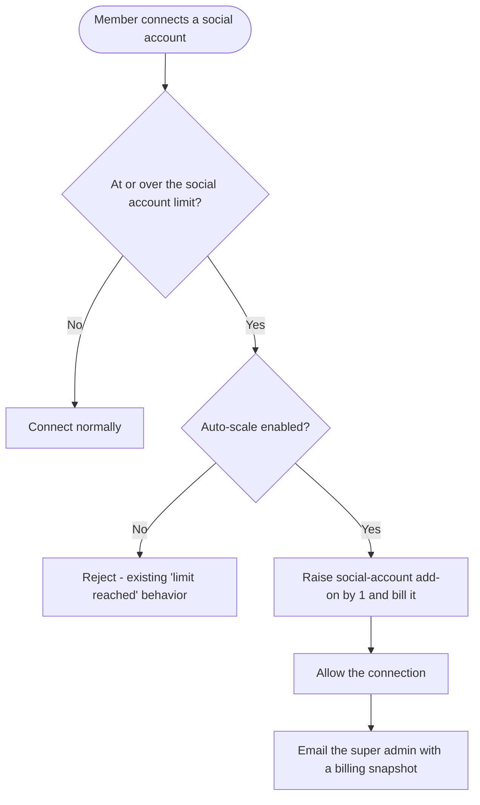
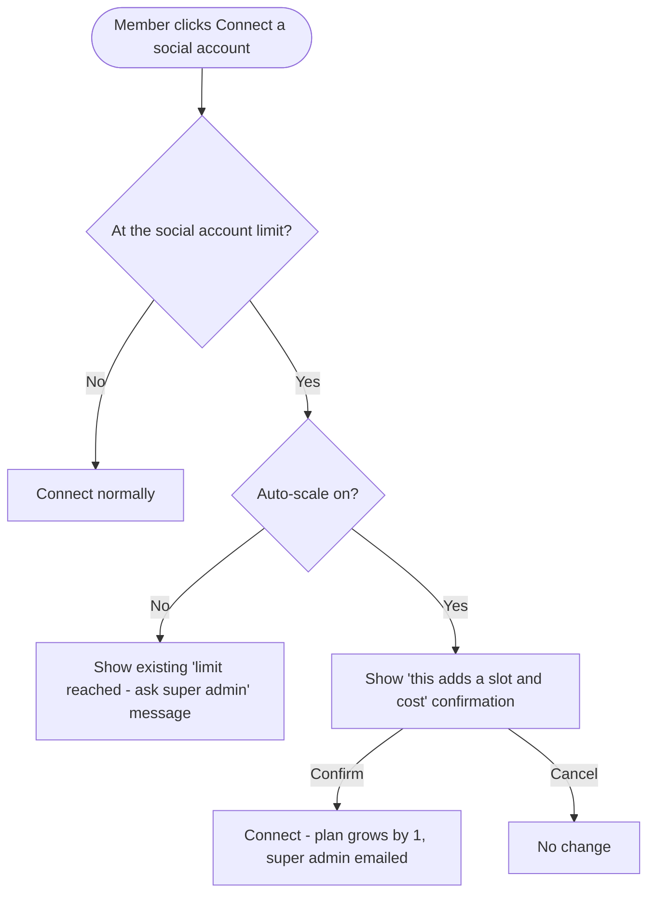

# Auto-Scale Social Account Limits · Stories

**Platform:** Web only (billing & add-on management are web-only). **Scope:** 2 × `[BE]` + 2 × `[FE]`. No mobile.

**What this is:** Today, when a workspace hits its social account limit, team members are blocked and must ask the super admin to buy more. This adds an opt-in (super-admin controlled) "auto-scale" mode: when ON, team members can keep connecting accounts past the limit — each new account auto-raises the plan's social-account add-on and bills it — and the super admin is emailed each time. Built so other add-ons can be added to the same control later; **socials only for now**.

| # | Story | Priority |
|---|---|---|
| S-1 | [BE] Add the super-admin "auto-scale social account limits" setting | Medium |
| S-2 | [BE] Auto-raise the social-account add-on and bill it when a member connects past the limit (+ notify super admin) | High |
| S-3 | [FE] Add a dedicated "Auto-scale limits" modal in billing | Medium |
| S-4 | [FE] Let team members connect social accounts past the limit when auto-scale is on | High |

> Customer-requested. Order: S-1 → S-2 (BE), then S-3 → S-4 (FE). S-3/S-4 depend on S-1/S-2.

---

## S-1 · [BE] Add the super-admin "auto-scale social account limits" setting
**Project:** Web App · **Group:** Backend · **Skill:** Backend · **Product area:** Billing · **Priority:** Medium · **Type:** Feature

### Description
As a super admin, I want a setting that lets my team connect social accounts beyond our current limit (auto-billing the extra), so that my team isn't blocked waiting on me — and I stay in control of whether that's allowed.

This story adds the setting itself (read + update), gated to the super admin, so the rest of the feature can switch on the auto-scale behavior.

### Acceptance criteria
- [ ] A new account-level setting controls whether social-account auto-scaling is enabled (default **off**).
- [ ] Only the super admin (account owner with billing control) can read and change the setting; other roles cannot toggle it.
- [ ] The setting is exposed to the web app so billing/Manage Add-ons can display and update it.
- [ ] The setting is structured so additional add-on types can be added to the same auto-scale control later (socials is the first/only type now).
- [ ] Changing the setting is recorded so it can be audited (who/when) consistent with other billing setting changes.

### Mock-ups
N/A — backend setting.

### Impact on existing data
Adds one new account/subscription-level setting (default off). No migration of existing data beyond defaulting the flag.

### Impact on other products
Web only. No mobile or Chrome extension change. Unblocks the FE Manage Add-ons control and the auto-scale connect behavior.

### Dependencies
- Blocks **[BE] Auto-raise the social-account add-on and bill it when a member connects past the limit (+ notify super admin)** and the FE stories.

### Global quality & compliance (wherever applicable)
- [ ] Mobile responsiveness — N/A, backend-only story
- [ ] Multilingual support (frontend + backend, translations available or fallback handled)
- [ ] UI theming support — N/A, backend-only story
- [ ] White-label domains impact review
- [ ] Cross-product impact assessment (web, mobile apps, Chrome extension)

### Implementation references
*Pointers from research — not a contract. Engineering may choose a different approach.*
- `contentstudio-backend/app/Http/Controllers/Accounts/SubscriptionController.php` — subscription/account settings surface.
- `contentstudio-backend/app/Libraries/Account/Addons.php` — add-on entitlements; good place to expose the auto-scale flag alongside add-on config.
- Mirror the existing super-admin-only billing-setting pattern (the same audience that manages limits/add-ons today).

---

## S-2 · [BE] Auto-raise the social-account add-on and bill it when a member connects past the limit (+ notify super admin)
**Project:** Web App · **Group:** Backend · **Skill:** Backend · **Product area:** Billing · **Priority:** High · **Type:** Feature

### Description
As a team member, when I connect a social account after the plan is full, I want it to just work (the plan grows by one and the cost is added automatically) so that I'm not blocked. As a super admin, I want an email whenever this happens so that I always know when my bill changes and who triggered it.

### Workflow

### Acceptance criteria
- [ ] When a member connects a social account and the workspace is **at/over** its social account limit:
  - [ ] If auto-scale is **off**, the existing "limit reached" rejection behavior is unchanged.
  - [ ] If auto-scale is **on**, the social-account add-on quantity is increased by the number of accounts being connected, the corresponding charge is applied to the subscription (using the existing add-on/limit billing flow and proration), and the connection is allowed.
- [ ] The new limit and charge are reflected in the account's subscription/add-on records immediately so the rest of the app sees the higher limit.
- [ ] Each time auto-scale raises the limit, the **super admin receives an email** following the standard ContentStudio email template, including: the team member's name, the workspace name, and a billing snapshot (add-on name, quantity added, per-account price, new social-account limit, and billing-cycle/charge detail).
- [ ] Auto-scaling only applies to **social accounts** (other add-on types are not auto-scaled yet).
- [ ] If the billing charge fails, the account is **not** connected over-limit and the failure is surfaced (the member sees an error; no silent over-limit connection without billing).
- [ ] When an account is auto-scaled, the existing `addons_limits_updated` / `addon_purchased` tracking fires for the add-on change (server-side or via the FE trigger) with the social-accounts add-on context.

### Mock-ups
N/A — backend + email.

### Impact on existing data
Increases the stored social-account add-on quantity and subscription charge for accounts that auto-scale. Adds a new transactional email. No destructive migration.

### Impact on other products
Web only for the trigger UI, but the raised limit applies everywhere accounts are counted (composer, planner, mobile reflect the higher limit once raised). Pricing per account follows the existing social-account add-on price.

### Dependencies
- **[BE] Add the super-admin "auto-scale social account limits" setting** (provides the on/off gate).

### Global quality & compliance (wherever applicable)
- [ ] Mobile responsiveness — N/A, backend-only story
- [ ] Multilingual support (frontend + backend, translations available or fallback handled)
- [ ] UI theming support — N/A, backend-only story
- [ ] White-label domains impact review
- [ ] Cross-product impact assessment (web, mobile apps, Chrome extension)

### Implementation references
*Pointers from research — not a contract. Engineering may choose a different approach.*
- `contentstudio-backend/app/Http/Controllers/Api/V1/AddAccountController.php` — where social accounts are connected; the limit gate that today rejects over-limit connects.
- `contentstudio-backend/app/Libraries/Account/IncreaseLimitsAddon.php` + `app/Libraries/Account/Addons.php` — add-on limit increase + billing application; reuse for the auto-raise + charge.
- Paddle Billing: `app/Services/PaddleBillingService.php`, `app/Repository/Billing/Paddle/PaddleAddonsSubscriptionRepository.php` — apply the add-on charge/proration.
- Email: follow the existing mailable pattern in `app/Mail/Accounts/` (e.g., `UpgradeGrowthPlanAutomaticallyMail.php` is a close analog for an automatic billing-change notification). Add a new Mailable for the super-admin auto-scale notice.

---

## S-3 · [FE] Add a dedicated "Auto-scale limits" modal in billing
**Project:** Web App · **Group:** Frontend · **Skill:** Frontend · **Product area:** Billing · **Priority:** Medium · **Type:** Feature

### Description
As a super admin, I want a dedicated, clearly-separated place to turn on auto-scaling for social accounts — with the cost impact spelled out — so that I can let my team grow our accounts without me, knowing exactly what it means for my bill, without it being tangled up with the buy-more-add-ons flow.

### Workflow
1. In **Settings → Billing**, next to the **Manage Add-Ons** link on the Usage Limits panel, the super admin sees a small **Auto-scale** icon button.
2. Clicking it opens a **dedicated "Auto-scale limits" modal** (separate from the Manage Add-Ons modal — the two are not mixed).
3. In the modal they see a list of add-on types with a toggle each — **Social accounts** is the only row for now.
4. They read the explanation and cost impact, then turn the **Social accounts** toggle on.
5. A confirmation appears explaining that team members will be able to add accounts beyond the limit and each is billed automatically; they confirm.
6. The toggle is saved; reopening the modal reflects the saved state.

### Acceptance criteria
- [ ] A dedicated **Auto-scale** trigger (icon button, tooltip **"Auto-scale limits"**) appears next to the **Manage Add-Ons** link in the Usage Limits panel, visible only to the super admin.
- [ ] Clicking it opens a **separate "Auto-scale limits" modal** — it does **not** reuse or open the Manage Add-Ons modal; the two surfaces stay independent.
- [ ] The modal contains a **list of add-on rows** (add-on name + toggle), with **Social accounts** as the only row today and room to add more later.
- [ ] Modal title: **"Auto-scale limits"** with subtext: **"Let your team connect more than your plan allows. When a limit is reached, the add-on is increased automatically and billed to your subscription — no waiting on you."**
- [ ] Social accounts row label: **"Social accounts"** with helper text: **"When your team hits the social account limit, new accounts are added automatically at {price}/account/month and billed to your plan."**
- [ ] An info icon (`ℹ`) on the row explains: **"Each account your team connects beyond your limit adds one social-account slot to your plan. You'll get an email every time this happens, with the cost."**
- [ ] Turning the toggle **on** opens a confirmation: title **"Turn on auto-scaling for social accounts?"**, body **"Your team members will be able to connect social accounts beyond your current limit. Each new account adds {price}/account/month to your subscription, and you'll be emailed every time. You can turn this off anytime."**, confirm CTA **"Turn on"**, cancel **"Cancel"**.
- [ ] Turning the toggle **off** saves immediately (no confirmation needed) and future over-limit connects are blocked again.
- [ ] The toggle reflects the saved state when the modal is reopened; a brief loading state shows while saving; a failure shows an error toast: **"Couldn't update auto-scaling. Please try again."**
- [ ] A **"Done"** button closes the modal.
- [ ] Non-super-admin roles do not see the trigger or the modal.
- [ ] When the super admin enables auto-scaling, a `social_auto_scale_enabled` Usermaven event fires with `{ addon: 'social_accounts' }`; disabling fires `social_auto_scale_disabled` with `{ addon: 'social_accounts' }`.
- [ ] All copy is added to the billing namespace across every locale directory under `src/locales/`, English first.

### Mock-ups
A standalone modal opened from an icon button next to the **Manage Add-Ons** link in the Usage Limits panel. Uses the `Modal` component for the dedicated modal, `Switch` for each add-on toggle, and a `Dialog`/`Modal` for the enable confirmation. Kept separate from the Manage Add-Ons modal.

### Impact on existing data
None on the frontend beyond reading/writing the new setting from the BE story.

### Impact on other products
Web only (billing is web-only). White-label safe via theme tokens.

### Dependencies
- **[BE] Add the super-admin "auto-scale social account limits" setting** (read/update API).

### Global quality & compliance (wherever applicable)
- [ ] Mobile responsiveness (frontend only, N/A for backend-only stories)
- [ ] Multilingual support (frontend + backend, translations available or fallback handled)
- [ ] UI theming support (default + white-label, design library components are being used)
- [ ] White-label domains impact review
- [ ] Cross-product impact assessment (web, mobile apps, Chrome extension)

### Implementation references
*Pointers from research — not a contract. Engineering may choose a different approach.*
- `contentstudio-frontend/src/modules/setting/components/billing/sections/UsageLimitsCard.vue` — the Usage Limits panel; add the **Auto-scale** icon-button trigger next to the existing `manage-addons` emit (around the "Manage Add-Ons" button). Emit a separate event (e.g. `open-auto-scale`) so it does **not** reuse the Manage Add-Ons modal.
- `contentstudio-frontend/src/modules/setting/components/billing/EnrolledPlanView.vue` — handles the `manage-addons` emit today; wire the new trigger to a **new standalone modal component** here, kept distinct from the adjust-limits/Manage Add-Ons dialog.
- `contentstudio-frontend/src/modules/billing/composables/useAdjustLimits.js` — holds the social-account add-on price (`prices.socialAccounts`); use it to render the `{price}` in copy so it stays in sync.
- Use `@contentstudio/ui` `Modal` for the dedicated modal, `Switch` for the toggle, `Modal`/`Dialog` for the enable confirm; theme tokens only.
- `const { trackUserMaven } = useUserMaven()` for the new events.

---

## S-4 · [FE] Let team members connect social accounts past the limit when auto-scale is on
**Project:** Web App · **Group:** Frontend · **Skill:** Frontend · **Product area:** Settings · **Priority:** High · **Type:** Feature

### Description
As a team member, when our plan is full and auto-scale is on, I want to connect a social account anyway — with a clear heads-up that it adds to the plan — so that I can get my work done without chasing the super admin. When auto-scale is off, I should see the existing "limit reached" message.

### Workflow

### Acceptance criteria
- [ ] When the workspace is at the social account limit and auto-scale is **off**, connecting shows the **existing** "limit reached / ask your super admin" behavior (unchanged).
- [ ] When at the limit and auto-scale is **on**, connecting a new account is **not blocked**; instead the user sees a confirmation before it's added.
- [ ] Confirmation modal — title: **"Add another social account?"**, body: **"You've reached your plan's social account limit. Connecting this account adds 1 social-account slot to your plan at {price}/account/month, and your super admin will be notified."**, confirm CTA: **"Connect & add slot"**, cancel: **"Cancel"**.
- [ ] On confirm, the account connects and the plan's social-account limit reflects the increase immediately across the app (no manual refresh needed).
- [ ] If the connection/billing fails, the user sees an error and the account is not added: **"We couldn't add this account right now. Please try again or contact your super admin."**
- [ ] The auto-scale path works wherever a team member connects social accounts in the web app (e.g., the social accounts settings connect flow).
- [ ] When an account is connected via auto-scale, a `social_account_auto_scaled` Usermaven event fires with `{ added_count, price }` (in addition to the existing connect tracking).
- [ ] All new copy is added across every locale directory under `src/locales/`, English first.

### Mock-ups
N/A — confirmation modal uses the existing `Modal`/`Dialog` component.

### Impact on existing data
None on the frontend; the limit increase + charge happen via the BE story.

### Impact on other products
Web only for the connect-confirmation UI. The raised limit applies everywhere accounts are counted. Mobile connect flow is **out of scope** for now — it continues to respect the current limit (which is simply higher after a web auto-scale); if mobile needs the same in-app auto-scale prompt later, track it separately.

### Dependencies
- **[BE] Auto-raise the social-account add-on and bill it when a member connects past the limit (+ notify super admin)** (does the actual raise/charge/email).
- **[FE] Add a dedicated "Auto-scale limits" modal in billing** (where the super admin turns it on).

### Global quality & compliance (wherever applicable)
- [ ] Mobile responsiveness (frontend only, N/A for backend-only stories)
- [ ] Multilingual support (frontend + backend, translations available or fallback handled)
- [ ] UI theming support (default + white-label, design library components are being used)
- [ ] White-label domains impact review
- [ ] Cross-product impact assessment (web, mobile apps, Chrome extension)

### Implementation references
*Pointers from research — not a contract. Engineering may choose a different approach.*
- `contentstudio-frontend/src/modules/setting/components/workspace/team/SocialPlatformAccounts.vue` and the social-accounts connect entry points — where the limit gate / "ask super admin" message lives today.
- `contentstudio-frontend/src/modules/billing/composables/useAdjustLimits.js` — social-account price for the `{price}` copy.
- Reuse the existing connect flow; branch on the auto-scale setting (from the BE setting) + current usage vs limit before showing the block vs the confirm.
- `const { trackUserMaven } = useUserMaven()`; the connect itself already has `connected_social_accounts` — add the auto-scale event alongside it.
