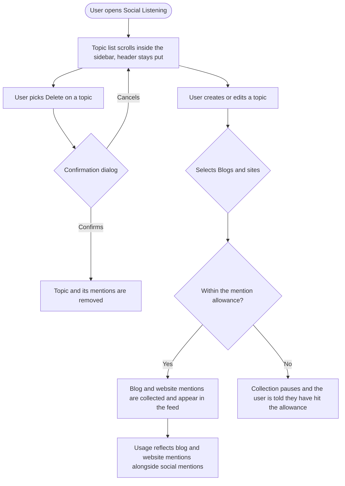

# Story: Social Listening fixes and Blog and Website Mentions to production

> **Authored as one ticket, as requested.**
>
> A note for the PO, not a refusal: parts 1 and 2 below are small frontend fixes with no commercial consequence, while part 3 is a billing implementation plus a production rollout with pricing decisions behind it. Bundled, the two quick fixes cannot ship until the pricing questions are answered. If you would rather split it, the natural three-way split is *[FE] Add delete confirmation and fix the topic sidebar scroll*, *[BE] Meter and enforce Blog and Website Mentions against the listening subscription*, and *[FE]+[BE] Blog and Website Mentions production readiness*. Your call. The combined version is what follows.

---

## [Full Stack] Social Listening: delete confirmation, sidebar scroll fix, and Blog and Website Mentions to production

### Description

Three pieces of Social Listening work.

Deleting a topic currently happens on a single click from a menu, with no confirmation. A topic carries every mention gathered under it, so an accidental click destroys real history and there is no way back.

The topic sidebar cuts topics off at the bottom once there are enough of them, and the whole sidebar scrolls instead of just the topic list, so the header scrolls away with it.

Blog and Website Mentions is built and working (it is already in the platform picker as "Blogs & sites", it has its own mention rendering, and the crawler exists) but it has never been metered or priced, so it cannot go to production. This story finishes the commercial side and takes it live.

### Workflow

**Delete confirmation**

1. User opens the topic list and picks Delete on a topic.
2. A confirmation dialog names the topic and warns that its mentions go with it.
3. Cancelling leaves everything as it was. Confirming deletes the topic and shows the existing success toast.

**Sidebar scrolling**

4. User has more topics than fit on screen. The topic list scrolls inside the sidebar. The sidebar header stays fixed, no topic is cut off, and the surrounding layout does not move.

**Blog and Website Mentions**

5. User creates a topic and includes Blogs and sites in its platforms.
6. Blog and website mentions are collected and appear in the feed, with the source domain as the author and no engagement metrics, as they do today.
7. Those mentions count against the user's listening allowance per the agreed metering, and the usage display reflects them.
8. When the allowance is reached, collection pauses and the user is told clearly, in the same way social mention limits are communicated today.

### Acceptance criteria

**Delete confirmation**

- [ ] Deleting a listening topic requires an explicit confirmation. No path deletes a topic on a single click.
- [ ] The confirmation names the topic and states that its collected mentions are removed with it.
- [ ] Confirming deletes the topic and shows the existing success toast. The existing deletion tracking still fires.
- [ ] Cancelling leaves the topic and its mentions untouched.
- [ ] Confirmation is required from every entry point that can delete a topic, including the topic list row menu and the views sidebar list.
- [ ] The confirm button is disabled while the deletion is in flight, so a double click cannot fire two deletes.
- [ ] A failed deletion shows an error and leaves the topic in place, rather than removing it from the list optimistically.

**Sidebar scrolling**

- [ ] With more topics than fit on screen, the topic list scrolls within the sidebar and no topic is cut off or unreachable.
- [ ] The sidebar header stays fixed while the topic list scrolls.
- [ ] The page as a whole does not scroll as a result of the topic list being long.
- [ ] The sidebar's collapse and expand behaviour still works, and collapsing does not leave a scrollbar behind.
- [ ] The fix holds at every supported width, and at browser zoom levels where the header takes proportionally more space.
- [ ] The fix holds with a single topic and with a very large number of topics.

**Blog and Website Mentions**

- [ ] Blog and website mentions are metered against the listening subscription per the agreed model, and the model is documented alongside the implementation.
- [ ] The usage figures a user sees account for blog and website mentions, so the number shown matches what they are actually consuming.
- [ ] The approaching-limit and limit-reached states behave for blog and website mentions the same way they do for social mentions.
- [ ] When the allowance is reached, blog and website collection pauses and resumes on the next reset, without losing the topic's configuration.
- [ ] A user without the listening subscription cannot collect blog and website mentions, consistent with how the rest of listening is gated.
- [ ] Any per-topic or per-domain cap agreed for web sources is enforced, and a topic hitting it is visible to the user rather than silently truncated.
- [ ] Blog and website mentions render in the feed with the source domain as the author and without engagement metrics, unchanged from current behaviour.
- [ ] Blogs and sites remains selectable in the topic platform picker, and the selection persists correctly on save and edit.
- [ ] Existing topics that already include Blogs and sites keep working, and their previously collected mentions are not lost or double-counted when metering starts.
- [ ] Analytics and exports that count mentions include blog and website mentions consistently, so no surface shows a different total.
- [ ] The production launch checklist is completed: monitoring on the crawler, alerting on collection failures, and a documented way to disable web collection if it misbehaves in production.

**Copy and quality**

- [ ] All new and changed strings are translated and present in every locale directory.
- [ ] Every new dialog and message renders correctly on a white-label domain.

### UI copy

**Delete topic confirmation**
- Title: `Delete this topic?`
- Body: `{topicName} and all the mentions collected for it will be removed. This can't be undone.`
- Primary button: `Delete topic`
- Secondary button: `Cancel`

**Delete failure**
- `We couldn't delete that topic. Please try again.`

**Approaching the mention allowance** (extends the existing message to cover web)
- `You've used {used} of {limit} mentions this month across all your topics, including blogs and sites. Collection pauses when you reach the limit.`

**Mention allowance reached**
- Title: `You've reached this month's mention limit`
- Body: `Collection is paused until {resetDate}. Your topics and everything already collected are safe. To keep collecting now, increase your mention allowance.`
- Primary button: `Increase allowance`
- Secondary button: `Close`

**Per-source cap reached, if one is agreed**
- `This topic has reached its limit for blogs and sites. Narrow its keywords to focus on the sources that matter most.`

**Blogs and sites platform option** (existing label, unchanged)
- `Blogs & sites`
- Tooltip: `Track mentions on blogs, news sites and other websites. These show the site they came from instead of a social profile, and they don't have likes or comments.`

All strings go through translation and land in every locale directory in the same change. Note the deliberate absence of em dashes.

### Mock-ups

N/A for the delete confirmation and the sidebar fix. Both reuse existing patterns: the app's standard confirmation dialog and the existing sidebar layout.

The limit-reached and approaching-limit messaging should follow whatever treatment the social listening launch UI work established for billing messaging, rather than introducing a new one.

### Impact on existing data

- No change to stored topics or mentions from the delete confirmation or the sidebar fix.
- Metering introduces usage accounting for blog and website mentions. Topics that already collect them must not be retroactively charged for mentions collected before metering started, and must not have those mentions double-counted. How previously collected web mentions are treated at cutover needs an explicit decision before implementation.

### Impact on other products

- Web app only. Social Listening is web only.
- Billing: metering changes what a listening subscription consumes, so the pricing owner has to sign off before this ships.
- The Go listening service runs the web crawler and is where collection pausing is enforced.
- Mobile apps and Chrome extension: unaffected.

### Dependencies

- **Blocking decision, needed before the billing part starts:** whether blog and website mentions share the monthly mention pool with social mentions or have their own, whether Blogs and sites is included in the base listening add-on or priced separately, and whether a per-topic or per-domain cap applies. The two frontend fixes are not blocked by this.
- Related to the social listening launch UI work, which owns the billing modal copy and the launch surfaces. Limit messaging here should match it.

### Global quality and compliance checklist

- [ ] Mobile responsiveness tested (frontend only, N/A for backend-only stories)
- [ ] Multilingual support verified (frontend + backend, translations available or fallback handled)
- [ ] UI theming supported (default + white-label, design library components are being used)
- [ ] White-label domains impact reviewed
- [ ] Cross-product impact assessed (web, mobile apps, Chrome extension)

### Implementation references

*Pointers from research — not a contract. Engineering may choose a different approach.*

**Delete confirmation**
- `contentstudio-frontend/src/modules/listening/composables/useListeningTopics.ts` — `deleteTopic(topic)` at line 222 goes straight to `deleteMutation.mutateAsync(...)` at line 233, then fires `trackUserMaven('listening_topic_deleted')` and the `listening.toasts.topic_deleted` toast. The confirmation belongs before the mutation, and the existing tracking and toast should stay exactly where they are.
- Both entry points emit rather than confirming: `components/topics/ListeningTopicListItem.vue:96` (`@click="$emit('delete', topic)"`) and `components/nav/ListeningViewsListContent.vue:179` (`@click="$emit('delete-view', view.id)"`). Putting the confirmation in the composable rather than in each component covers both and any future third caller.
- The listening module already has removal-confirmation dialogs elsewhere in the product to match, so this should not need a new pattern.

**Sidebar scrolling**
- `components/nav/ListeningViewsListContent.vue:2` already has the right intent: `flex min-w-[200px] flex-1 flex-col overflow-y-auto`. The problem is almost certainly above it. `components/nav/ListeningViewsSidebar.vue:41` sets width and collapse behaviour but nothing that constrains height, and line 43's header is a fixed `h-[4.25rem] min-h-[4.25rem]`.
- Flex children default to `min-height: auto`, so a `flex-1` child with `overflow-y-auto` grows past its parent instead of scrolling inside it unless an ancestor carries `min-h-0`. Adding `min-h-0` at the right level in the sidebar chain is the usual fix, and is preferable to changing the list's own overflow.
- Test with the sidebar collapsed as well as expanded, since the collapsed state sets `desktop:overflow-hidden` on the root.

**Blog and Website Mentions**
- The feature already works. `constants.ts:124` has `{ id: 'web', label: 'Blogs & sites' }` in `LISTENING_PLATFORM_OPTIONS` with no feature gate. `utils/mentionContent.ts` handles the `web` platform at lines 219 and 257 with a dedicated spec at `utils/mentionContent.web.spec.ts`. `components/feed/ListeningMentionCard.vue:109` hides engagement metrics for `web`. The crawler is `contentstudio-social-analytics-go/src/services/listening/fetcher/web.go`.
- The metering mechanism to extend is `contentstudio-backend/app/Data/Listening/ListeningSubscriptionUsageData.php`, which already carries `mentions_this_month`, `mention_limit_monthly`, `approaching_limit`, `mentions_limit_reached` and `reset_date`. If web mentions share the pool, this may need no new fields; if they get their own, it does.
- `contentstudio-backend/app/Libraries/Settings/SubscriptionLimits.php` counts `listening_topics` for the addon catalog and sets `social_listening_lock` / `social_listening_addon` from `has_social_listening_subscription`. That is the existing gate to reuse rather than adding a second one.
- Other touchpoints: `app/Services/Listening/TopicService.php`, `app/Http/Controllers/Listening/ListeningTopicsController.php`, `app/Jobs/Listening/TriggerTopicSyncJob.php`, `app/Libraries/Account/IncreaseLimitsAddon.php`, `app/Services/PaddleBillingService.php`.
- Collection pausing has to be enforced where collection happens, in the Go listening service, not only in the UI. A limit enforced only in the frontend still costs us the crawl.
- The listening add-on's existing commercial baseline is $49 per month with 5 topics and 10,000 mentions per month. That is the envelope the web-mention decision has to fit into.
