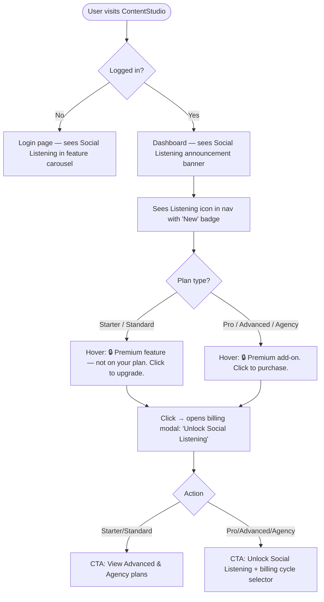

# Stories: Social Listening Module Launch UI

---

## [FE] Social Listening launch surface — "New" badge, billing modal copy, announcement banner, login carousel, and hover tooltips

### Description

As a ContentStudio user, I want to see clear signals that Social Listening is a new, available feature — through a "New" badge on the nav icon, an updated announcement banner on the dashboard, and an up-to-date billing modal — so that I understand what the feature is, know it's just launched, and can easily take action to unlock or explore it.

---

### Workflow

1. User arrives at the login page and sees the Social Listening feature image in the left-side carousel with the title "Social Listening" and relevant description.
2. After logging in, user sees the dashboard announcement banner (black bar) with: "📢 Social Listening is here. Monitor conversations, track trends, and act on real-time insights. Try it now →"
3. In the left navigation rail, the Social Listening icon shows a small **"New"** badge in its top-right corner.
4. On hover over the Social Listening icon:
   - **Starter/Standard plans** (feature not available on plan): "🔒 Social Listening is a Premium feature and isn't available on your current plan. Click to upgrade."
   - **Pro/Advanced/Agency plans** (add-on purchasable): "🔒 Social Listening is a Premium add-on. Click to purchase the add-on to start tracking mentions, trends & sentiment."
5. User clicks the locked Social Listening icon → the "Unlock Social Listening" billing modal opens.
6. Modal shows:
   - **Title:** Unlock Social Listening
   - **Subtitle:** "Your brand is being talked about right now. Social Listening lets you monitor every mention, trend, and conversation across X, Reddit, Threads, Facebook, Instagram, and TikTok — before it matters too late."
   - **Feature bullets (4):**
     - ✅ Track brand, competitor & industry keywords across all major platforms
     - ✅ AI-detected sentiment — positive, negative, or neutral, automatically
     - ✅ Crisis spike alerts — get notified the moment volume or negativity surges
     - ✅ Spot trends before they peak so your content is always first
   - **CTA:** "View Advanced & Agency plans" (Starter/Standard) or billing cycle selector + "Unlock Social Listening" button (Pro/Advanced/Agency)

---

### Acceptance criteria

**"New" badge on nav icon**
- [ ] The Social Listening nav icon in `DesktopNavigationRail` shows a "New" badge pill in its top-right corner
- [ ] The "New" badge is visible regardless of whether the feature is locked or unlocked for the user
- [ ] The badge does not appear on any other nav icon

**Login page carousel**
- [ ] The Social Listening feature entry (title, description, image) appears in the login page left-panel feature carousel alongside other feature entries
- [ ] The image rotates in with the same animation and timing as existing features

**Announcement banner**
- [ ] The dashboard announcement banner (black bar) displays: "📢 Social Listening is here. Monitor conversations, track trends, and act on real-time insights. Try it now"
- [ ] "Try it now" is a clickable link; for users with access it navigates to the Listening module; for locked users it opens the billing modal
- [ ] The banner can be dismissed; dismissal is persisted (does not reappear on page refresh)
- [ ] The banner replaces the existing Black Friday content — it does not appear alongside it

**Hover tooltips**
- [ ] Hovering the locked Social Listening icon when the user is on a **Starter or Standard plan** shows: "🔒 Social Listening is a Premium feature and isn't available on your current plan. Click to upgrade."
- [ ] Hovering the locked Social Listening icon when the user is on a **Pro, Advanced, or Agency plan** (add-on not yet purchased) shows: "🔒 Social Listening is a Premium add-on. Click to purchase the add-on to start tracking mentions, trends & sentiment."
- [ ] No tooltip change on hover when Social Listening is already unlocked (existing behavior preserved)

**Billing modal copy**
- [ ] The billing modal subtitle reads: "Your brand is being talked about right now. Social Listening lets you monitor every mention, trend, and conversation across X, Reddit, Threads, Facebook, Instagram, and TikTok — before it matters too late."
- [ ] Feature bullet 1: "Track brand, competitor & industry keywords across all major platforms"
- [ ] Feature bullet 2: "AI-detected sentiment — positive, negative, or neutral, automatically"
- [ ] Feature bullet 3: "Crisis spike alerts — get notified the moment volume or negativity surges"
- [ ] Feature bullet 4: "Spot trends before they peak so your content is always first"
- [ ] All other billing modal behavior (price tiles, CTA logic, Paddle checkout, confirmation popup) is unchanged

**Analytics**
- [ ] When a user clicks "Try it now" on the announcement banner, a `social_listening_banner_cta_clicked` Usermaven event fires with `{ entry_point: 'dashboard_announcement_banner' }`

---

### Mock-ups

N/A — copy and layout spec provided above.

---

### Impact on existing data

None. All changes are UI copy and a nav badge. No schema or API changes.

---

### Impact on other products

- **Mobile apps:** The mobile nav does not currently show Social Listening — no mobile change needed.
- **Chrome Extension:** Not affected.
- **White-label:** The "New" badge and announcement banner should be hidden on white-label domains where the branding is customized (check `shouldShowWhiteLabelData` from `useWhiteLabelApplication`). The billing modal copy is shown to all users regardless of white-label.

---

### Dependencies

None. The `ListeningUpgradeModal`, nav item, and plan-tier detection are all already implemented.

**Note on login page image:** The `LoginSideComponent.vue` pulls features from `fetchLoginFeaturesURL`. Adding Social Listening to the login carousel requires confirming:
1. The feature image URL (must be hosted in the ContentStudio GCS bucket)
2. Whether the image is added to the API payload (BE team) or as a static entry in the component

This should be confirmed with the team before implementation begins.

---

### Global quality & compliance (wherever applicable)

- [ ] Mobile responsiveness (the "New" badge and announcement banner must be tested at all breakpoints)
- [ ] Multilingual support (all new i18n keys must be added to every locale under `src/locales/` — English is source of truth, other locales can start with the English string)
- [ ] UI theming support (default + white-label — use CSS variables; hide announcement banner on white-label domains)
- [ ] White-label domains impact review (announcement banner and "New" badge should be hidden for white-label users)
- [ ] Cross-product impact assessment (web only; mobile, Chrome extension not affected)

---

### Implementation references

*Pointers from research — not a contract. Engineering may choose a different approach.*

**"New" badge on nav item:**
- `useHeaderNavigation.ts:13-26` — `HeaderNavigationItem` interface needs a new optional `showNewBadge?: boolean` field
- `useHeaderNavigation.ts:231-251` — listening item definition; set `showNewBadge: true` here
- `DesktopNavigationRail.vue:512-528` — the icon card `` already renders a lock badge using an absolute-positioned `` (lines 523–527); the "New" badge follows the same pattern but positioned top-right and uses a different color/style. Use a simple Tailwind pill (e.g., `absolute -top-1 -right-1 rounded-full bg-green-500 text-white text-[9px] px-1`) — not the `Badge` component from `@contentstudio/ui` since that is sized for larger contexts.

**Announcement banner:**
- `DashboardNotificationBanner.vue` — currently conditionally renders Black Friday content. Add a new Social Listening announcement block; use `shouldShowWhiteLabelData` (already imported) to gate it on non-white-label workspaces
- Banner dismissal already uses `setDashboardBannerStatus` — reuse this pattern with a new key (e.g., `'social_listening_announcement'`)
- New i18n keys go in `dashboard.json` under `notification_banner.social_listening.*`

**Billing modal copy (i18n only — no Vue changes):**
- All copy lives in `src/locales/*/listening.json`. Only change the values for:
  - `unlock_modal.locked.description`
  - `unlock_modal.feature1` through `unlock_modal.feature4`
  - `landing.not_supported.heading`
  - `landing.locked.heading`
- The `ListeningUpgradeModal.vue` template already reads these keys — no template changes needed

**Login page carousel:**
- `LoginSideComponent.vue:58` — imports `fetchLoginFeaturesURL`
- `LoginSideComponent.vue:121` — populates `features.value` from the API response
- If a static fallback is chosen over the API, add Social Listening as a `const SOCIAL_LISTENING_FEATURE` entry and push it into the array before the API data
- Image should be hosted in `https://storage.googleapis.com/contentstudio-media-library-nearline/contentstudio/feature-images/`
