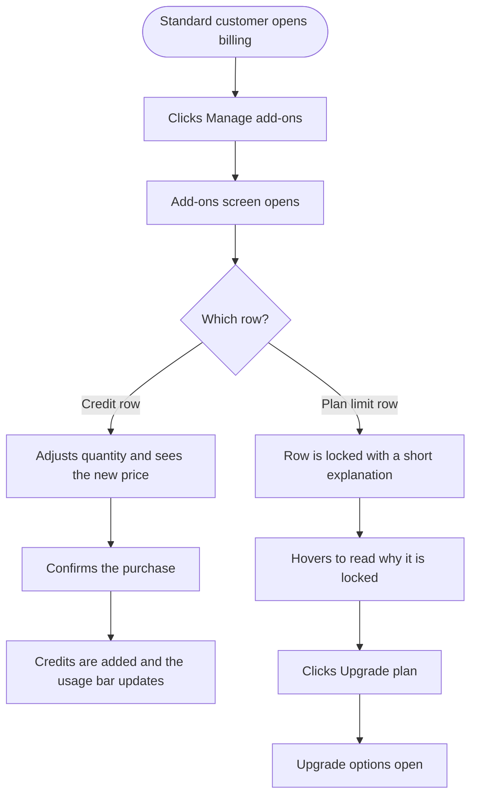

# Epic: Usage add-on top-ups on the Standard plan

## Goal

Let Standard subscribers buy more of what they consume, without forcing a plan upgrade for every top-up.

Today the Standard plan blocks add-ons entirely. A Standard customer who runs out of AI credits, video credits, auto-reply credits or API credits mid-month has exactly one option offered to them: upgrade to a higher plan. There is no way to simply buy more of the thing they ran out of. The "Manage add-ons" button is visible but dead, which reads as a broken screen rather than a deliberate limit.

That is the wrong trade for consumable credits. Running out of AI credits is a usage spike, not a signal that the customer has outgrown their plan.

## What changes

We split add-ons into two groups and treat them differently on Standard:

**Consumable credits, which Standard can now buy:**
- AI text credits
- AI image credits
- AI video credits
- Video clip credits
- AI auto-reply credits
- API credits
- X posting credits

**Plan limits, which stay tied to the plan:**
- Workspaces
- Social accounts
- Team members
- Automation campaigns
- Media storage

The add-ons screen now opens for Standard customers instead of being blocked at the door. Inside, credit rows work normally. Plan-limit rows are visible but locked, each with a short explanation of why and a direct path to upgrade.

## Why this split

Credits are consumption. Buying more is the customer telling us they are getting value, and we should take their money. Workspaces, social accounts, team members, automations and storage describe how big an operation the customer runs. Those are what separates Standard from Advanced and Agency, and letting Standard buy its way past them would erase the difference between the plans.

Locking those rows in plain sight is also a better upsell than hiding them. The customer sees exactly what a higher plan would give them, at the moment they are looking for it.

## Out of scope

- **Trials.** Trial subscriptions keep their current behaviour and their current message. This epic covers paid Standard subscriptions only.
- **Social listening credits.** Social listening is not part of the Standard plan at all, so its credits stay unavailable. Nothing changes here.
- **Auto-scale.** Auto-scale only adds social account slots, which is a plan limit, so it stays off on Standard.
- **Plans bought through the Apple App Store.** Add-on purchases for App Store subscriptions are a separate billing question and are not covered here.
- **X wallet.** Standard customers can already top up their X spending balance. This epic does not change that, but it should be confirmed still working once the rest ships.

## Success looks like

- A Standard customer who runs out of AI credits can buy more in under a minute without changing plan.
- A Standard customer who wants a sixth social account understands within seconds why they cannot buy one, and knows what to do about it.
- Advanced, Agency and every other plan behave exactly as they do today.

## Stories

- **[Design] Design the locked plan-limit row and its upgrade prompt in the add-ons screen**
- **[BE] Allow Standard subscribers to buy credit add-ons while keeping plan limits fixed**
- **[FE] Open the add-ons screen for Standard customers with locked plan-limit rows**

---

## [Design] Design the locked plan-limit row and its upgrade prompt in the add-ons screen

### Description

As a Standard subscriber, I want the add-ons screen to make it obvious which limits I can top up and which ones need a plan change, so that I do not waste time trying to buy something my plan cannot give me.

### Workflow

1. The customer opens the add-ons screen from their billing page.
2. They see every limit listed, as they do today.
3. Credit rows look and behave exactly as they do on higher plans, with the usual controls to add or remove quantity.
4. Plan-limit rows are visibly set apart. The controls are inactive and the row carries a short marker showing this limit belongs to the plan.
5. Hovering a plan-limit row explains why it is locked and what the current plan includes.
6. Each plan-limit row offers a way to move straight to the upgrade options.

### Acceptance criteria

- [ ] Designs cover the add-ons screen for a Standard subscriber, showing purchasable credit rows and locked plan-limit rows side by side in one view
- [ ] Locked rows are distinguishable from purchasable rows at a glance, without relying on colour alone
- [ ] A locked row includes a marker indicating the limit is set by the plan
- [ ] A locked row includes an upgrade action, and the design shows its resting, hover and focus states
- [ ] Hover explanation is designed for each of the five locked limits: workspaces, social accounts, team members, automation campaigns, media storage
- [ ] Designs show the add-ons screen at mobile width, with locked rows and their upgrade action remaining usable
- [ ] Designs cover the case where a customer has previously bought a credit add-on and still has it active
- [ ] Designs are handed over with the exact copy for every marker, explanation and action, ready to be used as written
- [ ] Design uses existing design system elements wherever they fit, and any element that does not yet exist is called out explicitly at handover

### Mock-ups

This story produces them.

### Impact on existing data

None.

### Impact on other products

None. The add-ons screen exists on web only.

### Dependencies

None. This story blocks **[FE] Open the add-ons screen for Standard customers with locked plan-limit rows**.

### Global quality & compliance (wherever applicable)

- [ ] Mobile responsiveness (frontend only, N/A for backend-only stories)
- [ ] Multilingual support (frontend + backend, translations available or fallback handled) — copy must be short enough to survive translation without breaking the row layout
- [ ] UI theming support (default + white-label, design library components are being used)
- [ ] White-label domains impact review
- [ ] Cross-product impact assessment (web, mobile apps, Chrome extension)

---

## [BE] Allow Standard subscribers to buy credit add-ons while keeping plan limits fixed

### Description

As a Standard subscriber, I want to buy more credits when I run out, so that I can keep working without upgrading my whole plan for a one-off busy month.

### Acceptance criteria

- [ ] A Standard subscriber can buy any of these add-ons: AI text credits, AI image credits, AI video credits, video clip credits, AI auto-reply credits, API credits, X posting credits
- [ ] A Standard subscriber cannot buy any of these add-ons: workspaces, social accounts, team members, automation campaigns, media storage
- [ ] An attempt to buy a blocked add-on is refused with a clear message explaining that the limit is set by the plan and needs an upgrade
- [ ] A blocked add-on is refused even when the request does not come from the add-ons screen, so the rule cannot be bypassed
- [ ] Credits bought as add-ons are added on top of what the plan already includes, and the combined total is what gets consumed
- [ ] A Standard subscriber who previously bought credit add-ons can also reduce or remove them
- [ ] Pricing, billing cycle and proration for a Standard credit purchase behave the same way they do on higher plans
- [ ] Advanced, Agency Unlimited, Professional, Business and Agency, Enterprise, Max, and lifetime plans keep access to every add-on, unchanged
- [ ] Legacy starter, growth and Empowerers plans keep access to every add-on, unchanged
- [ ] Trial subscriptions are unaffected and keep their current behaviour
- [ ] Social listening credits remain unavailable on Standard, unchanged
- [ ] Auto-scale remains unavailable on Standard, unchanged
- [ ] A Standard subscriber's ability to top up their X spending balance is unchanged
- [ ] Add-on purchases made through the Apple App Store are unaffected by this change
- [ ] A Standard subscriber with free API credits included on their account is charged correctly when buying more API credits, with the free amount taken into account

### Impact on existing data

Plan records need to carry which add-ons each plan permits, rather than a single yes or no for add-ons overall. Existing add-on purchases and their quantities are untouched. No customer loses access to anything they have already bought.

### Impact on other products

- **Mobile app:** no impact. There is no add-on purchase flow in the app.
- **Chrome extension:** no impact.
- **White-label:** no impact.

### Dependencies

None. **[FE] Open the add-ons screen for Standard customers with locked plan-limit rows** depends on this.

### Global quality & compliance (wherever applicable)

- [ ] Mobile responsiveness — N/A, backend-only story
- [ ] Multilingual support (frontend + backend, translations available or fallback handled)
- [ ] UI theming support — N/A, backend-only story
- [ ] White-label domains impact review
- [ ] Cross-product impact assessment (web, mobile apps, Chrome extension)

---

## [FE] Open the add-ons screen for Standard customers with locked plan-limit rows

### Description

As a Standard subscriber, I want to open the add-ons screen and buy more credits directly, so that I stop hitting a dead button whenever I run low.

### Workflow

1. A Standard customer goes to their billing page and sees the "Manage add-ons" button active rather than greyed out.
2. They click it and the add-ons screen opens.
3. Credit rows behave normally. They can raise or lower the quantity and watch the price summary update.
4. Plan-limit rows are shown but locked, each with a marker saying the limit comes from the plan.
5. Hovering a locked row explains why it cannot be changed and what their plan currently includes.
6. Clicking the upgrade action on a locked row takes them to the upgrade options.
7. If they adjust credits and confirm, the purchase completes and their usage figures update.
8. Elsewhere in the product, when a Standard customer runs out of a credit type, the message now offers to buy more credits instead of only offering a plan upgrade.

### UI copy

**Add-ons screen, introductory line (new):**
> Top up your credits any time. Workspaces, social accounts, team members, automations and storage are set by your plan.

**Marker on every locked row:**
> Set by your plan

**Hover explanation, workspaces:**
> Workspaces come with your plan and cannot be topped up. Standard includes 1 workspace. Upgrade your plan to work across more than one.

**Hover explanation, social accounts:**
> Social accounts come with your plan and cannot be topped up. Standard includes 5 accounts. Upgrade your plan to connect more.

**Hover explanation, team members:**
> Team members come with your plan and cannot be topped up. Standard does not include any. Upgrade your plan to invite your team.

**Hover explanation, automation campaigns:**
> Automation campaigns come with your plan and cannot be topped up. Standard does not include any. Upgrade your plan to start automating your posting.

**Hover explanation, media storage:**
> Storage comes with your plan and cannot be topped up. Standard includes 10 GB. Upgrade your plan for more room for your images and videos.

**Upgrade action on a locked row:**
> Upgrade plan

**Message when a Standard customer runs out of a credit type, anywhere in the product:**
> You have used all your credits for this month. Buy more credits to keep going, or upgrade your plan for a bigger monthly allowance.

Primary action: `Buy more credits`
Secondary action: `Upgrade plan`

**Error when a purchase is refused because the limit is set by the plan:**
> This limit is set by your plan and cannot be topped up. Upgrade your plan to increase it.

**Error when a purchase fails for any other reason:**
> We could not update your add-ons. Please refresh the page and try again. If it keeps happening, contact our support team.

**Loading state:** while prices and current limits are being fetched, rows show the existing loading treatment used on this screen. No new copy.

### Acceptance criteria

- [ ] For a paid Standard subscriber, the "Manage add-ons" button is active and opens the add-ons screen
- [ ] The add-ons screen shows the introductory line specified above
- [ ] Credit rows for AI text, AI image, AI video, video clips, AI auto-reply and API credits are fully interactive for a Standard subscriber
- [ ] The X posting credits row is interactive for a Standard subscriber whenever that row is shown for their account
- [ ] Rows for workspaces, social accounts, team members, automation campaigns and media storage are visible but their quantity controls cannot be used
- [ ] Each locked row shows the "Set by your plan" marker
- [ ] Hovering a locked row shows the explanation written for that specific limit, with the correct included amount
- [ ] Each locked row has an "Upgrade plan" action that opens the upgrade options
- [ ] Locked rows are excluded from the price summary and never affect the total
- [ ] A Standard subscriber can complete a credit purchase and sees their usage figures update afterwards without reloading the page
- [ ] A Standard subscriber who already owns credit add-ons can reduce or remove them
- [ ] If a purchase is refused because the limit is set by the plan, the specified error message is shown and nothing is charged
- [ ] Social listening rows remain hidden for Standard subscribers
- [ ] The auto-scale control remains unavailable for Standard subscribers
- [ ] Advanced, Agency and all other plans see the add-ons screen exactly as they do today, with no locked rows
- [ ] Trial customers see their existing message and behaviour, unchanged
- [ ] Wherever a Standard customer is told they have run out of AI text, AI image, AI video, video clip, auto-reply or API credits, the message offers "Buy more credits" as the primary action and "Upgrade plan" as the secondary action
- [ ] Wherever a Standard customer is told they have reached a plan limit for workspaces, social accounts, team members, automations or storage, the message offers only the upgrade path
- [ ] All new copy is added to every supported language, with English shown as the fallback where a translation is missing
- [ ] The add-ons screen remains usable at mobile width, with locked rows and their upgrade action reachable
- [ ] When a Standard subscriber completes a credit purchase, the existing add-on purchase tracking fires exactly as it does for higher plans

### Mock-ups

Provided by **[Design] Design the locked plan-limit row and its upgrade prompt in the add-ons screen**.

### Components

Use `Badge` for the "Set by your plan" marker, `Button` for the upgrade action, and `Icon` for the hover affordance. There is no standalone tooltip component in the design system, so the hover explanations follow the same hover pattern already used across the billing screens.

### Impact on existing data

None. This story changes what a customer can see and do, not what is stored.

### Impact on other products

- **Mobile app:** no impact. There is no add-on purchase screen in the app.
- **Chrome extension:** no impact.
- **White-label:** the add-ons screen appears on white-label domains, so the new markers and actions must follow the customer's theme colours rather than a fixed colour.

### Dependencies

- Depends on **[Design] Design the locked plan-limit row and its upgrade prompt in the add-ons screen**
- Depends on **[BE] Allow Standard subscribers to buy credit add-ons while keeping plan limits fixed**

### Global quality & compliance (wherever applicable)

- [ ] Mobile responsiveness (frontend only, N/A for backend-only stories)
- [ ] Multilingual support (frontend + backend, translations available or fallback handled)
- [ ] UI theming support (default + white-label, design library components are being used)
- [ ] White-label domains impact review
- [ ] Cross-product impact assessment (web, mobile apps, Chrome extension)
