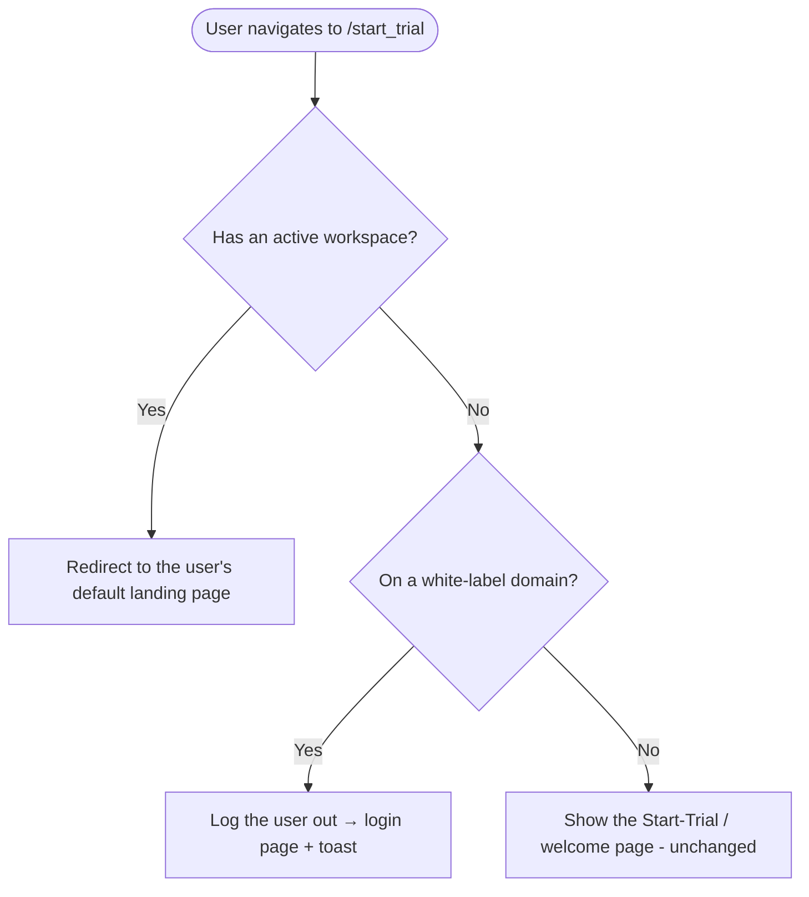

# Guard the /start_trial (No-Workspace Welcome) Route · Story

**Platform:** Web only. **Scope:** Frontend (route guard). No backend, no mobile.

| # | Story | Priority |
|---|---|---|
| S-1 | [FE] Guard the /start_trial route: redirect workspace users, log out white-label users with no workspace | Medium |

> Related to the existing "No-Workspace Welcome Page Description" story (the page itself). This story adds the missing access control around that page.

---

## S-1 · [FE] Guard the /start_trial route: redirect workspace users, log out white-label users with no workspace
**Project:** Web App · **Group:** Frontend · **Skill:** Frontend · **Product area:** Onboarding · **Priority:** Medium · **Type:** Feature

### Description
As a logged-in user, I want the "Start your trial" / no-workspace welcome page to only appear when it actually applies to me, so that I'm not dumped on a trial-signup screen when I already have a workspace, and so white-label users (who can't sign up or start trials on their branded domain) aren't shown a dead-end.

Today `/start_trial` has **no guard** — anyone who navigates there directly lands on the welcome page, even if they already belong to a workspace or have their own subscription. And white-label users with no workspace currently have nowhere sensible to go.

### Workflow

**Case 1 — user already has a workspace:** They hit `/start_trial` (e.g. by typing the URL or an old link). Instead of the welcome page, they're redirected to their default landing page inside their workspace.

**Case 2 — white-label user with no workspace:** White-label domains have no sign-up and can't start trials. If such a user somehow has no active workspace, they're logged out and sent to the login page with a toast explaining why, rather than seeing a trial page they can't use.

**Default — non-white-label user with no workspace:** unchanged — they see the Start-Trial / welcome page as today.

### Acceptance criteria

**Case 1 — has an active workspace**
- [ ] When a user who **has an active workspace** navigates to `/start_trial` (directly, via bookmark, or any link), they are **redirected to their default landing page** instead of seeing the Start-Trial / welcome page.
- [ ] This applies whether they reached the route by deep link or in-app navigation (the guard runs on every navigation to the route).
- [ ] The default landing page used is the user's configured Default Landing Page (Account Settings), resolved to a valid destination within their active workspace.

**Case 2 — white-label domain, no active workspace**
- [ ] When a user is on a **white-label domain** and has **no active workspace**, they are **not** shown the Start-Trial / welcome page.
- [ ] Instead, the user is **logged out** and redirected to the **login page**.
- [ ] A toast/alert is shown: **"You do not have an active workspace."**

**Default — non-white-label, no active workspace**
- [ ] A non-white-label user with **no active workspace** still sees the existing Start-Trial / welcome page (current behavior unchanged).

**General**
- [ ] No redirect loops (the guard does not re-trigger on the login/logout destination).
- [ ] Users who legitimately need the welcome page (new non-white-label users mid-onboarding) are unaffected.

### Mock-ups
N/A — routing/guard behavior. The only new UI is the toast copy above.

### Impact on existing data
None — client-side routing/guard only.

### Impact on other products
Web app only. White-label domains get the corrected logout behavior. No mobile or Chrome extension impact.

### Dependencies
None. (Complements the existing "No-Workspace Welcome Page Description" story for the same page.)

### Global quality & compliance (wherever applicable)
- [ ] Mobile responsiveness (frontend only, N/A for backend-only stories)
- [ ] Multilingual support (frontend + backend, translations available or fallback handled)
- [ ] UI theming support (default + white-label, design library components are being used)
- [ ] White-label domains impact review
- [ ] Cross-product impact assessment (web, mobile apps, Chrome extension)

### Implementation references
*Pointers from research — not a contract. Engineering may choose a different approach.*
- `contentstudio-frontend/src/modules/setting/config/routes/setting.js` (~L328) — the `start_trial` route (`path: '/start_trial'`) currently has only `meta.title` / `top_header: false`, no guard.
- `contentstudio-frontend/src/router.js` (~L809 `router.beforeEach`) — the global guard already chains auth → profile → role-based access → API-centric-plan checks; add a `start_trial`-specific branch here (or a `beforeEnter` on the route) so it fires on every navigation including back/forward. Note the existing exclusions set (`ONBOARDING_GUARD_EXCLUSIONS`, `to.meta.guest` / `no_authentication`) and the existing alert+redirect pattern (the API-plan block uses `useAlertStore().alert({ message, type })` then returns a route).
- Active-workspace check: `useWorkspaceStore().getActiveWorkspace` (slug used around router.js L782).
- Default landing page: `contentstudio-frontend/src/modules/setting/composables/useProfilePage.ts` (`resolveLandingValue` / `selectedLandingPage`) resolves the user's configured landing target; reuse it for the Case-1 redirect.
- White-label detection: `useWhiteLabelApplication` (singleton, `src/modules/setting/composables/whitelabel/`) — detects whether the current domain is white-labeled.
- Logout + toast: the `logout` route / `components/authentication/Logout.vue` (and the auth store's logout) for Case 2; `useAlertStore().alert({ message: t(...), type: 'warning' })` for the toast. Add the toast copy as an i18n key across all locale directories.
- The Case-1 guard keys off **active workspace**. A "subscription but no workspace" state does not occur — anyone with a subscription is a super admin, who always has a workspace — so no extra branch is needed for it.
