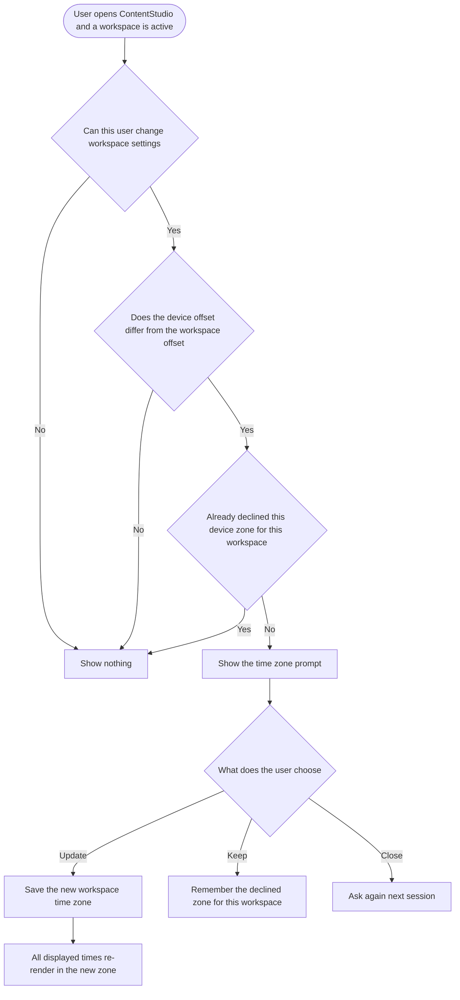

# Stories: time zone mismatch prompt

**Date:** 2026-09-07

Three stories. Read the note below before writing any of them into the tracker, because ContentStudio's time zone model is not the one in the reference screenshot.

> **Important difference from the reference design.** The screenshot prompts about a personal **account** time zone. ContentStudio has no user-level time zone. Time zone is a **workspace** setting, and it governs when scheduled content publishes for the whole team. Updating it shifts every queued post for everyone in that workspace. The prompt below is therefore framed around the workspace, gated to people who are allowed to change workspace settings, and states the consequences before the user confirms.

---

## Story 1

### Title

**[BE] Restrict workspace time zone changes to members who can manage workspace settings**

### Description

As a workspace owner, I want the workspace time zone to be changeable only by people who are allowed to manage workspace settings, so that a client guest, approver or team member cannot change when the whole team's scheduled content publishes.

---

### Workflow

1. A member who is allowed to manage workspace settings changes the workspace time zone. It saves, exactly as it does today.
2. A member who is not allowed to manage workspace settings attempts the same change. The change is rejected and the workspace time zone is unchanged.
3. The workspace time zone continues to be stored in its canonical form, so a legacy or alias identifier sent by an older browser is normalised before it is saved.

---

### Acceptance criteria

- [ ] Changing a workspace's time zone requires the same permission already required to manage workspace settings
- [ ] A member without that permission who attempts the change receives a permission error and the stored time zone is unchanged
- [ ] A member with that permission can change the time zone exactly as they can today, with no extra steps
- [ ] The existing onboarding flow, which sets the workspace time zone during setup, continues to work without a permission error
- [ ] Legacy and alias time zone identifiers continue to be normalised to their canonical form before being stored, so that identical zones are never stored under two different names
- [ ] An invalid or unrecognised time zone is rejected and the stored value is unchanged
- [ ] Two simultaneous changes to the same workspace resolve to one stored value, with no partially applied state
- [ ] The change is recorded with who made it and when, so an unexpected schedule shift can be traced back
- [ ] No change to how times are stored. Scheduled posts continue to be stored as absolute instants

---

### Mock-ups

Not applicable. No user-facing interface in this story.

---

### Impact on existing data

None. No stored data is created, changed or deleted. Existing workspace time zone values are untouched, including any that were stored before canonicalisation existed.

---

### Impact on other products

- **Web app:** members without workspace settings permission lose the ability to change the workspace time zone. This is the intended correction. Worth checking whether any existing customer relies on a non-admin doing this, though it is very unlikely to be deliberate.
- **Mobile apps:** none today. If the app ever exposes a workspace time zone control, it will inherit the same restriction.
- **Chrome extension:** none.
- **Public API:** the workspace update endpoint accepts a time zone. Confirm it enforces the same permission, so the restriction cannot be bypassed through the API.
- **Publishing:** none directly. This story only controls who may change the setting, not what the setting does.

---

### Dependencies

- Blocks **[FE] Prompt to update the workspace time zone when it does not match the user's device**, which relies on the permission check being real rather than only enforced in the interface.

---

### Global quality & compliance (wherever applicable)

- [ ] Mobile responsiveness (frontend only, N/A for backend-only stories)
- [ ] Multilingual support (frontend + backend, translations available or fallback handled)
- [ ] UI theming support (default + white-label, design library components are being used) — N/A, no user-facing interface in this story
- [ ] White-label domains impact review
- [ ] Cross-product impact assessment (web, mobile apps, Chrome extension)

---

## Story 2

### Title

**[FE] Prompt to update the workspace time zone when it does not match the user's device**

### Description

As a user whose device time zone no longer matches the workspace I am working in, I want ContentStudio to notice and offer to fix it, so that I do not schedule a week of content at the wrong times without realising.

---

### Workflow

1. User opens ContentStudio. The app finishes loading and a workspace is active.
2. ContentStudio compares the user's device time zone with the active workspace's time zone.
3. If they represent the same current offset, nothing happens. The user never sees anything.
4. If they differ, and the user is allowed to change workspace settings, and they have not already declined this same device time zone for this workspace, a prompt appears.
5. The prompt names the workspace, both time zones, and what will happen to already-scheduled content if they proceed.
6. User chooses to update. The workspace time zone changes, a confirmation appears, and every time shown across the planner, calendar, composer and queues re-renders in the new zone without the user reloading the page.
7. User chooses to keep the current setting. The prompt closes and does not come back for this workspace while their device stays in that same time zone. If they later move somewhere genuinely different, it can appear again.
8. User ticks "Do not ask again for this workspace" before choosing. The prompt never appears again for that workspace, whatever their device does.
9. User closes the prompt without choosing. Nothing changes and the prompt can appear again in a later session.

---

### Acceptance criteria

**When the prompt appears**

- [ ] The prompt appears only when the user's device time zone and the active workspace's time zone have different current UTC offsets
- [ ] The prompt does not appear when the two time zones have the same current offset under different names, for example a workspace on Europe/Paris and a device on Europe/Madrid
- [ ] Both time zone identifiers are normalised to their canonical form before being compared, so that an equivalent legacy identifier such as Asia/Calcutta against Asia/Kolkata, or US/Eastern against America/New_York, is treated as a match and does not prompt
- [ ] The prompt appears only for users who are allowed to change workspace settings. Every other member, including approvers, viewers and client guests, sees nothing
- [ ] The prompt is evaluated once per session, after the app has finished loading and the active workspace is known
- [ ] The prompt does not appear during onboarding, or for a workspace created in the current session
- [ ] The prompt does not appear on shared analytics links, public planner links, or any view opened by someone who is not signed in
- [ ] The prompt does not appear in the sample workspace
- [ ] The prompt does not appear on top of an already open modal, the composer, or a publishing flow. It waits until the user is back on a normal screen
- [ ] Device time zone is read from the browser only. IP based location is never used to decide this

**Not nagging**

- [ ] Choosing to keep the current setting records both the workspace and the device time zone that was declined, and the prompt does not appear again for that combination
- [ ] If the user's device later moves to a different time zone that still does not match the workspace, the prompt can appear again
- [ ] A workspace whose time zone is deliberately different from the user's, such as an agency managing a client in another region, stops prompting after one decline and does not resurface at daylight saving transitions
- [ ] Ticking "Do not ask again for this workspace" suppresses the prompt for that workspace permanently, regardless of any later device change
- [ ] Dismissal is stored per workspace. Declining in one workspace has no effect on any other workspace
- [ ] Closing the prompt with the close icon records nothing, and the prompt may appear again in a later session
- [ ] The prompt never appears more than once in a single session

**Copy**

- [ ] Modal title: "Update this workspace's time zone?"
- [ ] First paragraph: "**[Workspace name]** is set to **[Workspace time zone] ([offset])**, but your device is set to **[Device time zone] ([offset])**."
- [ ] Second paragraph: "This workspace's time zone decides when scheduled posts go out, for everyone on the team."
- [ ] Third paragraph, shown when the workspace has queue slots or content categories set up: "Your posting queue times will move with it. A slot set for 9:00 AM will start going out at 9:00 AM in the new time zone."
- [ ] Fourth paragraph: "Posts you already scheduled for a specific date and time will still go out at exactly the same moment. They will simply be shown in the new time zone."
- [ ] Checkbox label: "Do not ask again for this workspace"
- [ ] Secondary button: "Keep [Workspace time zone] ([offset])"
- [ ] Primary button: "Update to [Device time zone] ([offset])"
- [ ] Every offset shown is calculated at the moment the prompt is rendered, so a zone currently observing daylight saving shows its current offset and not a fixed one
- [ ] Success toast after updating: "Time zone updated. [Workspace name] now runs on [Device time zone] ([offset])."
- [ ] Error message if the update fails: "We could not update the time zone just now. Please try again, or change it in workspace settings."
- [ ] Error message if the user turns out not to have permission: "Only workspace admins can change the time zone. Ask an admin on your team to update it."
- [ ] All copy is added as translation keys with English values, and other locales fall back to English rather than showing a raw key

**Components and presentation**

- [ ] Built with the `Modal` component, `Button` for both actions, and `Checkbox` for the do-not-ask control
- [ ] The primary action is "Update", the secondary action is "Keep", and both name their time zone in full so the two cannot be confused at a glance
- [ ] No hardcoded colour classes. Primary colour comes from theme-aware classes so the prompt renders correctly on white-label domains
- [ ] The modal is readable and both buttons are reachable without horizontal scrolling at 1280px, 1024px, 768px and 375px widths
- [ ] Long workspace names and long time zone names wrap rather than overflowing or truncating the buttons

**After updating**

- [ ] Every displayed time across the planner, calendar, composer, queues and approvals re-renders in the new time zone without the user reloading the page
- [ ] The workspace settings screen shows the new time zone immediately
- [ ] If the update fails, the workspace time zone is unchanged, the prompt stays open, and the failure message is shown
- [ ] Loading state while the update is in flight disables both buttons and shows a spinner on the primary button
- [ ] If the update succeeds but the user has another tab open on the same workspace, that tab is not left silently showing times in the old zone. Either it picks up the change or it prompts the user to refresh
- [ ] A post that is due to publish within the next few minutes is not disrupted by the change
- [ ] A workspace with posting paused behaves the same way. The time zone change is applied and posting stays paused

**Edge cases**

- [ ] If the device reports a time zone that is not available in the workspace time zone picker, the prompt is not shown rather than offering a value that cannot be saved
- [ ] If the device reports no time zone at all, or an unreadable one, nothing is shown and no error is surfaced to the user
- [ ] Switching workspaces during a session evaluates the new workspace independently, and shows at most one prompt per session overall
- [ ] A user who belongs to several workspaces with deliberately different time zones is not prompted repeatedly as they switch between them

**Tracking**

- [ ] When the prompt is shown, a `workspace_timezone_prompt_shown` event fires with `{ matched: false }`
- [ ] When the user updates, a `workspace_timezone_updated` event fires with `{ source: 'mismatch_prompt' }`
- [ ] When the user keeps the existing setting, a `workspace_timezone_prompt_dismissed` event fires with `{ never_ask_again: true }` or `{ never_ask_again: false }`

---

### Mock-ups

To be attached by design. Layout intent, based on the reference screenshot but adapted for workspace semantics:

- Centred `Modal`, roughly 560px wide, with a close icon top right.
- Title in bold: "Update this workspace's time zone?"
- Body paragraphs in muted grey, with the workspace name and both time zone names in bold so they stand out from the sentence.
- The queue slots paragraph is the one carrying real consequence, so it should be visually distinct rather than buried, for example set on a light tinted background with a small warning icon.
- Below the body, left aligned, the "Do not ask again for this workspace" `Checkbox`.
- Footer divider, then two right-aligned buttons: secondary "Keep [zone]", primary "Update to [zone]".
- Both button labels contain a full time zone name and offset, so they are wider than usual. The footer must wrap them onto two lines on narrow screens rather than truncating.

---

### Impact on existing data

- No data is created, changed or deleted by showing the prompt.
- Choosing to update writes the workspace time zone, which is an existing field and an existing operation.
- A dismissal record is written under the user's existing preferences. New key, no schema change, no backfill.
- Nothing is written to scheduled posts. Their stored publish instants are untouched by a time zone change.

The one thing to be clear about with QA: after an update, already-scheduled posts will **display** a different clock time while publishing at exactly the same moment. That is correct behaviour and must not be raised as a bug.

---

### Impact on other products

- **Web app:** new prompt at app load for eligible users in mismatched workspaces. No other change.
- **Mobile apps:** none in this batch, and this is the notable gap. Phones change time zone automatically when travelling, so the app has the strongest case for this feature. Recommended as a follow up once the web copy and behaviour have settled, rather than being built blind alongside it.
- **Chrome extension:** none.
- **Public API:** none.
- **Publishing:** an accepted time zone change moves future queue slot times and content category slot times by the offset. This is real behaviour change and is why the confirmation copy states it before the user commits.
- **Scheduled analytics reports:** unaffected. They carry their own time zone independently of the workspace.

---

### Dependencies

- Depends on **[BE] Restrict workspace time zone changes to members who can manage workspace settings**, so the permission gating in the prompt is backed by a real check rather than being cosmetic.
- Depends on **[Design] Design the workspace time zone mismatch prompt** for the final layout, particularly the treatment of the queue slots warning and the two wide buttons.

---

### Global quality & compliance (wherever applicable)

- [ ] Mobile responsiveness (frontend only, N/A for backend-only stories)
- [ ] Multilingual support (frontend + backend, translations available or fallback handled)
- [ ] UI theming support (default + white-label, design library components are being used)
- [ ] White-label domains impact review
- [ ] Cross-product impact assessment (web, mobile apps, Chrome extension)

---

## Story 3

### Title

**[Design] Design the workspace time zone mismatch prompt**

### Description

As a designer, I want to produce the layout for the workspace time zone mismatch prompt, so that the consequence of changing a shared setting is obvious at a glance and the two choices cannot be confused.

---

### Workflow

1. Designer reviews the reference screenshot supplied by the CEO and the copy specified in **[FE] Prompt to update the workspace time zone when it does not match the user's device**.
2. Designer adapts it for ContentStudio, where the setting is shared across the team rather than personal, and where accepting it moves the posting queue.
3. Designer produces the default state, the state where the workspace has queue slots configured and the extra warning paragraph is present, the in-progress state while the change is saving, and the failure state.
4. Designer checks the layout with long workspace names and long time zone names, and at narrow widths.
5. Designer hands off with the components named, so the build uses the design system rather than bespoke styling.

---

### Acceptance criteria

- [ ] Default state designed, using the `Modal` component with two `Button` actions and a `Checkbox`
- [ ] The variant carrying the queue slots warning is designed, with that paragraph visually separated from the rest of the body so it is not skimmed past
- [ ] Saving state designed, with both buttons disabled and a spinner on the primary action
- [ ] Failure state designed, with the error message in place and the prompt still open
- [ ] Both button labels contain a full time zone name and offset. The footer layout is designed to wrap onto two lines rather than truncate
- [ ] Layout checked at 1280px, 1024px, 768px and 375px widths
- [ ] Layout checked with a 40 character workspace name and with the longest time zone names in the picker
- [ ] Only components from the existing design system are used. Any gap is flagged rather than designed around
- [ ] No colour is specified that would break on a white-label domain with a non-blue primary colour
- [ ] Handoff names each component used, so the build does not reinvent them

---

### Mock-ups

This story produces them.

---

### Impact on existing data

None.

---

### Impact on other products

None. Design only. If the prompt is later added to the mobile app, this design is the reference for it.

---

### Dependencies

- Blocks **[FE] Prompt to update the workspace time zone when it does not match the user's device**.
- Copy is specified in that story and should not be reinvented during design. Any copy change should be agreed and reflected in both places.

---

### Global quality & compliance (wherever applicable)

- [ ] Mobile responsiveness (frontend only, N/A for backend-only stories)
- [ ] Multilingual support (frontend + backend, translations available or fallback handled)
- [ ] UI theming support (default + white-label, design library components are being used)
- [ ] White-label domains impact review
- [ ] Cross-product impact assessment (web, mobile apps, Chrome extension)
