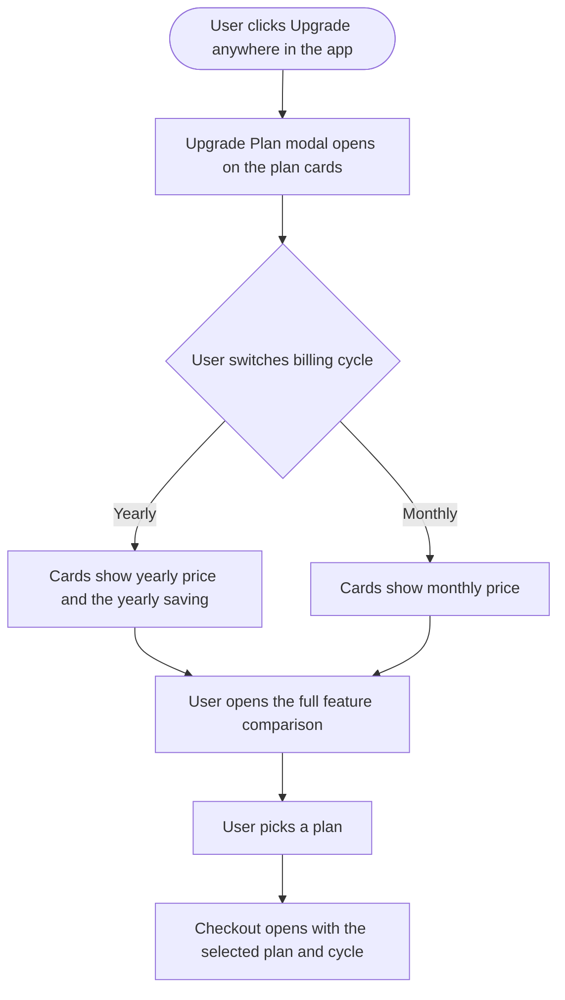

# Stories: Sync the in-app Upgrade Plan UI with the website pricing page

The ContentStudio website pricing page has been updated. The in-app Upgrade Plan UI has not, so a user who compares our marketing page against what they see inside the product finds different plan presentation, different savings wording, a differently badged recommended plan, and add-ons named differently in the two places. That is a bad moment to hand someone right before they pay.

Enterprise stays off the in-app UI by decision, not by oversight: the API plan occupies that slot and is already rendered, so this is a restyle of four existing plans rather than a structural change.

Two stories: a design pass that decides the reconciled result, and a frontend pass that builds it.

| # | Title |
|---|---|
| 1 | `[Design]` Reconcile the in-app Upgrade Plan UI with the website pricing page |
| 2 | `[FE]` Update the Upgrade Plan modal to match the reconciled pricing design |

---
---

# 1. [Design] Reconcile the in-app Upgrade Plan UI with the website pricing page

### Description

Our website pricing page was redesigned and the in-app Upgrade Plan modal was not, so the two now disagree on plan presentation, savings wording, badge language and add-on naming. A user who reads the pricing page and then opens the upgrade modal in the product sees two different stories about the same purchase. This story is the design decision: diff the two surfaces, decide what the in-app version should be, and hand the frontend team a spec they can build without further questions.

The API plan is the card most in need of attention. It is the only one with a social-account stepper driving its own pricing, it carries its own fixed border colour that a white-label customer never sees correctly, and it is hidden entirely on white-label domains, so the layout has to work with and without it.

### Workflow

N/A. Design deliverable.

### Acceptance criteria

- [ ] The current live website pricing page is diffed against the current in-app Upgrade Plan UI, and the differences are listed explicitly rather than implied by the mockups.
- [ ] Plan card presentation is specified: layout, price display for both billing cycles, savings treatment, badge treatment, the limits shown on each card, and the order of plans.
- [ ] The billing-cycle toggle is specified, including its labels and the headline savings claim shown next to it, worded the same way the website words it.
- [ ] The badge on the highest-value plan is specified with one agreed word, so the app and the website do not use two different terms for the same badge.
- [ ] The API plan's presentation is specified: where it sits relative to the three main plans, how its card differs from theirs, and how its social-account stepper and the pricing that stepper drives are laid out.
- [ ] The API plan is treated as a parallel track rather than a fourth rung on the Standard to Advanced to Agency ladder, consistent with how its feature list already reads today.
- [ ] The layout is specified both with and without the API plan column, because white-label domains hide it entirely and must not be left with a gap or a broken grid.
- [ ] Enterprise is deliberately absent. The design does not add it, and the reasoning is noted so it does not get raised again as an oversight.
- [ ] The feature comparison table is specified: its categories, their order, and which rows appear, aligned with how the website groups the same information.
- [ ] Add-ons are specified: which add-ons are surfaced in the upgrade UI, under what heading, and with the same names the website uses.
- [ ] Trial framing is specified, including where the trial length appears and where the no-credit-card and cancel-anytime reassurances appear.
- [ ] Every call-to-action label is specified for every state the card can be in: starting a trial, upgrading, downgrading, changing billing cycle, the current plan, and the highest available plan.
- [ ] Visual hierarchy is specified: what a user's eye should hit first, and how the recommended plan is emphasised without making the others look broken.
- [ ] All states are covered: a user on a trial, a user on a paid plan, a user on the highest plan, a user on a legacy plan, and a white-label user.
- [ ] The design specifies which existing design-library components to reuse, and explicitly flags anything not currently available as a component gap.
- [ ] Colors are specified as theme tokens rather than fixed values, so white-label domains render correctly.
- [ ] The design does not change any price or any plan entitlement. Where a number differs between the app and the website, the design notes it as a question for the billing owner rather than picking one.
- [ ] Responsive behaviour is specified down to the smallest supported width, including how the comparison table behaves when it cannot fit side by side.

### Mock-ups

This story produces them.

### Impact on existing data

None.

### Impact on other products

- Web app only. The mobile apps use their own in-app-purchase billing screens and do not render this modal.
- White-label domains render this modal, and they hide the API plan, so the design has to hold up both without ContentStudio's own brand colour and with one fewer column.

### Dependencies

- Needs the current live pricing page as the reference. If the website is due another change, the designer should confirm the page is settled before diffing.
- Should be coordinated with **[FE] Show "Change plan" CTA on the highest available plan**, since that story also changes the card call to action.

### Global quality and compliance checklist

- [ ] Mobile responsiveness tested (frontend only, N/A for backend-only stories)
- [ ] Multilingual support verified (frontend + backend, translations available or fallback handled) — plan names, badges and CTAs must tolerate longer translated strings without breaking the card
- [ ] UI theming supported (default + white-label, design library components are being used)
- [ ] White-label domains impact reviewed
- [ ] Cross-product impact assessed (web, mobile apps, Chrome extension)

### Implementation references

*Pointers from research — not a contract. Engineering may choose a different approach.*

- The in-app surface to diff is `contentstudio-frontend/src/modules/billing/components/`: `SubscriptionPlansModal.vue` (shell), `SubscriptionPlansMain.vue` (body), `SubscriptionPlanCard.vue` (one card), `PlansComparisonTable.vue` with `constants/plansComparison.ts` (the comparison), and `FeatureValue.vue` / `LimitItem.vue` / `SocialNetworks.vue` (cell renderers).
- `plansComparison.ts` types every comparison row against exactly four plan ids (`standard`, `advanced`, `agency-unlimited`, `api-centric`). Since Enterprise is not being added, that interface is unchanged and no row needs a new key. The API plan column already exists and is being restyled, not introduced.
- `SubscriptionPlanCard.vue` already has the state branches the design needs to cover: `isPopular`, `isAgencyPlan`, `isApiCentricPlan`, `changeTrialPlan`, `ccTrialOnly`, plus computed savings amount and discount percentage. Designing against that existing state list avoids inventing states the card cannot express.
- The app's comparison categories today are Publishing and scheduling, Planning and collaboration, Analytics and reporting, Social inbox, RSS feed management, and Essentials and support.
- The add-ons the website names each already have their own in-app flow, so the upgrade UI is pointing at existing surfaces rather than needing new ones: auto-scale limits, white-label, SAML, white-label reseller, and social listening all exist.

---
---

# 2. [FE] Update the Upgrade Plan modal to match the reconciled pricing design

### Description

Users comparing our pricing page to the upgrade modal inside the product currently see two different presentations of the same plans, with different savings wording and differently named add-ons. This story implements the reconciled design so the two agree, which matters most at the exact moment a user is deciding whether to pay us.

This is presentation and copy only. Prices, entitlements, checkout, trial handling and plan-change logic are untouched.

### Workflow

1. User clicks an upgrade prompt anywhere in the app and the Upgrade Plan modal opens showing the plan cards.
2. The plans, their prices, their limits and the highlighted recommendation read the same as the website pricing page.
3. User switches the billing cycle between monthly and yearly. Prices update and the yearly saving is stated the same way the website states it.
4. User expands the full feature comparison and sees the same categories, in the same order, as the website.
5. User sees the available add-ons named exactly as the website names them.
6. User picks a plan. The call to action reflects their situation: starting a trial, upgrading, downgrading or changing billing cycle.
7. Checkout opens with the plan and cycle they chose. Nothing about the payment step has changed.

### Acceptance criteria

- [ ] Plan cards match the approved design: layout, price display per billing cycle, savings treatment, badge, the limits listed, and plan order.
- [ ] The billing-cycle toggle uses the approved labels, and the headline savings claim beside it matches the approved copy.
- [ ] The highest-value plan carries the approved badge, using one term consistently across the app.
- [ ] The limits shown on each card match that plan's real entitlements. If a displayed number and the real entitlement disagree, the real entitlement is shown and the discrepancy is raised rather than hardcoded around.
- [ ] AI credits are presented as the approved design specifies, with text, image and video shown separately if that is what was approved.
- [ ] The feature comparison table uses the approved categories in the approved order.
- [ ] The API plan is presented per the approved design, in the slot the design places it.
- [ ] The API plan's social-account stepper still works: incrementing, decrementing, typing a value directly, and validating on blur all behave as they do today.
- [ ] The pricing shown on the API plan card still responds to the stepper, and its yearly saving is still computed from the dialled price rather than a static plan value.
- [ ] The API plan's feature list still reads as a parallel track rather than continuing the Standard to Advanced to Agency progression.
- [ ] The Media Storage row still appears on the API plan card and only there.
- [ ] Enterprise is not added to the modal.
- [ ] No plan card carries a hardcoded colour. The API plan's and the recommended plan's card borders both come from theme tokens, so a white-label domain renders them in the customer's colour.
- [ ] On a white-label domain the API plan is still hidden, and the remaining three plans lay out correctly with no gap where its column was.
- [ ] A customer already on the API plan still does not see the Standard plan.
- [ ] Add-ons are surfaced under the approved heading with the approved names, and each links to its existing flow.
- [ ] Trial framing appears where the design places it, including the trial length and the no-credit-card and cancel-anytime reassurances.
- [ ] Call-to-action labels are correct in every card state: trial start, upgrade, downgrade, billing-cycle change, current plan, and highest available plan.
- [ ] The modal renders correctly for a user on a trial, on a paid plan, on the highest plan, and on a legacy plan.
- [ ] The modal renders correctly on a white-label domain, with no ContentStudio-specific color or wording leaking through.
- [ ] The comparison table is usable down to the smallest supported width, following the approved responsive behaviour, and the page never scrolls horizontally as a whole.
- [ ] Every string is translated and present in every locale directory.
- [ ] Checkout still opens with the correct plan and billing cycle, and the existing trial and plan-change behaviour is unchanged. No regression in what a user is actually charged.
- [ ] No monetary or entitlement value is hardcoded in a component where it should come from the plan data.

### UI copy

Final strings come from the approved design. The following are the ones this story must not get wrong, aligned to the website's wording:

**Billing-cycle toggle**
- Options: `Monthly` / `Yearly`
- Beside the toggle: `Save up to 34%`

**Per-card yearly saving** (existing pattern, keep the per-plan amount)
- `Save ${amount} per year`

**Badge on the highest-value plan**
- `Best Value`

**Trial reassurance**
- `7-day free trial`
- `No credit card required. Cancel anytime.`

**Call-to-action labels**
- Starting a trial: `Start your 7-day free trial`
- Upgrading to a higher plan: `Upgrade`
- Current plan: `Your current plan` (button disabled)
- Highest available plan: `Change plan`

**Add-ons section heading**
- `Add-ons`
- Subtext: `Add extra capacity or features to any plan. You can add or remove these at any time.`

All strings go through translation and land in every locale directory in the same change. Note the deliberate absence of em dashes in all of the above.

### Mock-ups

Provided by **[Design] Reconcile the in-app Upgrade Plan UI with the website pricing page**.

### Impact on existing data

None. No change to plans, prices, entitlements or subscription records.

### Impact on other products

- Web app only. The mobile apps use their own in-app-purchase billing screens.
- White-label domains render this modal.
- The website is the reference, not a dependency. Nothing here changes the website.

### Dependencies

- Depends on **[Design] Reconcile the in-app Upgrade Plan UI with the website pricing page**.
- Overlaps with **[FE] Show "Change plan" CTA on the highest available plan**. Whichever ships second should absorb the other's call-to-action behaviour rather than reverting it.

### Global quality and compliance checklist

- [ ] Mobile responsiveness tested (frontend only, N/A for backend-only stories)
- [ ] Multilingual support verified (frontend + backend, translations available or fallback handled)
- [ ] UI theming supported (default + white-label, design library components are being used)
- [ ] White-label domains impact reviewed
- [ ] Cross-product impact assessed (web, mobile apps, Chrome extension)

### Implementation references

*Pointers from research — not a contract. Engineering may choose a different approach.*

- Files: `contentstudio-frontend/src/modules/billing/components/SubscriptionPlansModal.vue`, `SubscriptionPlansMain.vue`, `SubscriptionPlanCard.vue`, `PlansComparisonTable.vue`, `FeatureValue.vue`, `LimitItem.vue`, `SocialNetworks.vue`, and `constants/plansComparison.ts`. Copy sits in `src/locales/*/settings.json` under `settings.billing.*`.
- `SubscriptionPlanCard.vue` already computes the states this story needs: `isPopular`, `isAgencyPlan`, `isApiCentricPlan`, `getSaveAmount`, the discount percentage, and a `ctaButton` computed whose text already branches on `changeTrialPlan` and `ccTrialOnly`. Extending that computed is likely cheaper than adding parallel logic.
- `plansComparison.ts` types every row against the four current plan ids and stays as is, since Enterprise is out of scope.
- The two hardcoded borders to replace are both in `SubscriptionPlanCard.vue` line 326: `border-2! border-[#16a34a]!` for the API plan and `border-2! border-[#007bff]!` for the recommended plan. Neither follows a white-label primary colour today.
- The API plan behaviour to preserve is spread across the same file: `apiCentricSocialHandler` (line 68) with its increment / decrement / validate / finalize handlers rendered at lines 456 to 480; `hasDynamicPricing` (line 127), which routes `getSaveAmount` through a computed `basePrice * 12 - annualPrice` instead of the static `billing.yearly.saveAmount`; `getFeatureListHeading` (line 155), whose comment records that api-centric is a parallel track; and the Media Storage row at line 530.
- The visibility rules are in `SubscriptionPlansMain.vue` lines 41 to 45: Standard is hidden for customers already on api-centric, and api-centric is hidden entirely on white-label domains. Both must survive the restyle, and the second is why the three-column layout needs testing.
- The billing toggle's existing `save_up_to` string is at `SubscriptionPlansMain.vue` line 159.
- Prices and savings come from the plan's `billing.yearly.saveAmount` and `billing.yearly.discountPercentage` on the plan object. Keep reading them from there. A hardcoded saving in a template is the failure mode this story is meant to remove, not introduce.
- `SubscriptionPlansModal.vue` reads `planStore.getPlan.subscription.limits`, typed loosely as `unknown` today. If limit rendering is touched, that is a good moment to narrow it against a generated type rather than casting.
