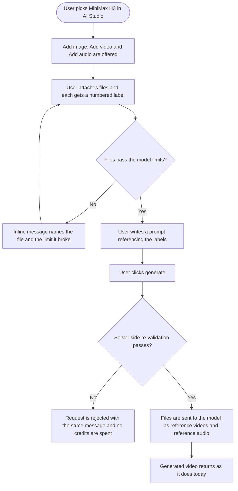

# Stories: audio and video reference inputs for video models

Four stories, split so MiniMax H3 can ship on its own without waiting for the other models.

| Order | Story | Notes |
|---|---|---|
| Now | 1. [Full Stack] Add reference video and audio inputs to MiniMax H3 | Backend half can start immediately. The frontend half needs story 2 |
| Now, in parallel | 2. [Design] Design the reference file attachment area for video generation | Unblocks the frontend half of story 1 |
| Now, independent | 3. [BE] Fix the MiniMax H3 prompt length limit for reference-to-video | Existing defect, no dependencies, ship whenever |
| Next | 4. [Full Stack] Extend reference video and audio inputs to WAN and Seedance models | Depends on the generic mechanism built in story 1 |

Backend and frontend stay merged within each story. The split is by model scope, not by layer.

Story 1 deliberately builds the mechanism generically, reading each model's declared parameter names rather than hardcoding H3's. That keeps story 4 small: registry declarations plus per-model verification, with no new plumbing.

---

## 1. [Full Stack] Add reference video and audio inputs to MiniMax H3

### Description

MiniMax H3's reference-to-video mode accepts reference videos and reference audio clips alongside reference images. A user can hand it a video of a camera move and an audio clip of a voice, then write a prompt describing how to combine them. We shipped the model with images only, so the rest of its capability is unreachable.

This story adds both inputs for MiniMax H3, with validation that catches bad input before a generation is attempted rather than after fal rejects it and the user has waited and lost credits.

One detail shapes the whole feature: MiniMax H3 does not infer what to do with each file. The prompt has to name them, as in "Image 1 walks into the room while Audio 1 plays". So the attachment area has to tell the user which file is Image 1, which is Video 1, and which is Audio 1, or the prompt cannot be written.

Other models accept these inputs too, and this story builds the mechanism so their parameter names come from their own model definitions rather than being hardcoded to H3. Turning those models on is **[Full Stack] Extend reference video and audio inputs to WAN and Seedance models**.

### Workflow

1. The user opens video generation and selects MiniMax H3.
2. The attachment area offers **Add image**, **Add video**, and **Add audio**.
3. The user attaches files. Each one shows a label: images are numbered Image 1, Image 2 and so on, videos are Video 1, Video 2, and audio clips are Audio 1, Audio 2.
4. If a file breaks one of the model's limits, the user sees an inline message naming the file and the specific limit, and the file is not added.
5. A running counter shows how many reference files are used against the model's total allowance.
6. The user writes a prompt that refers to the files by their labels.
7. The user generates. The same limits are checked again before any credits are spent, so a request that would be rejected downstream never gets that far.
8. The video returns through the existing generation flow, with no change to progress, credits, or delivery.

### UI copy

**Attachment area, for models that accept reference video or audio**

- Section label: `Reference files`
- Hint under the label: `Add images, videos, and audio for the model to work from. Refer to them in your prompt by their labels, for example "Image 1 walks into the room while Audio 1 plays".`
- Buttons: `Add image`, `Add video`, `Add audio`
- File labels on each thumbnail: `Image 1`, `Image 2`, `Video 1`, `Audio 1`, and so on, renumbering when a file is removed
- Counter: `{used} of {max} reference files used`
- Per-type allowance tooltip on each add button: `Up to {count} {type} for this model.`
- Remove control tooltip: `Remove file`

**Validation messages**

- Too many of one type: `You can add up to {count} reference {type} for this model.`
- Total exceeded: `You can add up to {max} reference files in total. Remove one to add another.`
- Audio with nothing else: `Audio needs something to go with it. Add at least one reference image or video.`
- Clip too short: `Reference clips need to be at least {min} seconds long. "{filename}" is {duration} seconds.`
- Clip too long: `Reference clips can be up to {max} seconds long. "{filename}" is {duration} seconds.`
- Combined duration exceeded: `Your reference {type} add up to {total} seconds. Keep the total to {max} seconds or less.`
- Unsupported file type: `"{filename}" is not a supported file type for this model.` The add button tooltip lists what is supported.
- File too large: `"{filename}" is {size} MB. Files need to be under {max} MB for this model.`
- Attached files not supported after a model switch: `{Model name} does not support {audio and video / audio / video} references. Remove those files, or switch back to a model that supports them.`
- Duration could not be read: `We could not read the length of "{filename}". Try a different file.`

**Model switching**

- When the user switches to a model that accepts fewer or different reference types while files are attached, unsupported files are flagged rather than silently dropped, using the message above. The user removes them or switches back.

### Acceptance criteria

**MiniMax H3 limits, per the fal schema**

- [ ] MiniMax H3 reference-to-video accepts up to 3 reference videos and up to 3 reference audio clips, alongside up to 9 reference images
- [ ] Each reference video and each reference audio clip must be between 2 and 15 seconds
- [ ] Reference videos combined must not exceed 15 seconds, and reference audio combined must not exceed 15 seconds, checked per type
- [ ] No more than 12 reference files in total across images, videos, and audio
- [ ] A request with audio but no reference image and no reference video is rejected with: `Audio needs something to go with it. Add at least one reference image or video.`
- [ ] A reference request with reference videos but no reference images is accepted, since images are not mandatory when videos are supplied
- [ ] Reference videos and audio are sent to fal as `reference_video_urls` and `reference_audio_urls`

**Built generically, not hardcoded**

- [ ] The parameter names used for reference video and audio come from the model's own definition, so a model declaring `audio_url` and a model declaring `audio_urls` both work without a code change
- [ ] Per-type counts, per-file duration bounds, combined duration bounds, and the total file cap all come from the model's own definition rather than H3 constants
- [ ] A model that declares no audio or video input support sends none, and its behavior is byte for byte unchanged from today

**Validation and credits**

- [ ] Every limit is checked before credits are reserved or spent, and a request that fails validation spends nothing
- [ ] A validation failure returns a message naming the file and the limit it broke, not a generic failure
- [ ] Attaching audio or video to a model that does not support it is caught before the request is sent
- [ ] The credit cost for a MiniMax H3 generation is unchanged by the presence of reference videos or audio

**Frontend**

- [ ] Add video and Add audio appear for MiniMax H3, and do not appear for models that accept images only
- [ ] Each attached file shows its type and index label, and labels renumber correctly when a file is removed from the middle
- [ ] The counter reflects the total across all three types against the model's total allowance
- [ ] All limits are enforced client-side with the copy above, before the request is sent
- [ ] Switching to a model with different support flags the now-unsupported files instead of dropping them silently
- [ ] Existing image-only video generation is unchanged for every model, including the multi-image path that routes MiniMax H3 to reference-to-video today
- [ ] When a user generates a video with at least one reference video or audio clip attached, a `video_reference_inputs_used` Usermaven event fires with `{ model, images, videos, audio_clips }`

### Mock-ups

To be provided by the product designer, see **[Design] Design the reference file attachment area for video generation**.

### Impact on existing data

- No schema changes. Reference files are passed as URLs from the existing upload path, exactly like reference images today.
- The MiniMax H3 model definition gains declarations for inputs already declared on other models, so the shape is not new.
- Existing video generation jobs, credits, and history are unaffected. No migration.

### Impact on other products

- Mobile apps: no impact. AI video generation is web only. AI chat exists on mobile but does not expose video model reference inputs.
- Chrome extension: no impact.
- White-label domains: no impact beyond the new attachment area inheriting the customer's primary color through existing theming.

### Dependencies

- **[Design] Design the reference file attachment area for video generation** for the attachment area layout, the labelled file states, and the validation message placement. The backend half of this story does not depend on it and can start immediately.
- **Before build:** confirm the accepted container formats and the maximum file size for MiniMax H3 reference video and audio against the fal schema. The fal OpenAPI schema documents counts and durations but not formats or sizes. Our model definitions record WAN 2.7 reference video as MP4 or MOV up to 100 MB, which is a data point for that model only, not for H3.

### Global quality & compliance (wherever applicable)

- [ ] Mobile responsiveness tested
- [ ] Multilingual support verified (translations available or fallback handled)
- [ ] UI theming supported (default + white-label, design library components are being used)
- [ ] White-label domains impact reviewed
- [ ] Cross-product impact assessed (web, mobile apps, Chrome extension)

### Implementation references

*Pointers from research, not a contract. Engineering may choose a different approach.*

**Where MiniMax H3 lives:**

- `contentstudio-ai-agents/src/utils/model_registry.py` line 553, the `minimax-h3` reference-to-video block. It declares only `requires_reference_images`, `reference_image_urls`, and `max_images: 9`. The audio and video declarations need adding.
- Four other models already carry audio and video input declarations that nothing reads, and they are the template for what to add plus the reason to build this generically: `wan-2.7` (lines 309 and 329), `wan-2.6` (lines 376 and 387), `seedance-2.0` (line 1595), `seedance-2.0-fast` (line 1676). A grep for `supports_audio_input`, `supports_video_input`, or `reference_video_param_name` across `src/` hits only the registry file itself. The in-code comments say so: "scaffold only (declarative; not yet sent to fal)" and "Video-ref input path not wired yet (structure only)".
- Note the declared param names are deliberately inconsistent across models because fal is inconsistent: `audio_url` versus `audio_urls`, `video_url` versus `video_urls` versus `reference_video_urls`. Reading the declared name is the whole point of the generic requirement above.

**Where the wiring goes:**

- `src/utils/video/parameter_optimizer_util.py` is the mapper. Its signature currently accepts only `source_image_url`, `reference_image_urls`, `front_image_url`, `end_image_url`, so audio and video need new arguments before anything can flow. Lines 147 to 152 show the existing pattern for discovering a param name by probing `mode_reqs`, worth mirroring rather than reinventing.
- **Line 122 is a blocker:** `if not reference_image_urls or len(reference_image_urls) < 2: raise ValueError("reference-to-video mode requires at least 2 reference images")`. This rejects a valid video-driven reference request. The gate needs to become "at least one reference input of any accepted type", with the audio-not-alone rule layered on top.
- `src/utils/credit_validation/validation.py` around lines 254 to 441 is the pre-flight validation path and already special-cases reference-to-video, including a branch for "Model endpoint not found" when a model does not support the mode. New validation belongs alongside that so it runs before credits are touched.
- `src/agents/video/video_parameter_optimizer.py`, `src/utils/video/cost_calculator.py`, `src/api/routers/jobs/jobs_router_dramatiq.py` (the `generation_mode` field description at line 74 and the `reference_image_urls` field at line 79), and `src/api/routers/streaming_router.py` around lines 1289 to 1302 all carry reference-image plumbing that needs audio and video equivalents.
- Error copy goes in `src/locales/en/en.json` and the other 5 locales. There is already a `reference_mode_unsupported` key for the "this model does not support reference mode" case, which the model-switch message can follow.

**Frontend:**

- `src/composables/useVideoGeneration.ts` lines 1184 to 1213 hold the `minimax-h3` model definition, including `imageToVideoSupport: { maxImages: 9 }` and `startEndFrameSupport: { bothRequired: false, allowReferences: true }`. Reference-to-video is reached implicitly by attaching several images, and the string `reference-to-video` appears nowhere in the frontend, so the mode has no explicit representation to hang new inputs off yet.
- **Naming trap:** `getAudioButtonState()` at line 1539 is about generated **output** audio, not audio input. It returns `{ show: true, toggleable: false }` for `minimax-h3` and the `wan` family because fal exposes no switch to disable generated audio. Do not extend it for input audio, the two concepts will get conflated permanently.
- `src/components/dashboard/ChatInput.vue` hardcodes `type: 'image/jpeg'` on the attachment path at lines 1616, 1632, and 1753. Those are the three places that assume attachments are images.
- `src/modules/AI-tools/utils/buildChatStreamPayload.ts` handles the optional start and end reference frames for image-to-video and is where new reference arrays would join the payload.
- `src/modules/AI-tools/components/MediaGenerationOptions.vue` line 550 lists `minimax-h3` in the picker, and line 54 shows the existing per-model image allowance tooltip pattern.
- Per-model credit rules live in `src/composables/useVideoCreditCalculation.ts`, with `minimax-h3` at line 113.

**Tests:**

- `tests/unit/test_minimax_h3_capabilities.py` has 6 tests that currently lock in image-only behavior, including `test_h3_r2v_uses_reference_image_urls_no_prompt_optimizer` and `test_registry_h3_declares_capabilities`. Extend rather than replace, so the image path stays protected.
- `tests/unit/test_reference_to_video_validation.py` covers the existing reference-to-video validation and is the natural home for the new limit tests.

**Laravel:** not involved. A grep for `minimax` across `contentstudio-backend/` hits only an unrelated sample-data seeding command.

**Source of the limits:** the fal OpenAPI schema for `minimax/h3/reference-to-video`, which documents `reference_video_urls` (max 3, each 2 to 15 seconds, combined 15 seconds), `reference_audio_urls` (max 3, each 2 to 15 seconds, combined 15 seconds, never the only reference input), and a 12 file total across all reference types. Model page: https://fal.ai/models/minimax/h3/reference-to-video

---

## 2. [Design] Design the reference file attachment area for video generation

### Description

Video generation currently accepts image attachments only, laid out as simple thumbnails. Supporting reference videos and audio changes that in three ways, and each one needs a design answer before frontend work starts.

First, three file types share one area with separate per-type limits and one overall cap, so the layout has to make the remaining allowance obvious without three separate counters competing for attention.

Second, and least obvious: MiniMax H3 requires the user to reference each file in the prompt by a label, as in "Image 1 walks into the room while Audio 1 plays". The label is not decoration, it is how the feature works. If a user cannot tell at a glance which file is Video 2, they cannot write a working prompt. The labels need to be genuinely prominent, and they renumber when a file is removed from the middle.

Third, audio and video have no natural thumbnail. An audio clip needs a representation that still communicates which clip it is and how long it runs.

This one design covers the MiniMax H3 rollout and the later rollout to WAN and Seedance, so it needs to work for a model with different per-type limits, not just H3's.

### What the designer needs to deliver

- The attachment area empty, with one file of each type, and at the full file limit
- File tiles for image, video, and audio, each showing its label prominently and its duration where relevant, plus the remove control
- How labels renumber visually when a file is removed from the middle of a type
- The audio tile, given there is no thumbnail to show
- The per-type and total allowance treatment, including what the user sees when one type is full but the total is not
- Inline validation message placement for a rejected file, including the case where several files are rejected at once
- The state after a model switch where some attached files are no longer supported and are flagged rather than dropped
- The area for a model that accepts images only, confirming it looks unchanged from today
- Prompt-field guidance that makes the label convention discoverable without a wall of help text, since a user who does not reference the labels gets a poor result and will not know why
- Mobile, tablet, and desktop widths

### Acceptance criteria

- [ ] Attachment area designed empty, partly filled, and at the total file limit
- [ ] Image, video, and audio file tiles designed, each with a prominent label, duration where relevant, and remove control
- [ ] Label renumbering behavior specified for removal from the middle of a type
- [ ] Audio tile designed without relying on a thumbnail
- [ ] Per-type and total allowance treatment designed, including one type full and total not full
- [ ] Layout holds for a model with different per-type limits, not only MiniMax H3's
- [ ] Validation message placement designed for one rejected file and for several at once
- [ ] Post model switch state designed, showing unsupported files flagged rather than removed
- [ ] Image-only models confirmed visually unchanged from today
- [ ] Prompt-field guidance designed so the label convention is discoverable
- [ ] Mobile, tablet, and desktop widths covered
- [ ] Any missing design library component named and flagged
- [ ] Designs handed off before frontend implementation of the MiniMax H3 story begins

### Mock-ups

This story produces them.

### Impact on existing data

N/A, design only.

### Impact on other products

N/A. AI video generation is web only.

### Dependencies

None. This story unblocks the frontend half of **[Full Stack] Add reference video and audio inputs to MiniMax H3**.

### Global quality & compliance (wherever applicable)

- [ ] Mobile responsiveness tested, N/A for a design story beyond specifying the breakpoints
- [ ] Multilingual support verified, designs must tolerate longer translated labels and validation messages
- [ ] UI theming supported (default + white-label, design library components are being used)
- [ ] White-label domains impact reviewed
- [ ] Cross-product impact assessed (web, mobile apps, Chrome extension), N/A, web only

---

## 3. [BE] Fix the MiniMax H3 prompt length limit for reference-to-video

### Description

MiniMax H3 is configured with a single maximum prompt length of 2000 characters for the whole model, but the model's reference-to-video mode accepts up to 7000 characters. The 2000 figure looks like it was taken from the text-to-video endpoint and applied model wide.

This matters more than a normal off-by-some limit. Reference-to-video prompts have to describe what happens to each numbered asset, so they are naturally much longer than a text-to-video prompt. A user writing a detailed multi-asset prompt hits our ceiling at roughly a seventh of what the model would actually accept, and either has their prompt cut short or gets a validation error for a prompt the model would have taken.

This is an existing defect independent of the reference video and audio work, so it can ship on its own at any time.

### Acceptance criteria

- [ ] A MiniMax H3 reference-to-video prompt of up to the length the model actually accepts is allowed through
- [ ] The prompt limit is applied per mode rather than as a single model-wide value, so text-to-video and image-to-video keep their own correct limits
- [ ] A prompt that exceeds the limit for the mode in use is rejected with a message stating the actual limit for that mode
- [ ] No prompt is silently truncated. The user is told rather than having their input quietly cut
- [ ] Other models' prompt limits are unchanged

### Mock-ups

N/A.

### Impact on existing data

None. Validation limit only, no stored data changes.

### Impact on other products

- Mobile apps and Chrome extension: no impact. AI video generation is web only.

### Dependencies

None.

### Global quality & compliance (wherever applicable)

- [ ] Mobile responsiveness (N/A, backend-only story)
- [ ] Multilingual support verified (the limit-exceeded message is localized or falls back)
- [ ] UI theming supported (N/A, backend-only story)
- [ ] White-label domains impact reviewed
- [ ] Cross-product impact assessed (web, mobile apps, Chrome extension)

### Implementation references

*Pointers from research, not a contract. Engineering may choose a different approach.*

- `contentstudio-ai-agents/src/utils/model_registry.py`, the `minimax-h3` entry, carries `max_prompt_chars: 2000` at model level (around line 544). The fal OpenAPI schema for `minimax/h3/reference-to-video` documents a prompt range of 1 to 7000 characters. Confirm the text-to-video and image-to-video endpoint limits against their own fal schemas before deciding the per-mode values.
- The `mode_requirements` block on each model is the existing mechanism for mode-specific overrides, and `parameter_optimizer_util.py` lines 169 to 179 already show mode requirements overriding model-level values for durations, ratios, and resolutions. A prompt limit override fits the same pattern.
- Worth checking whether any other model in the registry has the same model-wide prompt limit applied across modes with differing real limits.

---

## 4. [Full Stack] Extend reference video and audio inputs to WAN and Seedance models

### Description

**[Full Stack] Add reference video and audio inputs to MiniMax H3** builds the mechanism for reference video and audio inputs and turns it on for MiniMax H3. Four other models accept the same kinds of input and currently do not offer them: WAN 2.7, WAN 2.6, Seedance 2.0, and Seedance 2.0 Fast.

Each of those models already has its supported inputs and parameter names recorded in its model definition. They were added as scaffolding and nothing reads them. Once the MiniMax H3 story has made the mechanism parameter-name driven, turning these on is mostly declaring the real limits and verifying each model end to end, with no new plumbing.

Two of these models differ from H3 in a way worth noting up front: WAN 2.7 and WAN 2.6 accept audio and video on **image-to-video**, not only on reference-to-video, so the attachment area has to appear in a mode where it does not appear for H3.

### Workflow

Identical to the MiniMax H3 story from the user's point of view. The user selects one of these models, sees the reference file attachment area with that model's own allowances, attaches files, and generates.

For WAN 2.7 and WAN 2.6 the attachment area also appears in image-to-video mode, alongside the existing start and end frame controls.

### Acceptance criteria

- [ ] WAN 2.7 image-to-video accepts a video input and an audio input, sent under the parameter names its model definition declares
- [ ] WAN 2.7 reference-to-video accepts reference videos, sent under the parameter name its model definition declares
- [ ] WAN 2.6 image-to-video accepts an audio input, sent under the parameter name its model definition declares
- [ ] WAN 2.6 reference-to-video accepts its reference videos, sent under the parameter name its model definition declares
- [ ] Seedance 2.0 reference-to-video accepts video and audio inputs, sent under the parameter names its model definition declares
- [ ] Seedance 2.0 Fast reference-to-video accepts video and audio inputs, sent under the parameter names its model definition declares
- [ ] Each model's real per-type counts, per-file and combined duration limits, accepted formats, and maximum file sizes are recorded in its model definition, verified against that model's own fal schema rather than copied from another model
- [ ] For WAN 2.7 and WAN 2.6, the attachment area appears in image-to-video mode as well as reference-to-video, and the start and end frame controls continue to work alongside it
- [ ] Every limit is validated before credits are reserved or spent, using the same messages as the MiniMax H3 story
- [ ] No new plumbing was needed. Any code change outside model definitions, per-model tests, and the mode-visibility rule is called out in the pull request with a reason
- [ ] Credit costs for these models are unchanged by the presence of reference videos or audio, unless that model's own pricing differs, in which case the existing per-model cost rules apply
- [ ] MiniMax H3 behavior is unchanged by this story
- [ ] Models that declare no audio or video input support send none, and their behavior is byte for byte unchanged
- [ ] The remaining models that have a reference-to-video mode are checked against their own fal schemas to confirm none of them accepts reference video or audio: Kling Video v1.6 Standard, Kling Video v1.6 Pro, Kling Video v3 Standard, Kling Video v3 Pro, Veo 3.1, Veo 3.1 Fast, and Seedance v1 Lite. Any that does is added to this story's scope, and the audit result is recorded in the pull request either way

### Mock-ups

N/A. Reuses the attachment area from **[Design] Design the reference file attachment area for video generation**, which is specified to hold for models with different per-type limits.

### Impact on existing data

- No schema changes. Model definitions gain real limits in place of scaffolding declarations.
- Existing jobs, credits, and history are unaffected. No migration.

### Impact on other products

- Mobile apps and Chrome extension: no impact. AI video generation is web only.
- White-label domains: no impact.

### Dependencies

- **[Full Stack] Add reference video and audio inputs to MiniMax H3** must land first. This story assumes the mechanism reads declared parameter names and per-model limits.

### Global quality & compliance (wherever applicable)

- [ ] Mobile responsiveness tested
- [ ] Multilingual support verified (translations available or fallback handled)
- [ ] UI theming supported (default + white-label, design library components are being used)
- [ ] White-label domains impact reviewed
- [ ] Cross-product impact assessed (web, mobile apps, Chrome extension)

### Implementation references

*Pointers from research, not a contract. Engineering may choose a different approach.*

**The existing scaffolding, all in `contentstudio-ai-agents/src/utils/model_registry.py`:**

| Model | Mode | Declared today | Code comment |
|---|---|---|---|
| `wan-2.7` line 309 | image-to-video | `supports_video_input` / `video_input_param_name: video_url`, `supports_audio_input` / `audio_input_param_name: audio_url` | "scaffold only (declarative; not yet sent to fal)" |
| `wan-2.7` line 329 | reference-to-video | `supports_reference_video`, `reference_video_param_name: reference_video_urls` | "scaffold only (reference_video_urls, MP4/MOV, max 100 MB)" |
| `wan-2.6` line 376 | image-to-video | `supports_audio_input` / `audio_input_param_name: audio_url` | "scaffold only" |
| `wan-2.6` line 387 | reference-to-video | `requires_reference_videos`, `video_refs_param_name: video_urls`, `max_videos: 3` | "Video-ref input path not wired yet (structure only)" |
| `seedance-2.0` line 1595 | reference-to-video | `supports_video_input: video_urls`, `supports_audio_input: audio_urls` | none |
| `seedance-2.0-fast` line 1676 | reference-to-video | `supports_video_input: video_urls`, `supports_audio_input: audio_urls` | none |

The declared param names are inconsistent on purpose, because fal is inconsistent: `audio_url` versus `audio_urls`, `video_url` versus `video_urls` versus `reference_video_urls`. If any of these need a code change to work, the mechanism from the MiniMax H3 story is not generic enough and that is the bug to fix rather than adding a special case here.

**Verify each model against its own fal schema.** The WAN 2.7 comment recording MP4 or MOV up to 100 MB is the only format and size note we have, and it applies to that model only. Do not carry it across to WAN 2.6 or either Seedance without checking.

**Note on WAN 2.6 reference-to-video:** it declares `requires_reference_videos`, meaning reference videos are mandatory rather than optional for that mode, unlike H3 where they are one of several accepted reference types. Its validation branch differs accordingly.

**Frontend:** the per-model definitions in `contentstudio-frontend/src/composables/useVideoGeneration.ts` need the same allowances the backend model definitions carry, and the mode-visibility rule (attachment area in image-to-video for the WAN models) lives there too. Per-model credit rules are in `src/composables/useVideoCreditCalculation.ts`.
