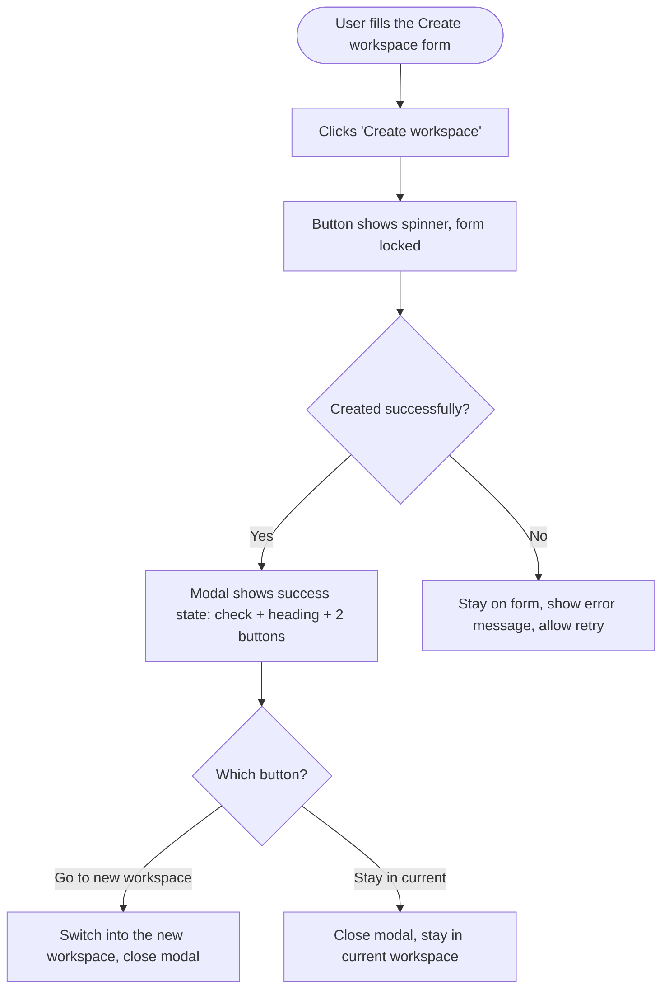

# Story — Workspace-created success state with "switch to it now" prompt

One frontend story. Create with the **New Feature Template**. Nothing is pushed to Shortcut.

---

## [FE] Show a success state after workspace creation with an option to switch to it

### Description

**As a** ContentStudio user creating a new workspace from the in-app "Create a new
workspace" modal, **I want** a clear success step that lets me jump straight into the new
workspace (or stay where I am), **so that** I don't have to hunt for the new workspace in
the switcher after creating it.

Today, after I click "Create workspace", the workspace is created, a toast appears, and
the modal closes — but I'm left in my current workspace with no easy way to open the new
one. This story replaces that toast-and-close with an in-modal success state offering to
switch me into the new workspace.

**Scope:** the in-app "Create a new workspace" modal only (opened from the workspace
switcher dropdown / settings). The first-time onboarding "create your first workspace"
flow is unchanged. Web only.

### Workflow



1. From the workspace switcher dropdown, the user clicks "Create a new workspace" and
   fills in the form (name, time zone, super admin, optional logo).
2. The user clicks **Create workspace**. The button shows a spinner and the form is
   locked while the workspace is being created.
3. On success, the modal content transitions to a **success state** (the form is
   replaced by a confirmation panel).
4. The user either clicks **"Go to [new workspace] →"** to switch into the new workspace,
   or **"Stay in [current workspace]"** to remain where they are. Either way the modal
   closes.
5. If creation fails, the modal stays on the form with an error message so the user can
   fix and retry.

### Acceptance criteria

**Loading state**
- [ ] While the workspace is being created, the "Create workspace" button shows a spinner and is disabled (prevents double-submit).
- [ ] The form fields and the modal's close controls are not interactive while creation is in progress.

**Success state**
- [ ] On successful creation, the modal's form is replaced by a success panel containing, in order: a green check icon, a heading, a subtext line, a primary full-width button, and a secondary full-width (outline) button.
- [ ] Heading: **"Workspace created successfully"**
- [ ] Subtext: **"[New Workspace Name]" is ready. Switch to it now, or keep working in [Current Workspace Name].** — with the actual new and current workspace names filled in.
- [ ] Primary button label: **"Go to [New Workspace Name] →"** (new workspace name filled in).
- [ ] Secondary button label: **"Stay in [Current Workspace Name]"** (current workspace name filled in).
- [ ] The success toast that previously appeared on creation is **no longer shown** (the success panel replaces it).
- [ ] Very long workspace names are truncated gracefully in the subtext and button labels (no overflow/broken layout).

**Button behavior**
- [ ] Clicking **"Go to [New Workspace Name] →"** switches the user into the newly created workspace and closes the modal.
- [ ] Clicking **"Stay in [Current Workspace Name]"** closes the modal and keeps the user in their current workspace.
- [ ] After the modal closes (either button), reopening "Create a new workspace" shows a fresh, empty form (no stale success panel or previous input).
- [ ] Closing the success panel via the modal's X behaves the same as "Stay in [Current Workspace Name]" (stays in the current workspace).

**Failure / edge cases**
- [ ] If creation fails for any reason (validation error, server error, network/timeout, workspace limit reached, trial expired), the modal does **not** show the success state — it stays on the form and surfaces the existing error handling (error message / the relevant existing dialog), and the user can retry.
- [ ] The workspace-limit-reached and trial-expired flows continue to behave as they do today (they are not replaced by the new success state).
- [ ] The new workspace still appears in the workspace switcher list after creation, regardless of which button the user chooses.

### Mock-ups

No design file provided. Success-state layout (for reference; final polish per design system):

```
        ┌───────────────────────────────┐
        │             ✓  (green)        │
        │  Workspace created successfully│
        │  "Nike" is ready. Switch to it │
        │  now, or keep working in Acme. │
        │                                │
        │  [   Go to Nike  →         ]   │  ← primary, full-width
        │  [   Stay in Acme          ]   │  ← secondary/outline, full-width
        └───────────────────────────────┘
```

### Impact on existing data

None. No schema or API changes — this is a client-side modal state change over the
existing create-workspace and workspace-switch flows.

### Impact on other products

- **Mobile apps (iOS/Android):** N/A — web only (mobile keeps its current flow).
- **Chrome extension:** N/A.
- **White-label:** the check icon, primary button, and accents must use theme tokens so
  they follow the white-label primary color.

### Dependencies

None.

### Global quality & compliance (wherever applicable)

- [ ] Mobile responsiveness (frontend only, N/A for backend-only stories)
- [ ] Multilingual support (frontend + backend, translations available or fallback handled)
- [ ] UI theming support (default + white-label, design library components are being used)
- [ ] White-label domains impact review
- [ ] Cross-product impact assessment (web, mobile apps, Chrome extension)

### Implementation references
*Pointers from research — not a contract. Engineering may choose a different approach.*

**Primary entry points:**
- `contentstudio-frontend/src/composables/useWorkspaceCore.ts` — `saveWorkspace()`
  success (create) branch currently fires the `workspace_saved` toast and hides the
  modal. This is where to: drop the success toast, keep the `workspace_created` Usermaven
  event, and surface "created" + the new `response.slug` / name to the modal instead of
  auto-hiding.
- `contentstudio-frontend/src/modules/setting/components/workspace/WorkspaceFields.vue` —
  the modal body (create button already bound `:loading="getSettingLoaders.saveWorkspace"`).
  Add the success-state view + the two buttons here.
- `contentstudio-frontend/src/modules/account/components/CreateWorkspaceModel.vue` — modal shell.

**Reuse:**
- Switching into the new workspace: `changeWorkspace(...)` from
  `contentstudio-frontend/src/composables/useWorkspaceSwitcher.ts` (already used elsewhere
  in `useWorkspaceCore.ts`), keyed off the new `response.slug`.
- `@contentstudio/ui`: `Button` (primary + `outline` variant, full-width), `Icon`
  (`CircleCheck` is already used for success in this area). Current workspace name is on
  the workspace store's active workspace.

**Gotchas / preserve:**
- Do **not** trigger the success state on the onboarding route
  (`route.name === 'onboardingWorkspace'`) — that path already auto-routes into the new
  workspace and must keep its current behavior.
- Keep the `workspace_created` Usermaven event firing on success (only the *toast* is
  removed, not the event).
- Preserve the existing failure branches in `saveWorkspace` (limit reached →
  `workspace-limits-dialog`, trial expired, upgrade, read-only 403, generic error).

**No new analytics event:** the `workspace_created` event already covers creation; the
switch reuses the existing workspace-switch path. No new Usermaven event is introduced.

---

### Shortcut fields

- **Template:** New Feature Template
- **Story type:** feature
- **Project:** Web App
- **Group:** Frontend
- **Epic:** Q2 - 2026: Miscellaneous
- **Priority:** Medium
- **Product Area:** Settings
- **Skill Set:** Frontend
- **Estimate:** _(empty — devs estimate during sprint planning)_
- **Labels:** _(none)_
- **Iteration:** _(PO assigns the current/target sprint at creation)_
