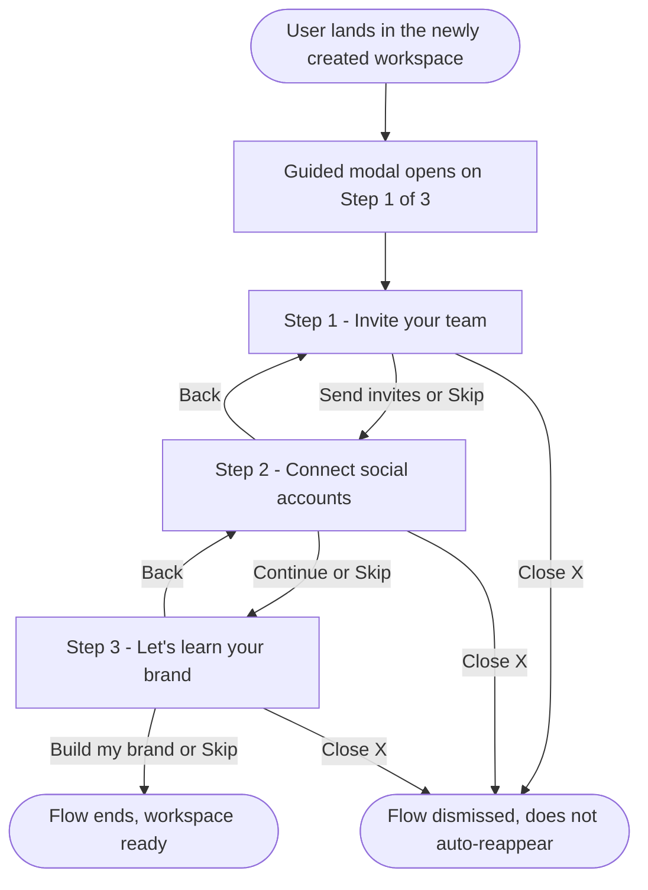

# Story — Guided setup flow for a newly created workspace

One full-stack story. Create with the **New Feature Template**. Nothing is pushed to Shortcut.
The flow reuses the existing invite-team, connect-accounts, and brand-profile features;
the new work is the guided modal shell around them + per-workspace flow state.

---

## [Full Stack] Add a guided 3-step setup flow when a user lands on a newly created workspace

### Description

**As a** user who just created a new workspace, **I want** a short guided setup that helps
me invite my team, connect social accounts, and add my brand, **so that** my new workspace
isn't empty and I'm ready to start working right away.

Today, after creating a workspace and switching into it, the workspace is empty with no
guidance on what to do first. This story adds a single guided modal that launches
automatically the first time the user lands in a newly created workspace and walks them
through three skippable steps. It reuses the existing invite, connect-accounts, and brand
features — presented inside one stepped modal.

**Scope:** fires only for **additional workspaces created in-app** (2nd workspace onward,
via "Create a new workspace"). The first-time signup onboarding is unchanged. Web only.

*Depends on: "[FE] Show a success state after workspace creation with an option to switch to it"* — this flow starts when the user lands in the newly created workspace.

### Workflow

1. Right after the user enters a newly created workspace, the guided modal opens on **Step 1 of 3**.
2. The header shows "Step X of 3", a title, and a subtitle that change per step. The footer is always present: **Back** on the left (hidden on Step 1), and **Skip** + the primary button on the right.
3. **Step 1 — Invite your team:** the user adds one or more teammates (each with their own email, membership type, role, and permissions), then clicks **Send invites** — or **Skip**.
4. **Step 2 — Connect social accounts:** the user connects the platforms they want, then clicks **Continue** — or **Skip**.
5. **Step 3 — Let's learn your brand:** the user enters their website URL and clicks **Build my brand** — or **Skip**. Building kicks off the brand crawl, closes the flow, and lands the user on the Brand Profile page.
6. **Skip** always advances to the next step (it does not exit the flow). **Back** returns to the previous step with entries preserved. **Close (X)** dismisses the whole flow; it does not auto-reappear, and anything skipped stays reachable from its normal place in the app.

### Acceptance criteria

**Launch & shell**
- [ ] The guided modal opens automatically the first time the user lands in a workspace created via the in-app "Create a new workspace" flow (2nd workspace onward). It does not open for the first-time signup workspace.
- [ ] It is **one modal** that swaps its body across the three steps — not three separate modals.
- [ ] The header shows "Step X of 3" plus a per-step title and subtitle (see copy).
- [ ] The footer is persistent across all steps: **Back** on the left (hidden on Step 1), **Skip** (secondary) and the primary button on the right.
- [ ] **Skip** advances to the next step (does not close the flow); on the last step it ends the flow.
- [ ] **Back** returns to the previous step with previously entered data preserved.
- [ ] **Close (X)** dismisses the entire flow; it does not auto-reappear on later visits to the workspace.
- [ ] The flow is **per-workspace** — creating another new workspace triggers it again for that workspace.
- [ ] Steps the user skips remain reachable from their normal locations in the app (invite team, connect accounts, brand profile). *(Explicit re-entry-point placement is TBD — finalize with mockups.)*

**Step 1 — Invite your team**
- [ ] The step shows one invite **row** by default; each row has: email field, membership type (**Team** / **Client**), role (**Administrator** / **Collaborator** / **Approver**), and an **"Additional settings"** disclosure (collapsed by default).
- [ ] The "Additional settings" contents depend on the selected role (Collaborator shows the full granular permission set; Administrator/Approver show fewer), matching the existing invite modal's permissions.
- [ ] Permissions are **per row** — each invitee has independent membership/role/permission state (no comma-separated bulk email entry).
- [ ] **"Add another member"** appends a new row that **inherits the previous row's** membership, role, and permission settings; each row is individually removable.
- [ ] A row requires a valid email; an invalid email shows: "Please enter a valid email address." A duplicate email within the list is flagged: "This email is already added above."
- [ ] Primary button: **Send invites**. Submitting sends all rows together and reports results **per email** — a partial failure does not fail the whole batch; each failed email shows its own reason (e.g. already a member) while the rest succeed.
- [ ] After a successful send the step reflects success and the flow can advance; `onboarding_steps.invite_team` is marked done.

**Step 2 — Connect social accounts**
- [ ] The step reuses the existing connect-accounts flow and its platform list: Facebook, Instagram, Threads, X, LinkedIn, Pinterest, Google Business Profile, YouTube, Tumblr, TikTok, Bluesky, Telegram, Meta Ads, Google Ads — including the EasyConnect "create new link" option.
- [ ] Platforms are laid out in a **scrollable two-column grid** that fits the guided modal's width (not a tall single-column list).
- [ ] Each platform can be connected/disconnected via its OAuth flow and shows a **"Connected"** state once authorized.
- [ ] The footer shows a live connected count (e.g. "3 connected") and uses the shared guided footer (the connect flow does not render its own footer here).
- [ ] Primary button: **Continue**. Connecting accounts marks `onboarding_steps.connect_social_account` done.

**Step 3 — Let's learn your brand**
- [ ] The step shows a single website URL input plus a short summary of what gets generated: brand voice/tone, a media assets library, and first drafted posts.
- [ ] An invalid/empty URL on submit shows: "Please enter a valid website URL (e.g. https://yourbrand.com)."
- [ ] Primary button: **Build my brand**. Submitting starts the brand-profile crawl, closes the flow, and lands the user on the Brand Profile page with the build in progress; `onboarding_steps.setup_brand_knowledge` is marked done.

**Persistence**
- [ ] If the user refreshes mid-flow (without closing it), the flow reopens on the step they were on, and any already-completed actions (invites sent, accounts connected) are preserved.
- [ ] Once the flow is completed or dismissed for a workspace, it does not auto-launch again for that workspace.

**Analytics** (see Analytics events below)
- [ ] Starting, completing, and skipping each step is tracked so we can see which step gets abandoned.

### UI Copy

**Header (per step)**
| Step | "Step X of 3" | Title | Subtitle |
|---|---|---|---|
| 1 | Step 1 of 3 | Invite your team | Add teammates or clients to this workspace and choose what each person can access. You can skip and do this later. |
| 2 | Step 2 of 3 | Connect social accounts | Connect the accounts you want to publish to and track analytics for in this workspace. |
| 3 | Step 3 of 3 | Let's learn your brand | Add your website and we'll learn your brand — its voice and tone, a media assets library, and a first set of drafted posts. |

**Footer buttons**
- Back (left, hidden on Step 1): **Back**
- Skip (secondary, right): **Skip**
- Primary (right): Step 1 **Send invites** · Step 2 **Continue** · Step 3 **Build my brand**

**Step 1 fields**
- Email placeholder: `name@company.com`
- Membership type options: **Team**, **Client**
- Role options: **Administrator**, **Collaborator**, **Approver**
- Disclosure label: **Additional settings**
- Add-row link: **+ Add another member**
- Remove-row control: trash icon with tooltip "Remove this member"
- Validation: "Please enter a valid email address." / "This email is already added above."
- Partial-failure example: "Invite sent to 2 of 3. Couldn't invite jane@acme.com — already a member of this workspace."

**Step 3 field**
- URL placeholder: `https://yourbrand.com`
- Summary line: "We'll analyze your site to set up your brand voice, a media assets library, and your first drafted posts."

### Mock-ups

Visual reference to be attached (follow it for layout and states):

**Step 1 — Invite your team**

_(attach mockup)_

**Step 2 — Connect social accounts**

_(attach mockup)_

**Step 3 — Let's learn your brand**

_(attach mockup)_

### Analytics events (Usermaven)

- [ ] When the guided flow opens for a new workspace, a `workspace_setup_started` event fires with `{ workspace_id }`.
- [ ] When a step is completed via its primary action, a `workspace_setup_step_completed` event fires with `{ workspace_id, step }` (`step` = `invite_team` | `connect_social_account` | `brand` ).
- [ ] When a step is skipped, a `workspace_setup_step_skipped` event fires with `{ workspace_id, step }`.
- [ ] When the flow ends (last step done/skipped) or is dismissed via X, a `workspace_setup_finished` event fires with `{ workspace_id, outcome }` (`outcome` = `completed` | `dismissed`).
- [ ] Existing events still fire from their underlying actions: `team_member_invited` on invite, and the existing connected-accounts event on connect — do not duplicate these; the step events above are additional.

### Impact on existing data

- Reuses the existing per-workspace `onboarding_steps` statuses (`invite_team`,
  `connect_social_account`, `setup_brand_knowledge`) for completion tracking.
- Adds a small amount of per-workspace flow state so the flow can resume mid-way and not
  re-trigger once completed/dismissed (e.g. current step index + a dismissed/completed
  flag). No changes to invite, account, or brand data models themselves.

### Impact on other products

- **Mobile apps (iOS/Android):** N/A — web only.
- **Chrome extension:** N/A.
- **White-label:** the modal, primary buttons, and accents must use theme tokens so they
  follow the white-label primary color.

### Dependencies

- **[FE] Show a success state after workspace creation with an option to switch to it** —
  this guided flow begins when the user lands in the newly created workspace (i.e. after
  choosing "Go to [new workspace]").

### Global quality & compliance (wherever applicable)

- [ ] Mobile responsiveness (frontend only, N/A for backend-only stories)
- [ ] Multilingual support (frontend + backend, translations available or fallback handled)
- [ ] UI theming support (default + white-label, design library components are being used)
- [ ] White-label domains impact review
- [ ] Cross-product impact assessment (web, mobile apps, Chrome extension)

### Implementation references
*Pointers from research — not a contract. Engineering may choose a different approach.*

**Reuse (don't rebuild):**
- Invite fields/roles/permissions live in
  `contentstudio-frontend/src/modules/setting/components/workspace/team/AddTeamMember.vue`
  (+ `components/TeamMemberBasics.vue`, `components/TeamMemberAccessSettings.vue`); invite
  action via `useTeam().saveTeamMember`, success event in
  `src/modules/setting/queries/useOrganizationQueries.ts`. Step 1 needs a repeatable-row
  wrapper with per-row state; the batch submit can loop the existing invite per row and
  aggregate per-email results (no comma-separated bulk entry).
- Connect flow: `src/modules/integration/components/SocialConnectHost.vue` / `Social.vue`
  (state `src/modules/account/composables/useSocialAccountsModal.ts`) — reuse for Step 2,
  re-laid-out into a two-column grid inside the shell using the shared footer.
- Brand: `src/modules/account/composables/useOnboardingBrandGeneration.ts` +
  `publisher/ai-content-library/**` (brand URL → crawl → Brand Profile page) for Step 3.
- Completion state: workspace `onboarding_steps` (`src/types/generated/workspace.ts`) is
  already written by all three underlying flows.

**Re-entry point:**
- The dashboard "Getting Started" widget
  (`src/modules/common/components/widgets/GettingStarted.vue`) already reads
  `onboarding_steps` and lists these tasks — a natural home for skipped steps. Final
  placement is TBD pending mockups.

**Design-system components:** `Modal`, `Button` (primary / secondary / text for Back),
`Icon`, `Collapsible` (Additional settings), `TextInput` (email, URL), `Checkbox`
(permissions), plus the existing membership/role selectors. No standalone stepper
component exists in `@contentstudio/ui` — the "Step X of 3" header is custom markup.

**Gotcha:** do not trigger the flow on the signup/first-workspace onboarding route — it
has its own flow; only the in-app "Create a new workspace" path should arm this.

---

### Shortcut fields

- **Template:** New Feature Template
- **Story type:** feature
- **Project:** Web App
- **Group:** Full Stack
- **Epic:** Q2 - 2026: Miscellaneous
- **Priority:** High
- **Product Area:** Onboarding
- **Skill Set:** Frontend (primary; Backend for onboarding/flow state + batch-invite results)
- **Estimate:** _(empty — devs estimate during sprint planning)_
- **Labels:** _(none)_
- **Iteration:** _(PO assigns the current/target sprint at creation)_

---

## [Design] Design review for the new-workspace guided setup flow

### Description

Design review pass for the guided setup flow that launches when a user lands in a newly
created workspace (the 3-step modal: **Invite your team → Connect social accounts →
Let's learn your brand**). The goal is to confirm the designs — and the implemented UI —
match the approved mockups and the ContentStudio design system before release.

The review should cover: the shared modal shell (stepper "Step X of 3" header, per-step
title/subtitle, and the persistent footer with Back / Skip / primary CTA); Step 1's
repeatable invite rows with the per-row "Additional settings" disclosure; Step 2's
two-column connect-accounts grid and "Connected" states; Step 3's brand-URL input; and all
states across the flow (default, hover, loading, empty, error, and connected). Also check
spacing, typography, iconography, responsive behavior, and white-label theming (no
hardcoded colors).
