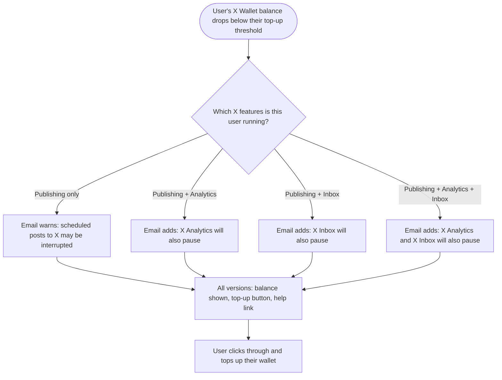

# Stories — Low X Wallet balance email

---

## [BE] Rewrite the low X Wallet balance email to name every X feature the balance will pause

### Description:

As a user whose X Wallet balance has run low, I want the warning email to tell me exactly which parts of X will stop working, so that I understand the full cost of ignoring it and can top up before my posts, analytics, or inbox go quiet.

The low-balance email today only warns about publishing — it tells the user to top up "to keep publishing to X without interruption". That was accurate when publishing was the only thing the wallet paid for. X Analytics and X Inbox now draw on the same wallet, so a user reading the current email can top up believing only their scheduled posts were at risk, and be surprised when their analytics stopped refreshing or their inbox stopped syncing days earlier.

This story rewrites the email body so it names the surfaces that will actually be affected for that specific user. A user who only publishes to X sees a publishing-only warning. A user who also runs X Analytics is told their analytics will pause too. Same for X Inbox, and for someone running all three. The email also drops the internal threshold figure, which meant nothing to most recipients, and gains a help link for people who don't know where topping up happens.

**When the email sends does not change.** The trigger, the once-per-24-hours limit, and the rule about not emailing when auto-recharge will refill the wallet anyway all stay exactly as they are.

---

### Workflow:

1. A user's X Wallet balance falls below the threshold at which they've asked to be warned.
2. The user receives an email addressed to them by first name, telling them their current X Wallet balance.
3. The email tells them their scheduled posts to X may be interrupted — and, if they are also running X Analytics or X Inbox, names those too as things that will pause until the balance is topped up.
4. The email tells them where to go to fix it: top up the wallet from Billings.
5. Below that, the user sees a help link for step-by-step instructions on topping up, in case they can't find it.
6. The user clicks the top-up button and lands directly on the wallet top-up screen for their workspace.
7. The user tops up, and the next time their balance runs low they are eligible to be warned again.

---

### Acceptance criteria:

**Shared across all four versions**

- [ ] The email greets the recipient by their first name
- [ ] The email states the recipient's current X Wallet balance in their own currency formatting
- [ ] The email no longer mentions the balance threshold figure anywhere in the body
- [ ] The email ends with the help link text **"Need help? How to top up your X Wallet →"**, placed below the main message
- [ ] The top-up button still appears and still deep-links to the wallet top-up screen for the relevant workspace, falling back to the workspace picker when no workspace resolves — unchanged from today
- [ ] Wherever the product is named in the body, it renders the recipient's own brand name — a white-label recipient never sees the word "ContentStudio" in this email

**Version 1 — publishing only (neither X Analytics nor X Inbox active)**

- [ ] Body reads: *"Your X Wallet balance is {balance}."* then *"This may interrupt your scheduled posts to X. To keep publishing without disruption, head over to {app name} and top up your wallet from Billings."*
- [ ] Neither X Analytics nor X Inbox is mentioned

**Version 2 — publishing + X Analytics active**

- [ ] Body reads: *"Your X Wallet balance is {balance}."* then *"This may interrupt your scheduled posts to X. Your X Analytics will also be paused until your balance is topped up."* then, on its own line, *"Head over to {app name} and top up your wallet from Billings."*
- [ ] X Inbox is not mentioned

**Version 3 — publishing + X Inbox active**

- [ ] Body reads: *"Your X Wallet balance is {balance}."* then *"This may interrupt your scheduled posts to X. Your X Inbox will also be paused until your balance is topped up."* then, on its own line, *"Head over to {app name} and top up your wallet from Billings."*
- [ ] X Analytics is not mentioned

**Version 4 — publishing + X Analytics + X Inbox active**

- [ ] Body reads: *"Your X Wallet balance is {balance}."* then *"This may interrupt your scheduled posts to X. Your X Analytics and X Inbox will also be paused until your balance is topped up."* then, on its own line, *"Head over to {app name} and top up your wallet from Billings."*

**Choosing the right version**

- [ ] The version is chosen from the recipient's own account state at the moment the email is built — a user running analytics but not inbox gets version 2, not version 4
- [ ] When either feature's state cannot be determined, that feature is treated as not active, so the email never claims a surface will pause when it will not
- [ ] Turning X Analytics or X Inbox on or off changes which version the user receives next time, with no other action required

**Sending behaviour — must not change**

- [ ] The email still sends only when the balance falls below the recipient's threshold and auto-recharge is switched off
- [ ] The email still sends on the payment-setup-required path, where auto-recharge is on but no payment method is on file
- [ ] The same recipient is still not emailed about a low balance more than once in a 24-hour window
- [ ] A recipient becomes eligible for the email again once their balance has climbed back above the threshold and later drops below it
- [ ] No change to the spending-limit-reached, auto-recharge-failed, refund, or wallet-available emails

**Translations**

- [ ] All four versions are translated into every supported language (English, German, Greek, Spanish, French, Italian, Polish, Chinese)
- [ ] The balance value, the brand name, and the recipient's first name are inserted into the translated text rather than concatenated onto it, so word order stays correct in every language
- [ ] The help link text is translated in every language while the destination stays the same

---

### Mock-ups:

N/A — the email keeps the existing layout, header, footer, and button styling. Only the body text changes.

The exact copy for all four versions is written out in the acceptance criteria above.

**Open item for implementation:** the destination URL for the "How to top up your X Wallet →" link will be provided by the Product Owner when development starts. The email must not ship with a placeholder or broken link.

---

### Impact on existing data:

None. No new stored fields and no migration. The threshold value is still calculated and passed as it is today — it simply stops being printed in the body, so nothing about how thresholds are stored or evaluated changes.

The existing record of when a user was last warned, and the rule that resets it once their balance recovers, both stay as they are.

---

### Impact on other products:

- **Mobile app (Flutter):** No impact. This is a transactional email; the app does not render it.
- **Chrome extension:** No impact.
- **White-label domains:** In scope and central to this story. The body names the product, so it must resolve to the recipient's own brand — the email already carries white-label details for its footer and button, and the body must use the same source. A white-label recipient seeing "ContentStudio" in the body is a defect.
- **X Analytics and X Inbox:** This email is the shared low-balance warning for all three X surfaces. As each ships, its paused-state messaging should match the wording used here so users aren't told two different things.

---

### Dependencies:

None blocking — the email exists and sends today, and the publishing-only version can ship on its own.

The X Analytics and X Inbox versions only become reachable once those features are drawing on the X Wallet. Both are in development in parallel, so this story should be coordinated with them to confirm how each surface's active state is read.

---

### Global quality & compliance (wherever applicable)

- [ ] Mobile responsiveness — the email renders correctly in common mobile mail clients; N/A for in-app screens as this story adds none
- [ ] Multilingual support (frontend + backend, translations available or fallback handled)
- [ ] UI theming support — N/A, transactional emails use the fixed email template rather than the design library
- [ ] White-label domains impact review
- [ ] Cross-product impact assessment (web, mobile apps, Chrome extension)
