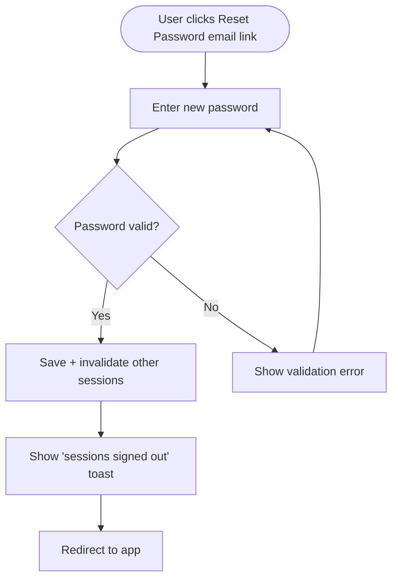

# Story Creation Guidelines

These rules apply to every story generated by the feature and story pipelines. Follow them exactly. The pipelines produce stories as local markdown — they do **not** push to Shortcut. A Product Owner creates each story in Shortcut manually, using the **Shortcut fields** block at the end of the story.

---

## 1. Story Template

**Structure every story with the "New Feature Template".** This template (under "no team") defines the standard story structure with all required sections and the global quality-checklist tasks. The pipeline authors the story body in this shape as local markdown; when the Product Owner creates the story in Shortcut, they select this template so Shortcut pre-populates the description structure and the 5-task checklist.

The pipeline does **not** push to Shortcut, so there is no `story_template_id` API payload — instead, note "New Feature Template" in the story's **Shortcut fields** block. See `.claude/shortcut-config.json` → `story_templates.new_feature` for the template name/ID the PO selects.

---

## 2. Story References

- **Never** refer to other stories as "Story 1", "Story 2", or by number.
- **Always** reference by the full story title. Example: _"Depends on: **[BE] Create Link-in-Bio API endpoints**"_

---

## 3. Platform Constraints

- **No dark mode.** ContentStudio does not have dark mode. Never mention dark mode support, theming toggles, or light/dark variants in stories or acceptance criteria.
- **No RTL language support.** Do not mention RTL layouts, bidirectional text, or RTL-specific styling.
- **Most AI features are web-only — with one exception: AI chat/assistant exists on mobile.** AI *generation* features (e.g., AI image/video/caption generation, AI Content Library) are web-only — scope those to web and don't create mobile AI stories for them. **AI chat / AI assistant is available on mobile** (native iOS today, Flutter going forward) and IS in scope for mobile. For a web-only AI generation feature with a non-AI mobile part, note explicitly: _"AI generation is web-only; mobile app gets [specific non-AI scope]."_

---

## 4. Workflow Writing Style

All story workflows must be written **from the user's point of view**, describing actions the user takes — not technical implementation steps.

**Bad (developer POV):**
> 1. Frontend calls POST /api/v1/link-in-bio
> 2. Backend validates the payload
> 3. MongoDB document is created

**Good (user POV):**
> 1. User navigates to Publish → Link in Bio from the left sidebar
> 2. User clicks "Create New Page"
> 3. User enters a page title (e.g., "My Links") and selects a username/slug
> 4. User sees a live preview update on the right side as they type
> 5. User clicks "Save & Publish" and sees a success toast with the live URL

For API-developer-facing stories (e.g. public API endpoints, MCP tools, CLI commands), the "user" *is* a developer — using developer terms (HTTP verbs, request shape) is fine because that's what that user actually sees. For everything else, stay in product language.

**Implementation pointers do not belong in Workflow.** File paths, class names, method signatures, helper suggestions, JWT/Redis/cache mechanics, ORM details — none of this goes in Workflow. If it's useful to the dev, park it in **Implementation references** at the end of the story (see section 18).

---

## 5. UI Content: Labels, Tooltips, Subtexts, Modals

Every frontend/UI story **must** include the actual copy for all UI elements. Do not leave copy as placeholders or "TBD". Specify:

### For every modal:
- **Title** — the modal header text
- **Description/subtext** — any explanatory text below the title
- **CTA button labels** — primary and secondary (e.g., "Save & Publish" / "Cancel")
- **Learn more link** — location (typically a `?` icon next to the title) and where it links

### For every form field:
- **Label** — the field label text
- **Placeholder** — example text inside the field
- **Helper text/subtext** — text below the field explaining what it does
- **Validation messages** — error states with user-friendly messages

### For every toggle/option:
- **Label** — what the toggle says
- **Tooltip** — hover text explaining what this option does, with an example
- **Info icon (`ℹ`)** — if present, what content it shows on hover/click

### For every tooltip:
Write tooltips that are:
- **Plain language** — no jargon, no technical terms
- **Example-driven** — include a concrete example so the user immediately understands
- **Action-oriented** — tell the user what happens, not what the feature "is"

**Bad tooltip:**
> "Configures the UTM parameters for link tracking."

**Good tooltip:**
> "Add tracking tags to your links so you can see which posts drive the most clicks in Google Analytics. Example: utm_source=instagram, utm_medium=linkinbio"

**Bad tooltip:**
> "Sets the scheduling interval."

**Good tooltip:**
> "Choose how often this post repeats. For example, 'Every 3 days' will re-share this post on Monday, Thursday, Sunday, and so on."

### Writing principles for all UI copy:
1. **Write for a layman** — assume the user is not a tech person, not a social media expert. They should understand on first read.
2. **No thinking required** — the user should never have to pause and wonder "what does this mean?" If they would, your copy needs an example.
3. **Be the best UX writer** — every label, tooltip, and subtext is a chance to guide the user. Use it.
4. **Be specific to ContentStudio** — reference ContentStudio features by name where relevant (e.g., "your Composer drafts", "your connected social accounts").

### UI component rules:
**Always reference components from `docs/ui-components.md`** when specifying UI elements in stories. This file is the single source of truth for what's available in the design system.

- **Prefer `@contentstudio/ui` components** (e.g., `Button`, `Dropdown`, `Checkbox`, `SegmentedControl`, `Modal`) over legacy `Cst*` equivalents
- **Name components explicitly** — say "Use the `SegmentedControl` component" not "add a toggle"
- **If a component doesn't exist yet**, flag it clearly: _"Requires new component: [description]. Not currently in `@contentstudio/ui` — needs a [Design] story or library update first."_
- **Never invent component names** that aren't in the catalog without flagging them as gaps
- **Do not override `@contentstudio/ui` component styles** with Tailwind color/border classes — use the component's props and variants instead

### Color and theming rules:
**Never hardcode color values** (no `bg-blue-50`, `text-blue-600`, `border-blue-300`, `#157FFF`, etc.). ContentStudio uses a **CSS custom property theming system** for white-label support. All primary colors come from CSS variables.

Use the **theme-aware Tailwind classes:**

| Purpose | Correct class | Wrong class |
|---|---|---|
| Primary text | `text-primary-cs-500` | `text-blue-600` |
| Primary text dark | `text-primary-cs-700` | `text-blue-700` |
| Light background | `bg-primary-cs-50` | `bg-blue-50` |
| Light background semi | `bg-primary-cs-50/50` | `bg-blue-50/50` |
| Border | `border-primary-cs-200` | `border-blue-300` |
| Hover text | `hover:text-cstu-primary-500` | `hover:text-blue-500` |

The Tailwind config maps `primary-cs-*` shades (50, 100, 200, 500, 600, 700, 800, 900) to `--cstu-primary-*` CSS variables. These variables change per white-label domain. Default is blue (`#157FFF`) but white-label customers can set any primary color.

**Neutral/gray colors** (`text-gray-900`, `border-gray-200`, `bg-white`) are fine — they don't change per theme.

---

## 6. Story Splitting: Backend vs Frontend

- **Backend stories** focus on: API endpoints, data models, validation, business logic, jobs, events
- **Frontend stories** focus on: UI components, user interactions, copy/labels/tooltips (per section 5 above), responsive behavior
- **If a feature needs both**, create separate BE and FE stories. Prefix titles: `[BE]` and `[FE]`
- **The FE story** is where ALL UI copy lives — labels, tooltips, modals, toasts, error messages, empty states
- **Never put UI copy in a BE story.** Backend stories deal with data and logic, not what the user sees.

---

## 7. Acceptance Criteria Format

Use checkbox format. Each criterion must be **testable** — a QA engineer should be able to verify it with a clear pass/fail.

```
- [ ] User can create a new link-in-bio page from Publish → Link in Bio
- [ ] Page title is required; shows error "Please enter a page title" if left empty
- [ ] Slug auto-generates from title but can be manually edited
- [ ] Live preview updates within 500ms of any change
- [ ] "Save & Publish" button is disabled until all required fields are filled
```

**Not testable (avoid):**
```
- [ ] The feature works correctly
- [ ] UI looks good
- [ ] Performance is acceptable
```

### No implementation prescriptions in AC

Acceptance criteria describe **observable behavior** — what the user sees, what the API returns, what state changes — never **how** the dev should write the code.

**Bad (implementation prescription — should not be in AC):**
- [ ] `canAccessSidebar` computed in `PublisherMain.vue` returns `true` for approvers
- [ ] Add an `isApprover()` helper in `usePermission.ts`
- [ ] Toast uses the existing `useAlertStore` / `alertMessage` pattern
- [ ] The shared helper is named `invalidateAllSessions($userId, ?string $keepToken = null)`

**Good (observable behavior):**
- [ ] Approvers see the publisher sidebar (today it's hidden for approvers without create-post permission)
- [ ] Success toast appears with copy: "Password updated. All other devices have been signed out."
- [ ] Other active sessions are invalidated when a user resets their password (existing sessions rejected on next request)

A code reference is fine when it disambiguates *which* behavior the AC is testing ("Compose dropdown excludes the Blog post action"). It's wrong when it dictates *how* to implement. If it's the latter, move it to **Implementation references** (section 18).

---

## 8. Global Quality Checklist

Every story must include the checklist from the story template. **Leave all checkboxes unchecked** — the checklist is for developers to mark off during implementation, not for the story author to pre-check.

Only add N/A notes where an item clearly doesn't apply:

```
- [ ] Mobile responsiveness (frontend only, N/A for backend-only stories)
- [ ] Multilingual support (frontend + backend, translations available or fallback handled)
- [ ] UI theming support — N/A, ContentStudio has no dark mode
- [ ] White-label domains impact review
- [ ] Cross-product impact assessment (web, mobile apps, Chrome extension)
```

Mark items `N/A` with a brief reason where they clearly don't apply (e.g., backend-only story → mobile responsiveness N/A). Leave all others as unchecked for devs to verify.

---

## 9. Story Title Convention

Format: `[Team] Action-oriented title`

Examples:
- `[BE] Create CRUD API for link-in-bio pages`
- `[FE] Build link-in-bio page editor with live preview`
- `[FE] Add link-in-bio analytics dashboard`
- `[BE] Implement link click tracking and aggregation job`
- `[Design] Create link-in-bio page templates and component library`

---

## 10. Empty States & Error States

Every FE story that introduces a new view or list **must** include:
- **Empty state** — what the user sees when there's no data yet. Include the illustration concept, headline, subtext, and CTA.
- **Error state** — what the user sees when something fails. Include the error message copy.
- **Loading state** — skeleton/spinner behavior.

Example empty state spec:
> **Headline:** "No link-in-bio pages yet"
> **Subtext:** "Create your first page to share all your important links in one place. Perfect for Instagram, TikTok, and anywhere you can only share one link."
> **CTA button:** "Create Your First Page"

---

## 11. No Estimates

**Never add story point estimates** to stories. Leave the estimate empty in the **Shortcut fields** block. Estimation is done by the development team during sprint planning, not by the story author.

---

## 12. No Labels on Stories

Do not add labels (like "New") to stories. The **Shortcut fields** block leaves labels empty — the team manages labels manually when the story is created in Shortcut.

---

## 13. Project Assignment

Every story must note a **Shortcut project** in its **Shortcut fields** block, based on where the work lives:

| Story type | Project |
|---|---|
| Backend (API, server, database) | Web App |
| Frontend (web UI) | Web App |
| iOS mobile app | Mobile |
| Android mobile app | Mobile |
| Chrome extension | Chrome App |
| Billing/payments | Billing |
| DevOps/infra | DevOps |

See `.claude/shortcut-config.json` → `projects` for IDs.

---

## 14. Default Epic for Standalone Stories

If stories are **not** part of a dedicated epic (i.e., created via the `/story` pipeline), note the current **Miscellaneous** epic in their **Shortcut fields** block:
- **Q2 - 2026: Miscellaneous** (id: `115078`)

Update the epic each quarter. See `.claude/shortcut-config.json` → `miscellaneous_epics`.

---

## 15. Mobile App Stories

ContentStudio has separate iOS and Android development teams. When a feature or change **impacts mobile apps**, you must create separate mobile stories:

- **Evaluate impact:** If the change adds a new API field, changes existing API behavior, or introduces a feature that users expect on mobile too — create mobile stories.
- **Prefix:** `[iOS]` for iOS, `[Android]` for Android
- **Group:** Use the appropriate mobile team group (if available) or the general team
- **Project:** Assign to "Mobile" project
- **Scope appropriately:** Mobile stories should describe what changes in the mobile app specifically, not repeat the full backend/frontend spec
- **AI generation features are web-only; AI chat/assistant is on mobile:** Don't create mobile stories for AI *generation* features (image/video/caption generation, AI Content Library). **AI chat / AI assistant is available on mobile** (native iOS today, Flutter going forward) — create mobile stories for it when in scope.

Example: If a backend story adds `last_login_method` to the API response, and users log in via mobile apps too, create:
- `[iOS] Display last used login method on iOS sign-in screen`
- `[Android] Display last used login method on Android sign-in screen`

---

## 16. No Local File References in Story Content

**Never include local file paths from this pipeline project** (e.g., `docs/features/whatsapp-inbox-integration/01-research.md`) in story descriptions, links, or references. The story content is written for whoever reads it in Shortcut once the PO creates it there — developers, designers, QA — and they have no access to this repo's local files.

Instead:
- **Reference other stories** by their full title. Shortcut URLs don't exist yet (the pipeline doesn't push), so titles are the only stable handle.
- **Don't link to the research/PRD docs by local path.** If the story needs that context, summarize it inline. The research, workflow, and PRD live as local markdown in `docs/features/<slug>/` for the PO's reference — not inside the story body.
- **Codebase file paths** (e.g., `contentstudio-frontend/src/modules/...`) are fine — those refer to the actual product codebases that developers work in. Concrete codebase pointers belong in the Implementation references section (section 18).

**Bad:** `See research doc: docs/features/whatsapp-inbox-integration/01-research.md`
**Good:** summarize the relevant finding inline, or reference the related story by full title

**Bad:** `Local reference: docs/technical/ai-agents-architecture-findings.md`
**Good:** put the concrete codebase pointer in the Implementation references section — see section 18

### Shortcut attachments and image previews

When screenshots or mockups are uploaded to Shortcut, **embed image attachments in the story description using Markdown image syntax** so Shortcut renders an inline preview:

```

```

Do not add uploaded image references as plain Markdown links like `[image.png](...)`; those render as text links instead of previews. Non-image attachments such as `.jsx`, `.pdf`, or `.zip` should remain normal Markdown links.

---

## 17. Code Implementation & PR Workflow

When implementing a story in code (if requested):

**Branch naming:** `feature/{story-title-slug}`
- Example: `feature/fe-display-last-used-indicator-on-the-sign-in`
- Always lowercase, hyphens for spaces, keep the `[FE]`/`[BE]` prefix in slug form
- Stories aren't in Shortcut at implementation time, so there's no `sc-{id}` to use. If the PO has already created the story in Shortcut and supplied its ID, you may use `feature/sc-{id}/{slug}` instead.

**Branch workflow:**
1. `git checkout develop` — always branch from `develop`
2. `git pull origin develop` — update local from remote
3. `git checkout -b feature/{slug}` — create the feature branch
4. Implement the code changes
5. Commit with a descriptive message (prefix `[sc-{id}] ` only if the PO supplied a Shortcut story ID)
6. Push the branch and create a PR

**PR details:**
- **Title:** Story title (e.g., `[FE] Display "Last used" indicator on the sign-in page`)
- **Description:** Summary of changes, files modified, and the story title(s) implemented (include the Shortcut URL only if the PO created the story and shared it)
- **Base branch:** `develop`
- If a `sc-{id}` is present in the branch name or a commit message, the Shortcut/GitHub integration auto-links the PR to that story.

---

## 18. Implementation References (Optional, Trailing Section)

When research surfaces useful technical pointers — codebase entry points, patterns to follow, suggested names, gotchas — put them in a dedicated **Implementation references** section at the **end of the story body**, after the Global quality & compliance checklist.

This section is what lets the core story (Description, Workflow, AC) stay strictly user-POV while devs still get the research output they need to move fast.

**Section header — copy this verbatim:**

> ### Implementation references
> *Pointers from research — not a contract. Engineering may choose a different approach.*

The non-binding framing matters. Reviewers (PMs, designers, QA) read top-down and stop at the checklist; devs jump to the bottom for the "how". The header signals the section is a hint, not a spec.

### What goes here

- **Codebase entry points** — files / controllers / components / composables that research found relevant. Use full repo-qualified paths (`contentstudio-frontend/src/modules/...`), per section 16.
- **Existing patterns to follow** — "the closest existing MCP tool is `FetchSocialAccountsTool`", "matches the change-password flow already in `ProfileController::changePassword`".
- **Suggested names** — helper signatures, i18n keys, prop names, route paths — clearly marked as suggestions, never as a contract.
- **Gotchas** — latent bugs or quirks research uncovered. E.g. *"the existing `terminateAllSessions` call in `recoverPassword` sits below an early-return for 2FA users, so 2FA users currently get zero session termination."*
- **Existing behavior to preserve** — bits of code research confirmed are already correct ("AI Studio is already gated by `hasFullAccess` — no change needed").

### What does NOT go here

- **Anything testable as user-facing behavior** — that's an AC, not a reference. If you find yourself writing "the helper must clear the trusted_devices collection," rewrite it as "trusted devices for the user are revoked when X happens" and put it in AC.
- **Pipeline-internal paths** (`docs/features/...`, `docs/stories/...`) — section 16 forbids these in any pushed story content. They stay in the local `02-stories.md` only.
- **Mandates** — if a specific class / file / approach is truly required (not just suggested), write it as a behavioral AC. References are non-binding by definition.

### When to omit the section

**Omit it entirely if research did not surface anything useful.** Empty boilerplate ("Implementation references: None") trains readers to skip the section and devalues it for stories where it matters.

### Example shape

> ### Implementation references
> *Pointers from research — not a contract. Engineering may choose a different approach.*
>
> **Primary entry points:**
> - `contentstudio-frontend/src/modules/publisher/views/PublisherMain.vue` — sidebar visibility gate (`canAccessSidebar` computed) lives here
> - `contentstudio-frontend/src/composables/usePermission.ts` — likely home for a centralised `isApprover()` helper if the team prefers that over inlining the role check
>
> **Existing behavior to preserve (no change needed):**
> - Compose dropdown's "Use template" option is already wired via `:show-template-attachment="true"` passed into `ComposeActionsDropdown`
> - AI Studio / Automations / Planner Settings sections are already gated by `hasFullAccess` (false for approvers)
>
> **Gotcha:**
> - The `recoverPassword` flow has a latent bug — for 2FA-enabled users, `TwoFactorChallengeData` returns early and the existing `terminateAllSessions` call below it is unreachable. Any fix to session invalidation needs to move the call **above** the 2FA early-return.

---

## 19. Analytics Event Tracking (Usermaven)

ContentStudio uses **Usermaven** for product analytics. Every story that introduces a **new trackable user action** must spec the Usermaven event(s) the feature emits. If we ship a feature without instrumentation, we have no way to measure adoption, conversion, or whether the feature is worth keeping.

### When to add Usermaven events

Add tracking when a user action falls into one of these categories:

- **Monetization / conversion** — addon purchased, addon unlocked, plan upgraded, plan cancelled, trial started
- **Adoption milestones** — first connection of a social account, first post created, first AI generation, first brand voice created, onboarding step completed
- **Recurring usage signals** — post created, AI post generated, AI post regenerated, automation activated, custom view saved, label/hashtag created
- **Funnel completion** — signup verified, workspace created, team member invited, social account connected
- **Engagement events that signal commitment** — settings change indicating real use (added hashtags, configured auto-replies, set up brand knowledge)

Do **not** add tracking for:
- Trivial UI interactions — sidebar toggle, tab switch (unless the tab itself is the feature being measured), modal open/close on view-only modals
- Read-only navigation — page views are tracked globally via `userMaven.track('pageview')` in the router
- Form field touches, hover states, scroll events

If you're unsure, default to **not tracking** and flag it in the workflow doc / PRD for the PO to decide. Noise in analytics is worse than gaps.

### Event naming convention

ContentStudio's existing Usermaven events follow a strict convention:

- **`snake_case`** — never camelCase or kebab-case
- **Action-completed past tense** for completed actions: `addon_purchased`, `team_member_invited`, `ai_posts_generated`, `brand_profile_created`, `connected_social_accounts`, `labels_created`, `hashtags_created`
- **Object-first then action** when grouping related events: `ai_post_regenerated`, `ai_post_compose`, `ai_post_feedback` — keeps related events alphabetically clustered in dashboards
- **Reuse existing event names** when the action already has one — don't invent `social_account_attached` if `connected_social_accounts` already exists for the same action. Search the codebase first.

### Payload convention

- Payload property names are **`snake_case`**: `profile_id`, `number_of_posts`, `post_type`, `tab_name`
- Include enough context to slice the event in dashboards (e.g., `platform: 'facebook'` so we can split connected-account events by platform)
- **Do not include PII** beyond what Usermaven already has from `identify` calls — no email, no full name, no message bodies, no post content
- Keep payloads small (≤ ~6 properties) — Usermaven dashboard filters get clunky with large payloads

### Where events live in the story

**In the FE story Acceptance Criteria** as testable items:

```
- [ ] When the user clicks "Connect Facebook" and OAuth completes, a `connected_social_accounts` Usermaven event fires with `{ platform: 'facebook' }`
- [ ] When the user purchases an addon from the Twitter Posting upgrade modal, a `addon_purchased` Usermaven event fires with `{ addon: 'twitter_posting' }`
- [ ] When AI post generation completes, an `ai_posts_generated` Usermaven event fires with `{ profile_id, number_of_posts, post_type }`
```

If the events were already specified in the PRD's Analytics Events section, **the FE story's AC must match the PRD spec exactly** — same event names, same payload shape. If the dev (or you, while writing) discovers the PRD spec needs to change, update the PRD too — don't let the two drift.

### Backend events

Most Usermaven tracking is frontend-dispatched. **Backend** can also emit events via the server-side Usermaven SDK or via Customer.io (`_cio.track`) for actions that don't have a clear FE trigger (e.g., subscription renewals, async job completions). When a feature requires BE tracking, put the event spec in the BE story's AC, same shape as the FE pattern.

### Existing event examples (for reference / reuse)

| Event | Where it fires |
|---|---|
| `addon_purchased` | Billing flows, addon upgrade modals |
| `addon_unlocked_x_posting` | Twitter Posting addon unlock |
| `team_member_invited` | Settings → Organization → Add member |
| `connected_social_accounts` | Social account OAuth completion |
| `ai_posts_generated` | AI Content Library — post generation success |
| `ai_post_regenerated` | AI Content Library — regenerate single post |
| `brand_profile_created` | AI Content Library — brand setup wizard completion |
| `labels_created` | Composer / settings — new label saved |
| `hashtags_created` | Settings → Hashtags — new hashtag saved |
| `language_change` | Header → language switcher |
| `account_cancellation_feedback` | Cancel plan dialog submit |

Search `contentstudio-frontend/src/` for `userMaven.track(` to find the full live catalog before naming a new event.

---

## 20. Diagrams in Workflow Sections

When a story's workflow involves **branching logic**, **multi-system interaction**, or **discrete state transitions**, include a Mermaid diagram inside the **Workflow** section of the story body. Skip diagrams for trivial CRUD, copy-only changes, simple UI gating, role-exposure stories, and single-step flows where prose alone is clear.

Use the same diagram-type rubric the `/feature` Step 2 workflow doc uses:

| When the workflow is... | Use | Mermaid type |
|---|---|---|
| A branching user flow ("if X, do A, else B") | Flowchart | `flowchart TD` |
| A multi-system interaction (FE → API → 3rd party → callback) | Sequence diagram | `sequenceDiagram` |
| A state-driven entity lifecycle (post status, approval state, account connection) | State diagram | `stateDiagram-v2` |

**Conventions:**
- Plain English labels — user-POV, no class names, file paths, or method signatures
- Keep node count tight (≤ ~12). If you need more, split into multiple diagrams or restructure the story
- Always wrap in a fenced code block tagged `mermaid` so Shortcut and GitHub render it
- For sequence diagrams, name actors by role (User, ContentStudio, Facebook OAuth) — not service or file names

**Placement:** Inside the story body's **Workflow** section, immediately before the numbered prose steps. The diagram visualizes the shape; the numbered steps capture the user-POV detail. Both belong together — diagram alone misses detail, prose alone misses structure.

**Example (branching flow inside a story body):**

````
### Workflow



1. User clicks the reset-password email link and lands on the Reset Password screen.
2. User enters a new password and clicks Save.
3. ...
````

**When to skip:**
- Pure backend stories with no user-facing flow — the AC describes the behavior cleanly
- Single-action stories ("user clicks save → server saves") — prose is clearer than a 2-node diagram
- Copy / theming / refactor / style stories
- Stories that expose existing UI to a new role (the existing flow is already documented elsewhere)
- Stories where the `02-workflow.md` overview diagram already covers the shape — link to the workflow doc instead of duplicating
