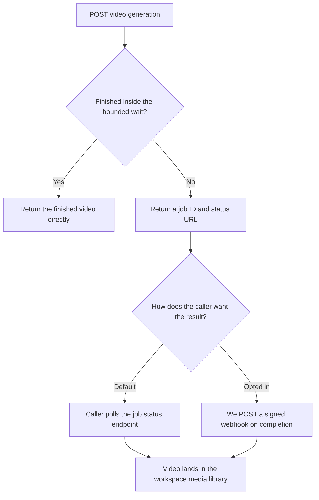

# Async pattern for AI video generation in the public API

**Date:** 2026-08-03
**Status:** Recommendation, for engineering review
**Context:** Pre-work for the AI video generation epic. The image generation epic is already specced and is synchronous. Video is not, and needs an async contract decided before any endpoint is written.

**Question this answers:** video generation takes minutes. How do we expose it through the REST API, CLI, MCP, and the Zapier / Make / n8n connectors? Polling, webhooks, streaming, or something else?

---

## 1. Reference point: what Higgsfield does

Checked `https://higgsfield.ai/mcp`.

**They use plain polling and nothing else.** Their own words:

> "All generation runs asynchronously, so your agent polls for results and delivers them as soon as they're ready."

> "Videos take longer depending on duration and model."

No webhooks on the MCP surface. The page documents no tool names, no job ID format, no status values, and no timeout thresholds. It is a marketing page, so there is not much to copy beyond the basic architectural choice. For deeper detail their CLI repo would need reading: `github.com/higgsfield-ai/cli`.

**Takeaway:** polling is a defensible industry baseline, and a competitor shipping agent-facing video generation considers it sufficient. We can do better cheaply, and the reasoning is below.

---

## 2. What we already have

All of this is live in `contentstudio-ai-agents` today. The async machinery exists. What is missing is a public contract in front of it.

**Job endpoints** in `src/api/routers/jobs/jobs_router_dramatiq.py`:

| Route | Purpose |
|---|---|
| `POST /api/v1/jobs/video` | Enqueue a video job, returns a job ID immediately |
| `POST /api/v1/jobs/video/batch` | Batch enqueue |
| `GET /api/v1/jobs/{job_id}` | Status, progress percentage, message, error, result |
| `GET /api/v1/jobs/{job_id}/events` | SSE event stream |
| `DELETE /api/v1/jobs/{job_id}` | Cancel |
| `GET /api/v1/jobs/` | List jobs |

The `JobInfo` response model already carries `id`, `status`, `progress` (0 to 100), `message`, `error`, and `result`.

**Kafka lifecycle topics** (from `contentstudio-backend/config/kafka.php`):
`ai-agents.video.job.lifecycle`, `ai-agents.video.batch.lifecycle`, `ai-agents.video.transform.lifecycle`, `ai-agents.reels.lifecycle`.

**Dedicated video tools** that enqueue jobs rather than returning inline, from the router comment in `src/api/routers/dedicated_tools_router.py`:

> `# Video (async): enqueues a Dramatiq job + emits job_info; FE polls /jobs/{id}.`

These are `motion-control` and `lip-sync`.

**Our own web app polls.** `contentstudio-frontend/src/modules/AI-tools/composables/useVideoJobPolling.ts` drives AI Studio video generation by polling `/jobs/{id}`, **not** by consuming the SSE stream that already exists. So polling is the production-proven path internally, and SSE is built but unused. That is a meaningful signal: if SSE were the better experience here, the web app would already be on it.

---

## 3. Recommendation

**Polling as the baseline contract, a bounded wait so short jobs feel synchronous, webhooks as the opt-in upgrade, and per-surface behaviour layered on top.**



### 3.1 Polling is the baseline

Universal, works on every surface, nothing new to build, and already proven in our own product. `POST` returns a job ID, `GET /jobs/{id}` returns status plus progress. This is the floor everything else builds on, and it is the only mechanism that is guaranteed to work in every integrator environment.

### 3.2 Add a bounded wait so short jobs feel synchronous

A `wait` parameter on submit, capped at roughly 90 seconds.

- If the job finishes inside the window, return the finished video in that same response.
- If it does not, return the job handle and let the caller poll or wait for a webhook.

**This is the single highest-value addition over what Higgsfield does.** Fast models and short clips collapse into one call instead of a submit-plus-poll loop, and nobody has to write polling code just to evaluate the feature. It also means the "hello world" in our docs is one request, not three.

### 3.3 Webhooks as the opt-in upgrade

For server integrators who do not want to poll at all.

This is nearly free for us. The **public webhooks epic is already In Review** with HMAC-signed payloads, at-least-once delivery, exponential-backoff retries into a dead-letter queue, delivery logs, and test events. Its PRD explicitly parks non-publishing events as a "future phase."

**Video completion is that phase.** Add `video.completed` and `video.failed` and video generation inherits the entire delivery stack rather than growing a second, parallel one. If we build a bespoke callback mechanism for video instead, we will end up maintaining two delivery systems with two retry policies and two sets of delivery logs.

**Sequencing implication:** the webhooks epic should land before, or at least alongside, the video epic.

### 3.4 Per-surface behaviour

The constraints genuinely differ per surface. One pattern cannot serve all four well.

| Surface | Behaviour | Why |
|---|---|---|
| REST API | Submit plus poll, with the optional bounded wait, plus webhooks if registered | Serves both quick scripts and real integrations |
| CLI | Block and render a progress bar by default, `--no-wait` returns the job ID | Terminal users expect to watch it finish |
| MCP / Claude / chat apps | Tool waits server-side up to 60 to 90 seconds. Returns the video if done, otherwise a job handle plus a separate `check_video_job` tool | See 3.5 |
| Zapier / Make / n8n | Never block. A submit action, then a separate wait or check step | Their request timeouts are shorter than a slow generation |

For the connectors specifically: n8n has a native `Wait` node, Make has incomplete-execution handling, and Zapier has polling triggers. Each platform already has an idiomatic way to resume a long operation, and we should use theirs rather than holding a connection open.

### 3.5 The MCP case deserves the most thought

Telling an agent to "poll every 10 seconds" is what Higgsfield does, and it is the wrong default for two concrete reasons:

1. **The agent burns tokens** on every status call, and each one comes back into its context.
2. **The conversation looks stalled** to the user. There is no progress affordance in a chat transcript.

Having the MCP server hold the wait internally means short generations return inline and feel instant, while long ones degrade gracefully to a handle the agent can check later. Same tool, two behaviours, and no polling loop occupying the agent's context.

The MCP tool description should also state the credit cost, so the agent can reason about spend before invoking a call that might cost real money.

---

## 4. Two decisions needed before build

### 4.1 Do not expose the granular job states

**This is the most important implementation note in this document.**

`contentstudio-ai-agents/src/api/models.py` declares a four-state `JobStatus` enum: `pending`, `processing`, `completed`, `failed`.

But the real job stream emits seven active stages. From `ACTIVE_VIDEO_JOB_STATUSES` in `contentstudio-frontend/src/modules/AI-tools/composables/useVideoJobPolling.ts`:

```
unknown, queued, starting, enhancing, optimizing, generating, processing
```

**Do not put those seven in the public contract.** `enhancing` and `optimizing` are pipeline internals. They will churn the moment the generation pipeline changes, and every integrator's switch statement breaks when they do.

**Recommended contract:**

- **Stable, documented, safe to branch on:** `queued`, `processing`, `completed`, `failed`, `cancelled`
- **Informational, display only, explicitly documented as subject to change without notice:** a separate `stage` field carrying the granular value, alongside `progress` and `message`

This gives integrators a state machine they can rely on and still lets us render a detailed progress string.

### 4.2 Credit behaviour on failure and cancellation

Video generation is expensive enough that getting this wrong is a support problem rather than a rounding error. Needs an explicit decision:

- A **failed** generation must not be charged, or must be refunded.
- A **cancelled** job's partial work must not be billed.
- Confirm whether a job that fails after the provider has already billed us is absorbed or passed on.

For reference, the image epic charges one API credit plus one image generation credit, on success only. Video should follow the same principle with whatever the per-model video credit cost turns out to be.

---

## 5. Open questions for engineering

| # | Question |
|---|---|
| 1 | What is the realistic p50 and p95 generation time per video model? This sets the bounded-wait cap and tells us which models are safe on which connector. |
| 2 | Is 90 seconds the right bounded-wait cap, given our own gateway and load balancer timeouts? |
| 3 | Should the SSE stream be exposed publicly at all, or kept internal? Our own web app does not use it, which argues for keeping it internal until someone asks. |
| 4 | Where do completed videos land? The image epic persists into the workspace media library so the asset is immediately publishable. Video should match, but the file sizes are far larger and interact with workspace storage limits. |
| 5 | Job retention: how long does a completed job stay queryable at `GET /jobs/{id}` before it is pruned? |
| 6 | Are batch video jobs in scope for the public API, or single jobs only for v1? |

---

## 6. Summary

- Higgsfield polls, and documents nothing further. Polling is a fine baseline but a low bar.
- We already have job submit, status, SSE, cancel, and Kafka lifecycle events. The async machinery is done.
- Our web app polls in production and ignores the SSE stream that exists, which is the strongest available signal on what actually works.
- Recommendation: **polling as the contract, a bounded wait so short jobs are one call, webhooks as the opt-in upgrade riding on the webhooks epic already in review, and per-surface behaviour on top.**
- The MCP surface should wait server-side rather than making the agent poll.
- Expose a coarse five-state machine publicly. Keep the seven granular pipeline stages informational.
- Decide credit behaviour on failure and cancellation before writing endpoints.
